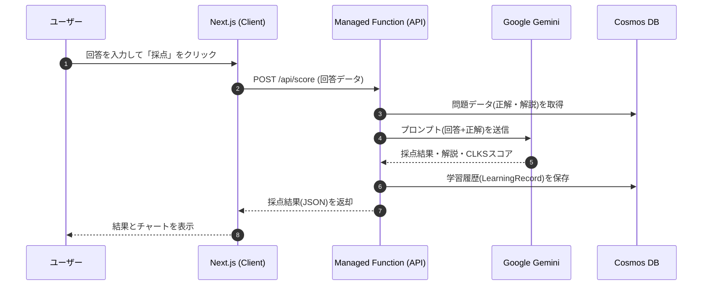

# Shikakuno (シカクノ) - IPA 情報処理技術者試験 学習プラットフォーム

[](https://github.com/hayato-git/IpaLab/actions/workflows/azure-static-web-apps.yml)

**Shikakuno (シカクノ)** は、IPA（情報処理推進機構）の試験対策に特化したインテリジェントな学習プラットフォームです。最先端の **AI 記述式採点システム** を搭載しており、独学では採点が難しい午後試験の記述式問題に対し、即座に分析的なフィードバックを提供します。

## 目次

- [主な機能](#-主な機能)
- [技術スタック](#-技術スタック)
- [システム構成](#-システム構成)
- [プロジェクト構造](#-プロジェクト構造)
- [セットアップ](#-セットアップ)
- [利用可能なスクリプト](#-利用可能なスクリプト)

## ✨ 主な機能

- **AI 自動採点**: Google Gemini Pro モデルを活用し、午後試験の記述式回答に対して多角的なフィードバックを即座に生成します。
- **CLKS 分析**: 回答を **C**ontext (文脈)、**L**ogic (論理)、**K**eyword (キーワード)、**S**pecificity (具体性) の4軸で評価し、レーダーチャートで可視化します。
- **インタラクティブ演習**: 午前試験の多肢選択問題に対応し、即座に正誤判定と解説を確認できます。
- **学習進捗管理**: 学習履歴、正答率、進捗状況を詳細な統計データとグラフで管理できます。
- **モダンな UI/UX**: デスクトップ・モバイルの両方に最適化されたレスポンシブデザインとダークモードを搭載しています。

## 🛠️ 技術スタック

- **Framework**: Next.js 14 (App Router)
- **Monorepo**: Turborepo & npm Workspaces
- **Backend**: Managed Functions on Azure Static Web Apps (Node.js)
- **Database**: Azure Cosmos DB (NoSQL)
- **AI Model**: Google Gemini Pro family
- **Authentication**: NextAuth.js (Google, GitHub)
- **Hosting**: Azure Static Web Apps
- **Styling**: CSS Modules / Tailwind CSS

## 🧩 システム構成

本システムは、Azure Static Web Apps 上で Next.js アプリケーションと Managed Functions (API) が動作する構成となっています。

```mermaid
graph TD
    subgraph Client [クライアント]
        Browser[Web Browser]
    end

    subgraph Azure_SWA [Azure Static Web Apps]
        NextJS[Next.js App (SSR)]
        API[Managed Functions (Node.js)]
        
        NextJS -- "API Call / SSR Data" --> API
    end

    subgraph Azure_Services [Azure Services]
        CosmosDB[(Azure Cosmos DB)]
        AppInsights[Application Insights]
    end
    
    subgraph External [外部サービス]
        Gemini[Google Gemini API]
        Auth[OAuth Providers<br/>(GitHub/Google)]
    end

    Browser -- "HTTPS" --> NextJS
    API -- "Data Access" --> CosmosDB
    API -- "AI Analysis" --> Gemini
    API -- "Telemetry" --> AppInsights
    NextJS -- "Auth Redirect" --> Auth
```

### データフロー (AI採点)



## 📂 プロジェクト構造

Turborepo を使用したモノレポ構成です。

- `apps/web`: メインの Next.js アプリケーション。UI、APIルート、フロントエンドロジックを含みます。
- `apps/api`: **(Legacy)** 旧 Azure Functions API。機能は `apps/web` の API Routes に統合されました。
- `packages/data`: 過去問データのスクレイピング、加工、データベース同期用スクリプト。
- `packages/shared`: モノレポ全体で共有される TypeScript 型定義やユーティリティ関数。
- `packages/config`: ESLint や TypeScript の共有設定。

## 🚀 セットアップ

### 1. 前提条件

- Node.js v20 以降
- npm v9 以降

### 2. インストール

リポジトリをクローンし、ルートディレクトリで依存関係をインストールします。

```bash
git clone https://github.com/hayato-git/IpaLab.git
cd IpaLab
npm install
```

### 3. 環境変数

Web アプリケーションには API キーやデータベース接続情報が必要です。

1.  Web アプリディレクトリへ移動: `cd apps/web`
2.  テンプレートからローカル環境変数ファイルを作成:
    ```bash
    cp .env.template .env.local
    ```
3.  `.env.local` を編集し、以下の変数を設定してください。
    - **認証 (NextAuth.js)**: `AUTH_SECRET`, `AUTH_GITHUB_ID`, `AUTH_GITHUB_SECRET` 等
    - **データベース (Azure Cosmos DB)**: `COSMOS_DB_ENDPOINT`, `COSMOS_DB_KEY`
    - **AI (Google Gemini)**: `GEMINI_API_KEY`

### 4. 開発サーバーの起動

プロジェクトルートに戻り、開発用スクリプトを実行します。

```bash
# プロジェクトルートで実行
npm run dev
```

Next.js 開発サーバーが起動し、通常は `http://localhost:3000` でアクセスできます。

## 📜 利用可能なスクリプト

プロジェクトルートから以下のコマンドを実行できます。

- `npm run dev`: 全アプリケーションの開発サーバーを起動します。
- `npm run build`: 本番用に全アプリケーションをビルドします。
- `npm run test`: テストを実行します。
- `npm run lint`: コードの静的解析を実行します。
- `npm run format`: Prettier を使用してコードをフォーマットします。