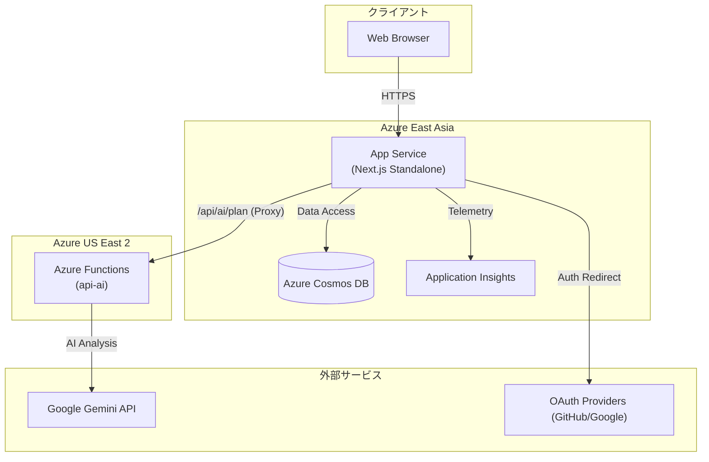
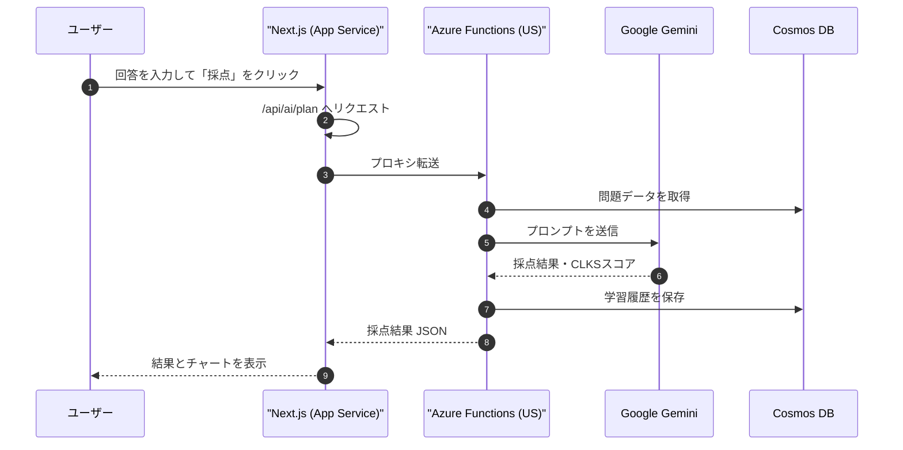

# Shikakuno (シカクノ) - IPA 情報処理技術者試験 学習プラットフォーム

[](https://github.com/keisato848/IpaLab/actions/workflows/azure-app-service.yml)

**Shikakuno (シカクノ)** は、IPA（情報処理推進機構）の試験対策に特化したインテリジェントな学習プラットフォームです。最先端の **AI 記述式採点システム** を搭載しており、独学では採点が難しい午後試験の記述式問題に対し、即座に分析的なフィードバックを提供します。

## 目次

- [主な機能](#-主な機能)
- [技術スタック](#-技術スタック)
- [システム構成](#-システム構成)
- [プロジェクト構造](#-プロジェクト構造)
- [セットアップ](#-セットアップ)
- [Copilot OTel ローカル監視](#-copilot-otel-ローカル監視)
- [利用可能なスクリプト](#-利用可能なスクリプト)

## ✨ 主な機能

- **AI 自動採点**: Google Gemini Pro モデルを活用し、午後試験の記述式回答に対して多角的なフィードバックを即座に生成します。
- **CLKS 分析**: 回答を **C**ontext (文脈)、**L**ogic (論理)、**K**eyword (キーワード)、**S**pecificity (具体性) の4軸で評価し、レーダーチャートで可視化します。
- **インタラクティブ演習**: 午前試験の多肢選択問題に対応し、即座に正誤判定と解説を確認できます。
- **学習進捗管理**: 学習履歴、正答率、進捗状況を詳細な統計データとグラフで管理できます。
- **モダンな UI/UX**: デスクトップ・モバイルの両方に最適化されたレスポンシブデザインとダークモードを搭載しています。

## 🛠️ 技術スタック

- **Framework**: Next.js 16 (App Router)
- **Language**: TypeScript 5
- **Monorepo**: Turborepo & npm Workspaces
- **Backend**: Azure Functions v4 (Node.js 20)
- **Database**: Azure Cosmos DB (NoSQL, Serverless)
- **AI**: Google Gemini (`@google/generative-ai`)
- **Authentication**: NextAuth.js v4 (Google, GitHub)
- **Hosting**: Azure App Service (Next.js Standalone mode)
- **AI API**: Azure Functions (US East 2) - Gemini API 地域制限対応
- **UI Libraries**: React 18, Recharts (グラフ), React Markdown, KaTeX (数式), Mermaid (図表)
- **Styling**: CSS Modules
- **Validation**: Zod
- **Monitoring**: Azure Application Insights
- **Testing**: Vitest (Unit), Playwright (E2E)
- **CI/CD**: GitHub Actions

## 🧩 システム構成

本システムは、Azure App Service 上で Next.js アプリケーションが動作し、AI 機能は US リージョンの Azure Functions で処理する構成となっています。


```mermaid
graph TD
    subgraph Client [クライアント]
        Browser[Web Browser]
    end

    subgraph Azure_EastAsia [Azure East Asia]
        AppService["App Service\n(Next.js Standalone)"]
        CosmosDB[(Azure Cosmos DB)]
        AppInsights[Application Insights]
    end

    subgraph Azure_USEast2 [Azure US East 2]
        FuncAI["Azure Functions\n(api-ai)"]
    end
    
    subgraph External [外部サービス]
        Gemini[Google Gemini API]
        Auth["OAuth Providers (GitHub/Google)"]
    end

    Browser -- "HTTPS" --> AppService
    AppService -- "Data Access" --> CosmosDB
    AppService -- "/api/ai/plan (Proxy)" --> FuncAI
    FuncAI -- "AI Analysis" --> Gemini
    AppService -- "Telemetry" --> AppInsights
    AppService -- "Auth Redirect" --> Auth
```

### AI API プロキシ構成

Gemini API は US リージョンからのみ呼び出し可能なため、以下のプロキシ構成を採用しています。

```
[ユーザー] → [shikaku-no.com (East Asia App Service)]
                    ↓
           [Next.js API Route: /api/ai/plan]
                    ↓ (プロキシ)
           [func-pm-exam-dx-ai-us.azurewebsites.net (US East 2)]
                    ↓
           [Gemini API]
```

### データフロー (AI採点)


```mermaid
sequenceDiagram
    autonumber
    participant User as ユーザー
    participant NextJS as "Next.js (App Service)"
    participant FuncAI as "Azure Functions (US)"
    participant Gemini as Google Gemini
    participant DB as Cosmos DB

    User->>NextJS: 回答を入力して「採点」をクリック
    NextJS->>NextJS: /api/ai/plan へリクエスト
    NextJS->>FuncAI: プロキシ転送
    FuncAI->>DB: 問題データを取得
    FuncAI->>Gemini: プロンプトを送信
    Gemini-->>FuncAI: 採点結果・CLKSスコア
    FuncAI->>DB: 学習履歴を保存
    FuncAI-->>NextJS: 採点結果 JSON
    NextJS-->>User: 結果とチャートを表示
```

## 📂 プロジェクト構造

Turborepo を使用したモノレポ構成です。

- `apps/web`: メインの Next.js アプリケーション。UI、APIルート、フロントエンドロジックを含みます。Azure App Service にデプロイされます。
- `apps/api-ai`: AI 採点用 Azure Functions。US East 2 リージョンにデプロイされ、Gemini API を呼び出します。
- `apps/api`: 汎用 Azure Functions API。East Asia リージョンで稼働し、CosmosDB へのデータアクセスを担います。
- `packages/data`: 過去問データのスクレイピング、加工、データベース同期用スクリプト。
- `packages/shared`: モノレポ全体で共有される TypeScript 型定義やユーティリティ関数。
- `packages/ui`: 共有 UI コンポーネントライブラリ（開発中）。
- `packages/config`: ESLint や TypeScript の共有設定。

## 🚀 セットアップ

### 1. 前提条件

- Node.js v20 以降
- npm v10 以降

### 2. インストール

リポジトリをクローンし、ルートディレクトリで依存関係をインストールします。

```bash
git clone https://github.com/keisato848/IpaLab.git
cd IpaLab
npm install
```

### 3. 環境変数

Web アプリケーションには API キーやデータベース接続情報が必要です。

1.  Web アプリディレクトリへ移動: `cd apps/web`
2.  テンプレートからローカル環境変数ファイルを作成:
    ```bash
    cp .env.template .env.local
    ```
3.  `.env.local` を編集し、以下の変数を設定してください。
    - **認証 (NextAuth.js)**: `AUTH_SECRET`, `AUTH_GITHUB_ID`, `AUTH_GITHUB_SECRET` 等
    - **データベース (Azure Cosmos DB)**: `COSMOS_DB_CONNECTION`
    - **AI (Google Gemini)**: `GEMINI_API_KEY`

### 3.1 ローカル Cosmos DB Emulator

Azure 接続文字列を使わずに API/DB 結合を確認する場合は、公式 Linux 版 Cosmos DB Emulator を起動します。

```bash
# プロジェクトルートで実行
npm run cosmos:emulator

# Emulator readiness、DB/コンテナ作成、write/read/delete を確認
npm run cosmos:verify-local
```

Cosmos Data Explorer は `https://localhost:1234`、ホスト OS からの SDK 接続先は `https://127.0.0.1:8081` です。devcontainer / Docker コンテナ内からホスト上の Emulator を使う場合は `https://host.docker.internal:8081` を使ってください。`npm run cosmos:verify-local` は `8080/ready` が使えない環境でも `8081` gateway 到達を fallback として扱います。停止する場合は `npm run cosmos:emulator:down` を実行します。`apps/web/.env.local` に `COSMOS_DB_CONNECTION` が未設定でも、検証スクリプトは到達可能なローカル host に合わせて公式エミュレータ既定接続文字列を生成します。クラウド Cosmos DB の接続文字列を検出した場合、誤操作防止のため検証スクリプトは中止します。

### 4. 開発サーバーの起動

プロジェクトルートに戻り、開発用スクリプトを実行します。

```bash
# プロジェクトルートで実行
npm run dev
```

Next.js 開発サーバーが起動し、通常は `http://localhost:3000` でアクセスできます。

## 📊 テストデータ管理

試験データ（過去問、解説など）の管理は `packages/data` パッケージで行います。

### 主なツールとコマンド

`packages/data` ディレクトリで以下のコマンドを実行することで、データの抽出、加工、データベースへの同期を行えます。

- **データ抽出**:
  ```bash
  npm run extract -w packages/data
  ```
  PDF等のソースからテキストデータを抽出します。

- **データベース同期**:
  ```bash
  npm run sync-db -w packages/data
  ```
  ローカルのJSONデータを Azure Cosmos DB に同期（Upsert）します。

- **整合性チェック**:
  ```bash
  npx ts-node src/scripts/check-duplicates.ts
  ```
  データの重複や欠損を確認します。

詳細な手順については、[DATA_IMPORT_SOP.md](packages/data/DATA_IMPORT_SOP.md) を参照してください。

### Webアプリでのデータ利用

`apps/web` のビルド時（`npm run build` または `npm run dev`）に、`packages/data/data/questions` 配下のデータが自動的に `apps/web/data/questions` にコピーされ、アプリケーションから利用可能になります。開発者が手動でファイルをコピーする必要はありません。

## 🔭 Copilot OTel ローカル監視

Copilot Chat の OpenTelemetry 出力を OTel Collector 経由でローカル Langfuse に送る開発時監視構成を用意しています。会話内容やツール引数を含む詳細トレースを取得するため、ローカルまたは信頼済み環境でのみ使用してください。

devcontainer で開く場合は、初期化時に Langfuse compose、OTel Collector 設定、未追跡 `.env` が準備されます。コンテナ起動後は `scripts/start-copilot-otel-session.mjs` が Langfuse の起動を待ち、VS Code から `http://localhost:3000` のダッシュボードを開き、`docs/04_reports/otel-sessions/` にセッションレポートを生成します。Docker Desktop 固有の前提は置かず、Docker 互換 API または Compose 互換 CLI を提供する Rancher Desktop などのコンテナランタイムでも利用できます。

OTel の送信経路は以下です。

```text
Copilot Chat → OTel Collector (:4318) → Local Langfuse (:3000)
                                      ↘ optional remote OTLP
```

リモート OTLP にも転送する場合は、未追跡 `.env` に以下を設定してから監視スタックを起動してください。

```env
OTEL_REMOTE_EXPORTER_OTLP_ENDPOINT=https://otel.example.com/v1/traces
OTEL_REMOTE_AUTH_HEADER=Bearer xxxxx
```

Dev Container の既定起動は workspace コンテナ単体で行い、Langfuse / OTel Collector は起動ブロッカーにしません。監視スタックを使う場合は以下を実行します。

```bash
node scripts/setup-copilot-otel.mjs
npm run otel:compose
export OTEL_EXPORTER_OTLP_HEADERS="$(sed -n 's/^OTEL_EXPORTER_OTLP_HEADERS=//p' .env)"
code .
npm run otel:start-session
```

`npm run otel:compose` は `docker compose`、`docker-compose`、`nerdctl compose`、`podman compose` の順に Compose 互換 CLI を検出します。Rancher Desktop の containerd モードなどで明示したい場合は、次のように指定できます。

```bash
COPILOT_OTEL_COMPOSE_COMMAND="nerdctl compose" npm run otel:compose
```

PowerShell から VS Code を起動する場合は、`.env` の OTLP 認証ヘッダーを環境変数に入れてから `code .` を実行します。

```powershell
$env:OTEL_EXPORTER_OTLP_HEADERS = (Select-String -Path .env -Pattern '^OTEL_EXPORTER_OTLP_HEADERS=').Line -replace '^OTEL_EXPORTER_OTLP_HEADERS=', ''
code .
```

仕組み、ダッシュボードの見方、起動・検証・トラブルシュート手順は [docs/02_design/24_CopilotOtelLangfuseRunbook.md](docs/02_design/24_CopilotOtelLangfuseRunbook.md) を参照してください。監視設計全体は [docs/02_design/16_TelemetryAndMonitoringDesign.md](docs/02_design/16_TelemetryAndMonitoringDesign.md) に記載しています。

## 📜 利用可能なスクリプト

プロジェクトルートから以下のコマンドを実行できます。

- `npm run dev`: 全アプリケーションの開発サーバーを起動します。
- `npm run build`: 本番用に全アプリケーションをビルドします。
- `npm run test`: テストを実行します。
- `npm run test:unit`: Webアプリのユニットテスト（Vitest）を実行します。
- `npm run test:e2e`: E2Eテスト（Playwright）を実行します。
- `npm run otel:setup`: Langfuse compose、`.env`、OTel Collector 設定を生成します。
- `npm run otel:compose`: Compose 互換 CLI を検出し、Langfuse / OTel Collector スタックを起動または操作します。
- `npm run otel:start-session`: Langfuse 起動確認、ダッシュボード表示、セッションレポート生成を実行します。
- `npm run otel:verify`: Langfuse / OTel Collector / OTel 環境変数を確認します。
- `npm run otel:report`: 現在の Langfuse ダッシュボード状態をセッションレポートとして保存します。
- `npm run lint`: コードの静的解析を実行します。
- `npm run format`: Prettier を使用してコードをフォーマットします。