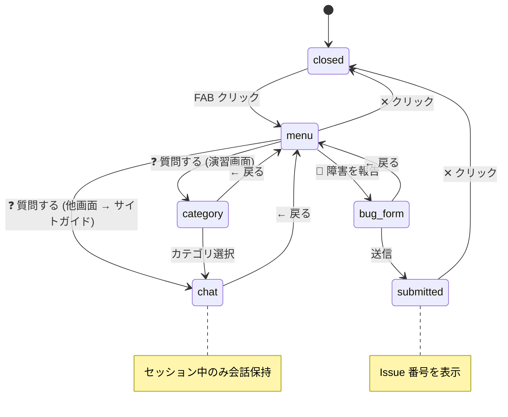

# AIアシスタント機能 要件定義書

## 1. 概要

### 1.1 目的

shikaku-no.com の学習体験を向上させるため、画面右下にフローティングチャットウィジェット形式の AI アシスタントを追加する。以下の 3 つの機能を提供する。

1. **アプリケーション障害報告** — GitHub Issues への自動起票
2. **学習 Q&A** — 正解・不正解した問題への質問・フィードバック（Gemini API）
3. **サイト利用ガイド** — 機能の使い方を案内

### 1.2 背景

- 現状、障害報告の手段がなく、ユーザーからのバグ報告を受け取れない
- 既存の解説は固定テキストであり、個々の疑問に対応できない
- 午後問題では解答プロセスのガイダンスが不足している

### 1.3 参考モデル

| モデル | 参考ポイント |
|--------|------------|
| Intercom / Zendesk チャットウィジェット | 右下 FAB → 展開パネルの UI パターン |
| Backlog AI アシスタント | アプリケーション内 AI の文脈 |

---

## 2. ターゲットユーザー

| 属性 | 値 |
|------|-----|
| 対象 | **ログインユーザーのみ**（ゲストは利用不可） |
| 理由 | レート制限管理、障害報告の追跡にユーザー ID が必要 |

---

## 3. 機能要件

### 3.1 障害報告モード

| 項目 | 詳細 |
|------|------|
| 入力形式 | テキスト入力（自由記述） |
| スクリーンショット | 添付可能（html2canvas によるキャプチャ） |
| マスキング | ユーザー名を DOM 操作で `****` に置換してからキャプチャ |
| プレビュー | キャプチャ後にプレビュー表示、ユーザー確認後に送信 |
| 自動収集情報 | 現在の URL、ブラウザ User-Agent、コンソールエラーログ |
| 送信先 | GitHub Issues に自動起票（ラベル: `bug`, `ai-assistant-report`） |
| 送信制限 | 1ユーザーあたり1日5件 |
| フィードバック | 起票完了通知（Issue 番号）をウィジェット内に表示 |

### 3.2 学習 Q&A モード（演習画面）

#### 初回カテゴリ選択

ユーザーは質問開始前に、以下から聞きたい内容を選択する。

| カテゴリ | AI の振る舞い |
|---------|-------------|
| 🔍 解説の深掘り | 既存の解説をもとに、さらに詳しく説明 |
| 🔗 関連知識の提示 | 関連する概念・用語・過去の類似問題を提示 |
| ❓ なぜ間違えたか分析 | 選択した誤答の傾向を分析して解説 |
| 📝 午後問題の活用 | 長文読解ポイント解説 / 模範解答との比較・添削 / 解答プロセスのステップバイステップ指導 |

#### コンテキスト注入

AI への問い合わせ時に、以下の情報を自動的にコンテキストとして含める。

- 現在の問題文（`question.text`）
- ユーザーの回答（`selectedOption` or 記述回答）
- 正解（`question.correctOption`）
- 既存の解説（`question.explanation`）
- 正解・不正解の判定結果

#### レート制限

| 項目 | 値 |
|------|-----|
| 上限 | **1ユーザーあたり1日10回** |
| リセット | 日本時間 0:00 |
| 表示 | ウィジェット内に「残り ○/10 回」と表示 |
| 上限到達時 | 入力を無効化し、メッセージ表示 |
| 対象外 | 障害報告はカウント対象外（サイト利用ガイドはカウント対象） |

### 3.3 サイト利用ガイドモード（演習以外の画面）

| 項目 | 詳細 |
|------|------|
| 対応内容 | ダッシュボード、演習・模擬試験、学習計画、学習履歴、設定の各機能の使い方 |
| 制約 | サイト外の質問には回答しない |
| レート制限 | Q&A と共通（1日10回） |

---

## 4. 画面フロー

### 4.1 ウィジェット表示ルール

| 画面 | 表示 | 機能 |
|------|------|------|
| ランディングページ (`/`) | 非表示 | — |
| ログイン画面 (`/login`) | 非表示 | — |
| ダッシュボード (`/dashboard`) | 表示 | 障害報告 + サイトガイド |
| 学習計画 (`/plan`) | 表示 | 障害報告 + サイトガイド |
| 演習画面 (`/exam/...`) | 表示 | 障害報告 + **学習 Q&A** |
| 学習履歴 (`/history`) | 表示 | 障害報告 + サイトガイド |
| 設定 (`/settings`) | 表示 | 障害報告 + サイトガイド |
| 管理画面 (`/admin`) | 表示 | 障害報告のみ |

### 4.2 状態遷移

---

## 5. 非機能要件

### 5.1 パフォーマンス

| 項目 | 要件 |
|------|------|
| 初回トークン応答 | 3 秒以内（ストリーミング） |
| ウィジェット描画 | 遅延ロード（`dynamic import`）で初期バンドルに影響しない |
| スクリーンショットキャプチャ | 5 秒以内 |

### 5.2 セキュリティ

| 脅威 | 対策 |
|------|------|
| PII 漏洩 | DOM マスキング + サーバーサイドでユーザー名フィールド除外検証 |
| プロンプトインジェクション | ユーザー入力をシステムプロンプトと分離、Gemini の safety settings 有効化 |
| レート制限バイパス | サーバーサイドで CosmosDB ベースのカウント（クライアント側は表示のみ） |
| Issue スパム | 認証必須 + 1ユーザーあたり1日5件 + ラベル自動付与 |
| スクショに機密情報 | プレビュー表示 → ユーザー確認後に送信 |
| XSS | React の自動エスケープ（`dangerouslySetInnerHTML` 不使用） |
| GitHub Token 漏洩 | サーバーサイド環境変数のみ、クライアントに公開しない |

### 5.3 アクセシビリティ

| 項目 | 要件 |
|------|------|
| キーボード操作 | Tab / Enter / Escape で操作可能 |
| ARIA 属性 | `role="dialog"`, `aria-label`, `aria-live="polite"` |
| フォーカス管理 | パネル展開時にフォーカストラップ |
| スクリーンリーダー | 状態変化を `aria-live` で通知 |

### 5.4 UI/UX

| 項目 | 要件 |
|------|------|
| ダークモード | 既存の `data-theme` 属性と CSS 変数に連動 |
| モバイル | SP では全画面展開 |
| 会話保持 | セッション中のみ（画面遷移でリセット） |
| レスポンシブ | 768px 以下で全画面展開 |

### 5.5 運用

| 項目 | 要件 |
|------|------|
| フィーチャーフラグ | `ai_assistant_enabled` で即時 ON/OFF 切替可能 |
| 段階的リリース | 管理者 → Staging → 10% → 全ユーザー |
| モニタリング | Application Insights でツール呼び出し回数、エラー率を追跡 |
| コスト管理 | Gemini API 使用量を日次で集計、閾値超過時にアラート |

---

## 6. 技術的制約

| 制約 | 影響 | 対応方針 |
|------|------|---------|
| Gemini API 地域制限 | 日本リージョンから直接呼び出し不可の場合がある | 既存 US Functions プロキシ（`apps/api-ai`）経由にフォールバック |
| NextAuth v4 | `getServerSession(authOptions)` 必須 | Auth.js v5 移行時に互換性確認 |
| CSS Modules | グローバルスタイルとの混在不可 | CSS 変数（`globals.css`）を活用 |
| Azure App Service | Cold Start 影響 | API Route は `dynamic = 'force-dynamic'` を設定 |

---

## 7. 受入基準

### 7.1 障害報告

- [ ] ログインユーザーが FAB → 障害報告フォームを開ける
- [ ] テキスト入力 + スクリーンショット添付で送信できる
- [ ] スクリーンショットでユーザー名がマスキングされている
- [ ] 送信後に GitHub Issue が作成される（ラベル: `bug`, `ai-assistant-report`）
- [ ] 起票完了通知（Issue 番号）がウィジェット内に表示される
- [ ] 1日5件を超えると送信不可になる

### 7.2 学習 Q&A

- [ ] 演習画面で FAB → カテゴリ選択 → チャットが開ける
- [ ] 4カテゴリ（解説深掘り / 関連知識 / 誤答分析 / 午後活用）が選択できる
- [ ] 問題コンテキスト（問題文、回答、正解、解説）が自動注入される
- [ ] Gemini がストリーミングで回答を返す
- [ ] 残り回数が表示される
- [ ] 1日10回を超えると質問不可になる

### 7.3 サイトガイド

- [ ] 演習以外の画面で FAB → 質問 → サイトガイドチャットが開ける
- [ ] サイトの機能に関する質問に回答する
- [ ] サイト外の質問には回答しない

### 7.4 非機能

- [ ] ダークモードで正しく表示される
- [ ] 768px 以下でパネルが全画面展開される
- [ ] キーボードのみで操作できる
- [ ] フィーチャーフラグ OFF でウィジェットが表示されない
