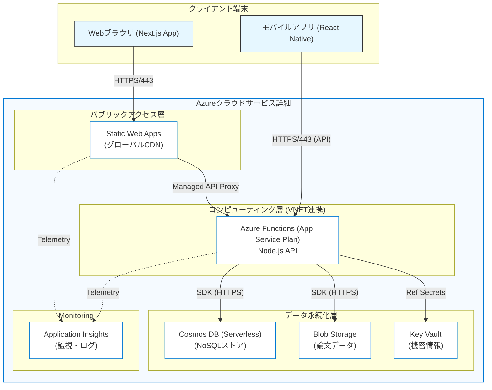

# PM Exam DX 環境設計書・NW構成図

## 1. インフラ構成概要 (Infrastructure Overview)
「要件定義書」および「基本設計書」に基づき、Azure Serverlessアーキテクチャを採用した構成とします。
高可用性、スケーラビリティ、低コスト（待機コストゼロ）を重視しています。

### 1.1 Azureリソース一覧

| <<リソース種別>>         | 名称 (例)              | 用途・役割                                         | SKU / Tier                    |
| :----------------------- | :--------------------- | :------------------------------------------------- | :---------------------------- |
| **Static Web Apps**      | `swa-pm-exam-dx-prod`  | Next.jsフロントエンド + Managed Functions (API)    | Standard (商用) / Free (開発) |
| ~~**Functions**~~        | ~~`func-pm-exam-dx-api`~~  | *(現在は使用せず、SWA Managed Functionsに統合)*  | *(N/A)*                       |
| **Cosmos DB**            | `cosmos-pm-exam-dx-prod` | NoSQLデータベース (JSONドキュメント)               | Serverless (Request Units)    |
| **Key Vault**            | `kv-pm-exam-dx-prod`   | 機密情報（APIキー、接続文字列）の管理              | Standard                      |
| **Application Insights** | `appi-pm-exam-dx`      | ログ監視、パフォーマンス分析                       | Basic (Workspace-based)       |
| **Blob Storage**         | `stpmexamdxprod`       | 論文データ（暗号化済）、静的アセット               | Standard LRS / Hot            |

---

## 2. ネットワーク構成 (Network Architecture)

### 2.1 構成方針
- **パブリックアクセス:** 全て HTTPS (TLS 1.2+) で暗号化。
- **エンドポイント:** Static Web Apps が提供するエッジ（CDN）及び Functions のAPIエンドポイント。
- **データアクセス:** Functions からのみ Cosmos DB / Blob Storage へアクセス許可（Managed Identity 推奨）。

### 2.2 NW構成図 (Mermaid)

---

## 3. 環境分離・デプロイメント (Deployments)

### 3.1 環境定義
| 環境名          | 用途                                           | デプロイ契機                        | URL                                            |
| :-------------- | :--------------------------------------------- | :---------------------------------- | :--------------------------------------------- |
| **Development** | 開発中の動作確認、PRごとのプレビュー環境       | Pull Request 作成/更新時            | `*.blue-sky.azurestaticapps.net` (Preview URL) |
| **Staging**     | リリース前の結合テスト、本番相当データでの検証 | `main` ブランチへのマージ時         | `staging.pm-exam-dx.com` (仮)                  |
| **Production**  | 本番稼働環境                                   | Stagingでの承認後 (Manual Approval) | `pm-exam-dx.com`                               |

### 3.2 CI/CDパイプライン (GitHub Actions)
1. **Build:** GitHub Actions 上で `npm ci` → `turbo run build --filter=web` を実行し、Next.js アプリと依存パッケージ (`@ipa-lab/shared` 等) を事前ビルド。
2. **Test:** Unit Tests (Jest), Lint (ESLint)
3. **Deploy:**
   - Web + API -> Azure Static Web Apps (Pre-built artifacts をアップロード)
     - `skip_app_build: true`: Azure Oryx によるフロントエンド再ビルドをスキップ
     - `skip_api_build: true`: Azure Oryx による API (npm install) 再ビルドをスキップ
     - モノレポ内のローカルパッケージ (`@ipa-lab/shared`) は npm レジストリに公開されていないため、事前ビルドが必須
   - Infra -> Bicep apply (if changes exist)

**重要:** Next.js の API Routes は `next build` 時に `.next` フォルダ内にバンドルされるため、独立した Azure Functions デプロイは不要です。

---

## 4. セキュリティ設計 (Security)

### 4.1 認証・認可
### 4.1 認証・認可
- **認証:** NextAuth.js を利用したソーシャルログイン (GitHub, Google, Email) およびゲストアクセス（匿名利用）。
- **認可:** JWT (JSON Web Token) の検証を Azure Functions 側で実施。NextAuth.jsのセッション情報を利用。

### 4.2 データ保護
- **通信経路:** 全経路 TLS 1.2 以上により暗号化。
- **保存データ:** 
  - Cosmos DB: 透過的データ暗号化 (TDE) はデフォルト有効。
  - Blob Storage: 記述式回答などのクリティカルデータは、アプリ層で暗号化してから保存することも検討（要件定義書 3.3 に準拠）。

### 4.3 ネットワークセキュリティ
- **DDoS保護:** Azure Basic DDoS Protection (標準付帯)。
- **WAF (Optional):** 将来的にFront Doorなどを導入しWAFを適用可能（MVP段階ではコスト優先でSWA標準機能を利用）。
