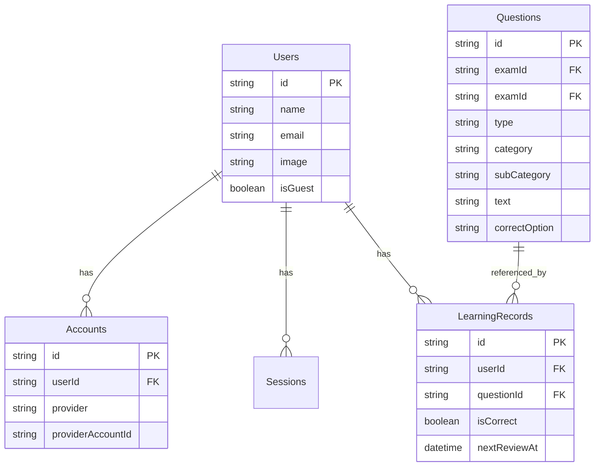

# 詳細設計書: データベース設計 (Database Design)

本システムは **Azure Cosmos DB (NoSQL)** を利用します。
リレーショナルデータベース(RDB)とは異なり、コンテナごとのスキーマレスなJSON構造と、パーティションキーの設計が重要となります。

## 1. データベース概要

- **Database Name:** `pm-exam-dx-db`
- **Throughput Mode:** Serverless (自動スケール)
- **Consistency Level:** Session (デフォルト)

## 2. コンテナ設計

### 2.1 `Questions` コンテナ
過去問データを管理します。午前・午後試験すべてのデータを含みます。

- **PK (Partition Key):** `/examId` (年度+試験区分。例: `AP-2023-Spring`)
- **ID:** `questionId` (ユニークID。例: `AP-2023-Spring-AM1-01`)

**Item Structure Definition:**
```json
{
  "id": "AP-2023-Spring-AM1-01",
  "examId": "AP-2023-Spring",
  "type": "AM1", // AM1, AM2, PM1, PM2
  "type": "AM1", // AM1, AM2, PM1, PM2
  "category": "Technology", // 大分類 (テクノロジ系)
  "subCategory": "Security", // 中分類 (セキュリティ, ネットワーク等)
  "text": "...", // 問題文 (Markdown)
  "options": [ // 選択肢
    { "id": "a", "text": "..." },
    { "id": "b", "text": "..." },
    { "id": "c", "text": "..." },
    { "id": "d", "text": "..." }
  ],
  "correctOption": "a",
  "explanation": "...", // 解説 (Markdown)
  "createdAt": "2023-01-01T00:00:00Z"
}
```

### 2.2 `Users` コンテナ
ユーザーのプロファイルと設定を管理します。

- **PK:** `/id` (NextAuth.js Generated ID)
- **ID:** `id`

**Item Structure Definition:**
```json
{
  "id": "cuid-user-12345",
  "name": "Taro Yamada",
  "email": "user@example.com",
  "image": "https://...",
  "emailVerified": null,
  "isGuest": false, // ゲストユーザーフラグ
  "targetExamDate": "2024-04-21",
  "preferences": {
    "theme": "dark"
  },
  "createdAt": "2024-01-01T00:00:00Z"
}
```

### 2.3 `Accounts` コンテナ (NextAuth.js)
OAuthプロバイダ (Google, GitHub) との紐付け情報を管理。

- **PK:** `/userId`
- **ID:** `providerAccountId` (複合キー的扱いだがCosmosではユニークID)

### 2.4 `Sessions` コンテナ (NextAuth.js)
セッション情報を管理（ゲストの一時保存用にも利用検討）。

- **PK:** `/sessionToken`
- **ID:** `sessionToken`
学習履歴とSR (Spaced Repetition) の状態を管理します。
クエリの負荷分散のため、ユーザーIDをパーティションキーとします。

- **PK:** `/userId`
- **ID:** `recordId` (UUID)

**Item Structure Definition:**
```json
{
  "id": "uuid-v4-xxxx",
  "userId": "user-guid-12345",
  "questionId": "AP-2023-Spring-AM1-01",
  "isCorrect": true,
  "answeredAt": "2024-02-01T10:00:00Z",
  "timeTakenSeconds": 45,
  "nextReviewAt": "2024-02-02T10:00:00Z", // SRアルゴリズムによる次回学習推奨日
  "reviewInterval": 1, // 現在の間隔 (日)
  "easeFactor": 2.5 // SR用係数
}
```

## 3. ER図 (Concept Mapping)

NoSQLですが、論理的なリレーションシップを可視化します。



## 4. データアクセス方針
- **Read:** `packages/shared` の型定義を利用し、Azure Functions経由で取得。
- **Write:** トランザクションは原則不要だが、整合性が必要な場合はStored Procedureを利用(基本は単一アイテム操作)。
