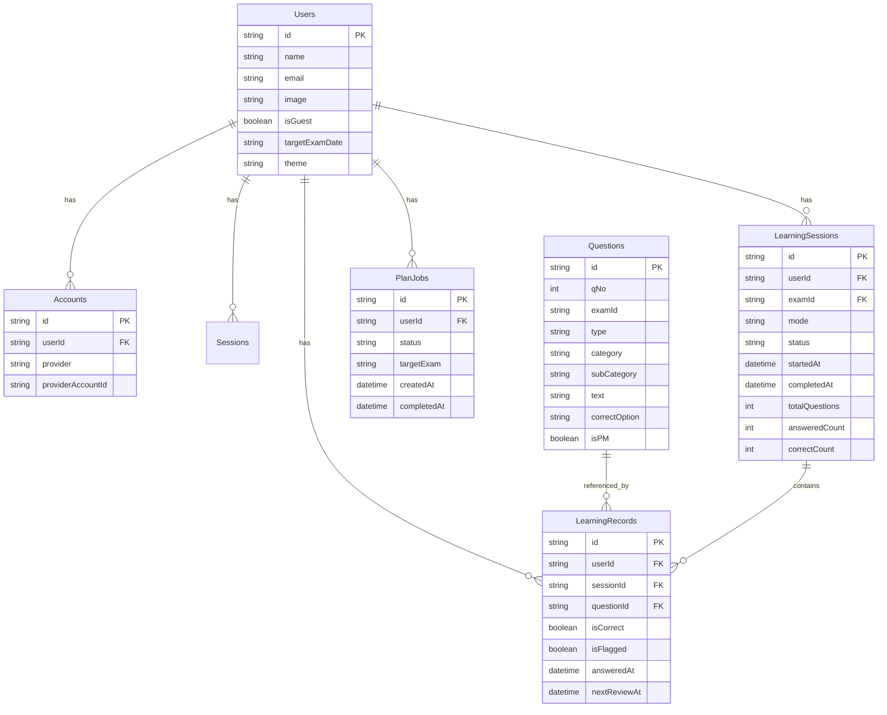

# 詳細設計書: データベース設計 (Database Design)

本システムは **Azure Cosmos DB (NoSQL)** を利用します。
リレーショナルデータベース(RDB)とは異なり、コンテナごとのスキーマレスなJSON構造と、パーティションキーの設計が重要となります。

## 1. データベース概要

- **Database Name:** `pm-exam-dx-db`
- **Throughput Mode:** Serverless (自動スケール)
- **Consistency Level:** Session (デフォルト)

## 2. コンテナ設計

### 2.1 `Questions` コンテナ
過去問データを管理します。午前・午後試験すべてのデータを含みます。

- **PK (Partition Key):** `/examId` (年度+試験区分。例: `AP-2023-Spring`)
- **ID:** `questionId` (ユニークID。例: `AP-2023-Spring-AM1-01`)

**Item Structure Definition:**
```json
{
  "id": "AP-2023-Spring-AM1-01",
  "qNo": 1, // 問題番号（検索用）
  "examId": "AP-2023-Spring",
  "type": "AM1", // AM1, AM2, PM1, PM2
  "category": "Technology", // 大分類 (テクノロジ系、マネジメント系、ストラテジ系)
  "subCategory": "Security", // 中分類 (セキュリティ, ネットワーク等)
  "text": "...", // 問題文 (Markdown)
  "options": [ // 選択肢（AM試験の場合）
    { "id": "a", "text": "..." },
    { "id": "b", "text": "..." },
    { "id": "c", "text": "..." },
    { "id": "d", "text": "..." }
  ],
  "correctOption": "a", // AM試験の正解
  "explanation": "...", // 解説 (Markdown)
  "transcription": "...", // 音声読み上げ用テキスト（将来機能）
  "createdAt": "2023-01-01T00:00:00Z",
  
  // PM試験専用フィールド
  "isPM": false, // PM試験の場合は true
  "subQuestions": [ // PM試験の設問構造
    {
      "subQNo": "設問1",
      "text": "...",
      "subQuestions": [
        {
          "label": "(1)",
          "text": "...",
          "point": 15
        }
      ],
      "choices": { "a": "選択肢A", "b": "選択肢B" }
    }
  ]
}
```

### 2.2 `Users` コンテナ
ユーザーのプロファイルと設定を管理します。

- **PK:** `/id` (NextAuth.js Generated ID)
- **ID:** `id`

**Item Structure Definition:**
```json
{
  "id": "cuid-user-12345",
  "name": "Taro Yamada",
  "email": "user@example.com",
  "image": "https://...",
  "emailVerified": null,
  "isGuest": false, // ゲストユーザーフラグ
  "targetExamDate": "2024-04-21",
  "preferences": {
    "theme": "dark"
  },
  "createdAt": "2024-01-01T00:00:00Z"
}
```

### 2.3 `Accounts` コンテナ (NextAuth.js)
OAuthプロバイダ (Google, GitHub) との紐付け情報を管理。

- **PK:** `/userId`
- **ID:** `providerAccountId` (複合キー的扱いだがCosmosではユニークID)

### 2.4 `Sessions` コンテナ (NextAuth.js)
セッション情報を管理（ゲストの一時保存用にも利用検討）。

- **PK:** `/sessionToken`
- **ID:** `sessionToken`

### 2.5 `LearningRecords` コンテナ
学習履歴とSR (Spaced Repetition) の状態を管理します。
クエリの負荷分散のため、ユーザーIDをパーティションキーとします。

- **PK:** `/userId`
- **ID:** `recordId` (UUID)

**Item Structure Definition:**
```json
{
  "id": "uuid-v4-xxxx",
  "userId": "user-guid-12345",
  "sessionId": "session-uuid-optional", // LearningSessionとの紐付け
  "questionId": "AP-2023-Spring-AM1-01",
  "examId": "AP-2023-Spring", // 集計用
  "category": "Technology", // 集計用
  "subCategory": "Security", // 分析用
  "isCorrect": true,
  "isFlagged": false, // レビューマーカー
  "answeredAt": "2024-02-01T10:00:00Z",
  "timeTakenSeconds": 45,
  "nextReviewAt": "2024-02-02T10:00:00Z", // SRアルゴリズムによる次回学習推奨日
  "reviewInterval": 1, // 現在の間隔 (日)
  "easeFactor": 2.5 // SR用係数
}
```

### 2.6 `LearningSessions` コンテナ
学習セッション（1回の学習トライ）を管理します。Udemy スタイルの進捗追跡に使用。

- **PK:** `/userId`
- **ID:** `sessionId` (UUID)

**Item Structure Definition:**
```json
{
  "id": "session-uuid-xxxx",
  "userId": "user-guid-12345",
  "examId": "AP-2023-Spring",
  "mode": "practice", // practice | mock
  "startedAt": "2024-02-01T10:00:00Z",
  "completedAt": "2024-02-01T11:00:00Z",
  "status": "completed", // in-progress | completed
  "totalQuestions": 80,
  "answeredCount": 75,
  "correctCount": 60,
  "lastQuestionNo": 75
}
```

### 2.7 `Metrics` コンテナ
AI 利用メトリクスとシステム分析データを管理します。

- **PK:** `/type`
- **ID:** メトリクスタイプ + タイムスタンプ

**Item Structure Definition:**
```json
{
  "id": "ai-usage-1707000000000",
  "type": "ai-usage", // ai-usage | system-performance | user-analytics
  "timestamp": "2024-02-04T00:00:00Z",
  "data": {
    "geminiRequests": 1250,
    "successfulResponses": 1180,
    "averageResponseTime": 2.3,
    "errors": {
      "timeout": 15,
      "quota": 5,
      "other": 50
    }
  },
  "createdAt": "2024-02-04T00:00:00Z"
}
```

### 2.8 `PlanJobs` コンテナ
AI学習計画生成の非同期ジョブを管理します。タイムアウト時のフォールバック処理に使用。

- **PK:** `/userId` (ユーザー単位のクエリを効率化)
- **ID:** `job-{userId}-{timestamp}`
- **TTL:** 30日（2592000秒）

**Item Structure Definition:**
```json
{
  "id": "job-user123-1707000000000",
  "type": "studyPlanJob",
  "userId": "user123",
  "targetExam": "AP",
  "status": "pending", // pending | processing | completed | failed
  "requestData": {
    "targetExam": "AP",
    "examDate": "2026-04-19",
    "studyTimeWeekday": 2,
    "studyTimeWeekend": 4,
    "scores": { "テクノロジ系": 60, "マネジメント系": 50, "ストラテジ系": 70 }
  },
  "resultData": { /* StudyPlan オブジェクト */ },
  "error": null,
  "createdAt": "2026-02-03T10:00:00.000Z",
  "processingStartedAt": "2026-02-03T10:00:05.000Z",
  "completedAt": "2026-02-03T10:01:30.000Z",
  "notifiedAt": null,
  "dismissed": false
}
```

**ステータス遷移:**
```
pending → processing → completed
                    ↘ failed
```

## 3. ER図 (Concept Mapping)

NoSQLですが、論理的なリレーションシップを可視化します。


```mermaid
erDiagram
    Users ||--o{ Accounts : has
    Users ||--o{ Sessions : has
    Users ||--o{ LearningRecords : has
    Users ||--o{ LearningSessions : has
    Users ||--o{ PlanJobs : has
    Questions ||--o{ LearningRecords : referenced_by
    LearningSessions ||--o{ LearningRecords : contains

    Users {
        string id PK
        string name
        string email
        string image
        boolean isGuest
        string targetExamDate
        string theme
    }
    
    Accounts {
        string id PK
        string userId FK
        string provider
        string providerAccountId
    }

    Questions {
        string id PK
        int qNo
        string examId
        string type
        string category
        string subCategory
        string text
        string correctOption
        boolean isPM
    }

    LearningRecords {
        string id PK
        string userId FK
        string sessionId FK
        string questionId FK
        boolean isCorrect
        boolean isFlagged
        datetime answeredAt
        datetime nextReviewAt
    }

    LearningSessions {
        string id PK
        string userId FK
        string examId FK
        string mode
        string status
        datetime startedAt
        datetime completedAt
        int totalQuestions
        int answeredCount
        int correctCount
    }

    PlanJobs {
        string id PK
        string userId FK
        string status
        string targetExam
        datetime createdAt
        datetime completedAt
    }
```

## 4. データアクセス方針
- **Read:** `packages/shared` の型定義を利用し、Next.js API Routes および Azure Functions 経由で取得。
- **Write:** トランザクションは原則不要だが、整合性が必要な場合は Stored Procedure を利用（基本は単一アイテム操作）。
- **Partition Strategy**: ユーザー関連データは userId でパーティション分割し、Questions は examId で分割して効率的なクエリを実現。

## 5. パフォーマンス考慮事項

### 5.1 インデックス戦略
- **LearningRecords**: /userId パーティションキー + questionId での複合インデックス
- **Questions**: /examId パーティションキー + qNo での順序検索インデックス
- **LearningSessions**: /userId パーティションキー + startedAt での時系列インデックス

### 5.2 容量見積もり
- **Questions**: 約 10,000 問 × 5KB = 50MB
- **LearningRecords**: 1ユーザー年間2万回答 × 500B = 10MB/ユーザー
- **LearningSessions**: 1ユーザー年間500セッション × 200B = 100KB/ユーザー

## 変更履歴

- **2026-04-07**: リバースエンジニアリングによる大幅更新
  - Question モデルの拡張（PM試験対応、transcription、qNo フィールド）
  - LearningSession モデルの追加（セッション追跡機能）
  - LearningRecord モデルの拡張（sessionId、isFlagged フィールド）
  - Metrics モデルの詳細化（AI利用メトリクス）
  - ER図の更新（LearningSessions の関係性追加）
  - パフォーマンス考慮事項セクションの追加
