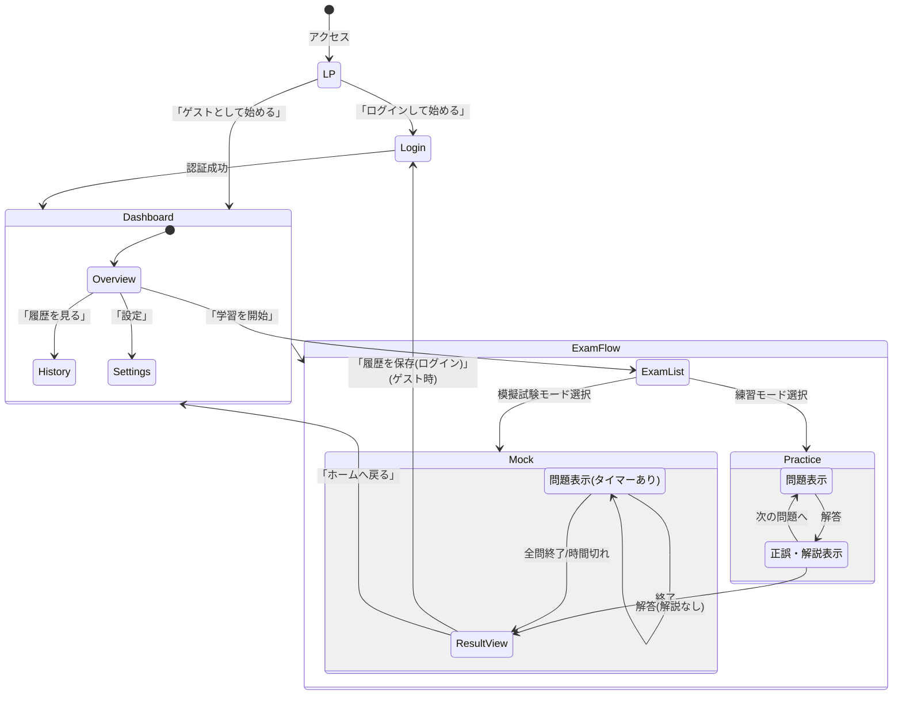

# 詳細設計書: 画面遷移・UI設計 (Screen Design)

Webアプリケーションの画面構成と遷移フローを定義します。

## 1. サイトマップ (Route Structure)

Next.js App Routerのディレクトリ構造に対応します。

- `/` (LP: Landing Page) - 未ログイン時
- `/login` (Login) - 認証画面 (NextAuth.js)
- `/dashboard` (Dashboard) - **ホーム画面**
  - 学習進捗概要、今日のタスク
- `/exam` (Exam List) - 問題選択
  - `/exam/[year]/[type]` - 問題一覧・モード選択
  - `/exam/[year]/[type]/[questionId]?mode=practice` - **練習モード**
  - `/exam/[year]/[type]/[questionId]?mode=mock` - **模擬試験モード**
  - `/exam/result` - 結果表示
- `/history` (History) - 学習履歴
- `/settings` (Settings) - ユーザー設定

## 2. 画面遷移図 (Screen Flow)

## 3. 主要画面ワイヤーフレーム要件

### 3.1 ダッシュボード (`/dashboard`)
- **Header:** ロゴ、ユーザーアイコン（未ログイン時は「ログイン」ボタン）
- **Today's Status:** 本日の学習目標数 vs 実績数 (プログレスバー)
- **Analytics:** 
  - **Radar Chart:** 分野別(SubCategory)正解率（得意・不得意の可視化）。
  - **Line Chart:** 学習日ごとの正解数/率の推移（成長グラフ）。
  - **Table:** 年度別の学習進捗と正解率。
- **Review Queue:** 「復習すべき問題」がある場合、アラート表示して直接開始ボタンを配置。
- **Recent History:** 直近の解答履歴リスト。

### 3.2 出題画面 (`/exam/.../[id]`)
- **Question Area:** 問題文を表示。Markdownのレンダリングが必要。
- **Options Area:** 選択肢 (ア, イ, ウ, エ) のボタン。スマホ操作を考慮し大きめに配置。
- **Actions:** 「解答する」ボタン、「あとで見る」フラグ。
- **Result Area (練習モード):** 解答後、即時に正誤と解説を表示。
- **Mock Mode:** 制限時間を表示。解答後は即座に次の問題へ遷移し、解説は表示しない。

### 3.3 結果画面 (`/exam/result`)
- **Summary:** 正答率、スコア、所要時間。
- **Details:** 問ごとの正誤一覧。模擬試験モードの場合はここで解説を確認可能。

### 3.3 設定画面 (`/settings`)
- **Theme:** ライト/ダークモード切替
- **Target:** 目標試験日の設定
