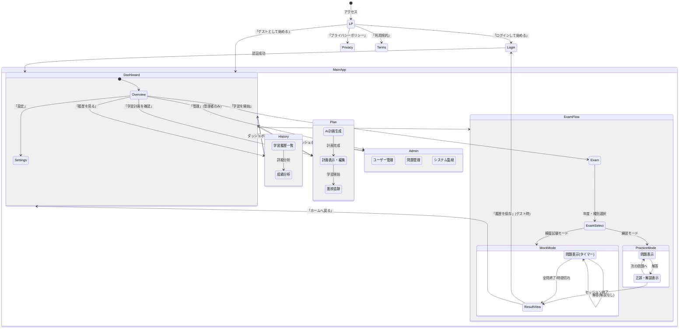

# 詳細設計書: 画面遷移・UI設計 (Screen Design)

Webアプリケーションの画面構成と遷移フローを定義します。

## 1. サイトマップ (Route Structure)

Next.js App Routerのディレクトリ構造に対応します。

### 1.1 パブリックアクセス
- `/` (LP: Landing Page) - 未ログイン時のトップページ
- `/login` (Login) - 認証画面 (NextAuth.js)
- `/privacy` (Privacy Policy) - プライバシーポリシー
- `/terms` (Terms of Service) - 利用規約

### 1.2 メイン機能（(main) Route Group）
- `(main)/dashboard/` (Dashboard) - **ホーム画面**
  - 学習進捗概要、今日のタスク、アクティビティ分析
- `(main)/exam/` (Exam List) - 試験・問題選択
  - `(main)/exam/[year]/[type]/` - 問題一覧・モード選択
  - `(main)/exam/[year]/[type]/[qNo]/` - **問題表示画面**
    - `?mode=practice` - **練習モード**
    - `?mode=mock` - **模擬試験モード**
  - `(main)/exam/[year]/[type]/result/` - 結果表示
- `(main)/history/` (History) - 学習履歴・成績分析
- `(main)/plan/` (Study Plan) - **AI学習計画機能**
  - 学習計画生成、進捗追跡、スケジュール管理
- `(main)/settings/` (Settings) - ユーザー設定
  - テーマ、目標試験日、通知設定
- `(main)/admin/` (Administration) - **管理機能**
  - 問題管理、ユーザー分析、システム監視

## 2. 画面遷移図 (Screen Flow)

```mermaid
stateDiagram-v2
    [*] --> LP: アクセス
    LP --> Dashboard: 「ゲストとして始める」
    LP --> Login: 「ログインして始める」
    LP --> Privacy: 「プライバシーポリシー」
    LP --> Terms: 「利用規約」
    Login --> Dashboard: 認証成功

    state MainApp {
        state Dashboard {
            [*] --> Overview
            Overview --> Exam: 「学習を開始」
            Overview --> History: 「履歴を見る」
            Overview --> Plan: 「学習計画を確認」
            Overview --> Settings: 「設定」
            Overview --> Admin: 「管理」(管理者のみ)
        }

        state ExamFlow {
            Exam --> ExamSelect: 年度・種別選択
            ExamSelect --> PracticeMode: 練習モード
            ExamSelect --> MockMode: 模擬試験モード

            state PracticeMode {
                PQ: 問題表示
                PA: 正誤・解説表示
                PQ --> PA: 解答
                PA --> PQ: 次の問題へ
                PA --> ResultView: セッション終了
            }

            state MockMode {
                MQ: 問題表示(タイマー)
                MQ --> MQ: 解答(解説なし)
                MQ --> ResultView: 全問終了/時間切れ
            }
        }

        state Plan {
            PlanGen: AI計画生成
            PlanView: 計画表示・編集
            PlanProgress: 進捗追跡
            PlanGen --> PlanView: 計画完成
            PlanView --> PlanProgress: 学習開始
        }

        state Admin {
            UserMgmt: ユーザー管理
            QuestionMgmt: 問題管理
            SystemMon: システム監視
        }

        state History {
            RecordList: 学習履歴一覧
            Analytics: 成績分析
            RecordList --> Analytics: 詳細分析
        }
    }

    Dashboard --> ExamFlow
    Dashboard --> Plan
    Dashboard --> Admin
    Dashboard --> History
    ResultView --> Dashboard: 「ホームへ戻る」
    ResultView --> Login: 「履歴を保存」(ゲスト時)
    Plan --> Dashboard: ダッシュボードへ  
    History --> Dashboard: ダッシュボードへ
    Admin --> Dashboard: ダッシュボードへ
```

## 3. 主要画面ワイヤーフレーム要件

### 3.0 ランディングページ (`/`)
- **Language:** 日本語 (Japanese)
- **Hero Section:**
  - キャッチコピー (例: "プロジェクトマネージャ試験を、もっとスマートに。")
  - **Action:** 「ゲストとして始める」(Link to `/dashboard`)
  - **Action:** 「ログイン」(Link to `/login`)
- **Features:** 機能紹介（演習、分析、履歴）

### 3.1 ダッシュボード (`/dashboard`)
- **Header:** ロゴ、ユーザーアイコン（未ログイン時は「ログイン」ボタン）
- **Today's Status:** 本日の学習目標数 vs 実績数 (プログレスバー)
- **Analytics:** 
  - **Radar Chart:** 分野別(SubCategory)正解率（得意・不得意の可視化）。
  - **Line Chart:** 学習日ごとの正解数/率の推移（成長グラフ）。
  - **Table:** 年度別の学習進捗と正解率。
- **Review Queue:** 「復習すべき問題」がある場合、アラート表示して直接開始ボタンを配置。
- **Recent History:** 直近の解答履歴リスト。

### 3.2 出題画面 (`/exam/.../[id]`)
- **Question Area:** 問題文を表示。Markdownのレンダリングが必要。
- **Options Area:** 選択肢 (ア, イ, ウ, エ) のボタン。スマホ操作を考慮し大きめに配置。
- **Actions:** 「解答する」ボタン、「あとで見る」フラグ。
- **Result Area (練習モード):** 解答後、即時に正誤と解説を表示。
- **Mock Mode:** 制限時間を表示。解答後は即座に次の問題へ遷移し、解説は表示しない。

### 3.3 結果画面 (`/exam/result`)
- **Summary:** 正答率、スコア、所要時間。
- **Details:** 問ごとの正誤一覧。模擬試験モードの場合はここで解説を確認可能。

### 3.4 学習計画画面 (`/plan`)
- **Plan Generator:** AI による学習計画生成
  - 目標試験日、週間学習時間、得意/不得意分野の入力
  - Gemini API を利用した個別最適化
- **Plan View:** 生成された学習計画の表示・編集
  - 週次スケジュール、推奨学習分野、進捗目標
- **Progress Tracking:** 計画に対する進捗状況の可視化
  - 達成率グラフ、予定vs実績の比較

### 3.5 学習履歴画面 (`/history`)
- **Record List:** 学習履歴一覧（日付別、試験別フィルタ）
- **Analytics Dashboard:** 
  - 分野別正解率の詳細分析
  - 学習時間の推移
  - Spaced Repetition 進捗状況
- **Performance Trends:** 長期的な成績向上傾向の可視化

### 3.6 管理画面 (`/admin`)
- **User Management:** ユーザー一覧・アクティビティ監視
- **Question Management:** 問題データの管理・編集
  - データ品質チェック
  - 新規問題の追加・承認
- **System Monitoring:** 
  - Azure Functions のパフォーマンス監視
  - AI API 利用状況・エラー率
  - CosmosDB クエリパフォーマンス

### 3.7 設定画面 (`/settings`)
- **Theme:** ライト/ダークモード切替
- **Target:** 目標試験日の設定
- **Notifications:** 学習リマインダー・進捗通知の設定
- **Privacy:** データ削除・エクスポート機能

## 4. レスポンシブ対応要件

### 4.1 ブレークポイント
- **Mobile**: < 768px
- **Tablet**: 768px - 1024px  
- **Desktop**: > 1024px

### 4.2 モバイル最適化
- **Navigation**: ハンバーガーメニュー
- **Question Display**: 縦スクロール最適化
- **Touch Interface**: ボタンサイズ 44px 以上
- **Performance**: 画像遅延読み込み、Critical CSS

## 変更履歴

- **2026-04-07**: リバースエンジニアリングによる大幅更新
  - サイトマップ構造を実装に合わせて更新（(main) Route Group追記）  
  - plan/ (AI学習計画機能) の追加
  - admin/ (管理機能) の追加
  - privacy/, terms/ ページの追加
  - 画面遷移図の詳細化（新機能含む）
  - ワイヤーフレーム要件の拡充（新画面対応）
  - レスポンシブ対応要件セクションの追加
