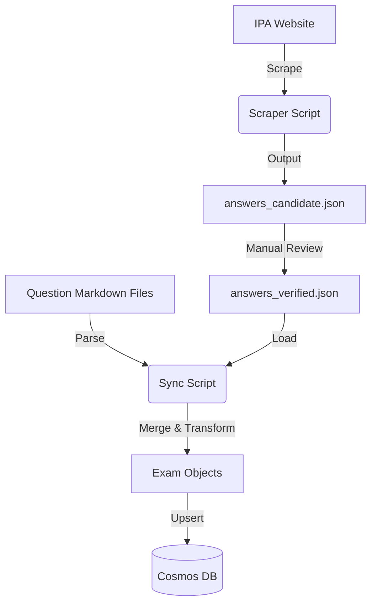

# Data Sync & Scraping Tool Design

## 1. Overview
This document outlines the design for the **Data Sync Tool** (`packages/data`), which is responsible for populating the Cosmos DB with exam master data.
The tool combines **Question Data** stored locally (GitOps) with **Answer Data** scraped from the official IPA website, validated by a human administrator.

## 2. Objectives
- **Automated Scraping**: Fetch correct answer keys (正誤データ) directly from the IPA official website (PDF/HTML).
- **GitOps for Questions**: Manage question text and structure as Markdown/YAML files in the repository.
- **Human-in-the-Loop Verification**: Ensure scraped data is accurate before committing to the database.
- **Idempotent Sync**: Enable safe re-runs to update or fix data without duplication.

## 3. Architecture

### 3.1 Data Flow


### 3.2 Components

#### A. Scraper Module (`scripts/scrape-answers.ts`)
- **Input**: Exam Year/Season URL (e.g., https://www.ipa.go.jp/shiken/mondai-kaiotu/...)
- **Logic**:
  - Fetches the definition page.
  - Downloads the PDF or parses the HTML table containing answer keys.
  - Extract Question Number (Q1...Q80) and Correct Option (ア/イ/ウ/エ).
- **Output**: JSON file `data/raw/{year}_{season}_answers.json`
  ```json
  {
    "examId": "AP-2023-Fall-AM1",
    "answers": [
      { "qNo": 1, "correct": "a" },
      { "qNo": 2, "correct": "c" }
    ]
  }
  ```
- **Dependencies**: `puppeteer` (for rendering JS if needed) or `cheerio` + `pdf-parse` (if PDF only). Note: IPA often publishes answers as PDFs.

#### B. Verification Workflow
1. Developer runs `npm run scrape -- --url=...`
2. Developer opens the generated JSON.
3. Developer compares with official PDF manually to spot check.
4. Developer renames/moves file/flag to "verified" status (e.g., `data/verified/...`).

#### C. Sync Module (`scripts/seed-db.ts`)
- **Input**: 
    - Verified Answer JSON.
    - Question Markdown files (Structure: `data/questions/{year}/{type}/{qNo}.md`).
- **Logic**:
  - Iterate through Question Markdowns to read Body/options/explanations.
  - Map `qNo` to the Verified Answer JSON to set `correctOption`.
  - Validate that every question has a correct answer.
- **Output**: Writes/Upserts documents to Cosmos DB `Exams` and `Questions` containers.

## 4. Tech Stack & Dependencies
- **Runtime**: Node.js (TS)
- **Scraping**: `axios`, `cheerio`, `pdf-parse` (for PDF text extraction)
- **DB Client**: `@azure/cosmos`
- **File System**: `fs/promises`

## 5. Directory Structure (`packages/data`)
```
packages/data/
├── src/
│   ├── scraper/
│   │   └── index.ts      # Scraping Logic
│   ├── syncer/
│   │   └── index.ts      # DB Sync Logic
│   └── utils/
│       └── pdf.ts        # PDF Parsing helpers
├── data/
│   ├── raw/              # Scraped but unverified
│   └── verified/         # Human checked
├── package.json
└── tsconfig.json
```

## 6. CLI Commands
- `npm run scrape <url> --out <filename>`
- `npm run sync --dry-run`
- `npm run sync --force`
