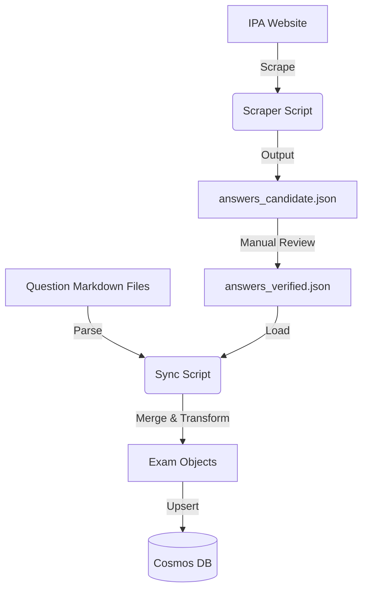

# Data Sync & Scraping Tool Design

## 変更履歴

| 日付 | 内容 |
|------|------|
| 2026-05-05 | `NW-2022-Spring-AM2` の埋め込みテキストによる AM2 解答PDF抽出実績を追加 |
| 2026-05-05 | `NW-2023-Spring-AM2` の Ollama/Gemma AM2 問題PDF抽出実績と画像補正結果を追加 |
| 2026-05-05 | `DB-2016-Spring-AM2` の Ollama/Gemma AM2 問題PDF抽出実績、Q4 再抽出メモ、`NW-2025-Spring-AM2` の解答・問題抽出実績を追加 |
| 2026-05-04 | Ollama による AM/AM2 問題PDF pilot、Gemma 推奨条件、Qwen3.x の response 空問題を追加 |
| 2026-05-04 | Ollama Vision による解答PDFローカル抽出 pilot と PDF レンダラ前提を追加 |
| 2026-05-03 | PDF ダウンロード時の実体検証、`DOWNLOAD_CATEGORIES` による対象カテゴリ指定、`audit:raw-pdfs` による Stage A 完了ゲートを追加 |
| 2026-05-02 | Cosmos `Questions` 再同期前のローカル監査、qNo 単位 dry-run、`qNo=99` 旧プレースホルダー削除計画、Agent Skill / Specialist / Security review の運用を追加 |
| 2026-05-02 | IPA 公式年度別 HTML から対象カテゴリの問題/解答 PDF を抽出し、`exam-list.ts` とローカルデータの To-Be / As-Is 差分を確認する公式ソース監査を追加 |

## 1. Overview
This document outlines the design for the **Data Sync Tool** (`packages/data`), which is responsible for populating the Cosmos DB with exam master data.
The tool combines **Question Data** stored locally (GitOps) with **Answer Data** scraped from the official IPA website, validated by a human administrator.

## 2. Objectives
- **Automated Scraping**: Fetch correct answer keys (正誤データ) directly from the IPA official website (PDF/HTML).
- **GitOps for Questions**: Manage question text and structure as Markdown/YAML files in the repository.
- **Human-in-the-Loop Verification**: Ensure scraped data is accurate before committing to the database.
- **Idempotent Sync**: Enable safe re-runs to update or fix data without duplication.

## 3. Architecture

### 3.1 Data Flow

```mermaid
graph TD
    A[IPA Website] -->|Scrape| B(Scraper Script)
    B -->|Output| C[answers_candidate.json]
    C -->|Manual Review| D[answers_verified.json]
    E[Question Markdown Files] -->|Parse| F(Sync Script)
    D -->|Load| F
    F -->|Merge & Transform| G[Exam Objects]
    G -->|Upsert| H[(Cosmos DB)]
```

### 3.2 Components

#### A. Scraper Module (`scripts/scrape-answers.ts`)
- **Input**: Exam Year/Season URL (e.g., https://www.ipa.go.jp/shiken/mondai-kaiotu/...)
- **Logic**:
  - Fetches the definition page.
  - Downloads the PDF or parses the HTML table containing answer keys.
  - Extract Question Number (Q1...Q80) and Correct Option (ア/イ/ウ/エ).
- **Output**: JSON file `data/raw/{year}_{season}_answers.json`
  ```json
  {
    "examId": "AP-2023-Fall-AM1",
    "answers": [
      { "qNo": 1, "correct": "a" },
      { "qNo": 2, "correct": "c" }
    ]
  }
  ```
- **Dependencies**: `puppeteer` (for rendering JS if needed) or `cheerio` + `pdf-parse` (if PDF only). Note: IPA often publishes answers as PDFs.

#### B. Verification Workflow
1. Developer runs `npm run scrape -- --url=...`
2. Developer opens the generated JSON.
3. Developer compares with official PDF manually to spot check.
4. Developer renames/moves file/flag to "verified" status (e.g., `data/verified/...`).

#### C. Sync Module (`scripts/seed-db.ts`)
- **Input**: 
    - Verified Answer JSON.
    - Question Markdown files (Structure: `data/questions/{year}/{type}/{qNo}.md`).
- **Logic**:
  - Iterate through Question Markdowns to read Body/options/explanations.
  - Map `qNo` to the Verified Answer JSON to set `correctOption`.
  - Validate that every question has a correct answer.
- **Output**: Writes/Upserts documents to Cosmos DB `Exams` and `Questions` containers.

## 4. Tech Stack & Dependencies
- **Runtime**: Node.js (TS)
- **Scraping**: `axios`, `cheerio`, `pdf-parse` (for PDF text extraction)
- **DB Client**: `@azure/cosmos`
- **File System**: `fs/promises`

## 5. Directory Structure (`packages/data`)
```
packages/data/
├── src/
│   ├── scraper/
│   │   └── index.ts      # Scraping Logic
│   ├── syncer/
│   │   └── index.ts      # DB Sync Logic
│   └── utils/
│       └── pdf.ts        # PDF Parsing helpers
├── data/
│   ├── raw/              # Scraped but unverified
│   └── verified/         # Human checked
├── package.json
└── tsconfig.json
```

## 6. CLI Commands
- `npm run scrape <url> --out <filename>`
- `npm run sync --dry-run`
- `npm run sync --force`

## 7. Cosmos Questions 再同期ガード

本番 `Questions` コンテナを再同期する場合は、直接 apply せず、以下の順序で確認する。

1. `.github/skills/exam-data-management/scripts/official-source-coverage-audit.mjs --json` で IPA 公式年度別 HTML から対象カテゴリの問題/解答 PDF を抽出し、To-Be を確定する。
2. `.github/skills/exam-data-management/scripts/local-exam-data-audit.mjs --json` でローカル JSON 形式、qNo 欠損、重複、空データ、IPA 公開一覧との差分を確認する。
3. Cosmos DB firewall は現在 IP を一時追加し、完了後に元の `ipRules` へ復元する。接続文字列は標準出力へ出さない。
4. `.github/skills/exam-data-management/scripts/cosmos-questions-sync-plan.mjs --dry-run --json` で削除予定と upsert 予定を確認する。
5. ユーザー承認後のみ `--apply --confirm-production-write` を付けて実行する。
6. apply 後に同じ dry-run を再実行し、旧プレースホルダーと未投入 qNo が残っていないことを確認する。

### 7.1 公式ソース To-Be 監査

対象カテゴリは AP / PM / SC / FE / NW / DB / SA / ES / ST、年度範囲は 2016 年以降を標準とする。
`official-source-coverage-audit.mjs` は IPA の年度別 HTML から `_qs.pdf` と `_ans.pdf` を抽出し、問題 PDF が存在する単位を To-Be として扱う。
公式解答 PDF が存在する場合は `exam-list.ts` の `answerUrl` と `packages/data/data/questions/{examId}/answers_raw.json` も検証対象に含める。
差分は `representativeGaps` として As-Is / To-Be の形で出力し、本番同期 dry-run 前に説明する。

### 7.2 Raw PDF Stage A ゲート

PDF ダウンロード後、Gemini OCR へ進む前に `packages/data/data/raw_pdfs/` の実体監査を必ず実行する。
`download.ts` は既存ファイルがあっても `%PDF-` ヘッダーがない、または HTML/XML と判定できるファイルを破損扱いにし、再取得対象にする。
大規模整備では対象カテゴリを `DOWNLOAD_CATEGORIES` で明示し、監査も同じカテゴリで実行する。

```powershell
$env:DOWNLOAD_CATEGORIES = "AP,PM,SC,FE,NW,DB,SA,ES,ST"
npm run download -w packages/data
Remove-Item Env:DOWNLOAD_CATEGORIES

npm run -w packages/data audit:raw-pdfs -- --categories=AP,PM,SC,FE,NW,DB,SA,ES,ST
```

Stage A の完了条件は `status=RAW_PDF_AUDIT_OK`、`missingQuestionCount=0`、`missingAnswerCount=0`、`invalidPdfCount=0` とする。
この条件を満たすまで `npm run extract -w packages/data` へ進まない。
Windows 環境では `npx` を子プロセスから直接 spawn すると `spawnSync npx ENOENT` になる場合があるため、Gemini OCR は `npm run extract -w packages/data` から起動し、内部では `process.execPath` と `ts-node/register` で `gemini-extract.ts` を実行する。

#### 7.2.1 Ollama 解答PDF抽出 pilot

Gemini のレート制限回避やローカル検証のため、解答PDFだけを `extract:answers:ollama` で抽出できる。
この pilot は `answers_raw.json` の補完用であり、問題本文・図表・Mermaid 変換を含む `questions_raw.json` の正式抽出を代替しない。

```powershell
npm run -w packages/data extract:answers:ollama -- --check
npm run -w packages/data extract:answers:ollama -- --dry-run --limit=3
npm run -w packages/data extract:answers:ollama -- --exam-id=AP-2024-Spring-AM
```

前提条件は、Ollama で Vision 対応モデル（既定値 `gemma4:26b`）が利用できること、および `pdfjs-dist` legacy build と `@napi-rs/canvas` による PDF 画像化がローカルで動作することである。
`--dry-run` や `--limit` が npm 側の設定として扱われる環境があるため、script は `npm_config_*` も読み取る。

2026-05-05 に AM/AM2 解答PDFの前処理として、埋め込みテキストが存在する場合は `問 1 ウ` のような表記を直接パースし、`answers_raw.json` の key-value map に変換する経路を追加した。
テキストから正答を検出できた場合は Ollama Vision OCR を呼ばず、テキストが空のスキャンPDFだけ従来の画像OCRにフォールバックする。
この修正により `NW-2024-Spring-AM2` と `NW-2025-Spring-AM2` はいずれも25問分の正答を生成できる。
同じ経路で `NW-2023-Spring-AM2` も25問分の正答を生成できる。
同じ経路で `NW-2022-Spring-AM2` も25問分の正答を生成できる。
`NW-2025-Spring-AM2` は初回の Gemma OCR で20問分に過少抽出されていたため、25問版の正答マップで `questions_raw.json` の `correctOption` を再同期した。
AM2 問題本文抽出を行う場合は、生成済みの正答マップと照合して `correctOption` 欠落や qNo 欠番を検出する。

#### 7.2.2 Ollama AM/AM2 問題PDF抽出 pilot

AM/AM2 の択一問題PDFをローカルで試験抽出する場合は、`extract:questions:ollama` を使用できる。
対象は午前系の `*-AM` / `*-AM2` に限定し、午後問題の正式抽出は Gemini 系の Stage B を継続する。
スキャンPDFでは埋め込みテキストが空になるため、ページ画像を Ollama Vision モデルへ渡す。
2段組みPDFでは `--split-columns` で左右カラムを分割し、長時間処理では `--allow-partial` と `--debug-dir` で成功チャンクと生応答を残す。

```powershell
npm run -w packages/data extract:questions:ollama -- --check --model=gemma4:e4b
npm run -w packages/data extract:questions:ollama -- --model=gemma4:e4b --exam-id=DB-2016-Spring-AM2 --split-columns --allow-partial --debug-dir=../../temp-logs/ollama-debug --render-dpi=85 --num-predict=1024 --timeout-ms=420000
```

2026-05-04 時点の検証では、`DB-2016-Spring-AM2` はスキャンPDFであり、`--text-only` は利用できない。
`gemma4:e4b` + `--split-columns` はページ単位の抽出に成功したが、選択肢欠落や本文誤読が残るため、出力後は qNo、選択肢4件、正答、図表表現を必ずレビューする。
`--with-explanations` は同時生成の負荷が高いため、一次抽出では無効のままとし、解説は後工程で補完する。

2026-05-05 の `DB-2016-Spring-AM2` 抽出では、`gemma4:e4b` + `--split-columns` + `--allow-partial` で `questions_raw.json` 24問を生成した。
初回通し抽出では Q4 が欠番になったため、ページ4のみを `--page-range=4`、`--render-dpi=100`、`--num-predict=1536` で再抽出し、Q4 だけをマージした。
構造検証では qNo 1-24、選択肢 a-d の4件、`answers_raw.json` との `correctOption` 一致を確認した。
ただし OCR 由来の本文・図表の誤読は残り得るため、Cosmos 同期前に人手レビューまたは Gemini 版との比較を行う。

2026-05-05 の `NW-2025-Spring-AM2` 問題PDF抽出では、ページ単位で `--chunk-pages=1 --chunk-overlap=0` を指定して重複チャンクを避けた。
Q1-Q12、Q16-Q20 はページ別 probe の成功分を正答マップで検証して採用し、Q13-Q15 はページ7左右カラム画像を確認して選択肢本文を補正した。
その後、埋め込みテキスト版の解答抽出で正答が25問あることを確認したため、Q21-Q25 をページ10〜12の左右カラム画像から補完した。
Q22-Q24 はページ11左右カラムの分断により Gemma の JSON が途中切れしたため、ページ画像と生応答を併用して手動補正した。
構造検証では qNo 1-25、選択肢 a-d の4件、空文字選択肢なし、`answers_raw.json` との `correctOption` 一致を確認した。
ページ7やページ11のように左右カラムの切れ目に選択肢がまたがる場合、Ollama の JSON が途中で切れたり qNo を 1 から再採番したりするため、カラム画像と生応答を併用して補正する。

2026-05-05 の `NW-2024-Spring-AM2` 問題PDF抽出では、スキャンPDFだが紙面は1カラムだったため、`--split-columns` を使うと本文を左右で切断し、表紙注意事項を Q25 と誤認したりページ2以降で長時間タイムアウトしたりした。
この形式ではページ全体画像を `--page-range=<n> --chunk-pages=1 --chunk-overlap=0` で1ページずつ処理する。
Q1-Q19 はページ別 probe の成功分を正答マップとページ画像で検証し、Q20-Q25 はページ10〜12のページ画像から補完した。
構造検証では qNo 1-25、選択肢 a-d の4件、空文字選択肢なし、`answers_raw.json` との `correctOption` 一致を確認した。
ページ全体画像でも長時間タイムアウトするページは、Gemma 再試行を続けずにページ画像と既知の正答マップで本文・選択肢を補正する。

2026-05-05 の `NW-2023-Spring-AM2` 問題PDF抽出でも、スキャンPDFかつ紙面は1カラムだったため、`--split-columns` は使わずページ全体画像で処理した。
Q1-Q13 はページ3〜6の probe 成功分を採用前にページ画像で補正し、Q14-Q25 はページ7〜12のページ画像から本文・選択肢を補完した。
ページ7は `gemma4:e4b` のページ単位抽出が 600000ms でタイムアウトしたため、再試行を続けずに画像確認へ切り替えた。
構造検証では qNo 1-25、選択肢 a-d の4件、空文字選択肢なし、`answers_raw.json` との `correctOption` 一致を確認した。

Qwen3.x 系モデルは当面使用しない。
`qwen3.5:9b` では `/api/generate`、`/api/chat`、`format: json` の有無、`options.think=false` のいずれでも `response` / `message.content` が空になる事象を確認した。
この問題はプロンプトや JSON 強制だけでは回避できず、`qwen3.6:27b` も同系統のリスクが高い。
また 27B は `gemma4:26b` と同程度のサイズになり、処理時間・メモリ面でも `gemma4:e4b` より不利である。
Ollama またはモデル側で response 空問題が解消されるまで、AM/AM2 問題PDF抽出の推奨モデルは `gemma4:e4b` とする。

### 7.3 qNo=99 の扱い

`qNo=99` は IP/AM では正規問題になり得るため、全件削除は禁止する。
削除対象は「ローカル静的データに同じ examId が存在し、かつローカル側に Q99 が存在しない Cosmos 側 Q99」に限定する。
これにより、過去の同期不具合で生成された午後問題の旧プレースホルダーを削除しつつ、正規の Q99 を保持する。

### 7.4 Agent 運用

データ抽出、登録、同期は `.github/skills/exam-data-management/` と `data-management-specialist` が担当する。
本番 DB 操作、GitHub security alerts、secret scanning、Dependabot、CodeQL の確認は `security-agent` がレビューする。
レビューで権限不足や未確認項目がある場合は、同期 apply 前の未解決リスクとして扱う。
