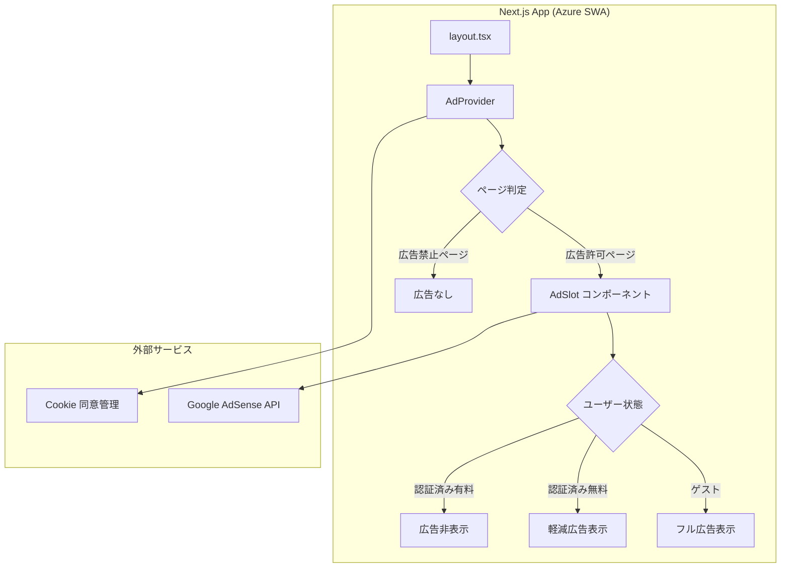

# 広告実装計画 設計書

## 1. 概要

### 1.1 目的

IPA 資格試験対策プラットフォーム「PM Exam DX」の収益化手段として、**ユーザー体験を損なわない形**で広告を導入する。学習アプリという特性上、**集中力を阻害しない広告配置**が最優先事項である。

### 1.2 基本方針

| 方針 | 説明 |
|------|------|
| **学習体験ファースト** | 試験演習中（`/exam`）には広告を表示しない |
| **段階的導入** | Phase 1 で静的バナーのみ → Phase 2 でインタースティシャルを検討 |
| **認証ユーザー優遇** | ログインユーザーは広告非表示 or 軽減（将来的なプレミアムプランへの導線） |
| **パフォーマンス維持** | Core Web Vitals への影響を最小限に抑える（LCP +500ms 以内） |
| **プライバシー準拠** | GDPR / 個人情報保護法に準拠した同意管理を実装 |

---

## 2. 現状分析

### 2.1 ページ構成と広告適性

| ページ | パス | 広告配置 | 理由 |
|--------|------|----------|------|
| トップページ | `/` | ✅ 適 | ランディングページ。ユーザーの集中を妨げない |
| ログイン | `/login` | ✅ 適 | 遷移ページ。軽量バナーのみ |
| ダッシュボード | `/dashboard` | ✅ 適 | 学習概要ページ。サイドまたは下部に配置可能 |
| 試験演習 | `/exam` | ❌ 不適 | **学習集中エリア。広告は一切表示しない** |
| 学習履歴 | `/history` | ⚠️ 条件付き | 結果表示後のフッターのみ |
| AI 学習プラン | `/plan` | ⚠️ 条件付き | プラン表示後のフッターのみ |
| 設定 | `/settings` | ❌ 不適 | ユーティリティページ |
| プライバシーポリシー | `/privacy` | ❌ 不適 | 法的ページ |
| 利用規約 | `/terms` | ❌ 不適 | 法的ページ |

### 2.2 ユーザーセグメント

| セグメント | 広告表示 | 備考 |
|------------|----------|------|
| 未認証（ゲスト）ユーザー | ✅ 表示 | 主要な収益対象 |
| 認証済みユーザー（無料） | ⚠️ 軽減表示 | バナーのみ。インタースティシャルなし |
| 認証済みユーザー（有料/将来） | ❌ 非表示 | プレミアムプランの価値提案 |

---

## 3. 技術設計

### 3.1 広告プロバイダー

| 候補 | 特徴 | 推奨度 |
|------|------|--------|
| **Google AdSense** | 最も普及、自動最適化、Next.js 対応実績豊富 | ⭐ 推奨 |
| Google Ad Manager | AdSense + 直接販売の統合管理 | Phase 2 以降 |
| Carbon Ads | 開発者向け。学習サイトとの親和性高い | 代替候補 |

**Phase 1 では Google AdSense を採用する。**

### 3.2 アーキテクチャ図



### 3.3 コンポーネント設計

#### 3.3.1 ディレクトリ構成

```
apps/web/
├── components/
│   ├── features/
│   │   └── ads/
│   │       ├── AdProvider.tsx          # 広告コンテキストプロバイダー
│   │       ├── AdSlot.tsx              # 広告スロットコンポーネント
│   │       ├── AdBanner.tsx            # バナー広告
│   │       ├── ConsentBanner.tsx       # Cookie 同意バナー
│   │       └── types.ts               # 広告関連の型定義
│   └── ...
├── hooks/
│   └── useAdConfig.ts                 # 広告設定フック
├── lib/
│   └── ads/
│       ├── config.ts                  # 広告スロット設定
│       ├── consent.ts                 # 同意管理ロジック
│       └── constants.ts              # 広告定数
└── ...
```

#### 3.3.2 型定義

```typescript
// components/features/ads/types.ts

/** 広告スロットの位置 */
export type AdPosition = 'header' | 'sidebar' | 'footer' | 'in-content';

/** 広告スロットのサイズ */
export type AdSize =
  | 'banner'           // 728×90 (デスクトップ)
  | 'leaderboard'      // 970×90
  | 'rectangle'        // 300×250
  | 'mobile-banner'    // 320×50
  | 'responsive';      // 自動サイズ

/** 広告スロットの設定 */
export interface AdSlotConfig {
  id: string;
  position: AdPosition;
  size: AdSize;
  /** 表示対象ページパス（glob パターン） */
  allowedPaths: string[];
  /** 表示禁止ページパス */
  blockedPaths: string[];
  /** 認証ユーザーに表示するか */
  showToAuthenticated: boolean;
}

/** ユーザーの広告同意状態 */
export interface AdConsent {
  analytics: boolean;
  advertising: boolean;
  timestamp: string;
}
```

#### 3.3.3 AdProvider コンポーネント

```typescript
// components/features/ads/AdProvider.tsx
'use client';

import { createContext, useContext, useEffect, useState } from 'react';
import { useSession } from 'next-auth/react';
import { usePathname } from 'next/navigation';
import type { AdConsent } from './types';

interface AdContextValue {
  isAdEnabled: boolean;
  consent: AdConsent | null;
  updateConsent: (consent: AdConsent) => void;
}

const AdContext = createContext<AdContextValue>({
  isAdEnabled: false,
  consent: null,
  updateConsent: () => {},
});

/** 広告を表示しないパス */
const BLOCKED_PATHS = ['/exam', '/settings', '/privacy', '/terms'];

export function AdProvider({ children }: { children: React.ReactNode }) {
  const { data: session } = useSession();
  const pathname = usePathname();
  const [consent, setConsent] = useState<AdConsent | null>(null);

  useEffect(() => {
    const stored = localStorage.getItem('ad-consent');
    if (stored) {
      setConsent(JSON.parse(stored));
    }
  }, []);

  const isAdEnabled =
    consent?.advertising === true &&
    !BLOCKED_PATHS.some((p) => pathname.startsWith(p));

  const updateConsent = (newConsent: AdConsent) => {
    setConsent(newConsent);
    localStorage.setItem('ad-consent', JSON.stringify(newConsent));
  };

  return (
    <AdContext.Provider value={{ isAdEnabled, consent, updateConsent }}>
      {children}
    </AdContext.Provider>
  );
}

export const useAdContext = () => useContext(AdContext);
```

#### 3.3.4 AdSlot コンポーネント

```typescript
// components/features/ads/AdSlot.tsx
'use client';

import { useEffect, useRef } from 'react';
import { useAdContext } from './AdProvider';
import type { AdPosition, AdSize } from './types';

interface AdSlotProps {
  position: AdPosition;
  size?: AdSize;
  className?: string;
}

export function AdSlot({ position, size = 'responsive', className }: AdSlotProps) {
  const { isAdEnabled } = useAdContext();
  const adRef = useRef<HTMLDivElement>(null);

  useEffect(() => {
    if (!isAdEnabled || !adRef.current) return;
    // Google AdSense の広告ユニットを初期化
    try {
      ((window as any).adsbygoogle = (window as any).adsbygoogle || []).push({});
    } catch {
      // AdSense ロードエラーは静かに無視
    }
  }, [isAdEnabled]);

  if (!isAdEnabled) return null;

  return (
    <div
      ref={adRef}
      className={className}
      data-ad-position={position}
      aria-label="広告"
      role="complementary"
    >
      <ins
        className="adsbygoogle"
        style={{ display: 'block' }}
        data-ad-client={process.env.NEXT_PUBLIC_ADSENSE_CLIENT_ID}
        data-ad-slot={process.env.NEXT_PUBLIC_ADSENSE_SLOT_ID}
        data-ad-format={size === 'responsive' ? 'auto' : undefined}
        data-full-width-responsive={size === 'responsive' ? 'true' : undefined}
      />
    </div>
  );
}
```

### 3.4 環境変数

| 変数名 | 説明 | 必須 |
|--------|------|------|
| `NEXT_PUBLIC_ADSENSE_CLIENT_ID` | Google AdSense パブリッシャーID (`ca-pub-XXXXX`) | ✅ |
| `NEXT_PUBLIC_ADSENSE_SLOT_ID` | 広告スロット ID | ✅ |
| `NEXT_PUBLIC_ADS_ENABLED` | 広告機能のフィーチャーフラグ (`true`/`false`) | ✅ |

### 3.5 AdSense スクリプトの読み込み

```typescript
// app/layout.tsx への追加
import Script from 'next/script';

// <head> 内に追加
{process.env.NEXT_PUBLIC_ADS_ENABLED === 'true' && (
  <Script
    async
    src={`https://pagead2.googlesyndication.com/pagead/js/adsbygoogle.js?client=${process.env.NEXT_PUBLIC_ADSENSE_CLIENT_ID}`}
    crossOrigin="anonymous"
    strategy="lazyOnload"
  />
)}
```

---

## 4. Cookie 同意管理

### 4.1 要件

- **日本の個人情報保護法** および **GDPR（EU ユーザー対応）** に準拠
- 初回訪問時に同意バナーを表示
- 同意状態は `localStorage` に保存
- 同意なしの場合、広告スクリプトを一切読み込まない

### 4.2 同意バナーの配置

```
┌─────────────────────────────────────────────────────────────┐
│ 🍪 このサイトでは広告配信のために Cookie を使用しています。  │
│    詳細はプライバシーポリシーをご確認ください。              │
│                                                             │
│    [すべて許可]  [必要最小限のみ]  [設定]                   │
└─────────────────────────────────────────────────────────────┘
```

---

## 5. パフォーマンス対策

| 対策 | 説明 |
|------|------|
| `strategy="lazyOnload"` | AdSense スクリプトをページロード後に遅延読み込み |
| Intersection Observer | ビューポートに入った時のみ広告を初期化 |
| サイズ予約 | CLS を防ぐため、広告スロットに `min-height` を設定 |
| フィーチャーフラグ | `NEXT_PUBLIC_ADS_ENABLED=false` で広告を完全無効化 |

---

## 6. 実装ステップ

### Phase 1: 基盤構築（MVP）

| Step | 内容 | 見積もり |
|------|------|----------|
| 1.1 | Google AdSense アカウント取得・サイト審査申請 | 1-2 週間（審査待ち） |
| 1.2 | `AdProvider`, `AdSlot`, `ConsentBanner` コンポーネント作成 | 1 日 |
| 1.3 | `layout.tsx` に AdSense スクリプト追加 | 0.5 日 |
| 1.4 | トップページ (`/`) にバナー広告配置 | 0.5 日 |
| 1.5 | ダッシュボード (`/dashboard`) にサイドバー広告配置 | 0.5 日 |
| 1.6 | Cookie 同意バナー実装 | 1 日 |
| 1.7 | プライバシーポリシー更新（広告 Cookie の説明追加） | 0.5 日 |
| 1.8 | E2E テスト作成（広告表示/非表示の検証） | 1 日 |
| 1.9 | パフォーマンス計測（Lighthouse / Core Web Vitals） | 0.5 日 |

### Phase 2: 最適化（Phase 1 リリース後）

| Step | 内容 |
|------|------|
| 2.1 | 学習完了時のインタースティシャル広告（`/exam` 結果表示後） |
| 2.2 | A/B テスト基盤の構築（広告配置パターンの最適化） |
| 2.3 | 広告収益ダッシュボード（AdSense レポート API 連携） |
| 2.4 | プレミアムプラン導入（広告非表示オプション） |

### Phase 3: 高度な収益化（将来）

| Step | 内容 |
|------|------|
| 3.1 | ネイティブ広告（学習コンテンツに自然に統合） |
| 3.2 | スポンサードコンテンツ（IT 企業の資格取得支援広告） |
| 3.3 | アフィリエイト連携（技術書・学習教材の推薦） |

---

## 7. 広告配置レイアウト

### 7.1 デスクトップ（1280px 以上）

```
┌──────────────────────────────────────────────────┐
│  ヘッダー                                         │
├──────────────────────────────────────────────────┤
│  [バナー広告 728×90]                              │
├─────────────────────────────────┬────────────────┤
│                                 │                │
│  メインコンテンツ                │  サイドバー     │
│                                 │  [広告 300×250]│
│                                 │                │
├─────────────────────────────────┴────────────────┤
│  フッター                                         │
│  [フッター広告 728×90]                            │
└──────────────────────────────────────────────────┘
```

### 7.2 モバイル（768px 未満）

```
┌────────────────────┐
│  ヘッダー           │
├────────────────────┤
│  メインコンテンツ    │
│                    │
│  [広告 320×50]     │
│  （コンテンツ間）    │
│                    │
├────────────────────┤
│  フッター           │
└────────────────────┘
```

---

## 8. テスト計画

### 8.1 ユニットテスト

| テスト対象 | テスト内容 |
|------------|----------|
| `AdProvider` | 広告禁止パスで `isAdEnabled=false` になること |
| `AdProvider` | 同意なしで `isAdEnabled=false` になること |
| `AdSlot` | `isAdEnabled=false` 時に何もレンダリングしないこと |
| `ConsentBanner` | 同意操作で `localStorage` に保存されること |

### 8.2 E2E テスト

| テスト ID | シナリオ | 期待結果 |
|-----------|----------|----------|
| AD-01 | トップページに広告スロットが表示される | 広告コンテナが DOM に存在 |
| AD-02 | `/exam` ページに広告が表示されない | 広告コンテナが DOM に不在 |
| AD-03 | Cookie 同意バナーが初回訪問時に表示される | バナーが可視 |
| AD-04 | 「必要最小限のみ」選択で広告が非表示になる | 広告コンテナが DOM に不在 |
| AD-05 | 同意状態がページ遷移後も保持される | `localStorage` に値が存在 |
| AD-06 | 広告表示がモバイルレイアウトに対応している | 320×50 バナーが表示 |

---

## 9. リスクと緩和策

| リスク | 影響度 | 緩和策 |
|--------|--------|--------|
| AdSense 審査不合格 | 高 | 十分なコンテンツ量とプライバシーポリシーを事前準備 |
| 広告ブロッカー対応 | 中 | 広告非表示でもサイト機能に影響なし。代替収益源を検討 |
| パフォーマンス低下 | 中 | 遅延読み込み + フィーチャーフラグで即時無効化可能 |
| ユーザー離脱 | 高 | 学習ページ（`/exam`）には一切広告を出さない。A/B テストで影響を計測 |
| 法的コンプライアンス | 高 | Cookie 同意管理を Phase 1 で必ず実装。プライバシーポリシー更新 |

---

## 10. 収益見込み（参考値）

| 指標 | 想定値 | 備考 |
|------|--------|------|
| DAU（日次アクティブユーザー） | 100-500 | 初期段階 |
| ページビュー/ユーザー | 5-10 | 学習アプリの特性上、回遊率は高い |
| AdSense eCPM | ¥100-300 | 教育・IT カテゴリの国内相場 |
| 月間収益（初期） | ¥1,500-15,000 | `DAU×PV×eCPM/1000×30` |
| 月間収益（成長後） | ¥30,000-100,000 | DAU 1,000-3,000 到達時 |

---

## 変更履歴

| 日付 | バージョン | 内容 |
|------|-----------|------|
| 2026-02-17 | 1.0 | 初版作成 |
