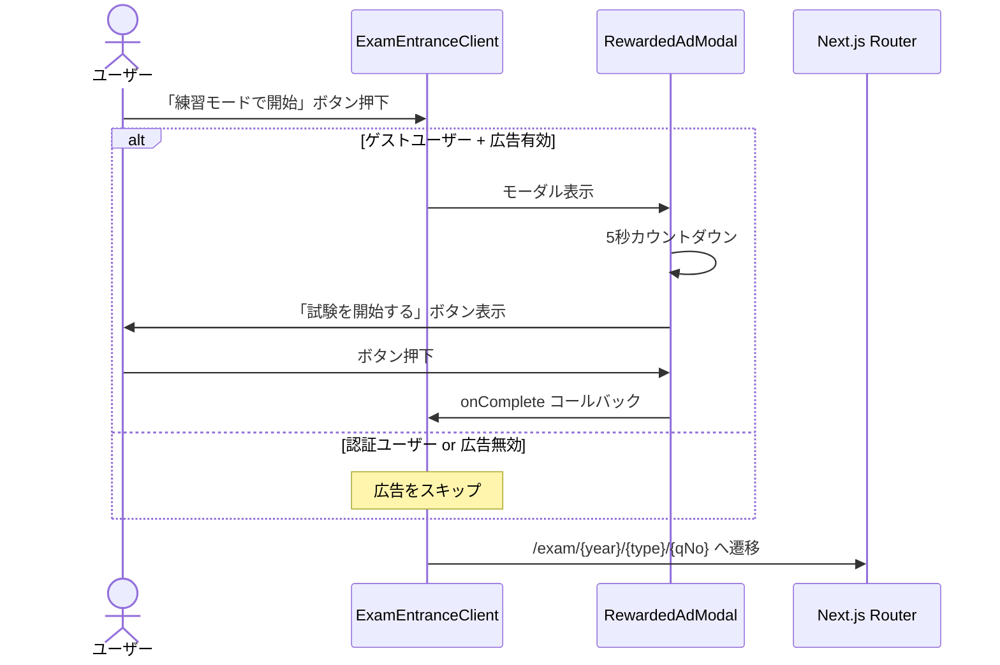

# 広告実装計画 設計書

## 1. 概要

### 1.1 目的

IPA 資格試験対策プラットフォーム「シカクノ」の収益化手段として、**ユーザー体験を損なわない形**で広告を導入する。学習アプリという特性上、**集中力を阻害しない広告配置**が最優先事項である。

### 1.2 基本方針

| 方針 | 説明 |
|------|------|
| **学習体験ファースト** | 試験演習中（問題解答中）には広告を表示しない |
| **リワード形式** | 試験開始前にカウントダウン付き広告を表示（ゲストユーザーのみ） |
| **認証ユーザー優遇** | ログインユーザーは広告スキップ可能（将来的なプレミアムプランへの導線） |
| **パフォーマンス維持** | Core Web Vitals への影響を最小限に抑える |
| **プライバシー準拠** | 個人情報保護法に準拠した同意管理を実装 |

---

## 2. 現状実装（Rev.1 - 2026/02/18）

### 2.1 実装済み機能

| 機能 | 状態 | 説明 |
|------|------|------|
| AdProvider | ✅ 完了 | 広告コンテキスト管理（フィーチャーフラグ / 同意 / 認証状態） |
| RewardedAdModal | ✅ 完了 | 試験開始前のリワード広告モーダル |
| ExamEntrance 統合 | ✅ 完了 | 試験入口ページに広告モーダルを統合 |
| フィーチャーフラグ | ✅ 完了 | `NEXT_PUBLIC_ADS_ENABLED` による全体制御 |

### 2.2 リワード広告フロー



### 2.3 広告表示条件

| 条件 | ゲストユーザー | 認証ユーザー（無料） | 認証ユーザー（有料/将来） |
|------|---------------|---------------------|-------------------------|
| リワード広告 | ✅ 必須視聴 | ⏭️ スキップ可能 | ❌ 非表示 |
| バナー広告（将来） | ✅ 表示 | ⚠️ 軽減表示 | ❌ 非表示 |

### 2.4 広告禁止パス

以下のパスでは広告コンポーネントが無効化されます:

| パス | 理由 |
|------|------|
| `/settings` | ユーティリティページ |
| `/privacy` | 法的ページ |
| `/terms` | 法的ページ |

※ `/exam` 内の問題解答ページでは広告は表示されない（リワード広告は入口ページのみ）

---

## 3. コンポーネント設計

### 3.1 ディレクトリ構成

```
apps/web/components/features/ads/
├── index.ts              # 公開エクスポート
├── types.ts              # 型定義
├── AdProvider.tsx         # 広告コンテキストプロバイダー
├── RewardedAdModal.tsx    # リワード広告モーダル
└── RewardedAdModal.module.css  # スタイル
```

### 3.2 AdProvider

```typescript
interface AdContextValue {
    isAdEnabled: boolean;          // 全体の広告有効フラグ
    isRewardedAdEnabled: boolean;  // リワード広告有効フラグ（ゲストのみ）
    consent: AdConsent | null;     // 同意状態
    updateConsent: (consent: AdConsent) => void;
    isAuthenticated: boolean;      // 認証状態
}
```

**プロバイダー階層:**

```
TelemetryProvider
  └─ NextAuthProvider (SessionProvider)
      └─ AdProvider       ← 追加
          └─ ThemeProvider
              └─ {children}
```

### 3.3 RewardedAdModal

| Props | 型 | 説明 |
|-------|------|------|
| `isOpen` | `boolean` | モーダルの表示/非表示 |
| `onComplete` | `() => void` | 広告視聴完了後のコールバック |
| `onSkip` | `() => void` | スキップ時のコールバック |
| `canSkip` | `boolean` | スキップ可能か（認証ユーザーの場合 true） |

**状態遷移:**

```
idle → showing（カウントダウン中）→ completed（完了）→ onComplete
                                 ↘ skipped（スキップ）→ onSkip
```

### 3.4 ExamEntranceClient 統合

試験開始ボタン押下時のフロー:

1. `startSession(startQNo, mode)` が呼ばれる
2. `isRewardedAdEnabled` が true なら `showRewardedAd` を true に設定
3. RewardedAdModal が表示される
4. カウントダウン完了 or スキップで `executeStartSession` が実行される

---

## 4. 環境変数

| 変数名 | 説明 | 必須 | デフォルト |
|--------|------|------|-----------|
| `NEXT_PUBLIC_ADS_ENABLED` | 広告機能のフィーチャーフラグ | ✅ | `false` |
| `NEXT_PUBLIC_ADSENSE_CLIENT_ID` | Google AdSense パブリッシャーID | Phase 2 | なし |
| `NEXT_PUBLIC_ADSENSE_REWARDED_SLOT_ID` | リワード広告スロット ID | Phase 2 | なし |

---

## 5. 実装ステップ

### Phase 1: リワード広告基盤（✅ 完了）

| Step | 内容 | 状態 |
|------|------|------|
| 1.1 | AdProvider コンテキスト作成 | ✅ |
| 1.2 | RewardedAdModal コンポーネント作成 | ✅ |
| 1.3 | ExamEntranceClient に統合 | ✅ |
| 1.4 | layout.tsx に AdProvider 追加 | ✅ |
| 1.5 | フィーチャーフラグによる制御 | ✅ |

### Phase 2: AdSense 統合

| Step | 内容 |
|------|------|
| 2.1 | Google AdSense アカウント取得・サイト審査 |
| 2.2 | AdSense スクリプトの遅延読み込み |
| 2.3 | リワード広告スロットに AdSense 広告を配信 |
| 2.4 | Cookie 同意バナー実装 |
| 2.5 | プライバシーポリシー更新 |

### Phase 3: バナー広告・最適化

| Step | 内容 |
|------|------|
| 3.1 | トップページ / ダッシュボードにバナー広告配置 |
| 3.2 | A/B テスト基盤 |
| 3.3 | 広告収益ダッシュボード |
| 3.4 | プレミアムプラン（広告非表示オプション） |

---

## 6. テスト計画

### 6.1 ユニットテスト

| テスト対象 | テスト内容 |
|------------|----------|
| `AdProvider` | 広告禁止パスで `isAdEnabled=false` |
| `AdProvider` | ゲストで `isRewardedAdEnabled=true` |
| `AdProvider` | 認証済みで `isRewardedAdEnabled=false` |
| `RewardedAdModal` | カウントダウンが正しく動作する |
| `RewardedAdModal` | 完了後に onComplete が呼ばれる |
| `RewardedAdModal` | canSkip=true 時にスキップボタンが表示される |

### 6.2 E2E テスト

| テスト ID | シナリオ | 期待結果 |
|-----------|----------|----------|
| AD-01 | ゲストで試験開始ボタン押下 → リワード広告表示 | モーダルが表示される |
| AD-02 | カウントダウン完了後に開始ボタンが表示される | ボタンが可視状態 |
| AD-03 | 開始ボタン押下で試験ページに遷移 | URL が `/exam/{year}/{type}/{qNo}` |
| AD-04 | 認証ユーザーでスキップボタンが表示される | スキップ可能 |
| AD-05 | 広告無効時（フラグ OFF）に直接試験開始 | モーダルなし |

---

## 7. リスクと緩和策

| リスク | 影響度 | 緩和策 |
|--------|--------|--------|
| パフォーマンス低下 | 中 | フィーチャーフラグで即時無効化可能 |
| ユーザー離脱 | 高 | ゲストのみ対象。5秒の短いカウントダウン |
| 広告ブロッカー | 中 | プレースホルダー表示で UX を維持 |

---

## 変更履歴

| 日付 | バージョン | 内容 |
|------|-----------|------|
| 2026-02-18 | 1.0 | 初版作成（リワード広告の設計・実装） |
