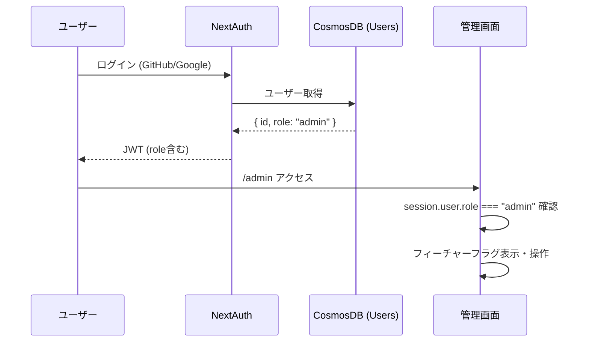

# 管理者機能・フィーチャーフラグ設計書

## 1. 概要

サイト管理者がUIから機能の有効/無効を制御できるシステムを構築する。

### 目的

- サイト管理者アカウントの作成・認証
- フィーチャーフラグ（広告表示等）をUIから操作可能にする
- 環境変数に依存しない動的な機能制御を実現

### 対象機能

| フラグID | 説明 | デフォルト |
|---------|------|-----------|
| `ads_enabled` | 広告表示の全体制御 | OFF |
| `rewarded_ad_enabled` | リワード広告（試験開始時） | OFF |
| `ai_plan_enabled` | AI学習計画機能 | ON |

---

## 2. アーキテクチャ

### 認証・認可フロー



### データフロー

```mermaid
flowchart LR
    Admin[管理画面] -->|PATCH| API[/api/admin/feature-flags]
    API -->|権限チェック| Auth[requireAdmin]
    API -->|読み書き| DB[(CosmosDB<br/>FeatureFlags)]
    
    Client[クライアント] -->|GET| PublicAPI[/api/feature-flags]
    PublicAPI -->|読み取り| DB
    Client --> AdProvider[AdProvider等]
```

---

## 3. データベース設計

### Users コンテナ（変更）

| フィールド | 型 | 説明 |
|-----------|------|------|
| `id` | string | ユーザーID (UUID) |
| `name` | string | 表示名 |
| `email` | string | メールアドレス |
| `role` | `"user" \| "admin"` | ロール（**新規追加**） |

### FeatureFlags コンテナ（新規）

| フィールド | 型 | 説明 |
|-----------|------|------|
| `id` | string | フラグID（パーティションキー） |
| `enabled` | boolean | 有効/無効 |
| `description` | string | フラグの説明 |
| `updatedAt` | string (ISO 8601) | 最終更新日時 |
| `updatedBy` | string | 更新者のユーザーID |

---

## 4. API設計

### 管理者API（認証・管理者権限必須）

| エンドポイント | メソッド | 説明 |
|--------------|---------|------|
| `/api/admin/feature-flags` | GET | 全フラグ取得 |
| `/api/admin/feature-flags` | PATCH | フラグ更新 `{ id, enabled }` |
| `/api/admin/analytics` | GET | 利用状況分析 `?period=7d\|30d\|90d\|{任意の日数}d\|{任意の日数}` |
| `/api/admin/setup` | POST | 初回管理者セットアップ `{ setupToken }` |

### 公開API（認証不要・読み取り専用）

| エンドポイント | メソッド | 説明 |
|--------------|---------|------|
| `/api/feature-flags` | GET | フラグの公開情報 `{ flags: { [id]: boolean } }` |

### 認可チェック

```typescript
// lib/admin-auth.ts
export async function requireAdmin() {
    const session = await getServerSession(authOptions);
    if (!session?.user?.id) → 401
    if (session.user.role !== 'admin') → 403
    return { session };
}
```

---

## 5. 初回管理者セットアップ

### セットアップ手順

1. 環境変数 `ADMIN_SETUP_TOKEN` にランダムな文字列を設定
2. サイトにログイン（GitHub/Google）
3. `/admin` ページにアクセス
4. セットアップトークンを入力して「管理者に設定」を押下
5. 再ログインして管理者権限を取得

### セキュリティ

- 管理者が既に存在する場合、セットアップAPIは `409 Conflict` を返す
- セットアップトークンは環境変数で管理し、使用後は削除を推奨
- 追加の管理者は将来の管理画面から設定可能

---

## 6. 管理画面設計

### ページ構成

| パス | 説明 | アクセス条件 |
|------|------|------------|
| `/admin` | フィーチャーフラグ管理・利用状況分析 | `role === "admin"` |

### ナビゲーション

- サイドバーに「🛡️ 管理」メニューを表示（管理者のみ）
- 非管理者は「権限がありません」+セットアップフォームを表示

### UI構成

1. **フィーチャーフラグセクション**
   - フラグごとにID・説明・ON/OFF状態・トグルスイッチ
   - トグル操作で即座にAPIを呼び出し更新
   - 成功/エラーメッセージのフィードバック

2. **利用状況分析セクション**
  - 期間セレクタ（7日間 / 30日間 / 90日間）
  - 任意日数入力（1〜365日、入力時に即時反映）
  - 概要カード（サイト訪問者数、総セッション数、完了セッション、総回答数）
   - 試験別セッション集計テーブル（セッション数、完了数、完了率プログレスバー）
  - 24時間以内の新規ユーザーテーブル（名前、メール、ロール、登録日）

3. **初回セットアップセクション**（非管理者のみ）
   - セットアップトークン入力フォーム

---

## 7. 利用状況分析設計

### API

| エンドポイント | メソッド | 説明 |
|--------------|---------|------|
| `/api/admin/analytics` | GET | 分析データ取得 `?period=7d\|30d\|90d\|{任意の日数}d\|{任意の日数}` |

### レスポンス構造

```typescript
{
  period: string;                // リクエストされた期間
  overview: {
    totalUsers: number;          // App Insights のユニーク訪問者数
    guestUsers: number;          // ゲストユーザー数
    totalSessions: number;       // 期間内セッション数
    completedSessions: number;   // 完了セッション数
    activeSessions: number;      // 進行中セッション数
    avgQuestionsPerSession: number; // セッション当たり平均回答数
    totalAnswers: number;        // 期間内総回答数
  };
  examBreakdown: {               // 試験別集計
    examId: string;
    count: number;
    completedCount: number;
  }[];
  recentUsers: {                 // 24時間以内に登録したユーザー
    id: string;
    name: string | null;
    email: string | null;
    role: string;
    createdAt: string;
    isGuest: boolean;
  }[];
}
```

### 期間指定ルール

| 指定例 | 意味 |
|-------|------|
| `7d` | 直近7日 |
| `30d` | 直近30日 |
| `90d` | 直近90日 |
| `14d` | 直近14日 |
| `45` | 直近45日（`45d` と同義） |

- 指定可能範囲は `1〜365日`
- 不正な値が指定された場合は `400 Bad Request` を返す

### App Insights 集計ルール

- `overview.totalUsers` は Cosmos DB の `Users` 件数ではなく、Application Insights `AppRequests` のユニーク訪問者数を使用
- `AppRequests` と `AppPageViews` は**別指標**として扱う
- `AppRequests`: サーバーサイド SDK (`applicationinsights`) が記録する HTTP リクエスト。現行の「サイト訪問者数」はこの指標をベースに集計する
- `AppPageViews`: クライアントサイド JS SDK (`@microsoft/applicationinsights-web`) が記録する画面表示イベント。ブラウザ計測用の指標として別管理する
- Workspace-based な App Insights では Azure Monitor Logs API を経由するため、テーブル名は `AppRequests`、列名は PascalCase を使用
- API エンドポイント (`/api/`) を除外し、ページリクエストのみを集計する
- 訪問者の一意判定は `UserAuthenticatedId` → `UserId` → `SessionId` → `OperationId` の順でフォールバック（現状は `OperationId` のみ有効）
- `TELEMETRY_RESOURCE_ID` が未設定、またはクエリ失敗時は `0` を返す

### 修正後の表示項目一覧

| 区分 | 表示項目 | API フィールド | データソース | 定義 |
|------|----------|----------------|--------------|------|
| 概要カード | サイト訪問者数 | `overview.totalUsers` | Application Insights `AppRequests` | `GET /api/*` と `POST /api/*`、`HEAD` を除外したページリクエストからユニーク訪問者数を集計 |
| 概要カード | 総セッション数 | `overview.totalSessions` | Cosmos DB `LearningSessions` | 指定期間内に `startedAt >= @since` を満たすセッション件数 |
| 概要カード | 完了セッション | `overview.completedSessions` | Cosmos DB `LearningSessions` | 指定期間内に `status = 'completed'` のセッション件数 |
| 概要カード | 総回答数 | `overview.totalAnswers` | Cosmos DB `LearningRecords` | 指定期間内の回答件数 |
| グラフ | 試験別分布 | `examBreakdown[]` | Cosmos DB `LearningSessions` | `examId` ごとのセッション件数・完了件数 |
| 一覧 | 24時間以内の新規ユーザー | `recentUsers[]` | Cosmos DB `Users` | `createdAt >= 24時間前` のユーザー一覧 |
| 統計 | 総ページビュー | `visitorStats.totalPageViews` | Cosmos DB `PageViews` | 独自 `/api/track` で記録したページビュー総数 |
| 統計 | ユニーク訪問者数 | `visitorStats.uniqueVisitors` | Cosmos DB `PageViews` | 独自 `visitorId` ベースのユニーク訪問者数 |
| 統計 | 認証済み訪問者数 | `visitorStats.authenticatedVisitors` | Cosmos DB `PageViews` | `isAuthenticated = true` のユニーク訪問者数 |
| 統計 | 匿名訪問者数 | `visitorStats.anonymousVisitors` | Cosmos DB `PageViews` | `isAuthenticated = false` のユニーク訪問者数 |
| グラフ | 日別訪問者推移 | `visitorStats.dailyVisitors[]` | Cosmos DB `PageViews` | 日別の総訪問者・認証済み・匿名訪問者数 |

### App Insights 指標の定義

| 指標 | テーブル | 用途 | 現在の扱い |
|------|----------|------|------------|
| AppRequests | `AppRequests` | サーバーサイドの HTTP リクエスト計測 | 管理画面の「サイト訪問者数」に使用 |
| AppPageViews | `AppPageViews` | クライアントサイドの画面表示計測 | クライアント JS SDK で送信開始済み。表示項目への反映は将来切替 |

### データソース

| コンテナ | 取得データ | クエリの概要 |
|---------|----------|------------|
| Users | ゲストユーザー数・24時間以内の新規ユーザー | COUNT, WHERE createdAt >= 24時間前, ORDER BY createdAt DESC |
| LearningSessions | セッション統計・試験別集計 | COUNT, AVG, GROUP BY examId |
| LearningRecords | 総回答数 | COUNT |
| Application Insights `AppRequests` | サイト訪問者数 | `AppRequests` を KQL でユニーク集計（API 除外、PascalCase 列名） |
| Application Insights `AppPageViews` | ブラウザ画面表示イベント | クライアント JS SDK による自動送信。将来の訪問者数切替候補 |

### セキュリティ

- `requireAdmin()` による管理者権限チェック必須
- 個人の学習内容は集計値のみ表示（個別回答データは返さない）

---

## 7. AdProvider との連携

### 変更前（環境変数ベース）

```typescript
const ADS_ENABLED = process.env.NEXT_PUBLIC_ADS_ENABLED === 'true';
```

### 変更後（DBフラグ優先、環境変数フォールバック）

```typescript
// マウント時に /api/feature-flags からフラグを取得
useEffect(() => {
    fetch('/api/feature-flags')
        .then(res => res.json())
        .then(data => {
            setAdsFlag(data.flags.ads_enabled ?? fallback);
            setRewardedAdFlag(data.flags.rewarded_ad_enabled ?? fallback);
        });
}, []);
```

- `GET /api/feature-flags` は30秒キャッシュ
- API取得失敗時は環境変数 `NEXT_PUBLIC_ADS_ENABLED` にフォールバック

---

## 8. 環境変数

| 変数名 | 説明 | 必須 |
|--------|------|------|
| `ADMIN_SETUP_TOKEN` | 初回管理者セットアップ用トークン | 初回のみ |
| `NEXT_PUBLIC_ADS_ENABLED` | 広告フラグのフォールバック値 | いいえ |
| `TELEMETRY_RESOURCE_ID` | Application Insights リソース ID | 利用状況分析で訪問者数を表示する場合は必須 |

---

## 9. セキュリティ考慮事項

1. **JWT内のrole**: ログイン時にCosmosDBからロールを取得してJWTに含める
2. **APIレベル権限チェック**: 全管理者APIで `requireAdmin()` を呼び出し
3. **クライアントサイド**: ナビゲーション表示のみで制御（セキュリティはAPI側）
4. **公開API**: フラグのID・enabled値のみ公開、description等は非公開

---

## 変更履歴

| 日付 | 内容 |
|------|------|
| 2026-02-20 | 初版作成 |
| 2026-02-20 | 利用状況分析機能を追加（API・ダッシュボードUI） |
| 2026-03-06 | 利用状況分析の期間を任意日数で動的指定できるよう更新 |
| 2026-03-06 | 利用状況分析で `adminUsers` を削除し、`totalUsers` を App Insights 訪問者数へ変更 |
