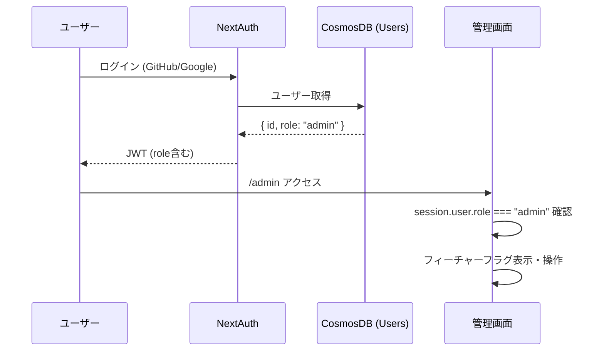

# 管理者機能・フィーチャーフラグ設計書

## 1. 概要

サイト管理者がUIから機能の有効/無効を制御できるシステムを構築する。

### 目的

- サイト管理者アカウントの作成・認証
- フィーチャーフラグ（広告表示等）をUIから操作可能にする
- 環境変数に依存しない動的な機能制御を実現

### 対象機能

| フラグID | 説明 | デフォルト |
|---------|------|-----------|
| `ads_enabled` | 広告表示の全体制御 | OFF |
| `rewarded_ad_enabled` | リワード広告（試験開始時） | OFF |
| `ai_plan_enabled` | AI学習計画機能 | ON |

---

## 2. アーキテクチャ

### 認証・認可フロー



### データフロー

```mermaid
flowchart LR
    Admin[管理画面] -->|PATCH| API[/api/admin/feature-flags]
    API -->|権限チェック| Auth[requireAdmin]
    API -->|読み書き| DB[(CosmosDB<br/>FeatureFlags)]
    
    Client[クライアント] -->|GET| PublicAPI[/api/feature-flags]
    PublicAPI -->|読み取り| DB
    Client --> AdProvider[AdProvider等]
```

---

## 3. データベース設計

### Users コンテナ（変更）

| フィールド | 型 | 説明 |
|-----------|------|------|
| `id` | string | ユーザーID (UUID) |
| `name` | string | 表示名 |
| `email` | string | メールアドレス |
| `role` | `"user" \| "admin"` | ロール（**新規追加**） |

### FeatureFlags コンテナ（新規）

| フィールド | 型 | 説明 |
|-----------|------|------|
| `id` | string | フラグID（パーティションキー） |
| `enabled` | boolean | 有効/無効 |
| `description` | string | フラグの説明 |
| `updatedAt` | string (ISO 8601) | 最終更新日時 |
| `updatedBy` | string | 更新者のユーザーID |

---

## 4. API設計

### 管理者API（認証・管理者権限必須）

| エンドポイント | メソッド | 説明 |
|--------------|---------|------|
| `/api/admin/feature-flags` | GET | 全フラグ取得 |
| `/api/admin/feature-flags` | PATCH | フラグ更新 `{ id, enabled }` |
| `/api/admin/setup` | POST | 初回管理者セットアップ `{ setupToken }` |

### 公開API（認証不要・読み取り専用）

| エンドポイント | メソッド | 説明 |
|--------------|---------|------|
| `/api/feature-flags` | GET | フラグの公開情報 `{ flags: { [id]: boolean } }` |

### 認可チェック

```typescript
// lib/admin-auth.ts
export async function requireAdmin() {
    const session = await getServerSession(authOptions);
    if (!session?.user?.id) → 401
    if (session.user.role !== 'admin') → 403
    return { session };
}
```

---

## 5. 初回管理者セットアップ

### セットアップ手順

1. 環境変数 `ADMIN_SETUP_TOKEN` にランダムな文字列を設定
2. サイトにログイン（GitHub/Google）
3. `/admin` ページにアクセス
4. セットアップトークンを入力して「管理者に設定」を押下
5. 再ログインして管理者権限を取得

### セキュリティ

- 管理者が既に存在する場合、セットアップAPIは `409 Conflict` を返す
- セットアップトークンは環境変数で管理し、使用後は削除を推奨
- 追加の管理者は将来の管理画面から設定可能

---

## 6. 管理画面設計

### ページ構成

| パス | 説明 | アクセス条件 |
|------|------|------------|
| `/admin` | フィーチャーフラグ管理 | `role === "admin"` |

### ナビゲーション

- サイドバーに「🛡️ 管理」メニューを表示（管理者のみ）
- 非管理者は「権限がありません」+セットアップフォームを表示

### UI構成

1. **フィーチャーフラグセクション**
   - フラグごとにID・説明・ON/OFF状態・トグルスイッチ
   - トグル操作で即座にAPIを呼び出し更新
   - 成功/エラーメッセージのフィードバック

2. **初回セットアップセクション**（非管理者のみ）
   - セットアップトークン入力フォーム

---

## 7. AdProvider との連携

### 変更前（環境変数ベース）

```typescript
const ADS_ENABLED = process.env.NEXT_PUBLIC_ADS_ENABLED === 'true';
```

### 変更後（DBフラグ優先、環境変数フォールバック）

```typescript
// マウント時に /api/feature-flags からフラグを取得
useEffect(() => {
    fetch('/api/feature-flags')
        .then(res => res.json())
        .then(data => {
            setAdsFlag(data.flags.ads_enabled ?? fallback);
            setRewardedAdFlag(data.flags.rewarded_ad_enabled ?? fallback);
        });
}, []);
```

- `GET /api/feature-flags` は30秒キャッシュ
- API取得失敗時は環境変数 `NEXT_PUBLIC_ADS_ENABLED` にフォールバック

---

## 8. 環境変数

| 変数名 | 説明 | 必須 |
|--------|------|------|
| `ADMIN_SETUP_TOKEN` | 初回管理者セットアップ用トークン | 初回のみ |
| `NEXT_PUBLIC_ADS_ENABLED` | 広告フラグのフォールバック値 | いいえ |

---

## 9. セキュリティ考慮事項

1. **JWT内のrole**: ログイン時にCosmosDBからロールを取得してJWTに含める
2. **APIレベル権限チェック**: 全管理者APIで `requireAdmin()` を呼び出し
3. **クライアントサイド**: ナビゲーション表示のみで制御（セキュリティはAPI側）
4. **公開API**: フラグのID・enabled値のみ公開、description等は非公開

---

## 変更履歴

| 日付 | 内容 |
|------|------|
| 2026-02-20 | 初版作成 |
