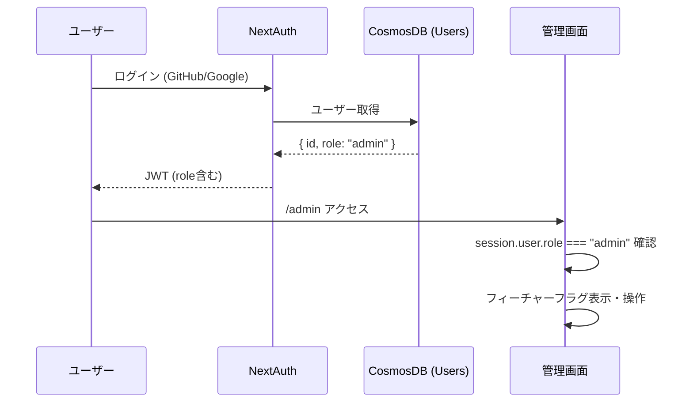

# 管理者機能・フィーチャーフラグ設計書

## 1. 概要

サイト管理者がUIから機能の有効/無効を制御できるシステムを構築する。

### 目的

- サイト管理者アカウントの作成・認証
- フィーチャーフラグ（広告表示等）をUIから操作可能にする
- 環境変数に依存しない動的な機能制御を実現

### 対象機能

| フラグID | 説明 | デフォルト |
|---------|------|-----------|
| `ads_enabled` | 広告表示の全体制御 | OFF |
| `rewarded_ad_enabled` | リワード広告（試験開始時） | OFF |
| `ai_plan_enabled` | AI学習計画機能 | ON |

---

## 2. アーキテクチャ

### 認証・認可フロー



### データフロー

```mermaid
flowchart LR
    Admin[管理画面] -->|PATCH| API[/api/admin/feature-flags]
    API -->|権限チェック| Auth[requireAdmin]
    API -->|読み書き| DB[(CosmosDB<br/>FeatureFlags)]
    
    Client[クライアント] -->|GET| PublicAPI[/api/feature-flags]
    PublicAPI -->|読み取り| DB
    Client --> AdProvider[AdProvider等]
```

---

## 3. データベース設計

### Users コンテナ（変更）

| フィールド | 型 | 説明 |
|-----------|------|------|
| `id` | string | ユーザーID (UUID) |
| `name` | string | 表示名 |
| `email` | string | メールアドレス |
| `role` | `"user" \| "admin"` | ロール（**新規追加**） |

### FeatureFlags コンテナ（新規）

| フィールド | 型 | 説明 |
|-----------|------|------|
| `id` | string | フラグID（パーティションキー） |
| `enabled` | boolean | 有効/無効 |
| `description` | string | フラグの説明 |
| `updatedAt` | string (ISO 8601) | 最終更新日時 |
| `updatedBy` | string | 更新者のユーザーID |

---

## 4. API設計

### 管理者API（認証・管理者権限必須）

| エンドポイント | メソッド | 説明 |
|--------------|---------|------|
| `/api/admin/feature-flags` | GET | 全フラグ取得 |
| `/api/admin/feature-flags` | PATCH | フラグ更新 `{ id, enabled }` |
| `/api/admin/analytics` | GET | 利用状況分析 `?period=7d\|30d\|90d\|{任意の日数}d\|{任意の日数}` |
| `/api/admin/setup` | POST | 初回管理者セットアップ `{ setupToken }` |

### 公開API（認証不要・読み取り専用）

| エンドポイント | メソッド | 説明 |
|--------------|---------|------|
| `/api/feature-flags` | GET | フラグの公開情報 `{ flags: { [id]: boolean } }` |

### 認可チェック

```typescript
// lib/admin-auth.ts
export async function requireAdmin() {
    const session = await getServerSession(authOptions);
    if (!session?.user?.id) → 401
    if (session.user.role !== 'admin') → 403
    return { session };
}
```

---

## 5. 初回管理者セットアップ

### セットアップ手順

1. 環境変数 `ADMIN_SETUP_TOKEN` にランダムな文字列を設定
2. サイトにログイン（GitHub/Google）
3. `/admin` ページにアクセス
4. セットアップトークンを入力して「管理者に設定」を押下
5. 再ログインして管理者権限を取得

### セキュリティ

- 管理者が既に存在する場合、セットアップAPIは `409 Conflict` を返す
- セットアップトークンは環境変数で管理し、使用後は削除を推奨
- 追加の管理者は将来の管理画面から設定可能

---

## 6. 管理画面設計

### ページ構成

| パス | 説明 | アクセス条件 |
|------|------|------------|
| `/admin` | フィーチャーフラグ管理・利用状況分析 | `role === "admin"` |

### ナビゲーション

- サイドバーに「🛡️ 管理」メニューを表示（管理者のみ）
- 非管理者は「権限がありません」+セットアップフォームを表示

### UI構成

1. **フィーチャーフラグセクション**
   - フラグごとにID・説明・ON/OFF状態・トグルスイッチ
   - トグル操作で即座にAPIを呼び出し更新
   - 成功/エラーメッセージのフィードバック

2. **利用状況分析セクション**
   - 期間セレクタ（7日間 / 30日間 / 90日間）
   - 任意日数入力（1〜365日、入力時に即時反映）
   - ユーザー概要カード（登録ユーザー数・ゲストユーザー数・ゲスト→登録転換率・MAU）
   - 演習統計カード（総セッション数・演習完了率・総回答数・全体正解率）
   - DAU 棒グラフ（日別アクティブユーザー数）
   - 試験別セッション集計テーブル（セッション数、完了数、完了率プログレスバー）
   - 24時間以内の新規ユーザーテーブル（名前、メール、ロール、登録日）

3. **初回セットアップセクション**（非管理者のみ）
   - セットアップトークン入力フォーム

---

## 7. 利用状況分析設計

### 計測ツールの役割分担

訪問者数・流入分析は **Google Analytics 4（GA4）** が担い、管理画面は GA4 では取得できないサービス固有の指標に特化する。

| ツール | 担当領域 | 備考 |
|--------|----------|------|
| **GA4** | 訪問者数・流入元・直帰率・ページPV | ブラウザ計測、外部サービス |
| **App Insights** | エラー監視・パフォーマンス・SPA ルート追跡 | TelemetryProvider が自動送信 |
| **管理画面（Cosmos DB）** | 演習の使われ方・コンテンツ品質・ユーザー定着 | 本設計の対象 |

### API

| エンドポイント | メソッド | 説明 |
|--------------|---------|------|
| `/api/admin/analytics` | GET | 分析データ取得 `?period=7d\|30d\|90d\|{任意の日数}` |

### レスポンス構造

```typescript
{
  period: string;                   // リクエストされた期間（例: "30d"）
  generatedAt: string;              // 集計実行日時（ISO 8601）
  overview: {
    guestUsers: number;             // ゲストユーザー総数（累積）
    registeredUsers: number;        // 登録ユーザー総数（累積）
    conversionRate: number;         // ゲスト→登録転換率（%）
    totalSessions: number;          // 期間内セッション数
    completedSessions: number;      // 期間内完了セッション数
    completionRate: number;         // 演習完了率（%）
    activeSessions: number;         // 現在進行中セッション数（リアルタイム）
    avgQuestionsPerSession: number; // セッション当たり平均回答数（小数第1位）
    totalAnswers: number;           // 期間内総回答数
    correctAnswers: number;         // 期間内正解数
    accuracyRate: number;           // 全体正解率（%）
  };
  examBreakdown: {                  // 試験別集計
    examId: string;
    count: number;
    completedCount: number;
  }[];
  recentUsers: {                    // 24時間以内に登録したユーザー
    id: string;
    name: string | null;
    email: string | null;
    role: string;
    createdAt: string;
    isGuest: boolean;
  }[];
  activityStats: {
    dau: { date: string; uniqueUsers: number }[];  // 日別アクティブユーザー数
    mau: number;                    // 直近30日間のアクティブユーザー数（固定）
  };
}
```

### 期間指定ルール

| 指定例 | 意味 |
|-------|------|
| `7d` | 直近7日 |
| `30d` | 直近30日（デフォルト） |
| `90d` | 直近90日 |
| `45` | 直近45日（`45d` と同義） |

- 指定可能範囲: 1〜365日
- 不正な値: 400 Bad Request

### 表示項目一覧・集計仕様

#### ユーザー概要カード

| 表示項目 | API フィールド | データソース | 集計粒度 | 集計ロジック |
|----------|----------------|--------------|----------|-------------|
| 登録ユーザー数 | `overview.registeredUsers` | Cosmos DB `Users` | 累積（全期間） | `COUNT WHERE isGuest = false` |
| ゲストユーザー数 | `overview.guestUsers` | Cosmos DB `Users` | 累積（全期間） | `COUNT WHERE isGuest = true` |
| ゲスト→登録転換率 | `overview.conversionRate` | Cosmos DB `Users` | 累積（全期間） | `registeredUsers / (registeredUsers + guestUsers) × 100`（小数第1位） |
| MAU（直近30日） | `activityStats.mau` | Cosmos DB `LearningRecords` | 直近30日固定 | `SELECT DISTINCT userId WHERE answeredAt >= 30日前` の件数 |

#### 演習統計カード

| 表示項目 | API フィールド | データソース | 集計粒度 | 集計ロジック |
|----------|----------------|--------------|----------|-------------|
| 総セッション数 | `overview.totalSessions` | Cosmos DB `LearningSessions` | 指定期間 | `COUNT WHERE startedAt >= @since` |
| 演習完了率 | `overview.completionRate` | Cosmos DB `LearningSessions` | 指定期間 | `completedSessions / totalSessions × 100`（小数第1位） |
| 総回答数 | `overview.totalAnswers` | Cosmos DB `LearningRecords` | 指定期間 | `COUNT WHERE answeredAt >= @since` |
| 全体正解率 | `overview.accuracyRate` | Cosmos DB `LearningRecords` | 指定期間 | `COUNT(isCorrect=true) / totalAnswers × 100`（小数第1位） |

補足:
- `completedSessions`: `COUNT WHERE startedAt >= @since AND status = 'completed'`
- `activeSessions`: `COUNT WHERE status = 'in-progress'`（リアルタイム、期間フィルタなし）
- `avgQuestionsPerSession`: `AVG(answeredCount) WHERE startedAt >= @since AND answeredCount > 0`（小数第1位）
- `correctAnswers`: `COUNT WHERE answeredAt >= @since AND isCorrect = true`

#### DAU グラフ

| 表示項目 | API フィールド | データソース | 集計粒度 | 集計ロジック |
|----------|----------------|--------------|----------|-------------|
| 日別アクティブユーザー | `activityStats.dau[]` | Cosmos DB `LearningRecords` | 日次 × 指定期間 | `GROUP BY date, userId` → サーバー側 JS で日別 distinct ユーザー数を集計 |

- Cosmos DB の `SUBSTRING(answeredAt, 0, 10)` で `YYYY-MM-DD` を抽出してグループ化
- クライアントには `{ date: "2026-03-15", uniqueUsers: 42 }[]` 形式で返却

#### 試験別セッション集計テーブル

| 表示項目 | API フィールド | データソース | 集計粒度 | 集計ロジック |
|----------|----------------|--------------|----------|-------------|
| セッション数・完了数 | `examBreakdown[]` | Cosmos DB `LearningSessions` | 試験ID × 指定期間 | `GROUP BY examId`。完了率は UI 側で計算 |

#### 新規ユーザー一覧

| 表示項目 | API フィールド | データソース | 集計粒度 | 集計ロジック |
|----------|----------------|--------------|----------|-------------|
| 24時間以内の新規登録 | `recentUsers[]` | Cosmos DB `Users` | 直近24時間固定 | `WHERE createdAt >= 24時間前 ORDER BY createdAt DESC` |

取得フィールド: `id`, `name`, `email`, `role`, `createdAt`, `isGuest`

### データソースまとめ

| Cosmos DB コンテナ | 取得する値 | クエリ本数 |
|-------------------|-----------|-----------|
| `Users` | 登録数・ゲスト数・転換率・新規ユーザー一覧 | COUNT×2 ＋ SELECT一覧 |
| `LearningSessions` | セッション数・完了率・進行中数・平均回答数・試験別内訳 | COUNT×4 ＋ GROUP BY |
| `LearningRecords` | 総回答数・正解数・正解率・DAU・MAU | COUNT×2 ＋ GROUP BY（DAU）＋ DISTINCT（MAU） |

### セキュリティ

- `requireAdmin()` による管理者権限チェック必須
- 個人の学習内容は集計値のみ表示（個別回答データは返さない）

---
## 8. 環境変数

| 変数名 | 説明 | 必須 |
|--------|------|------|
| `ADMIN_SETUP_TOKEN` | 初回管理者セットアップ用トークン | 初回のみ |
| `NEXT_PUBLIC_ADS_ENABLED` | 広告フラグのフォールバック値 | いいえ |
| `TELEMETRY_RESOURCE_ID` | Application Insights リソース ID | 利用状況分析で訪問者数を表示する場合は必須 |

---

## 9. セキュリティ考慮事項

1. **JWT内のrole**: ログイン時にCosmosDBからロールを取得してJWTに含める
2. **APIレベル権限チェック**: 全管理者APIで `requireAdmin()` を呼び出し
3. **クライアントサイド**: ナビゲーション表示のみで制御（セキュリティはAPI側）
4. **公開API**: フラグのID・enabled値のみ公開、description等は非公開

---

## 変更履歴

| 日付 | 内容 |
|------|------|
| 2026-02-20 | 初版作成 |
| 2026-02-20 | 利用状況分析機能を追加（API・ダッシュボードUI） |
| 2026-03-06 | 利用状況分析の期間を任意日数で動的指定できるよう更新 |
| 2026-03-06 | 利用状況分析で `adminUsers` を削除し、`totalUsers` を App Insights 訪問者数へ変更 |

| 2026-04-03 | 計測ツール役割分担を整理。訪問者系指標（App Insights・Cosmos DB PageViews）を廃止しGA4に委譲。管理画面はサービス固有指標（転換率・正解率・DAU/MAU）に特化 |