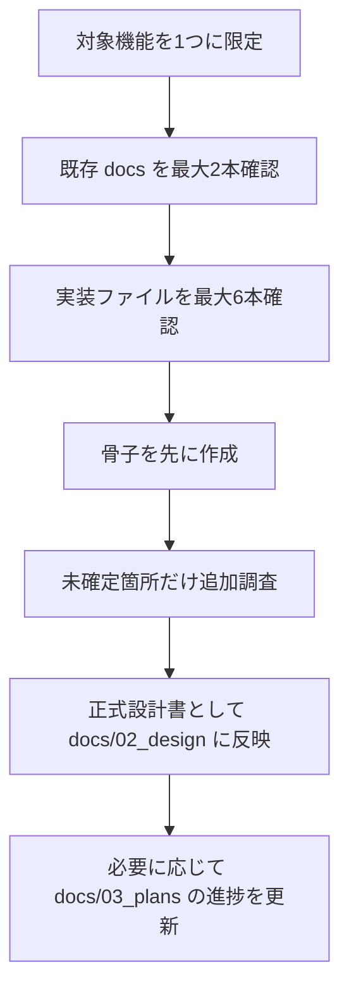

# 機能別詳細設計ガイド

## 1. 概要

本ガイドは、`docs/02_design/` 配下に機能別の詳細設計書を追加・更新する際の標準ルールを定義する。

目的は以下の 3 点である。

- 設計書ごとの粒度を揃える
- コード改修時に参照しやすい形で情報を整理する
- 会話コンテキストが圧縮されても、必要な設計情報を docs だけで再構成できるようにする

---

## 2. 位置づけ

### 2.1 ドキュメント階層上の役割

| レベル | 保存先 | 役割 |
|------|------|------|
| Planning Level | `docs/01_planning/` | 要件、背景、全体方針 |
| Implementation Level | `docs/02_design/` | 実装の正解基準となる正式設計 |
| Execution Plan Level | `docs/03_plans/` | 整備順序、作業分割、再開用メモ |

### 2.2 詳細設計書の責務

詳細設計書は、以下を満たす必要がある。

- 対象機能の責務が分かる
- 画面、コンポーネント、API、データの関係が分かる
- 認証、認可、保存、エラー処理の境界が分かる
- 改修時に「どのファイルを読めばよいか」の起点になる

---

## 3. 設計作成フロー

---

## 4. 1 セッションあたりの調査上限

詳細設計作成時は、LLM のコンテキスト上限を超えないように、以下を上限とする。

- 対象機能: 1 つのみ
- 既存ドキュメント: 最大 2 本
- 実装ファイル: 最大 6 本
- テストファイル: 最大 2 本
- 読込量目安: 合計 1,500 行前後

追加調査が必要な場合でも、骨子作成と補完を別セッションに分離する。

---

## 5. 必須章立て

すべての機能別詳細設計書は、原則として以下の章立てを持つ。

1. 概要
2. 対象範囲
3. アーキテクチャ図
4. ユーザーフロー
5. コンポーネント一覧
6. 外部依存サービス
7. 環境変数定義
8. データモデル
9. API / サーバー処理
10. データフロー
11. 状態遷移・保存ルール
12. 認証・認可
13. エラー処理
14. テレメトリ / 監視
15. テスト観点
16. 既知の課題・未確定事項

補足:
- すべての章を長文化する必要はない
- 該当しない章でも「対象外」または「現状なし」を明記する
- 読み手が仕様の欠落と未調査を区別できるようにする

---

## 6. 記載ルール

### 6.1 事実と方針を分離する

設計書には、以下を明確に分けて記載する。

- **現行実装**: 現在コードで確認できる事実
- **設計方針**: 以後の正解基準として扱う記述
- **既知の課題**: 実装と設計が一致していない点、または要改善点

### 6.2 実装ギャップを隠さない

セキュリティ、認可、データ整合性に関するギャップを見つけた場合は、設計書の末尾に「既知の課題・未確定事項」として残す。

### 6.3 コード参照の単位

本文では、以下の単位で責務を記述する。

- 画面
- コンポーネント
- Route Handler
- Hook / Utility
- 永続化境界

内部関数を逐一説明しない。ファイル単位で責務をまとめる。

---

## 7. 標準記述フォーマット

### 7.1 コンポーネント一覧

| 区分 | ファイル / モジュール | 責務 |
|------|------|------|
| Page | `app/...` | 画面エントリポイント |
| Component | `components/...` | 表示と入力制御 |
| Hook | `hooks/...` | クライアント側状態・副作用 |
| API | `app/api/...` | 認証、検証、永続化 |
| Utility | `lib/...` | クライアント共有ロジック |

### 7.2 環境変数定義

| 変数名 | 必須 | 用途 | 備考 |
|------|------|------|------|

### 7.3 API 記述

| エンドポイント | メソッド | 認証要否 | 用途 | 備考 |
|------|------|------|------|------|

---

## 8. Mermaid の使い分け

- 構成図: `graph TD` または `graph LR`
- ユーザーフロー / データフロー: `sequenceDiagram`
- 状態遷移: 必要に応じて `stateDiagram-v2`

図を作る際は、略称よりも責務が分かるラベルを優先する。

---

## 9. 詳細設計書の完成条件

以下を満たした時点で「初版作成済み」とみなす。

- 対象機能の主要導線が文章または図で説明されている
- 画面、API、永続化先の責務が区別されている
- 認証・認可の有無が明記されている
- 保存ルールが guest / authenticated の両方で整理されている
- 既知の課題が未記載のまま放置されていない

---

## 10. 更新フロー

1. 実装差分が発生したら、先に該当詳細設計書を確認する
2. 設計と実装がズレる場合、コード修正前に設計を更新する
3. 長期の整備計画や再開メモは `docs/03_plans/` に残す
4. 正式仕様は `docs/02_design/` を正本とする

---

## 11. 次の優先対象

本ガイドに基づくコア機能の新規詳細設計書は一巡したため、今後の優先対象は以下である。

1. 実装変更が入った機能の詳細設計を差分更新する
2. `ai-planner-design.md`、`07`、`08`、`09` 系の既存詳細文書を必要時のみ正規化する
3. 新機能追加時に `02_design/` へ同粒度の設計書を追加する
4. `docs/00_Documentation_Map.md` と `docs/03_plans/` の整合を継続的に保つ

---

## 12. 判断メモ

- 完璧な網羅性より、再開しやすさを優先する
- 1 回で全体を書き切らず、骨子を先に確定する
- 設計書は将来の会話の代替メモとして機能する必要がある