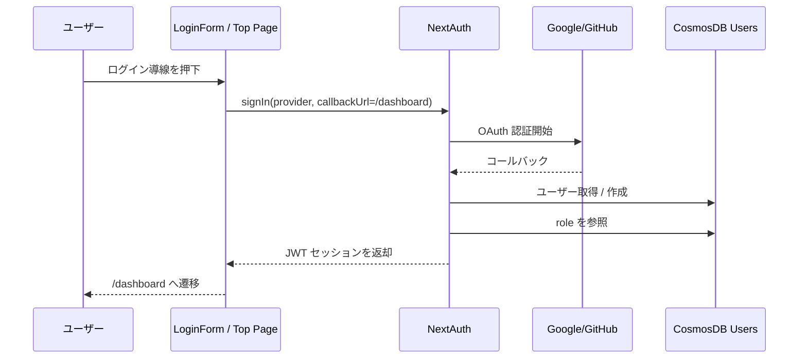
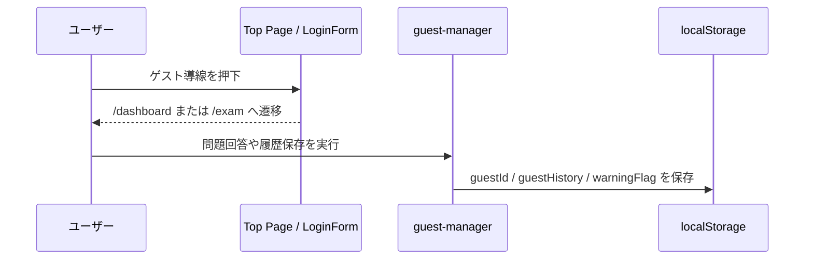
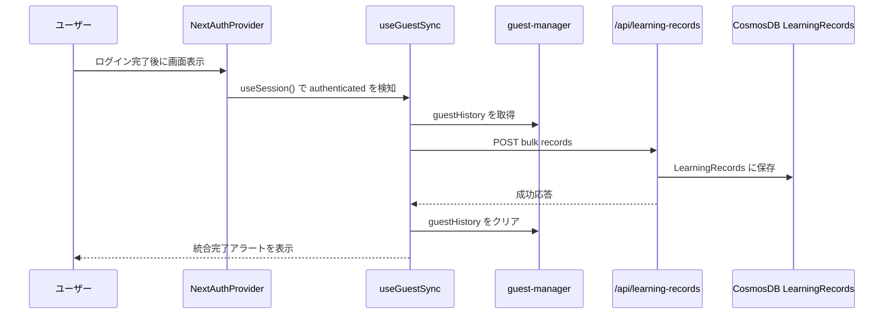

# 認証・ゲスト利用 詳細設計書

## 1. 概要

本書は、ログイン、ゲスト利用、ゲスト履歴の統合、および認証状態に応じたデータ保存境界を定義する。

本機能は以下を扱う。

- OAuth ログイン（Google / GitHub）
- ログイン画面とトップページからの導線
- ゲストユーザーの一時利用
- ゲスト履歴の localStorage 保存
- 認証後のゲスト履歴統合
- 認証済みユーザー向け学習セッションと学習記録 API

---

## 2. 対象範囲

### 対象

- NextAuth によるサインイン / セッション管理
- `guest-manager` によるゲスト識別子・履歴管理
- `useGuestSync` による履歴統合
- 認証関連 UI と関連 API

### 対象外

- 管理者権限の詳細設計
- 学習計画機能固有の認証フロー
- 広告やフィーチャーフラグの認可

これらは別設計書で扱う。

---

## 3. アーキテクチャ図

```mermaid
graph TD
    User[ユーザー] --> Top[トップページ]
    User --> Login[ログイン画面]
    Top --> SignInRoute[/api/auth/signin]
    Login --> SignInRoute
    SignInRoute --> NextAuthRoute[/api/auth/[...nextauth]]
    NextAuthRoute --> AuthConfig[auth.ts]
    AuthConfig --> GitHub[GitHub OAuth]
    AuthConfig --> Google[Google OAuth]
    AuthConfig --> Users[(CosmosDB Users)]

    User --> GuestFlow[ゲスト利用]
    GuestFlow --> GuestManager[guest-manager.ts]
    GuestManager --> LocalStorage[(localStorage)]

    SessionProvider[NextAuthProvider] --> GuestSync[useGuestSync]
    GuestSync --> LearningRecordsApi[/api/learning-records]
    LearningRecordsApi --> LearningRecords[(CosmosDB LearningRecords)]

    AuthenticatedUser[認証済みユーザー] --> SessionApi[/api/session / /api/session/create]
    SessionApi --> LearningSessions[(CosmosDB LearningSessions)]
```

---

## 4. ユーザーフロー

### 4.1 認証ユーザーのログイン



### 4.2 ゲスト利用



### 4.3 ゲスト履歴の統合



---

## 5. コンポーネント一覧

| 区分 | ファイル / モジュール | 責務 |
|------|------|------|
| Config | `apps/web/auth.ts` | NextAuth 設定、Provider 有効化、JWT / session コールバック |
| Route | `apps/web/app/api/auth/[...nextauth]/route.ts` | NextAuth ハンドラ公開 |
| Page | `apps/web/app/page.tsx` | トップページ表示、ログイン済み時 `/dashboard` へリダイレクト |
| Page | `apps/web/app/login/page.tsx` | ログイン画面のエントリポイント |
| Component | `apps/web/components/features/auth/LoginForm.tsx` | Google / GitHub ログイン実行、ゲスト利用導線、エラー表示 |
| Provider | `apps/web/components/providers/NextAuthProvider.tsx` | `SessionProvider` と `useGuestSync` の起動点 |
| Hook | `apps/web/hooks/useGuestSync.ts` | 認証後のゲスト履歴統合 |
| Utility | `apps/web/lib/guest-manager.ts` | ゲスト ID、履歴、警告表示済みフラグの localStorage 管理 |
| API | `apps/web/app/api/learning-records/route.ts` | 学習履歴の取得 / 保存（単体・一括） |
| API | `apps/web/app/api/session/route.ts` | 認証済みユーザーの学習セッション取得 / 更新 |
| API | `apps/web/app/api/session/create/route.ts` | 学習セッション作成 |
| Client API | `apps/web/lib/api.ts` | フロントエンドから session / learning-records API を呼び出す |

---

## 6. 外部依存サービス

| サービス | 用途 |
|------|------|
| GitHub OAuth | GitHub ログイン |
| Google OAuth | Google ログイン |
| Azure Cosmos DB | Users / LearningRecords / LearningSessions の保存 |
| NextAuth.js v4 | OAuth, JWT セッション、コールバック制御 |

---

## 7. 環境変数定義

| 変数名 | 必須 | 用途 | 備考 |
|------|------|------|------|
| `NEXTAUTH_SECRET` | 推奨 | JWT / セッション署名 | `AUTH_SECRET` とのフォールバックあり |
| `AUTH_SECRET` | 任意 | `NEXTAUTH_SECRET` の代替 | `auth.ts` で明示参照 |
| `AUTH_GITHUB_ID` | 任意 | GitHub Provider 有効化 | 未設定時は Provider を登録しない |
| `AUTH_GITHUB_SECRET` | 任意 | GitHub Provider 有効化 | 未設定時は Provider を登録しない |
| `AUTH_GOOGLE_ID` | 任意 | Google Provider 有効化 | 未設定時は Provider を登録しない |
| `AUTH_GOOGLE_SECRET` | 任意 | Google Provider 有効化 | 未設定時は Provider を登録しない |
| `NEXTAUTH_URL` | 運用上必須 | OAuth コールバック URL 解決 | NextAuth の警告抑制にも必要 |
| `NODE_ENV` | 自動 | debug 有効化判定 | development のとき debug=true |

---

## 8. データモデル

### 8.1 セッションユーザー情報

`auth.ts` の callbacks により、セッションには以下が付与される。

| フィールド | 型 | 説明 |
|------|------|------|
| `session.user.id` | string | JWT `sub` から設定されるユーザー ID |
| `session.user.role` | `user` \| `admin` | Users コンテナから取得したロール |

### 8.2 Users コンテナで参照する属性

| フィールド | 型 | 説明 |
|------|------|------|
| `id` | string | ユーザー ID |
| `role` | `user` \| `admin` | 権限種別 |

### 8.3 ゲスト保存データ

`guest-manager.ts` では、以下の localStorage キーを使用する。

| キー | 用途 |
|------|------|
| `ipalab_guest_id` | ゲスト識別子 |
| `ipalab_guest_history` | ゲスト時の学習履歴配列 |
| `ipalab_guest_warning_shown` | 初回警告の表示済みフラグ |

### 8.4 履歴同期時のデータ

ゲスト統合時は `LearningRecord[]` を一括 POST する。`useGuestSync` は既存履歴の `userId` を認証済みユーザー ID に上書きして送信する。

---

## 9. API / サーバー処理

| エンドポイント | メソッド | 認証要否 | 用途 | 備考 |
|------|------|------|------|------|
| `/api/auth/[...nextauth]` | GET/POST | 不要 | NextAuth ハンドラ | OAuth コールバック含む |
| `/api/session` | GET | 必須 | 自分の学習セッション一覧取得 | `getServerSession(authOptions)` で認証 |
| `/api/session` | PATCH | 必須 | 学習セッション進捗更新 | 所有者チェックあり |
| `/api/session/create` | POST | 現状は不要 | 学習セッション作成 | リクエストの `userId` をそのまま採用 |
| `/api/learning-records` | GET | 必須 | 自分の学習履歴取得 | query の `userId` は無視して session.user.id を採用 |
| `/api/learning-records` | POST | 現状は不要 | 履歴保存 / 一括同期 | 単体・配列の両方を受け付ける |

---

## 10. データフロー

### 10.1 ログインフロー

1. `LoginForm` またはトップページのログイン導線から `signIn()` を呼ぶ
2. `/api/auth/[...nextauth]` 経由で OAuth プロバイダーに遷移する
3. `CosmosAdapter()` を通じて Users コンテナにユーザーを保存または参照する
4. JWT callback で `role` を Users コンテナから再取得する
5. session callback で `session.user.id` と `session.user.role` を付与する

### 10.2 ゲスト履歴保存フロー

1. 未認証状態で問題回答を行う
2. クライアント側で `guestManager.getGuestId()` を取得する
3. 学習記録を `guestManager.saveHistory()` で localStorage に保存する
4. 初回のみ、ゲスト警告フラグを保存する

### 10.3 認証後の統合フロー

1. `NextAuthProvider` 配下で `useGuestSync()` が常時待機する
2. `status === 'authenticated'` かつ `session.user.id` が存在する場合に同期開始する
3. `guestHistory` の `userId` を認証済みユーザー ID に差し替える
4. `syncLearningRecords()` で `/api/learning-records` に配列 POST する
5. 成功時のみ localStorage の履歴を削除し、アラートを出す

---

## 11. 状態遷移・保存ルール

### 11.1 ゲスト状態

- 認証セッションは持たない
- `guestId` はブラウザローカルで採番される
- 学習履歴は localStorage に保存される
- 学習セッションのサーバー管理は前提としない

### 11.2 認証済み状態

- `session.user.id` を正本のユーザー識別子として扱う
- 学習履歴は API 経由で Cosmos DB に保存する
- 学習セッションは `LearningSessions` コンテナで管理する

### 11.3 ゲストから認証済みへの遷移

- 認証後に `useGuestSync()` が 1 回だけ同期を試行する
- 成功時は guest history を消去する
- 失敗時は guest history を保持する

---

## 12. 認証・認可

### 12.1 現行実装の境界

- OAuth / セッション管理は NextAuth が担当する
- Route Handler 単位の認証は `getServerSession(authOptions)` で個別に実施している
- `middleware.ts` は認証制御ではなく、ボットアクセス制御専用である

### 12.2 role の扱い

- `session.user.role` は `user` または `admin`
- role は JWT callback 内で Users コンテナから読み出す
- role を使った管理者機能の詳細は別設計書で扱う

---

## 13. エラー処理

### 13.1 ログイン UI

`LoginForm.tsx` では、NextAuth の `error` クエリパラメータをユーザー向け文言に変換して表示する。

主な変換対象:

- `OAuthSignin`
- `OAuthCallback`
- `OAuthAccountNotLinked`
- `AccessDenied`
- `Configuration`

### 13.2 ゲスト履歴統合

- 同期失敗時は `console.error()` を出力する
- 失敗時に guest history は削除しない
- 成功時のみ `alert()` を表示する

### 13.3 サーバー API

- 認証必須 API は未認証時に 401 を返す
- バリデーションエラーは 400 を返す
- 例外発生時は 500 を返す

---

## 14. テレメトリ / 監視

現状、本機能に特化した監視イベント設計は限定的である。

確認できる観測点:

- クライアントログ: `useGuestSync` の同期開始 / 成功 / 失敗ログ
- NextAuth 警告: `NEXTAUTH_URL` 未設定時などにブラウザ / サーバーログへ出力
- API エラーログ: Route Handler 内の `console.error`

今後は、以下を標準化対象とする。

- ログイン成功 / 失敗イベント
- ゲスト履歴統合成功 / 失敗イベント
- 認証エラーの分類集計

---

## 15. テスト観点

本機能の主要テスト観点は以下である。

| 種別 | 観点 |
|------|------|
| E2E | トップページからログイン画面へ遷移できること |
| E2E | トップページからゲスト導線で利用開始できること |
| E2E | ログイン画面に Google / GitHub ボタンとゲスト導線が表示されること |
| E2E | OAuth エラーコードが適切なメッセージで表示されること |
| Unit | `useGuestSync` が認証後に 1 回だけ同期すること |
| Unit | 同期成功時に履歴を消去すること |
| Unit | 同期失敗時に履歴を消去しないこと |
| Unit | `guest-manager` が guestId と履歴を保持すること |

---

## 16. 既知の課題・未確定事項

### 16.1 セキュリティ境界の不整合

- `/api/session/create` は server side で認証確認をしておらず、クライアント送信の `userId` をそのまま採用している
- `/api/learning-records` の POST は未認証でも受け付け、送信された `userId` を信頼して保存している

このため、現状の実装は「認証済み API」と「未認証でも書き込み可能な API」が混在している。

### 16.2 ゲスト判定ロジックの未完成

- `guest-manager.isGuest()` は常に `true` を返す stub 実装であり、単独では正確な判定に使えない
- 実際の画面制御は `session` の有無に依存している

### 16.3 ゲスト導線の不一致

- トップページのゲスト導線は `/dashboard` を指す
- ログイン画面のゲスト導線は `/exam` を指す

導線意図が統一されていないため、仕様としては要整理である。

### 16.4 middleware の責務誤認リスク

- `middleware.ts` は認証制御を行わず、ボット遮断のみを担当する
- ファイル名から認証ミドルウェアと誤解される可能性がある

### 16.5 通知方式

- ゲスト統合成功時の通知は `alert()` で実装されている
- UX としてはトースト通知への置換余地がある

---

## 17. 次の関連設計

本書の次に参照・整備すべき設計書は以下である。

1. `12_DashboardAndLearningHistoryDesign.md`
2. `13_AMPracticeDesign.md`
3. `15_CommonApiAndErrorDesign.md`

認証・ゲスト利用は、特に履歴表示、午前演習、API 認可設計と密結合している。