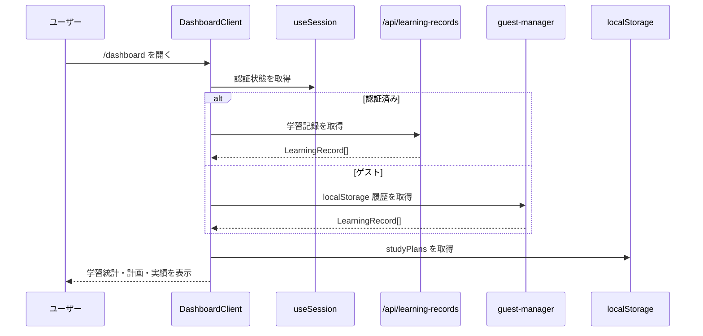
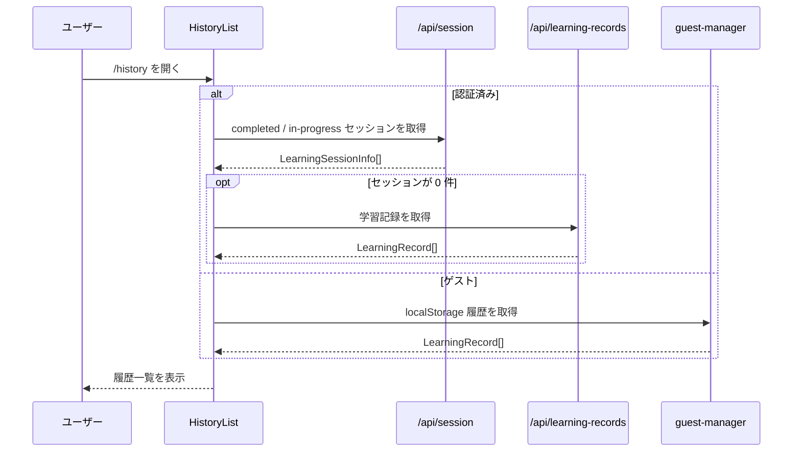

# ダッシュボード・学習履歴 詳細設計書

## 1. 概要

本書は、ダッシュボード画面と学習履歴画面における表示責務、統計集計、保存境界、および認証状態によるデータソースの切替を定義する。

本機能は以下を扱う。

- ダッシュボードの学習サマリー表示
- 月次進捗、月次統計、ヒートマップ表示
- ローカル保存された学習計画の読込と選択
- AI 学習計画ジョブ完了通知の表示
- 学習履歴一覧とセッション再開・完了導線
- ゲーミフィケーションの進捗表示

---

## 2. 対象範囲

### 対象

- `dashboard` 画面の表示と集計ロジック
- `history` 画面の一覧表示と履歴の取得方式
- `LearningRecord` / `LearningSession` の読込分岐
- `studyPlans` とゲーミフィケーション状態の localStorage 管理
- ダッシュボードが参照する月次集計 Hook

### 対象外

- AI 学習計画生成ロジック自体の詳細
- 午前 / 午後演習の出題ロジック
- 広告表示や管理者機能
- テレメトリの低レベル実装詳細

これらは別設計書で扱う。

---

## 3. アーキテクチャ図

```mermaid
graph TD
    User[ユーザー] --> DashboardPage[/dashboard]
    User --> HistoryPage[/history]

    DashboardPage --> DashboardClient[DashboardClient.tsx]
    HistoryPage --> HistoryList[HistoryList.tsx]

    DashboardClient --> RecordsApi[/api/learning-records]
    DashboardClient --> PendingJobsApi[/api/ai/jobs/pending]
    DashboardClient --> GuestManager[guest-manager.ts]
    DashboardClient --> StudyPlans[(localStorage studyPlans)]
    DashboardClient --> UserProgressStore[(localStorage user progress)]
    DashboardClient --> MonthlyProgress[useMonthlyProgress]
    DashboardClient --> MonthlyStats[useMonthlyStats]
    DashboardClient --> UserProgressHook[useUserProgress]

    HistoryList --> SessionApi[/api/session]
    HistoryList --> RecordsApi
    HistoryList --> GuestManager

    RecordsApi --> LearningRecords[(CosmosDB LearningRecords)]
    SessionApi --> LearningSessions[(CosmosDB LearningSessions)]
    PendingJobsApi --> PlanJobs[(CosmosDB PlanJobs)]
```

---

## 4. ユーザーフロー

### 4.1 ダッシュボード表示



### 4.2 履歴画面表示



### 4.3 AI 学習計画通知

1. 認証済みユーザーがダッシュボードを開く
2. `DashboardClient` が `/api/ai/jobs/pending` を参照する
3. 完了済みジョブがあれば `PlanReadyNotification` を表示する
4. ユーザーが適用すると、生成計画を `studyPlans` に追加保存する

---

## 5. コンポーネント一覧

| 区分 | ファイル / モジュール | 責務 |
|------|------|------|
| Page | `apps/web/app/(main)/dashboard/page.tsx` | ダッシュボード画面のエントリポイント |
| Page | `apps/web/app/(main)/history/page.tsx` | 履歴画面のエントリポイント |
| Component | `apps/web/components/features/dashboard/DashboardClient.tsx` | 学習記録読込、計画読込、通知、集計結果の統括 |
| Component | `apps/web/components/features/history/HistoryList.tsx` | セッション一覧・履歴一覧の表示と完了処理 |
| Component | `apps/web/components/features/dashboard/HeatmapWidget.tsx` | 日別学習量の可視化 |
| Component | `apps/web/components/features/dashboard/MonthlyProgressCard.tsx` | 月次目標の進捗表示 |
| Component | `apps/web/components/features/dashboard/GoalSettingWizard.tsx` | 学習計画の作成 UI |
| Component | `apps/web/components/features/dashboard/MonthlyGoalEditor.tsx` | 月次定量目標の編集 |
| Component | `apps/web/components/features/dashboard/PlanReadyNotification.tsx` | AI ジョブ完了通知 |
| Hook | `apps/web/hooks/useMonthlyProgress.ts` | 月次目標に対する進捗率を算出 |
| Hook | `apps/web/hooks/useMonthlyStats.ts` | 今月 / 前月の定量統計を算出 |
| Hook | `apps/web/hooks/useUserProgress.ts` | XP・レベル・実績・連続日数を管理 |
| Utility | `apps/web/lib/guest-manager.ts` | ゲスト履歴の localStorage 管理 |
| Client API | `apps/web/lib/api.ts` | learning-records / session / jobs API 呼び出し |

---

## 6. 外部依存サービス

| サービス | 用途 |
|------|------|
| Azure Cosmos DB LearningRecords | 学習記録の保存・読込 |
| Azure Cosmos DB LearningSessions | 学習セッション一覧・進捗 |
| Azure Cosmos DB PlanJobs | AI 学習計画ジョブ状態 |
| localStorage | studyPlans、ユーザー進捗、ゲスト履歴の保持 |
| NextAuth.js | 認証状態の取得 |

---

## 7. 環境変数定義

| 変数名 | 必須 | 用途 | 備考 |
|------|------|------|------|
| `NEXT_PUBLIC_API_BASE` | 任意 | クライアント API 呼び出しのベース URL | 未設定時はブラウザでは `/api` を使用 |
| `COSMOS_DB_CONNECTION` | サーバー運用上必須 | LearningRecords / LearningSessions / PlanJobs の読込元 | 未設定時は DB アクセスを無効化 |

ダッシュボード・履歴表示自体は、ゲストモードまたは localStorage ベースで部分動作できる。

---

## 8. データモデル

### 8.1 学習記録

| フィールド | 型 | 用途 |
|------|------|------|
| `questionId` | string | 問題単位の識別 |
| `examId` | string | 試験単位の識別 |
| `isCorrect` | boolean | 正解判定 |
| `answeredAt` | string | 表示順・月次集計の基準時刻 |
| `sessionId` | string optional | セッション単位の集計に使用 |
| `isDescriptive` | boolean optional | 記述問題かどうか |
| `aiScore` | number optional | AI 採点結果 |

### 8.2 学習セッション

| フィールド | 型 | 用途 |
|------|------|------|
| `id` | string | セッション識別子 |
| `mode` | `practice` / `mock` | 実施モード |
| `status` | `in-progress` / `completed` | 一覧での状態表示 |
| `answeredCount` | number | 進捗量 |
| `correctCount` | number | セッション正答数 |
| `lastQuestionNo` | number optional | 再開位置 |

### 8.3 学習計画

`DashboardClient` は localStorage の `studyPlans` を正本として扱う。主要フィールドは以下のとおり。

| フィールド | 型 | 用途 |
|------|------|------|
| `id` | string | 計画識別子 |
| `title` | string | ダッシュボード表示名 |
| `examDate` | string | アクティブ計画選択に利用 |
| `monthlyGoals` | `MonthlyGoal[]` optional | 定量目標 |
| `weeklySchedule` | array | 日次ミッション生成の基礎 |

### 8.4 ゲーミフィケーション状態

`useUserProgress` は XP、レベル、アチーブメント、連続日数を localStorage ベースで保持する。現状はサーバー同期しない。

---

## 9. API / サーバー処理

| エンドポイント | メソッド | 認証要否 | 用途 | 備考 |
|------|------|------|------|------|
| `/api/learning-records` | GET | 必須 | 認証ユーザーの学習記録取得 | query の `userId` は無視される |
| `/api/session` | GET | 必須 | 認証ユーザーの学習セッション一覧取得 | examId / status / limit で絞込可能 |
| `/api/session` | PATCH | 必須 | セッション完了処理・進捗更新 | 所有者チェックあり |
| `/api/ai/jobs/pending` | GET | 必須 | 未通知の学習計画ジョブ取得 | ダッシュボード通知用 |

画面は認証状態に応じて API 経由か localStorage 経由かを切り替えるため、ゲスト状態では上記 API を使わない。

---

## 10. データフロー

### 10.1 ダッシュボードの学習統計

1. `DashboardClient` が `LearningRecord[]` を取得する
2. 記録は `answeredAt` 降順で正規化される
3. `useMonthlyProgress()` が `monthlyGoals` に対する達成率を算出する
4. `useMonthlyStats()` が今月・前月比較のサマリーを算出する
5. `useUserProgress()` が XP / レベル / 実績情報を返す

### 10.2 履歴一覧のデータ優先順位

1. 認証済みなら `getLearningSessions()` を優先する
2. セッションが存在しない場合のみ `getLearningRecords()` にフォールバックする
3. ゲストは `guestManager.getHistory()` をそのまま表示対象とする

### 10.3 学習計画の保存

1. `studyPlans` があればそれを配列として読込む
2. なければ旧形式 `studyPlan` を移行する
3. `monthlyGoals` が欠落しているプランには `createDefaultMonthlyGoals()` を自動付与する
4. もっとも近い将来の試験日を持つ計画をアクティブ計画とする

---

## 11. 状態遷移・保存ルール

### 11.1 認証済みユーザー

- 学習記録は Cosmos DB を正本とする
- 履歴画面では `LearningSessions` を優先し、`LearningRecords` はフォールバックとする
- 学習計画とゲーミフィケーション状態は現状 localStorage に残る

### 11.2 ゲストユーザー

- 学習記録は `guest-manager` 経由で localStorage に保存する
- 履歴画面も同じ localStorage 履歴を表示する
- 学習計画と月次カスタム目標は同一ブラウザに閉じる

### 11.3 月次目標の保存

- 定量目標はアクティブな `studyPlan` 内に保持する
- カスタム目標の手入力値は `monthlyGoalCustom_{goalId}` キーで別途 localStorage 保存する

---

## 12. 認証・認可

### 12.1 画面側の方針

- `/dashboard` と `/history` はゲストでも表示可能な前提で実装されている
- 認証状態は `useSession()` により判定する

### 12.2 API 側の方針

- `learning-records GET` と `session GET/PATCH` は認証必須である
- ダッシュボード側は未認証時にこれら API を呼ばず、guest localStorage に切り替える

---

## 13. エラー処理

### 13.1 ダッシュボード

- 学習記録読込失敗時は `console.error` を出し、ローディング解除後に空状態で継続する
- `studyPlans` の JSON パース失敗時はエラーを出すが UI 全体は停止しない
- `/api/ai/jobs/pending` の取得失敗は通知非表示として扱う

### 13.2 履歴画面

- セッション取得や記録取得に失敗した場合も空一覧として継続する
- セッション完了処理に失敗しても結果画面への遷移は継続する

---

## 14. テレメトリ / 監視

本機能固有のイベント設計は限定的であり、現状は以下が主な観測点である。

- グローバル `TelemetryProvider` によるページビュー追跡
- `/api/ai/jobs/pending` 失敗時のブラウザログ
- 履歴取得失敗時・統計読込失敗時の `console.error`

今後の標準化候補:

- ダッシュボード表示完了イベント
- 履歴画面のデータソース判定イベント（session / records / guest）
- 学習計画適用・破棄イベント

---

## 15. テスト観点

| 種別 | 観点 |
|------|------|
| Unit | `useMonthlyProgress` が目標種別ごとの進捗率を正しく算出すること |
| Unit | `useMonthlyStats` が今月 / 前月比較を正しく返すこと |
| Unit | `useUserProgress` が XP・実績・連続日数を正しく更新すること |
| Unit | 学習計画の旧形式 `studyPlan` が `studyPlans` に移行されること |
| Integration | 認証済みとゲストで履歴データソースが切り替わること |
| Integration | セッションが 0 件のとき履歴画面が `LearningRecord` にフォールバックすること |

---

## 16. 既知の課題・未確定事項

### 16.1 データ正本の分散

- 学習記録はサーバー保存だが、学習計画とゲーミフィケーションは localStorage に残る
- 同一ユーザーでも端末間同期ができない

### 16.2 履歴画面の二重モデル

- `LearningSession` と `LearningRecord` の両方を一覧対象にしているため、表示基準が統一されていない
- セッション未導入時代の履歴との互換性のため、実装が複雑化している

### 16.3 AI ジョブ通知の責務境界

- ダッシュボードが `/api/ai/jobs/pending` を直接参照しており、通知中心の責務が画面側に寄っている
- 通知既読や適用履歴の標準化は別途整理が必要である

### 16.4 ゲーミフィケーションの保存境界

- `useUserProgress` は認証済みユーザーでも localStorage にしか保存しない
- ゲストと認証済みで保存戦略が揃っていない

---

## 17. 次の関連設計

本書の次に参照・整備すべき設計書は以下である。

1. `13_AMPracticeDesign.md`
2. `15_CommonApiAndErrorDesign.md`
3. `16_TelemetryAndMonitoringDesign.md`

ダッシュボードと履歴は、午前・午後演習の保存結果と共通 API 設計に直接依存する。