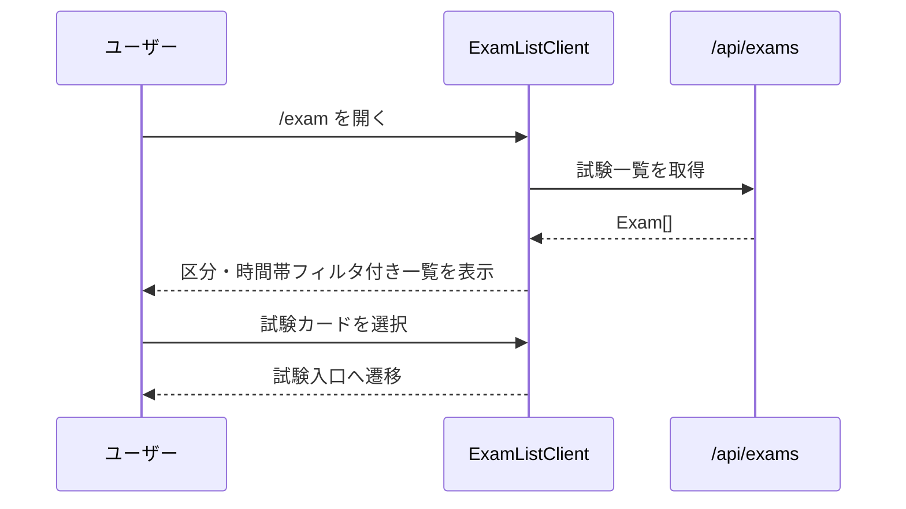
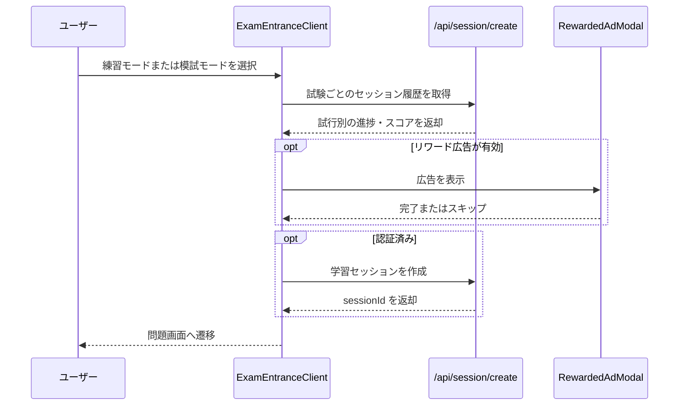
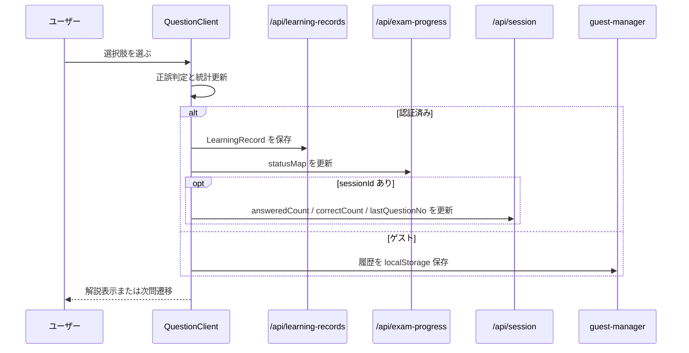

# 午前演習 詳細設計書

## 1. 概要

本書は、試験一覧、演習開始、選択式回答、正誤判定、進捗保存、結果表示までを含む午前演習機能の詳細を定義する。

本機能は以下を扱う。

- 演習一覧画面の読込とフィルタリング
- 午前 I / 午前 II の開始導線
- 練習モード / 模試モードの分岐
- 選択肢回答と正誤判定
- ブックマーク、見直しフラグ、試験進捗スナップショット
- 認証ユーザーとゲストの保存分岐
- 結果画面の集計と再受験導線

---

## 2. 対象範囲

### 対象

- `exam` 一覧、入口、問題、結果ページ
- `QuestionClient` の選択式分岐
- `ExamProgress`、`LearningRecord`、`LearningSession` の保存
- `Questions` / `Exams` 読込とファイルシステムフォールバック

### 対象外

- 午後記述問題と AI 採点
- 学習履歴画面の一覧詳細
- 広告機能の詳細仕様
- テレメトリ実装の詳細

広告や監視は必要箇所のみ参照し、詳細は別設計書に委譲する。

---

## 3. アーキテクチャ図

```mermaid
graph TD
    User[ユーザー] --> ExamListPage[/exam]
    ExamListPage --> ExamListClient[ExamListClient.tsx]
    ExamListClient --> ExamsApi[/api/exams]
    ExamsApi --> Exams[(CosmosDB Exams)]

    User --> ExamEntrancePage[/exam/{year}/{type}]
    ExamEntrancePage --> QuestionRepo[questionRepository]
    ExamEntrancePage --> SSG[getExamData]
    QuestionRepo --> Questions[(CosmosDB Questions)]
    SSG --> FS[(packages/data/data/questions)]
    ExamEntrancePage --> ExamEntranceClient[ExamEntranceClient.tsx]

    ExamEntranceClient --> SessionCreate[/api/session/create]
    SessionCreate --> LearningSessions[(CosmosDB LearningSessions)]

    User --> QuestionPage[/exam/{year}/{type}/{qNo}]
    QuestionPage --> QuestionClient[QuestionClient.tsx]
    QuestionClient --> LearningRecordsApi[/api/learning-records]
    QuestionClient --> ExamProgressApi[/api/exam-progress]
    QuestionClient --> SessionApi[/api/session]
    QuestionClient --> GuestManager[guest-manager.ts]

    User --> ResultPage[/exam/{year}/{type}/result]
    ResultPage --> ExamResult[ExamResult.tsx]
```

---

## 4. ユーザーフロー

### 4.1 演習一覧から開始



### 4.2 入口画面から演習開始



### 4.3 回答と保存



---

## 5. コンポーネント一覧

| 区分 | ファイル / モジュール | 責務 |
|------|------|------|
| Page | `apps/web/app/(main)/exam/page.tsx` | 試験一覧ページのエントリポイント |
| Page | `apps/web/app/(main)/exam/[year]/[type]/page.tsx` | 試験入口ページ。Questions を DB 優先で読込 |
| Page | `apps/web/app/(main)/exam/[year]/[type]/[qNo]/page.tsx` | 問題ページ。対象問題を特定して `QuestionClient` に渡す |
| Page | `apps/web/app/(main)/exam/[year]/[type]/result/page.tsx` | 結果ページエントリポイント |
| Component | `apps/web/components/features/exam/ExamListClient.tsx` | 一覧取得、フィルタリング、進捗表示 |
| Component | `apps/web/components/features/exam/ExamEntranceClient.tsx` | 入口画面、開始位置算出、モード選択、回ごとのセッション履歴アコーディオン表示 |
| Component | `apps/web/components/features/exam/QuestionClient.tsx` | 選択式問題の表示、判定、保存、セッション単位の見直し復元 |
| Component | `apps/web/components/features/exam/ExamResult.tsx` | 結果集計、セッション別の見直しリンク表示 |
| Repository | `apps/web/lib/repositories/questionRepository.ts` | Questions コンテナから試験問題を取得 |
| Utility | `apps/web/lib/ssg-helper.ts` | packages/data から問題 JSON を直接読込 |
| Utility | `apps/web/lib/guest-manager.ts` | ゲスト履歴保存 |
| Client API | `apps/web/lib/api.ts` | exam / records / progress / session API の呼び出し |

---

## 6. 外部依存サービス

| サービス | 用途 |
|------|------|
| Azure Cosmos DB Questions | 問題データ取得 |
| Azure Cosmos DB Exams | 試験一覧取得 |
| Azure Cosmos DB LearningRecords | 回答履歴保存 |
| Azure Cosmos DB LearningSessions | 認証ユーザーのセッション管理 |
| Azure Cosmos DB ExamProgress | ブックマークと最新正誤のスナップショット |
| packages/data 配下 JSON | DB 不可時のフォールバックデータ |
| AdProvider / RewardedAdModal | 開始前広告の制御 |

---

## 7. 環境変数定義

| 変数名 | 必須 | 用途 | 備考 |
|------|------|------|------|
| `COSMOS_DB_CONNECTION` | サーバー運用上必須 | Questions / Exams / Records / Sessions / Progress 参照 | 未設定時は DB 経路を無効化 |
| `NEXT_PUBLIC_API_BASE` | 任意 | クライアント API 呼び出し | 未設定時はブラウザで `/api` |

午前演習のサーバーページは、DB が無効でも `packages/data` の JSON を使って表示を継続できる。

---

## 8. データモデル

### 8.1 Question

| フィールド | 型 | 用途 |
|------|------|------|
| `id` | string | 問題識別子 |
| `examId` | string | 試験識別子 |
| `qNo` | number | 問番号 |
| `options` | array | 選択肢一覧 |
| `correctOption` | string | 正解選択肢 |
| `explanation` | string optional | 解説表示 |
| `subCategory` | string optional | 分野フィルタ・表示用 |

### 8.2 LearningRecord

午前演習では以下の項目が主に利用される。

| フィールド | 型 | 用途 |
|------|------|------|
| `questionId` | string | 問題識別子 |
| `isCorrect` | boolean | 正誤 |
| `isFlagged` | boolean optional | 見直しフラグ |
| `sessionId` | string optional | セッション単位集計 |
| `selectedOptionId` | string optional | 選択式問題の回答復元 |
| `answeredAt` | string | 最新回答判定に利用 |
| `timeTakenSeconds` | number | 所要時間 |

### 8.3 ExamProgress

| フィールド | 型 | 用途 |
|------|------|------|
| `bookmarks` | string[] | 永続ブックマーク |
| `statusMap` | object | 問題ごとの最新正誤スナップショット |
| `updatedAt` | string | 更新時刻 |

### 8.4 一覧フィルタキャッシュ

| localStorage キー | 用途 |
|------|------|
| `ipalab_exam_filter` | 区分フィルタ保持 |
| `ipalab_exam_time_filter` | 午前 / 午後フィルタ保持 |

---

## 9. API / サーバー処理

| エンドポイント | メソッド | 認証要否 | 用途 | 備考 |
|------|------|------|------|------|
| `/api/exams` | GET | 不要 | 試験一覧取得 | `Exams` コンテナを参照 |
| `/api/exams/[examId]/questions` | GET | 不要 | 試験問題取得 | `category` / `subCategory` に安全補完あり |
| `/api/learning-records` | POST | 現状は不要 | 回答履歴保存 | 単体保存 |
| `/api/learning-records` | GET | 必須 | 認証ユーザーの履歴取得 | session.user.id を正本化 |
| `/api/exam-progress` | GET | 不要 | ブックマークと正誤スナップショット取得 | `userId` と `examId` 指定 |
| `/api/exam-progress` | POST | 不要 | ブックマーク / statusMap 更新 | guestId でも保存可能 |
| `/api/session/create` | POST | 現状は不要 | 認証ユーザー向けセッション作成 | body の `userId` を信頼 |
| `/api/session` | PATCH | 必須 | セッション進捗更新 | owner チェックあり |

---

## 10. データフロー

### 10.1 問題データ読込

1. 試験入口ページと問題ページは `questionRepository.listByExamId()` を試行する
2. Cosmos DB が使えない場合は `getExamData()` で `packages/data/data/questions` を参照する
3. 問題ページは `qNo` で対象問題を特定して `QuestionClient` に渡す

### 10.2 入口画面の進捗算出

1. 認証済みなら `getLearningRecords()` と `getExamProgress()` と `getLearningSessions(examId)` を同時取得する
2. ゲストなら localStorage 履歴のみを参照する
3. 最新回答から `statusMap` を組み立て、履歴が欠ける場合は `ExamProgress.statusMap` をフォールバックに使う（※ `statusMap` は `nextQNo` 計算にのみ使用し、問題一覧グリッドには正誤ステータスを表示しない）
4. `LearningSessions` から試行回数を算出し、回ごとの実施履歴アコーディオンを構成する
5. 最初の未回答問題を `nextQNo` とする

### 10.3 回答保存

1. `checkIsCorrect()` が `ALL_CORRECT` を含む正誤判定を行う
2. `QuestionClient` が `LearningRecord` を生成する
3. 選択式では `selectedOptionId` も `LearningRecord` に保存する
4. 認証済みなら `saveLearningRecord()` と `saveExamProgress()` を並列呼び出しする
5. `sessionId` があれば `updateSessionProgress()` も並列実行する
6. ゲストなら `guestManager.saveHistory()` に保存する

---

## 11. 状態遷移・保存ルール

### 11.1 練習モード

- 選択肢クリック直後に正誤判定と解説表示を行う
- `showExplanation` が true の間は選択肢を変更できない

### 11.2 模試モード

- `timeLeft` をクライアント側タイマーで減算する
- 時間切れによる自動終了処理は実装されておらず、結果画面遷移は手動導線に依存する

### 11.3 ブックマークと見直し

- ブックマークは `ExamProgress.bookmarks` に保存する
- 見直しフラグは `LearningRecord.isFlagged` に保存する
- 結果画面の「見直す」は `sessionId` と `review=true` を保持して問題画面へ遷移する
- `selectedOptionId` があれば、見直し画面で当時の選択肢を復元する
- `sessionId` がない状態では、見直しフラグ単独保存は行われない

### 11.4 ゲスト保存

- 回答履歴は localStorage の `guestHistory` に保存する
- 初回回答時のみ警告フラグを立て、ログインのメリットを通知する

---

## 12. 認証・認可

### 12.1 画面側

- 一覧、入口、問題、結果の各画面はゲスト利用可能である
- 認証済みユーザーだけが `LearningSessions` を利用する

### 12.2 API 側

- `session GET/PATCH` は認証必須である
- `learning-records POST`、`exam-progress GET/POST`、`session/create POST` は現状未認証でも到達可能である

---

## 13. エラー処理

### 13.1 サーバーページ

- Questions の DB 読込失敗時はファイルシステムへフォールバックする
- 問題が見つからない場合は専用メッセージと一覧戻りリンクを表示する

### 13.2 クライアント保存

- `saveLearningRecord()` や `saveExamProgress()` の失敗は `console.error` に記録する
- UI は極力継続し、演習自体を停止しない

### 13.3 一覧 / 入口

- 一覧取得失敗時は空一覧として継続する
- 入口画面の進捗取得失敗時はデフォルト開始位置で継続する

---

## 14. テレメトリ / 監視

本機能固有の専用イベントは限定的であり、現状の観測点は以下である。

- グローバル `TelemetryProvider` によるページビュー追跡
- API 保存失敗時の `console.error`
- Cosmos DB 非接続時の警告ログ

今後の候補:

- 問題開始イベント
- 問題回答イベント
- 模試完了イベント
- ブックマーク利用率の集計

---

## 15. テスト観点

| 種別 | 観点 |
|------|------|
| Unit | `checkIsCorrect()` が `ALL_CORRECT` を含めて正しく判定すること |
| Unit | `saveExamProgress()` が bookmark / statusUpdate を正しく送ること |
| API | `/api/exam-progress` が空 progress を返せること |
| API | `/api/exams/[examId]/questions` が安全補完を行うこと |
| API | `/api/session` が owner チェックを行うこと |
| Integration | DB 読込失敗時にファイルシステムフォールバックへ切り替わること |
| Integration | 認証済みとゲストで保存先が分岐すること |

午前演習専用の E2E は現状薄く、演習開始から結果表示までの導線は追加余地がある。

---

## 16. 既知の課題・未確定事項

### 16.1 ゲストブックマークの不整合

- `toggleBookmark()` は guestId でも `/api/exam-progress` に保存する
- 一方で `QuestionClient` の初期読込は認証ユーザー時しか bookmark を復元しない

### 16.2 セッション作成 API の認可不足

- `/api/session/create` は未認証で呼び出せ、body の `userId` をそのまま採用する

### 16.3 模試タイマーの権威性不足

- タイマーはクライアント状態のみで管理され、サーバー側の締切判定が存在しない

### 16.4 演習入口と一覧の二重取得経路

- 一覧画面は `/api/exams` を使うが、入口 / 問題ページは `questionRepository` と `getExamData()` を直接利用する
- データ供給経路が統一されていない

---

## 17. 次の関連設計

本書の次に参照・整備すべき設計書は以下である。

1. `14_PMPracticeAndScoringDesign.md`
2. `15_CommonApiAndErrorDesign.md`
3. `17_DataLoadingAndSyncBoundaryDesign.md`

午前演習は、保存 API とデータ供給境界の設計に強く依存する。