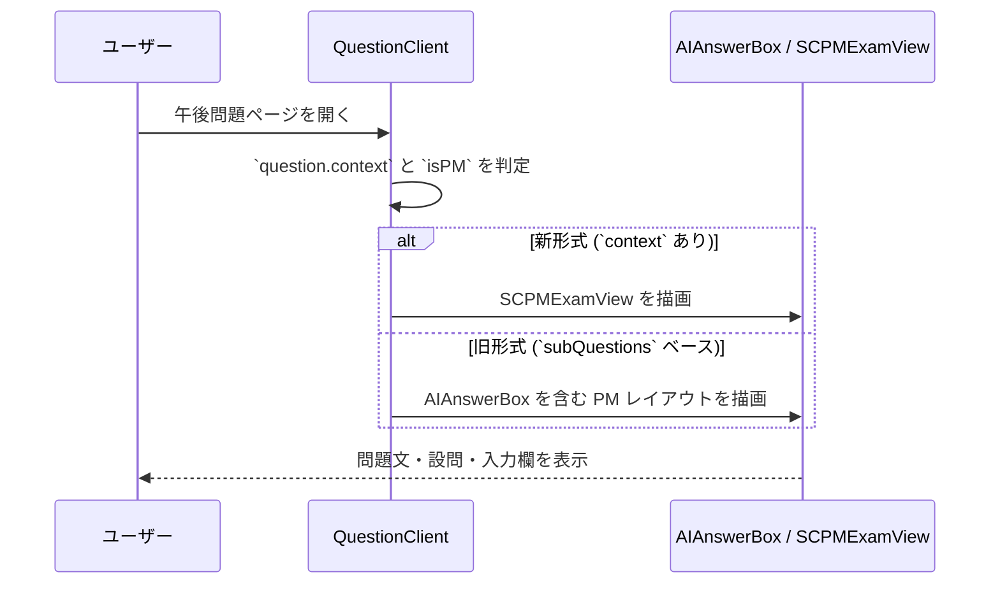

# 午後演習・AI採点 詳細設計書

## 変更履歴

| 日付 | 変更内容 |
|------|------|
| 2026-05-08 | 午後個別問題ページの `qNo` 解決を完全一致に限定し、疎な `qNo` を位置番号で別問題へ誤解決するフォールバックを廃止 |
| 2026-05-08 | 子設問を持つ説明だけの親見出しを解答欄化しない判定を追加し、800字欄化の再発防止を追加 |
| 2026-05-07 | ダークテーマで新形式午後画面の解答例ラベルが低コントラストになる問題を修正し、self-inspect検出ルールを追加 |
| 2026-05-07 | 新形式午後画面の解答例解説をMarkdownとして描画し、同種デグレをself-inspectで検出するルールを追加 |
| 2026-05-07 | 午後試験ヘッダーの不要な `IpaLab` リンクを削除し、午後記述欄を原稿用紙形式入力に変更 |
| 2026-05-07 | アプリ全体の左サイドナビをデスクトップで常時開閉でき、状態を localStorage に保存する UI を追加 |
| 2026-05-07 | 新形式午後画面で解答中に問題文左ペインをトグル表示できる UI を追加 |
| 2026-05-06 | 変換済み午後データの `subQuestions` 空配列、`section.answer`、`section.questions`、PM2 論述設問を解答欄として扱うフォールバック、疎な `qNo` の位置番号フォールバック、日本語 Mermaid 図表のサニタイズ強化を追加 |
| 2026-05-06 | 参考静的サイト (`SA/files`) の保存・文字数表示構成を踏まえ、午後解答欄の localStorage 下書き保存、文字数上限表示、100点満点の総合スコア表示、変換済み午後画面ヘッダーの CSS Modules 化を追加 |

## 1. 概要

本書は、午後問題の表示、記述回答入力、AI 採点、採点結果の永続化、レーダー集計表示を含む午後演習機能の詳細を定義する。

本機能は以下を扱う。

- 午後問題の表示形式判定
- ケース本文、図表、設問、記述入力 UI
- 午後記述欄の原稿用紙形式入力 UI
- `/api/score` による CLKS ベース採点
- 採点結果の `LearningRecord` への保存
- 採点前の回答下書きの localStorage 保存
- セッション進捗更新と集計表示
- `ExamSummary` と `scoring.ts` による総合スコア算出

---

## 2. 対象範囲

### 対象

- `QuestionClient` の午後分岐
- `AIAnswerBox`、`SCPMExamView`、`ExamSummary`
- `LearningRecord` の記述式拡張項目
- `/api/score` と `lib/scoring.ts`
- 文字数制限の表示と超過時の採点抑止
- 午後記述欄の原稿用紙形式表示と文字数制限の可視化
- 解答例・AIフィードバック・改善回答などMarkdown文字列のHTML描画
- 午後問題の新旧データ形式への対応
- 新形式午後画面の問題文ペイン開閉 UI
- アプリ全体で常時利用できるデスクトップサイドナビ開閉 UI

### 対象外

- AI 学習計画生成
- 管理者画面や広告
- グローバル監視や Application Insights の低レベル設定

---

## 3. アーキテクチャ図

```mermaid
graph TD
    User[ユーザー] --> PMPage[/exam/{year}/{type}/{qNo}]
    PMPage --> QuestionClient[QuestionClient.tsx]

    QuestionClient --> PMJudge{午後形式判定}
    PMJudge --> LegacyPM[AIAnswerBox + subQuestions]
    PMJudge --> NewPM[SCPMExamView]

    LegacyPM --> ScoreApi[/api/score]
    NewPM --> ScoreApi
    ScoreApi --> Gemini[Gemini API]

    QuestionClient --> LearningRecordsApi[/api/learning-records]
    QuestionClient --> ExamProgressApi[/api/exam-progress]
    QuestionClient --> SessionApi[/api/session]
    QuestionClient --> GuestManager[guest-manager.ts]

    QuestionClient --> ExamSummary[ExamSummary.tsx]
    ExamSummary --> ScoringLib[lib/scoring.ts]
```

---

## 4. ユーザーフロー

### 4.1 午後問題の表示



### 4.1.1 解答中の表示領域調整

1. デスクトップではアプリ全体で左サイドナビの「サイドナビを隠す」ボタンによりナビを退避できる
2. ナビ退避中は本文領域を画面幅いっぱいに広げる
3. 左上の「サイドナビを表示」ボタンでナビを復元する
4. 新形式午後画面では、必要に応じて問題文ペインも「問題文を隠す / 表示」で開閉できる
5. サイドナビの開閉状態は localStorage に保存し、再読み込み後も維持する

### 4.1.2 新形式午後画面の解答欄生成

`SCPMExamView` は `questions` / `subQuestions` から解答欄を生成する。子設問を持つ親設問は、親自身に `answer` または `modelAnswer` が明示されている場合だけ直接解答欄化する。

`explanation` だけを持つ親設問は、設問グループ見出しまたは解説メタデータとして扱い、800字の原稿用紙欄を生成しない。これにより `A社の製造データの作成について答えよ。` のような親見出しが、子設問とは別の余分な入力欄として表示されることを防ぐ。

記述式のリーフ設問は従来どおり `AIAnswerBox` の `genkoyoshi` 入力を使用し、字数制限が1つだけ抽出できる場合はその上限を表示する。複数字数条件を含む設問はデータ側で解答欄を分割し、記号回答は公式PDFに基づく解答群を構造化した上で選択式UIへ渡す。

### 4.2 AI 採点

```mermaid
sequenceDiagram
    participant User as ユーザー
    participant Box as AIAnswerBox
    participant API as /api/score
    participant Gemini as Gemini API

    User->>Box: 回答を入力し採点を実行
    Box->>API: question / userAnswer / modelAnswer を送信
    API->>Gemini: CLKS プロンプトを送信
    Gemini-->>API: JSON 文字列を返却
    API-->>Box: score / radarChartData / feedback を返却
    Box-->>User: スコア・フィードバック・改善例を表示
```

### 4.3 採点結果の保存

1. `AIAnswerBox` が `onSave()` で親に採点結果を返す
2. `QuestionClient.handleSaveAIScore()` が `LearningRecord` を生成する
3. `aiScore >= 60` を `isCorrect` とみなす
4. 認証済みなら `learning-records`、`exam-progress`、`session` を更新する
5. ゲストなら localStorage 履歴へ保存する

---

## 5. コンポーネント一覧

| 区分 | ファイル / モジュール | 責務 |
|------|------|------|
| Component | `apps/web/components/features/exam/QuestionClient.tsx` | 午後形式判定、採点結果保存、統計更新 |
| Component | `apps/web/components/features/exam/AIAnswerBox.tsx` | 回答入力、採点 API 呼び出し、スコア表示 |
| Component | `apps/web/components/features/exam/SCPMExamView.tsx` | 新形式ケース問題の分割表示と図表参照 |
| Component | `apps/web/components/features/scoring/GenkoyoshiInput.tsx` | 原稿用紙形式の答案入力と字数カウンタ表示 |
| Component | `apps/web/app/(main)/layout.tsx` | メインサイドナビ表示とデスクトップ開閉状態の保持 |
| Utility | `apps/web/components/features/exam/pmAnswerUtils.ts` | 午後答案の文字数制限抽出、設問ID、下書き保存キー生成 |
| Component | `apps/web/components/features/exam/ExamSummary.tsx` | 総合スコアとレーダー集計表示 |
| API | `apps/web/app/api/score/route.ts` | Gemini を用いた CLKS 採点 |
| Utility | `apps/web/lib/scoring.ts` | 総合スコアと平均レーダー算出 |
| API | `apps/web/app/api/learning-records/route.ts` | 記述回答の保存 |
| API | `apps/web/app/api/session/route.ts` | セッション進捗更新 |
| Utility | `apps/web/lib/guest-manager.ts` | ゲスト時の採点履歴保存 |

---

## 6. 外部依存サービス

| サービス | 用途 |
|------|------|
| Gemini API | 記述回答の採点とフィードバック生成 |
| Azure Cosmos DB LearningRecords | 採点結果の保存 |
| Azure Cosmos DB LearningSessions | 認証ユーザーの進捗更新 |
| Azure Cosmos DB ExamProgress | 午後問題の最新状態保存 |
| localStorage | ゲスト時の採点履歴保存 |
| localStorage | 採点前の午後答案下書き保存 |

---

## 7. 環境変数定義

| 変数名 | 必須 | 用途 | 備考 |
|------|------|------|------|
| `GEMINI_API_KEY` | 必須 | `/api/score` から Gemini API を呼ぶ | 未設定時は 500 を返す |
| `COSMOS_DB_CONNECTION` | サーバー運用上必須 | 採点結果の保存・セッション更新 | 未設定時は DB 保存を無効化 |
| `NEXT_PUBLIC_API_BASE` | 任意 | クライアント API 呼び出し | 未設定時は `/api` |

---

## 8. データモデル

### 8.1 記述回答の採点結果

`/api/score` は以下の JSON を返す。

| フィールド | 型 | 用途 |
|------|------|------|
| `score` | number | 0-100 の総合点 |
| `radarChartData` | array | CLKS 軸の点数 |
| `feedback` | string | 改善点の説明 |
| `mermaidDiagram` | string optional | 改善フロー図 |
| `improvedAnswer` | string optional | 改善回答例 |

### 8.2 LearningRecord の記述式拡張

| フィールド | 型 | 用途 |
|------|------|------|
| `isDescriptive` | boolean | 記述問題フラグ |
| `userAnswer` | string | 入力回答 |
| `aiScore` | number | AI 採点点数 |
| `aiFeedback` | string | 要約フィードバック |
| `aiRadarData` | array | 軸別点数 |

### 8.3 午後問題識別子

`QuestionClient` は設問単位で以下の ID 生成規則を使う。

| 形式 | 例 | 用途 |
|------|------|------|
| `question.id-{idx}` | `AP-2023-PM-01-0` | サブ設問単位の記録 |
| `question.id-{idx}-{subIdx}` | `AP-2023-PM-01-0-1` | ネスト設問単位の記録 |

### 8.4 午後答案下書き

採点前の途中答案は、参考静的サイトの「保存 / 読込」構成を踏まえ、ブラウザ localStorage に自動保存する。

| フィールド | 内容 |
|------|------|
| storage key | `ipalab_pm_answer_draft_v1:{answerFieldId}` |
| `answer` | 入力中の答案 |
| `savedAt` | ISO 8601 形式の保存日時 |

`answerFieldId` は `question.id-{idx}` または `question.id-{idx}-{subIdx}` とし、採点結果の `LearningRecord.questionId` と同じ粒度にそろえる。

---

## 9. API / サーバー処理

| エンドポイント | メソッド | 認証要否 | 用途 | 備考 |
|------|------|------|------|------|
| `/api/score` | POST | 不要 | 記述回答の AI 採点 | Gemini を直接呼び出す |
| `/api/learning-records` | POST | 現状は不要 | 採点結果保存 | `isDescriptive` と `aiScore` を保存 |
| `/api/learning-records` | GET | 必須 | 過去の採点履歴取得 | `descriptiveHistory` 復元に使用 |
| `/api/exam-progress` | POST | 不要 | statusMap 更新 | subQuestion 単位の questionId を保存 |
| `/api/session` | PATCH | 必須 | セッション進捗更新 | sessionId 指定時のみ |

---

## 10. データフロー

### 10.1 旧形式午後問題

1. `QuestionClient` が `question.text` と `subQuestions` を左右ペインで表示する
2. `AIAnswerBox` が設問ごとに採点 API を呼ぶ
3. `handleSaveAIScore()` が `descriptiveHistory` と `allExamRecords` を更新する
4. `ExamSummary` が `lib/scoring.ts` で総合点と平均レーダーを再計算する

### 10.2 新形式ケース問題

1. `question.context` が存在する場合、`SCPMExamView` を優先表示する
2. `{{diagram:id}}` プレースホルダを展開し、Mermaid または markdown 図表を埋め込む
3. `subQuestions` がある場合はその小問を解答欄にする
4. `subQuestions` が空でも、設問直下の `answer` / `modelAnswer` / `explanation` がある場合は、その設問自体を解答欄にする
5. `section.questions` にネストした設問がある場合は、その配下を解答欄として扱う
6. PM2 論述式の設問ア・イ・ウのように設問本文だけで構成されるデータは、本文をプロンプトとして解答欄を生成する
7. 設問回答は `AIAnswerBox` に委譲し、親コンポーネントへ採点結果を返す
8. 回答済み設問の総合スコアは合計点ではなく平均点として算出し、100点満点で表示する
9. 解答ペインの件数は大問ブロック数ではなく、実際に描画される解答欄数で表示する
10. 解答ペインヘッダーのトグルで、問題文左ペインを非表示にして解答欄を全幅表示できる
11. 非表示中も同じトグルで問題文左ペインを再表示できる

### 10.3 問題番号の厳密解決

1. 試験入口画面は `questions` の実在 `qNo` を昇順に並べ、最初の問題番号・次の未回答番号・再開リンクを生成する
2. 個別問題ページはまず要求 `qNo` の完全一致を探す
3. 完全一致がない場合、`qNo - 1` 番目などの位置番号フォールバックは行わず「問題が見つかりません」として扱う
4. 疎な `qNo` を補正したい場合は URL 側で別問題へ寄せず、データ抽出・変換工程で公式PDF上の大問番号と `qNo` を一致させる

### 10.4 採点前下書き保存

1. `AIAnswerBox` は `draftKey` を受け取った場合、入力変更を debounce して localStorage に自動保存する
2. ユーザーは「下書き保存」ボタンで任意のタイミングでも保存できる
3. 同じ設問を再表示した場合、採点済み履歴よりも下書きを優先して復元する
4. 下書き保存は採点結果・進捗とは独立し、採点前の離脱対策として扱う

### 10.5 採点 API

1. Route Handler が request body を検証する
2. CLKS モデルを説明したプロンプトを生成する
3. Gemini に JSON 応答を要求する
4. `JSON.parse()` に失敗した場合は 500 を返す

---

## 11. 状態遷移・保存ルール

### 11.1 正誤判定

- 記述問題では `aiScore >= 60` を正答扱いとする
- `LearningRecord.isCorrect` はこの閾値で自動算出される

### 11.2 認証済み保存

- 採点結果は `saveLearningRecord()` によりサーバー保存する
- `saveExamProgress()` により statusMap を更新する
- `sessionId` があれば `updateSessionProgress()` で answeredCount / correctCount を進める

### 11.3 ゲスト保存

- 採点結果は localStorage の guest history に保存する
- 初回回答時のみゲスト警告を表示する

### 11.4 集計表示

- `ExamSummary` は `calculateExamResult()` の戻り値で総合スコアを表示する
- `calculateAggregatedRadar()` は `aiRadarData` の平均を表示する
- `SCPMExamView` の新形式午後画面では、回答済み小問の AI スコア平均を `0〜100` に丸め、コンパクトな `スコア N/100` 表示にする
- スマートフォンの解答ペインヘッダーは、`設問一覧`、`解答欄 N`、`スコア N/100` を1行に収める
- 新形式午後画面の問題文左ペインは、解答ペインヘッダーのトグルから閉じる/戻すことができる

### 11.5 文字数制限

- 設問文に単一の `N字以内` / `N文字以内` が含まれる場合、`AIAnswerBox` は `N` を上限として表示する
- 複数の異なる字数制限が同一入力欄に含まれる場合は、単一上限として扱えないため自動制限を行わない
- 上限超過時はカウンタと警告を表示し、AI 採点ボタンを無効化する

---

## 12. 認証・認可

### 12.1 画面側

- 午後問題はゲストでも利用可能である
- 認証済みユーザーのみセッション管理が有効になる

### 12.2 API 側

- `/api/score` は未認証で利用可能である
- `/api/learning-records POST` も現状は未認証書込を受け付ける
- `/api/session PATCH` のみ認証済みセッションが必要である

---

## 13. エラー処理

### 13.1 採点 API

- `GEMINI_API_KEY` 未設定時は 500 を返す
- request body に `question` または `userAnswer` がない場合は 400 を返す
- Gemini 応答の JSON パースに失敗した場合は 500 を返す

### 13.2 AIAnswerBox

- 通信失敗や API エラー時はインラインメッセージを表示する
- 採点失敗時でも入力内容は保持する

### 13.3 保存処理

- `handleSaveAIScore()` 内の保存失敗は `console.error` に留め、採点結果表示自体は維持する

---

## 14. テレメトリ / 監視

現状の観測点は限定的である。

- `/api/score` のサーバーログ
- クライアント側の採点失敗ログ
- グローバル `TelemetryProvider` によるページビュー追跡

今後の候補:

- 採点成功 / 失敗イベント
- 採点レイテンシ
- 軸別平均点の推移

---

## 15. テスト観点

| 種別 | 観点 |
|------|------|
| API | `/api/score` が必要項目不足で 400 を返すこと |
| API | `/api/score` が 0-100 範囲の score と CLKS 配列を返すこと |
| API | `learning-records POST` が `isDescriptive` 時に `isCorrect` を自動計算すること |
| Unit | `calculateExamResult()` が配点付き午後問題を正しく集計すること |
| Unit | `calculateAggregatedRadar()` が軸平均を算出すること |
| Integration | 採点後に `descriptiveHistory` と `allExamRecords` が更新されること |
| UI | 午後解答欄で文字数制限、超過警告、下書き保存状態が表示されること |
| UI | 新形式午後画面の総合スコアが 100 点満点で表示されること |
| UI | 新形式午後画面の件数表示が大問数ではなく解答欄数で表示されること |
| UI | 新形式午後画面で問題文左ペインを閉じると解答ペインが全幅になり、再表示できること |
| UI | 変換済み午後画面のヘッダーと「終了して一覧へ」ボタンに CSS Modules のスタイルが適用されること |
| UI | `subQuestions` が空の午後データでも、設問直下またはネスト配下の解答情報から入力欄が表示されること |
| UI | 疎な `qNo` の午後データで要求番号と異なる問題へ位置番号フォールバックしないこと |
| Unit | Mermaid サニタイズが日本語 subgraph、named subgraph、日本語 ER 図、二重括弧ノードを描画可能な構文へ正規化すること |

---

## 16. 既知の課題・未確定事項

### 16.1 CLKS 軸ラベルの不一致

- `/api/score` は 4 軸 (`設問適合性`, `論理構成`, `重要語句`, `具体性`) を返す
- 一方で `SCPMExamView` の `defaultRadar` は 5 軸 (`的確性`, `論理性`, `用語`, `網羅性`, `具体性`) を前提にしている

このため、集計レーダーの軸整合性が崩れている。

### 16.2 結果画面との整合不足

- 汎用 `ExamResult` は `question.id` 単位で結果を参照するため、`question.id-idx` 形式で保存される午後設問を適切に集計できない

### 16.3 採点経路のリージョン設計

- `/api/score` は `apps/web` 側から Gemini を直接呼んでいる
- 一方で AI 計画機能は US リージョンの proxy 経由を前提としており、AI 機能間で経路が統一されていない

### 16.4 採点補助情報の不足

- `QuestionClient` は `AIAnswerBox` へ `modelAnswer=""` を渡すケースがあり、模範解答の活用が限定的である

### 16.5 集計 ID 規約の脆さ

- `calculateExamResult()` は `question.id-{idx}` の規則を前提に配点を引き当てるため、設問構造変更に弱い

---

## 17. 次の関連設計

本書の次に参照・整備すべき設計書は以下である。

1. `15_CommonApiAndErrorDesign.md`
2. `16_TelemetryAndMonitoringDesign.md`
3. `17_DataLoadingAndSyncBoundaryDesign.md`

午後演習は、共通 API 契約、リージョン設計、問題データ構造に強く依存する。