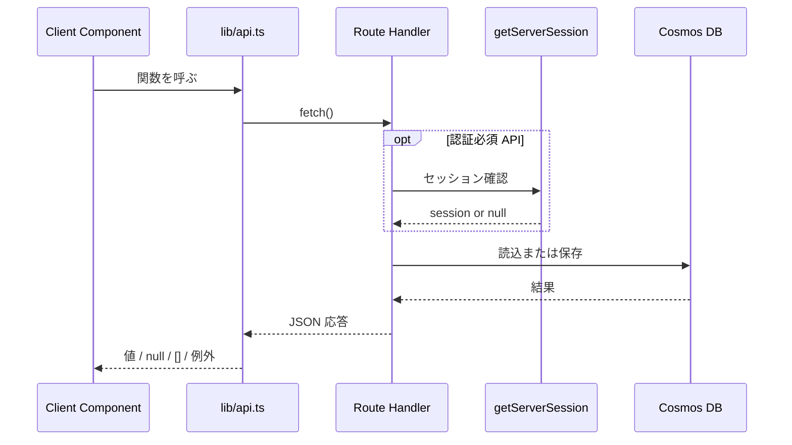

# 共通 API・エラー設計書

## 1. 概要

本書は、`apps/web` 内の主要な Route Handler 群に共通する API 契約、認証境界、HTTP ステータス運用、クライアント側ラッパーの振る舞いを整理する。

目的は以下の 3 点である。

- 画面ごとに散らばる API 契約を横断的に把握できるようにする
- 認証必須 API と未認証 API の境界を明示する
- エラー応答とクライアント側例外処理の不統一箇所を可視化する

---

## 2. 対象範囲

### 対象

- `apps/web/lib/api.ts`
- `exam-progress`、`exams`、`learning-records`、`session`、`score`、`track`、`config/telemetry` 各 Route Handler
- `NextResponse.json()` を使う主要 API 契約

### 対象外

- AI 学習計画 API の詳細設計
- 管理者 API と feature flags API の詳細仕様
- Azure Functions 側の API 契約

---

## 3. アーキテクチャ図

```mermaid
graph LR
    Client[React Client Components] --> ClientApi[lib/api.ts]
    ClientApi --> Routes[Next.js Route Handlers]
    Routes --> Auth[getServerSession(authOptions)]
    Routes --> Zod[Zod validation]
    Routes --> Cosmos[getContainer()]
    Routes --> External[Gemini / App Insights config]

    Routes --> Response[NextResponse.json]
    Response --> Client
```

---

## 4. ユーザーフロー

### 4.1 標準的なクライアント API 呼び出し



### 4.2 エラー時の現行分岐

1. Route Handler が 400 / 401 / 403 / 404 / 500 を返す
2. `lib/api.ts` 側では関数ごとに異なる扱いをする
3. 一部は例外を throw し、一部は `null` や `[]` を返し、一部は UI を継続する

---

## 5. コンポーネント一覧

| 区分 | ファイル / モジュール | 責務 |
|------|------|------|
| Client API | `apps/web/lib/api.ts` | fetch ラッパー、型定義、キャッシュ方針 |
| API | `apps/web/app/api/exams/route.ts` | 試験一覧取得 |
| API | `apps/web/app/api/exams/[examId]/questions/route.ts` | 問題一覧取得 |
| API | `apps/web/app/api/exam-progress/route.ts` | ブックマーク / 正誤スナップショット管理 |
| API | `apps/web/app/api/learning-records/route.ts` | 学習記録取得 / 保存 |
| API | `apps/web/app/api/session/route.ts` | セッション取得 / 更新 |
| API | `apps/web/app/api/session/create/route.ts` | セッション作成 |
| API | `apps/web/app/api/score/route.ts` | 記述回答の AI 採点 |
| API | `apps/web/app/api/config/telemetry/route.ts` | Application Insights 接続文字列返却 |
| API | `apps/web/app/api/track/route.ts` | PageViews 保存 |
| Utility | `apps/web/lib/cosmos.ts` | CosmosDB 接続とコンテナ取得 |

---

## 6. 外部依存サービス

| サービス | 用途 |
|------|------|
| NextAuth.js | 認証必須 API のセッション確認 |
| Azure Cosmos DB | 読込・保存先 |
| Gemini API | `/api/score` の採点処理 |
| Application Insights | テレメトリ設定取得・監視 |
| Zod | request body バリデーション |

---

## 7. 環境変数定義

| 変数名 | 必須 | 用途 | 備考 |
|------|------|------|------|
| `NEXT_PUBLIC_API_BASE` | 任意 | `lib/api.ts` の fetch 先ベース URL | ブラウザ未設定時は `/api` |
| `COSMOS_DB_CONNECTION` | サーバー運用上必須 | 全 CosmosDB API の接続先 | 未設定時は DB 無効化 |
| `NEXTAUTH_SECRET` / `AUTH_SECRET` | 認証 API で必要 | セッション署名 | NextAuth 設定 |
| `AI_CHAT_FUNCTION_URL` | 本番・Staging 必須 | `/api/score` と AI 採点 API の US Function プロキシ | Azure App Service 上で未設定の場合、`/api/score` は 503 を返す |
| `AI_CHAT_FUNCTION_SECRET` | 本番・Staging 必須 | `aiChat` への HMAC 署名生成・検証 | Web App と AI Function App の両方に同一値を設定する。未設定時は Azure 上で処理を拒否する |
| `GEMINI_API_KEY` | ローカル開発のみ必須 | `AI_CHAT_FUNCTION_URL` 未設定時の直接呼び出し | Azure App Service 上では直接呼び出しへフォールバックしない |
| `NEXT_PUBLIC_APPLICATIONINSIGHTS_CONNECTION_STRING` | 任意 | クライアント計測初期化 | 公開値として扱う |
| `TELEMETRY_CONNECTION_STRING` | 任意 | Node 側計測 | Managed Identity と併用。ブラウザには返さない |

---

## 8. データモデル

### 8.1 共通的に返るエラー応答

現行実装では以下の形が混在する。

| 形 | 例 |
|------|------|
| `{ error: string }` | `score`、`session/create` |
| `{ error: string, details: string }` | `exam-progress`、`session` |
| `{ error: string, details: zod format }` | `session PATCH`、`learning-records POST` |
| `{ ok: true }` | `track POST` のフォールバック |

### 8.2 主要レスポンス型

| 型 | 用途 |
|------|------|
| `Exam[]` | `/api/exams` |
| `Question[]` | `/api/exams/[examId]/questions` |
| `ExamProgress` | `/api/exam-progress` |
| `LearningRecord[]` | `/api/learning-records GET` |
| `LearningSessionInfo[]` | `/api/session GET` |
| `ScoreResult` | `/api/score` |

---

## 9. API / サーバー処理

| エンドポイント | メソッド | 認証要否 | 成功応答 | 主な失敗 |
|------|------|------|------|------|
| `/api/exams` | GET | 不要 | `Exam[]` | 500 |
| `/api/exams/[examId]/questions` | GET | 不要 | `Question[]` | 400, 500 |
| `/api/exam-progress` | GET | 不要 | `ExamProgress` | 400, 500 |
| `/api/exam-progress` | POST | 不要 | `ExamProgress` | 400, 500 |
| `/api/learning-records` | GET | 必須 | `LearningRecord[]` | 401, 500 |
| `/api/learning-records` | POST | 必須 | 単体 record または bulk 保存結果。重複 ID は同期済みとして 200 | 400, 401, 500 |
| `/api/session` | GET | 必須 | `LearningSessionInfo[]` | 401, 500 |
| `/api/session` | PATCH | 必須 | `LearningSessionInfo` | 400, 401, 403, 404, 500 |
| `/api/session/create` | POST | 現状は不要 | `LearningSessionInfo` | 400, 500 |
| `/api/score` | POST | 不要 | `ScoreResult` | 400, 500, 503 |
| `/api/config/telemetry` | GET | 不要 | `{ connectionString }` | `NEXT_PUBLIC_APPLICATIONINSIGHTS_CONNECTION_STRING` のみ返却。`TELEMETRY_CONNECTION_STRING` は返さない |
| `/api/track` | POST | 不要 | `{ ok: true }` | 400, 実質 200 フォールバック |

---

## 10. データフロー

### 10.1 `lib/api.ts` のベース URL 解決

- ブラウザ環境では未設定時に `/api` を使う
- サーバー環境では未設定時に `http://localhost:3001/api` を使う

### 10.2 キャッシュ方針

- `getExams()` は `revalidate: 3600`
- `getQuestions()` は `revalidate: 86400`
- `getLearningRecords()`、`getExamProgress()`、`getLatestStudyPlanJob()` は `cache: 'no-store'`

### 10.3 失敗時のクライアント挙動

- `saveLearningRecord()` は例外を throw する
- `createLearningSession()` は `null` を返す
- `getLearningRecords()` は `[]` を返す
- `saveExamProgress()` は `null` を返す

同じ失敗でも返り値戦略が一致していない。

---

## 11. 状態遷移・保存ルール

### 11.1 読込系 API

- 認証必須 API は Route Handler 側で session.user.id を正本化する
- public API は query/body の識別子をそのまま利用することがある

### 11.2 保存系 API

- `learning-records POST` は単体と配列の両方を受け付ける
- `exam-progress POST` は upsert ベースで bookmark / statusMap を統合する
- `track POST` はユーザー体験を壊さないため、DB 保存失敗時も `ok: true` を返す

---

## 12. 認証・認可

### 12.1 認証必須 API

- `/api/learning-records GET`
- `/api/session GET`
- `/api/session PATCH`

これらは `getServerSession(authOptions)` によって利用者を固定し、query の `userId` を信用しない。

### 12.2 未認証で利用可能な API

- `/api/exams*`
- `/api/exam-progress`
- `/api/score`
- `/api/track`
- `/api/config/telemetry`
- `/api/session/create`
- `/api/learning-records POST`

### 12.3 aiChat 内部プロキシ認証

`/api/score`、午後採点 v2、AI アシスタントが US East 2 の `aiChat` を呼び出す場合は、`AI_CHAT_FUNCTION_SECRET` でリクエスト本文と Unix 秒タイムスタンプに HMAC-SHA256 署名を付与する。

| ヘッダー | 内容 |
|------|------|
| `x-ai-chat-timestamp` | 署名対象に含める Unix 秒。Function 側で 5 分以内の時刻だけ受け付ける |
| `x-ai-chat-signature` | `sha256=<hex>` 形式。署名対象は `<timestamp>.<rawBody>` |

AI Function App 側は Gemini API キー確認や Gemini 呼び出しより前に署名を検証する。ヘッダー欠落は 401、不正署名・期限切れは 403、Azure 実行環境で `AI_CHAT_FUNCTION_SECRET` が未設定の場合は 500 を返し、いずれも Gemini API へ到達させない。ローカル Function 実行では `AI_CHAT_FUNCTION_SECRET` 未設定時のみ警告ログを出して unsigned request を許可し、ローカル検証を阻害しない。

### 12.4 認可上の不整合

- 一部の読込 API は厳格だが、書込 API は body の `userId` を信頼している
- セッション作成と記録保存で認可方針が揃っていない

---

## 13. エラー処理

### 13.1 サーバー側

- 多くの Route Handler は `try/catch` で 500 を返す
- Zod を使う API は 400 で詳細を返す
- `track POST` は例外を吸収して 200 を返す特殊設計である

### 13.2 クライアント側

- 呼び出し関数ごとに `throw` / `null` / `[]` / `void` が混在する
- そのため、画面側は API ごとに固有の失敗処理を書く必要がある

### 13.3 設計方針

将来的には以下へ統一する。

- エラー応答形式の共通化
- 認証要否の明示的な分類
- クライアント API の戻り値戦略統一

---

## 14. テレメトリ / 監視

共通 API の観測点は以下である。

- Route Handler 内の `console.error`
- `aiChat` の署名検証失敗ログ (`AI chat authorization failed: ...`)
- `track POST` による PageViews 保存
- Application Insights 設定の読込

現状は API 単位の相関 ID や構造化ログがないため、失敗原因追跡はログ依存である。

---

## 15. テスト観点

| 種別 | 観点 |
|------|------|
| API | 主要 Route Handler が 400 / 401 / 404 / 500 を返し分けること |
| Security | `aiChat` が署名ヘッダー欠落を 401、不正署名を 403 とし、Gemini 呼び出し前に拒否すること |
| Unit | `lib/api.ts` がエラー時に関数ごとの期待値を返すこと |
| Integration | `session PATCH` が owner 以外を拒否すること |
| Integration | `learning-records GET` が query の `userId` を無視すること |
| Integration | `track POST` が DB エラーでも UI を壊さないこと |

---

## 16. 既知の課題・未確定事項

### 16.1 エラー契約の不統一

- エラー応答の shape が API ごとに異なる
- `details` の型も string、Zod format、未設定が混在する

### 16.2 認可境界の不統一

- `learning-records GET` は厳格だが `learning-records POST` は未認証書込を許す
- `session PATCH` は厳格だが `session/create POST` は未認証で作成できる

### 16.3 クライアント API の戻り値設計

- 同じ失敗でも `throw` / `null` / `[]` / `void` が混在し、画面実装の複雑性を上げている

### 16.4 読込経路の多重化

- 問題データは API 経由、repository 直呼び、ファイルシステム読込が混在する
- 共通 API 層がアプリ全体の唯一の窓口になっていない

---

## 17. 次の関連設計

本書の次に参照・整備すべき設計書は以下である。

1. `16_TelemetryAndMonitoringDesign.md`
2. `17_DataLoadingAndSyncBoundaryDesign.md`
3. `11_AuthAndGuestAccessDesign.md`

共通 API 設計は、認証境界、監視、データ供給境界を横断して成立する。