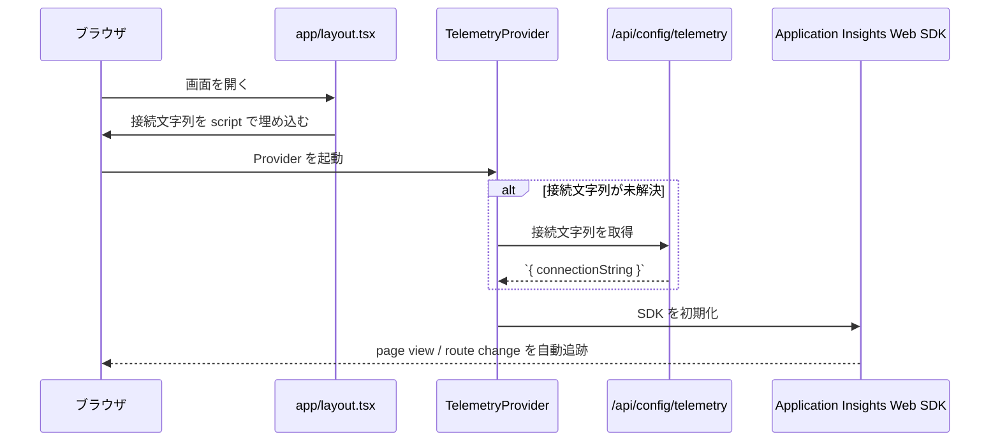

# テレメトリ・監視 詳細設計書

## 1. 概要

本書は、クライアント側 Application Insights、Node.js ランタイム計測、独自 PageViews 保存、および Google Analytics を含む監視・計測機構の実装境界を整理する。

本機能は以下を扱う。

- `TelemetryProvider` によるブラウザ計測初期化
- `instrumentation.ts` / `instrumentation.node.ts` によるサーバー計測
- `/api/config/telemetry` による接続文字列配布
- `/api/track` による PageViews 保存
- Google Analytics の埋込

---

## 2. 対象範囲

### 対象

- `apps/web/app/layout.tsx`
- `apps/web/components/providers/TelemetryProvider.tsx`
- `apps/web/instrumentation.ts`
- `apps/web/instrumentation.node.ts`
- `apps/web/app/api/config/telemetry/route.ts`
- `apps/web/app/api/track/route.ts`

### 対象外

- 管理画面の利用状況分析ロジック
- Azure Monitor のポータル設定
- E2E レポートや CI ログ収集

---

## 3. アーキテクチャ図

```mermaid
graph TD
    Browser[ブラウザ] --> Layout[app/layout.tsx]
    Layout --> TelemetryProvider[TelemetryProvider.tsx]
    Layout --> GoogleAnalytics[@next/third-parties]

    TelemetryProvider --> ConfigApi[/api/config/telemetry]
    TelemetryProvider --> AppInsightsWeb[@microsoft/applicationinsights-web]
    TelemetryProvider --> Session[useSession]

    ConfigApi --> EnvClient[NEXT_PUBLIC_APPLICATIONINSIGHTS_CONNECTION_STRING]

    NextServer[Next.js Node Runtime] --> Instrumentation[instrumentation.ts]
    Instrumentation --> NodeInstrumentation[instrumentation.node.ts]
    NodeInstrumentation --> AzureMonitor[applicationinsights useAzureMonitor]
    NodeInstrumentation --> ManagedIdentity[@azure/identity ManagedIdentityCredential]

    Browser --> TrackApi[/api/track]
    TrackApi --> PageViews[(CosmosDB PageViews)]
```

---

## 4. ユーザーフロー

### 4.1 ブラウザ計測初期化



### 4.2 認証ユーザー文脈の設定

1. `TelemetryProvider` が `useSession()` の状態を監視する
2. 認証済みなら `appInsights.setAuthenticatedUserContext(userId)` を実行する
3. 未認証またはログアウト時は `clearAuthenticatedUserContext()` を実行する

### 4.3 Node.js ランタイム計測

1. Next.js 起動時に `register()` が呼ばれる
2. `NEXT_RUNTIME === 'nodejs'` の場合のみ `instrumentation.node.ts` を読み込む
3. `useAzureMonitor()` で Azure Monitor を初期化する
4. Managed Identity を使って送信認証を行う

---

## 5. コンポーネント一覧

| 区分 | ファイル / モジュール | 責務 |
|------|------|------|
| Layout | `apps/web/app/layout.tsx` | 接続文字列埋込、TelemetryProvider 適用、GA 埋込 |
| Provider | `apps/web/components/providers/TelemetryProvider.tsx` | クライアント SDK 初期化と認証ユーザー文脈の反映 |
| Instrumentation | `apps/web/instrumentation.ts` | Node 専用計測初期化の分岐 |
| Instrumentation | `apps/web/instrumentation.node.ts` | Azure Monitor SDK 初期化 |
| API | `apps/web/app/api/config/telemetry/route.ts` | 接続文字列を no-store で返す |
| API | `apps/web/app/api/track/route.ts` | PageViews を CosmosDB に保存 |
| Layout | `apps/web/app/(main)/layout.tsx` | ページビュー追跡を TelemetryProvider に委譲する宣言 |

---

## 6. 外部依存サービス

| サービス | 用途 |
|------|------|
| Azure Application Insights / Azure Monitor | ブラウザ・サーバー双方の計測 |
| Managed Identity | Node 計測の送信認証 |
| Azure Cosmos DB PageViews | 独自 PageView データ保存 |
| Google Analytics | マーケティング用ページ計測 |

---

## 7. 環境変数定義

| 変数名 | 必須 | 用途 | 備考 |
|------|------|------|------|
| `NEXT_PUBLIC_APPLICATIONINSIGHTS_CONNECTION_STRING` | 任意 | クライアント SDK の接続文字列 | script 埋込と API の両方で参照 |
| `TELEMETRY_CONNECTION_STRING` | 任意 | Node 側 SDK の接続文字列 | AAD 認証付き送信に使用 |
| `NEXT_PUBLIC_GA_MEASUREMENT_ID` | 任意 | Google Analytics 埋込 | 未設定時は無効 |
| `OTEL_SERVICE_NAME` | 任意 | OpenTelemetry サービス名 | 未設定時は `pm-exam-dx-web` を自動設定 |

---

## 8. データモデル

### 8.1 PageViews コンテナ

`/api/track` は以下の形で PageViews を保存する。

| フィールド | 型 | 用途 |
|------|------|------|
| `id` | string | レコード識別子 |
| `visitorId` | string | 匿名訪問者識別子 |
| `userId` | string optional | 認証済みユーザー識別子 |
| `isAuthenticated` | boolean | 認証状態 |
| `path` | string | ページパス |
| `date` | string | パーティションキー |
| `timestamp` | string | イベント時刻 |

### 8.2 Application Insights タグ

`TelemetryProvider` は以下のタグを補完する。

| タグ | 値 |
|------|------|
| `ai.cloud.role` | `pm-exam-dx-web-client` |
| `ai.cloud.roleInstance` | `window.location.host` |

Node 側では `OTEL_SERVICE_NAME=pm-exam-dx-web` を既定値として使う。

---

## 9. API / サーバー処理

| エンドポイント | メソッド | 認証要否 | 用途 | 備考 |
|------|------|------|------|------|
| `/api/config/telemetry` | GET | 不要 | 接続文字列返却 | `Cache-Control: no-store` |
| `/api/track` | POST | 不要 | PageViews 保存 | DB 障害時も `{ ok: true }` を返す |

### 9.1 `/api/config/telemetry`

- `headers()` を呼んで動的レンダリングを強制する
- `NEXT_PUBLIC_APPLICATIONINSIGHTS_CONNECTION_STRING` または `TELEMETRY_CONNECTION_STRING` を返す
- 接続文字列は公開情報として扱う方針である

### 9.2 `/api/track`

- `visitorId` と `path` を必須入力として検証する
- セッションがあれば `userId` と `isAuthenticated=true` を付与する
- DB 書込が失敗しても UX 優先で成功応答を返す

---

## 10. データフロー

### 10.1 クライアント接続文字列の解決

1. `app/layout.tsx` が `window.__APPINSIGHTS_CONNECTION_STRING__` を埋め込む
2. `TelemetryProvider` は props または window グローバルから初期値を解決する
3. 未解決時のみ `/api/config/telemetry` を fetch する

### 10.2 SDK の一度きり初期化

- `appInsights` は module-level singleton である
- 既に初期化済みなら再生成しない
- 初期化直後に `trackPageView({ uri: window.location.href })` を 1 回送る

### 10.3 独自 PageViews 保存

- `/api/track` は存在するが、現行ソース上では明示的な呼出元 Hook が確認できない
- `app/(main)/layout.tsx` には「ページビュートラッキングは TelemetryProvider が担当」とある

---

## 11. 状態遷移・保存ルール

### 11.1 クライアント状態

- `resolvedConnectionString` が空の間だけ API 取得を試みる
- 取得成功後は `window.__APPINSIGHTS_CONNECTION_STRING__` と state に保持する

### 11.2 失敗時の非機能要件

- 計測初期化失敗は UI を壊さない
- `/api/track` の DB 障害もユーザー操作へ影響させない

### 11.3 サーバー側初期化

- `instrumentation.ts` は Edge 実行時に Node 専用モジュールを読み込まない
- `instrumentation.node.ts` は `TELEMETRY_CONNECTION_STRING` 未設定時に計測を無効化する

---

## 12. 認証・認可

### 12.1 クライアント計測

- 認証済みユーザーのみ `setAuthenticatedUserContext(userId)` を適用する
- 未認証ユーザーは匿名扱いとする

### 12.2 サーバー API

- `/api/config/telemetry` は公開 API である
- `/api/track` も匿名利用可能であり、セッションがあれば自動 enrich する

---

## 13. エラー処理

### 13.1 TelemetryProvider

- `/api/config/telemetry` fetch 失敗は無視する
- SDK 初期化失敗は UI に影響させない

### 13.2 Node instrumentation

- 接続文字列未設定時は warning を出して無効化する
- 初期化失敗時は error ログを出すが起動は継続する

### 13.3 Track API

- 入力不足時は 400 を返す
- DB 書込失敗時は error ログを出して `{ ok: true }` を返す

---

## 14. テレメトリ / 監視

### 14.1 現行の三層構造

1. ブラウザ Application Insights SDK
2. Node.js ランタイム Application Insights SDK
3. 独自 `PageViews` 保存

### 14.2 補助計測

- `NEXT_PUBLIC_GA_MEASUREMENT_ID` がある場合は Google Analytics も併用する

### 14.3 運用上の観測点

- サーバー初期化ログ
- `/api/track` のエラーログ
- ブラウザ SDK の自動 route tracking

---

## 15. テスト観点

| 種別 | 観点 |
|------|------|
| Unit | 接続文字列解決ロジックが props / window / API の順で動作すること |
| Unit | 認証状態変化で `setAuthenticatedUserContext` / `clearAuthenticatedUserContext` が切り替わること |
| API | `/api/config/telemetry` が no-store で接続文字列を返すこと |
| API | `/api/track` が入力不足で 400 を返すこと |
| API | `/api/track` が DB 障害時も `{ ok: true }` を返すこと |

---

## 16. 既知の課題・未確定事項

### 16.1 独自 PageViews の呼出元不明確

- ソース上で `/api/track` を呼ぶ専用 Hook やコンポーネントが確認できない
- ルートは存在するが、実運用でどの程度使われているか不明である

### 16.2 計測方式の重複

- Application Insights、PageViews、Google Analytics が並存し、イベント taxonomy が統一されていない

### 16.3 接続文字列解決の二重化

- `app/layout.tsx` の script 埋込と `/api/config/telemetry` fetch が両方存在する
- どちらを正本とするかが明文化されていない

### 16.4 未使用要素

- `/api/config/telemetry` で取得した `host` は実質未使用である
- `TelemetryProvider` の `reactPlugin` export は `null` 固定で未活用である

---

## 17. 次の関連設計

本書の次に参照・整備すべき設計書は以下である。

1. `15_CommonApiAndErrorDesign.md`
2. `09_AdminAndFeatureFlagsDesign.md`
3. `12_DashboardAndLearningHistoryDesign.md`

監視設計は、共通 API 契約と管理画面側の分析要件に接続する。