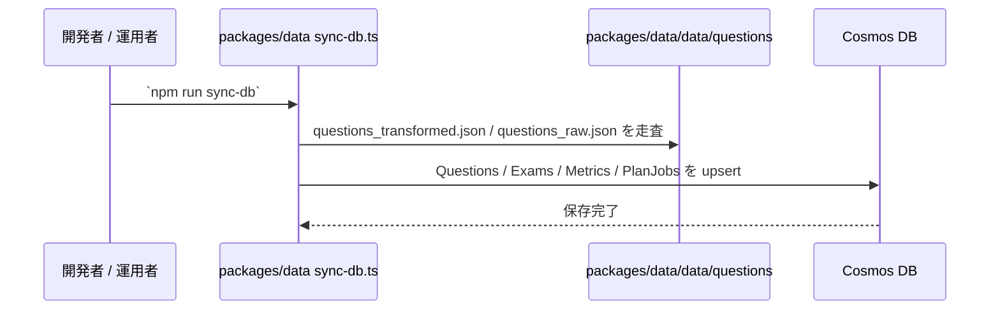
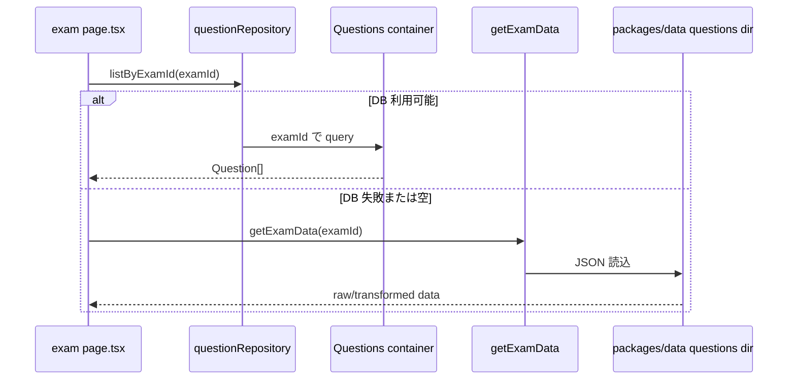

# データ読み込み・同期境界 詳細設計書

## 1. 概要

本書は、`packages/data` に存在する試験データが、同期スクリプトを経て Cosmos DB へ格納され、`apps/web` 側で repository / API / file system fallback として利用されるまでの境界を整理する。

本機能は以下を扱う。

- `packages/data/data/questions` のファイル構造
- `sync-db.ts` による Cosmos DB 同期
- `questionRepository` による DB 読込
- `ssg-helper.ts` によるファイルシステム読込
- 演習ページと API でのデータ取得経路の差異

---

## 2. 対象範囲

### 対象

- `packages/data/package.json`
- `packages/data/src/scripts/sync-db.ts`
- `packages/data/data/questions/**`
- `apps/web/lib/repositories/questionRepository.ts`
- `apps/web/lib/ssg-helper.ts`
- `apps/web/app/api/exams/**`
- `apps/web/app/(main)/exam/**`

### 対象外

- 問題抽出や補修プロセスの詳細
- 管理画面からのデータ更新
- Azure Functions 側の別同期経路

---

## 3. アーキテクチャ図

```mermaid
graph TD
    RawFiles[(packages/data/data/questions/*)] --> SyncScript[sync-db.ts]
    SyncScript --> Questions[(CosmosDB Questions)]
    SyncScript --> Exams[(CosmosDB Exams)]
    SyncScript --> PlanJobs[(CosmosDB PlanJobs)]

    Questions --> QuestionRepo[questionRepository]
    Exams --> ExamsApi[/api/exams]
    Questions --> QuestionsApi[/api/exams/[examId]/questions]

    RawFiles --> SSGHelper[ssg-helper.ts]

    QuestionRepo --> ExamPages[exam page.tsx / question page.tsx / result page.tsx]
    SSGHelper --> ExamPages
    QuestionsApi --> ClientFetch[getQuestions()]
    ExamsApi --> ClientFetch
```

---

## 4. ユーザーフロー

### 4.1 データ同期



### 4.2 演習ページの問題読込



---

## 5. コンポーネント一覧

| 区分 | ファイル / モジュール | 責務 |
|------|------|------|
| Package | `packages/data/package.json` | データ生成・補修・同期スクリプトの公開 |
| Script | `packages/data/src/scripts/sync-db.ts` | JSON データを Cosmos DB へ同期 |
| Data | `packages/data/data/questions/*/questions_transformed.json` | 正規化済み問題データ |
| Data | `packages/data/data/questions/*/questions_raw.json` | フォールバック元データ |
| Repository | `apps/web/lib/repositories/questionRepository.ts` | Questions コンテナ読込 |
| Utility | `apps/web/lib/ssg-helper.ts` | ファイルシステムから問題 JSON を読込 |
| API | `apps/web/app/api/exams/route.ts` | Exams コンテナ読込 |
| API | `apps/web/app/api/exams/[examId]/questions/route.ts` | Questions コンテナ読込と安全補完 |
| Page | `apps/web/app/(main)/exam/[year]/[type]/page.tsx` | DB 優先・FS フォールバックで入口データを読込 |
| Page | `apps/web/app/(main)/exam/[year]/[type]/[qNo]/page.tsx` | DB 優先・FS フォールバックで問題データを読込 |

---

## 6. 外部依存サービス

| サービス | 用途 |
|------|------|
| Azure Cosmos DB Questions | 問題データの運用系ストア |
| Azure Cosmos DB Exams | 試験一覧ストア |
| ローカルファイルシステム | build / local dev / DB 障害時フォールバック |

---

## 7. 環境変数定義

| 変数名 | 必須 | 用途 | 備考 |
|------|------|------|------|
| `COSMOS_DB_CONNECTION` | 同期・Web サーバーで必須 | Cosmos DB 接続 | `apps/web` 側と共有 |
| `Values_COSMOS_DB_CONNECTION` | 任意 | `apps/api/local.settings.json` 読込時の代替 | sync script 用 |

`sync-db.ts` は以下の順で環境ファイルを探索する。

1. `apps/web/.env.local`
2. `apps/web/.env`
3. `apps/api/local.settings.json`

---

## 8. データモデル

### 8.1 Questions コンテナ

| 項目 | 値 |
|------|------|
| コンテナ名 | `Questions` |
| パーティションキー | `/examId` |
| 並び順 | `qNo ASC` |

### 8.2 Exams コンテナ

| 項目 | 値 |
|------|------|
| コンテナ名 | `Exams` |
| パーティションキー | `/id` |

### 8.3 ファイル形式

`getExamData()` は複数形式を許容する。

| 形式 | 内容 |
|------|------|
| Form A | `Question[]` 配列 |
| Form B | 単一問題オブジェクト |
| Form C | `{ questions: Question[] }` ラッパー |

### 8.4 優先読込ファイル

| 優先度 | ファイル | 用途 |
|------|------|------|
| 1 | `questions_transformed.json` | 午後問題の構造化済みデータ |
| 2 | `questions_raw.json` | フォールバック |

---

## 9. API / サーバー処理

| エンドポイント | メソッド | 認証要否 | 用途 | 備考 |
|------|------|------|------|------|
| `/api/exams` | GET | 不要 | `Exams` コンテナ読込 | `id DESC` で返す |
| `/api/exams/[examId]/questions` | GET | 不要 | `Questions` コンテナ読込 | `category` / `subCategory` を安全補完 |

### 9.1 API route と page route の違い

- API route は `getContainer("Questions")` を直接使う
- server page は `questionRepository.listByExamId()` を使う
- page route 側だけが `getExamData()` によるファイルシステムフォールバックを持つ

---

## 10. データフロー

### 10.1 `sync-db.ts` の同期ルール

1. `questions_transformed.json` があればそれを優先する
2. なければ `questions_raw.json` を使う
3. `Questions`、`Exams`、`Metrics`、`PlanJobs` の存在を事前保証する
4. 試験フォルダ名から `examId`、`type`、`title` を導出する
5. `qNo` は正の整数または数値文字列のみを有効とし、欠損時に `99` へ丸めてはならない
6. Form A / B / C の各形式を明示的に展開し、親問題番号を正規化できない場合はその試験フォルダの同期を失敗として扱う
7. 1件でも同期失敗した試験フォルダがある場合、同期スクリプト全体を非0終了にし、古い Cosmos データを成功扱いで残さない

### 10.2 `ssg-helper.ts` の読込ルール

1. 実行時の working directory から複数候補パスを探索する
2. `packages/data/data/questions` を解決できた場合のみ読込を継続する
3. データファイルが見つからない場合は `[]` を返す

### 10.3 `questions` API の安全補完

`/api/exams/[examId]/questions` は、DB 内のデータ欠損を埋めるために以下を補完する。

- `category`: `examId.split('-')[0]`
- `subCategory`: `その他`

---

## 11. 状態遷移・保存ルール

### 11.1 正本の優先順位

- 運用時の正本は Cosmos DB `Questions` / `Exams` である
- ただし page route は可用性優先で file system fallback を持つ
- Cosmos に当該 `examId` のデータが存在しても対象 `qNo` が欠落している場合は、部分不整合として page route から file system fallback を試行する
- 午後問題で `qNo=99` のみが返るケースは旧同期由来のプレースホルダー疑いとして扱い、午前問題の正規 Q99 とは区別する

### 11.2 ビルド / 開発時の挙動

- DB 接続不能でも `getExamData()` により演習ページを表示可能とする
- 一覧 API は DB 依存のため、完全なオフライン時は空配列になりうる

### 11.3 ルーティング上の識別子

- `generateAllExamParams()` は full examId を `year` に詰めて返す
- これは既存 URL 構造との互換性維持を目的とする特殊設計である

---

## 12. 認証・認可

本機能で扱う問題データ読込は公開情報として扱い、認証を要求しない。

- `Questions` / `Exams` の読込 API は未認証で利用可能
- server page の repository 直読込も認証不要

---

## 13. エラー処理

### 13.1 同期スクリプト

- 接続文字列が見つからない場合は `process.exit(1)` で終了する
- 各試験フォルダ処理中の例外はログ出力する
- `qNo` 欠損はデータ品質エラーとして扱い、`qNo=99` の代替値で保存しない
- フォルダ単位の失敗を集約し、同期全体の終了コードを失敗にする

### 13.2 Web サーバー

- repository 読込失敗時は握りつぶして file system fallback に移行する
- `getExamData()` 自体が失敗した場合は `[]` を返す
- API route は 500 を返すため、page route と可用性方針が異なる
- repository が0件ではなく一部データを返した場合でも、要求 `qNo` が欠落していれば file system fallback を試行する
- fallback 発動時は `Filesystem fallback engaged for examId=...` を warn 出力し、Cosmos 件数、要求 `qNo`、プレースホルダー疑いの有無をログへ残す

---

## 14. テレメトリ / 監視

現状の観測点は構造化されておらず、以下のログが中心である。

- `sync-db.ts` の console log
- `ssg-helper.ts` の `[SSG]` ログ
- page route での `console.warn`
- self-inspect R11 により、`sync-db.ts` へ `qNo || 99` / `parentQNo = 99` 系の丸め処理が再導入されていないかを検出する

問題データ供給の鮮度や DB / FS フォールバック発生率は現状可視化されていない。

---

## 15. テスト観点

| 種別 | 観点 |
|------|------|
| Unit | `ssg-helper.ts` が `questions_transformed.json` を優先すること |
| Unit | filesystem データ Form A / B / C を page route 用の `Question[]` に正規化できること |
| Unit | 午後問題の `qNo=99` のみを旧同期プレースホルダーとして検知し、午前問題の Q99 と区別すること |
| Unit | データディレクトリ探索が候補パスから正しく解決されること |
| Repository | `questionRepository.listByExamId()` が qNo 順に返すこと |
| API | `/api/exams/[examId]/questions` が欠損フィールドを補完すること |
| Integration | DB 不可時に page route が file system fallback で継続すること |
| Integration | Cosmos が部分不整合で対象 `qNo` を返さない場合に page route が file system fallback で対象問題を表示できること |

---

## 16. 既知の課題・未確定事項

### 16.1 読込経路の多重化

- 一覧画面は API route、演習 page は repository 直読込、障害時は file system fallback と、取得経路が 3 系統ある

### 16.2 API route と page route の可用性差

- page route は DB 障害時でも file system へ逃げられるが、API route は 500 を返す
- クライアント fetch ベースの機能は同じ可用性を持たない

### 16.3 欠損補完がデータ品質問題を隠す

- questions API が `category` / `subCategory` を補完するため、元データ欠損が運用上見えにくい
- `qNo` 欠損は表示上の補完対象にせず、同期時に失敗させて検知する

### 16.4 ルーティング識別子の特殊性

- full examId を `year` パラメータへ流用しており、URL パラメータ名と実体が一致していない

---

## 17. 次の関連設計

本書の次に参照・整備すべき設計書は以下である。

1. `13_AMPracticeDesign.md`
2. `14_PMPracticeAndScoringDesign.md`
3. `15_CommonApiAndErrorDesign.md`

演習機能の安定性は、このデータ供給境界に強く依存する。

---

## 18. 変更履歴

| 日付 | 変更内容 |
|------|----------|
| 2026-05-01 | Cosmos 部分不整合時の page route filesystem fallback、同期時の `qNo` 正規化、不正な `qNo=99` 丸め禁止、self-inspect R11 を追記 |