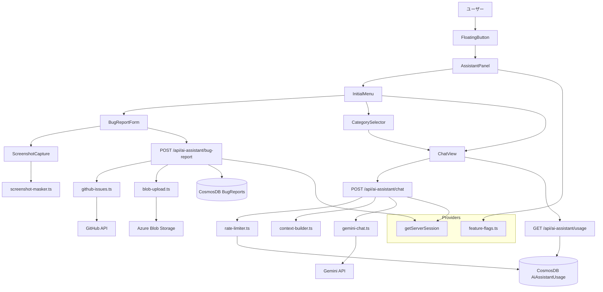
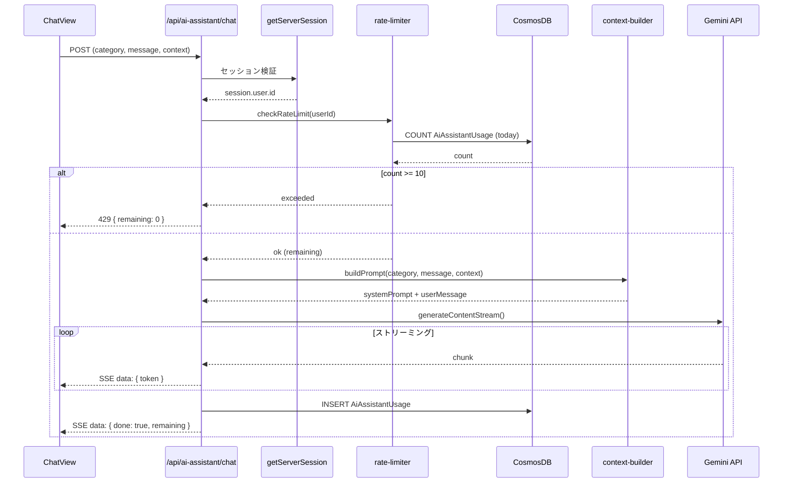
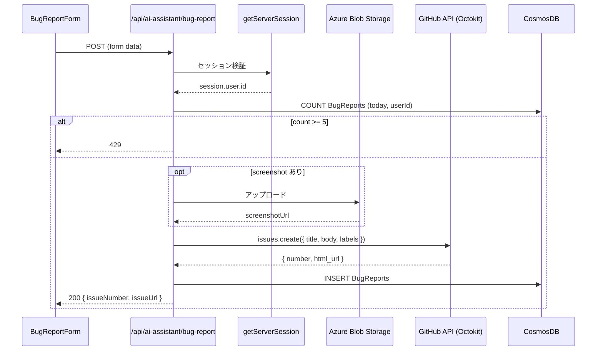

# AIアシスタント 詳細設計書

## 1. 概要

本書は、shikaku-no.com に追加する AI アシスタント機能（フローティングチャットウィジェット）の詳細設計を定義する。

本機能は以下を扱う。

- 右下フローティングボタン（FAB）と展開パネル
- 障害報告フォームと GitHub Issues 自動起票
- スクリーンショットキャプチャと DOM マスキング
- Gemini API によるストリーミングチャット応答
- カテゴリ選択と問題コンテキスト注入
- サイト利用ガイドモード
- レート制限（1日10回）

---

## 2. 対象範囲

### 対象

- `components/features/ai-assistant/` 配下の全コンポーネント
- `hooks/use-ai-assistant.ts`
- `lib/ai-assistant/` 配下の全ライブラリ
- `app/api/ai-assistant/` 配下の全 Route Handler
- CosmosDB コンテナ `AiAssistantUsage`, `BugReports`

### 対象外

- AI 学習計画生成（`ai-planner-design.md` で管理）
- AI 採点（`14_PMPracticeAndScoringDesign.md` で管理）
- 管理者画面の拡張（`09_AdminAndFeatureFlagsDesign.md` で管理）

---

## 3. アーキテクチャ図



---

## 4. データベース設計

### 4.1 新規コンテナ

#### `AiAssistantUsage`

| プロパティ | 型 | 説明 |
|-----------|-----|------|
| `id` | string | UUID (cuid) |
| `userId` | string | **Partition Key** |
| `usedAt` | string | ISO 8601（UTC） |
| `category` | string | `"qa-explain"` \| `"qa-related"` \| `"qa-analysis"` \| `"qa-afternoon"` \| `"site-guide"` |
| `questionId` | string? | 演習画面の場合の問題 ID |
| `examId` | string? | 演習画面の場合の試験 ID |

**パーティションキー**: `/userId`

**TTL**: 90 日（コスト最適化のため古いレコードを自動削除）

#### `BugReports`

| プロパティ | 型 | 説明 |
|-----------|-----|------|
| `id` | string | UUID (cuid) |
| `userId` | string | **Partition Key** |
| `description` | string | 報告内容 |
| `screenshotUrl` | string? | Azure Blob Storage の URL |
| `pageUrl` | string | 報告時の URL |
| `userAgent` | string | ブラウザ UA |
| `errorLogs` | string? | JSON 文字列（コンソールエラー最大10件） |
| `githubIssueNumber` | number? | 起票された Issue 番号 |
| `githubIssueUrl` | string? | Issue の URL |
| `createdAt` | string | ISO 8601 |

**パーティションキー**: `/userId`

### 4.2 `lib/cosmos.ts` への追記

```typescript
const CONTAINER_PARTITION_KEYS: Record<string, string> = {
    // ... 既存 ...
    AiAssistantUsage: "/userId",
    BugReports: "/userId",
};
```

### 4.3 フィーチャーフラグ追加

`DEFAULT_FLAGS` に以下を追加する。

```typescript
{
    id: 'ai_assistant_enabled',
    enabled: false,
    description: 'AIアシスタントウィジェットの有効化',
}
```

---

## 5. API 設計

### 5.1 `POST /api/ai-assistant/chat`

#### リクエスト

```typescript
interface ChatRequest {
    category: "qa-explain" | "qa-related" | "qa-analysis" | "qa-afternoon" | "site-guide";
    message: string;
    context?: {
        questionId: string;
        questionText: string;
        userAnswer: string;
        correctAnswer: string;
        explanation: string;
        isCorrect: boolean;
        examId: string;
        isDescriptive: boolean;
    };
}
```

#### レスポンス

`Content-Type: text/event-stream` (Server-Sent Events)

```
data: {"token": "こ"}
data: {"token": "の"}
data: {"token": "問題は"}
data: {"done": true, "remaining": 7}
```

#### ステータスコード

| コード | 条件 |
|--------|------|
| 200 | 正常（ストリーミング開始） |
| 401 | 未認証 |
| 429 | レート制限超過 |
| 500 | Gemini API エラー |

#### 処理フロー



### 5.2 `POST /api/ai-assistant/bug-report`

#### リクエスト

`Content-Type: multipart/form-data`

| フィールド | 型 | 必須 | 説明 |
|-----------|-----|------|------|
| `description` | string | ✅ | 報告内容（1-2000文字） |
| `screenshot` | File | | マスキング済み PNG 画像 |
| `pageUrl` | string | ✅ | URL |
| `userAgent` | string | ✅ | UA |
| `errorLogs` | string | | JSON 文字列 |

#### レスポンス

```typescript
interface BugReportResponse {
    success: true;
    issueNumber: number;
    issueUrl: string;
}
```

#### ステータスコード

| コード | 条件 |
|--------|------|
| 200 | 正常 |
| 401 | 未認証 |
| 429 | 1日5件超過 |
| 500 | GitHub API エラー |

#### 処理フロー



### 5.3 `GET /api/ai-assistant/usage`

#### レスポンス

```typescript
interface UsageResponse {
    used: number;
    limit: number;
    remaining: number;
    resetsAt: string; // ISO 8601 (JST 0:00)
}
```

---

## 6. コンポーネント設計

### 6.1 ファイル構成

```
apps/web/
├── components/features/ai-assistant/
│   ├── AiAssistantWidget.tsx      # エントリポイント（FAB + Panel 切替）
│   ├── FloatingButton.tsx         # 右下 FAB ボタン
│   ├── AssistantPanel.tsx         # 展開パネルコンテナ
│   ├── InitialMenu.tsx            # 初期メニュー（障害報告 / 質問）
│   ├── CategorySelector.tsx       # Q&A カテゴリ選択
│   ├── ChatView.tsx               # チャット表示（ストリーミング対応）
│   ├── ChatMessage.tsx            # メッセージバブル
│   ├── BugReportForm.tsx          # 障害報告フォーム
│   ├── ScreenshotCapture.tsx      # スクショ撮影 + プレビュー
│   ├── RateLimitBadge.tsx         # 残回数バッジ
│   └── ai-assistant.module.css    # CSS Modules
├── hooks/
│   └── use-ai-assistant.ts        # 状態管理 hook
└── lib/ai-assistant/
    ├── gemini-chat.ts             # Gemini API クライアント
    ├── github-issues.ts           # Octokit ラッパー
    ├── screenshot-masker.ts       # DOM マスキングロジック
    ├── context-builder.ts         # プロンプト構築
    ├── rate-limiter.ts            # CosmosDB レート制限
    └── blob-upload.ts             # Azure Blob アップロード
```

### 6.2 状態管理 (`use-ai-assistant.ts`)

```typescript
type PanelState = 'closed' | 'menu' | 'bug-form' | 'category' | 'chat' | 'submitted';

interface AiAssistantState {
    panelState: PanelState;
    messages: ChatMessage[];
    remainingQuota: number;
    category: Category | null;
    currentPage: 'exam' | 'admin' | 'other';
    examContext: ExamContext | null;
    bugReportResult: { issueNumber: number; issueUrl: string } | null;
}

interface ChatMessage {
    id: string;
    role: 'user' | 'assistant';
    content: string;
    timestamp: Date;
}

interface ExamContext {
    questionId: string;
    questionText: string;
    userAnswer: string;
    correctAnswer: string;
    explanation: string;
    isCorrect: boolean;
    examId: string;
    isDescriptive: boolean;
}
```

### 6.3 Root Layout 統合

```tsx
// apps/web/app/layout.tsx
// next/dynamic で遅延ロード（初期バンドルに影響しない）
const AiAssistantWidget = dynamic(
    () => import("@/components/features/ai-assistant/AiAssistantWidget"),
    { ssr: false }
);

// ThemeProvider の直後、{children} の後に追加
<ThemeProvider>
    {children}
    <AiAssistantWidget />
</ThemeProvider>
```

`AiAssistantWidget` 内部で以下を判定:
1. `useSession()` でログイン状態を確認（未ログインなら `null` を返す）
2. `useFeatureFlag('ai_assistant_enabled')` で有効性を確認
3. `usePathname()` でランディング / ログイン画面を除外

---

## 7. Gemini プロンプト設計

### 7.1 システムプロンプト

```typescript
const SYSTEM_PROMPTS: Record<Category, string> = {
    "qa-explain": QA_EXPLAIN_PROMPT,
    "qa-related": QA_RELATED_PROMPT,
    "qa-analysis": QA_ANALYSIS_PROMPT,
    "qa-afternoon": QA_AFTERNOON_PROMPT,
    "site-guide": SITE_GUIDE_PROMPT,
};
```

#### `qa-explain` — 解説深掘り

```text
あなたは情報処理技術者試験の学習アシスタントです。
与えられた問題の解説をさらに詳しく、初学者にもわかるように説明してください。
具体例を交えて、なぜその答えが正しいのかを論理的に解説してください。
回答は日本語で、Markdown 形式で返してください。
```

#### `qa-related` — 関連知識

```text
あなたは情報処理技術者試験の学習アシスタントです。
与えられた問題に関連する概念、用語、過去の類似問題を提示してください。
体系的な理解を促すように、関連分野のつながりを示してください。
回答は日本語で、Markdown 形式で返してください。
```

#### `qa-analysis` — 誤答分析

```text
あなたは情報処理技術者試験の学習アシスタントです。
ユーザーが選んだ誤答に基づいて、なぜその選択肢を選びやすいのかを分析してください。
正解との違いを明確にし、同様のミスを防ぐためのポイントを示してください。
回答は日本語で、Markdown 形式で返してください。
```

#### `qa-afternoon` — 午後問題支援

```text
あなたは情報処理技術者試験の午後問題の学習アシスタントです。
長文読解のポイント解説、模範解答との比較・添削、
解答プロセスのステップバイステップ指導を行ってください。
回答は日本語で、Markdown 形式で返してください。
```

#### `site-guide` — サイト利用ガイド

```text
あなたは「シカクノ」サイトの使い方ガイドです。
以下の機能について案内してください:
- ダッシュボード: 学習目標、進捗、正答率、ヒートマップ
- 演習・模擬試験: 区分・時間帯フィルタ、練習/模擬試験モード
- 学習計画: AI による学習プラン生成
- 学習履歴: 過去の学習ログ
- 設定: ダークモード、統計表示
サイト外の質問には「申し訳ございませんが、シカクノの機能に関する質問のみお答えできます」と回答してください。
回答は日本語で、Markdown 形式で返してください。
```

### 7.2 コンテキスト構築

ユーザーメッセージに問題コンテキストを付与するテンプレート:

```typescript
function buildUserPrompt(category: Category, message: string, context?: ExamContext): string {
    if (!context) return message;
    return `${buildContextBlock(context)}\n\nユーザーの質問: ${message}`;
}
```

コンテキストブロックのフォーマット:

```text
--- 問題情報 ---
問題文: {questionText}
ユーザーの回答: {userAnswer}
正解: {correctAnswer}
判定: {正解 | 不正解}
既存の解説: {explanation}
--- ここまで ---

ユーザーの質問: {message}
```
```

### 7.3 安全設定

```typescript
const safetySettings = [
    { category: HarmCategory.HARM_CATEGORY_HARASSMENT, threshold: HarmBlockThreshold.BLOCK_MEDIUM_AND_ABOVE },
    { category: HarmCategory.HARM_CATEGORY_HATE_SPEECH, threshold: HarmBlockThreshold.BLOCK_MEDIUM_AND_ABOVE },
    { category: HarmCategory.HARM_CATEGORY_SEXUALLY_EXPLICIT, threshold: HarmBlockThreshold.BLOCK_MEDIUM_AND_ABOVE },
    { category: HarmCategory.HARM_CATEGORY_DANGEROUS_CONTENT, threshold: HarmBlockThreshold.BLOCK_MEDIUM_AND_ABOVE },
];
```

---

## 8. スクリーンショットマスキング

### 8.1 マスキング対象

| セレクタ | 対象 |
|---------|------|
| `[data-user-identity]` | カスタム属性によるマスキング対象指定 |
| `.user-display-name` | ユーザー名表示クラス |
| `[data-testid="user-name"]` | テスト用属性 |

### 8.2 処理フロー

```typescript
// lib/ai-assistant/screenshot-masker.ts
export async function captureWithMasking(): Promise<Blob> {
    const selectors = [
        '[data-user-identity]',
        '[data-testid="user-name"]',
        '.user-display-name',
    ];

    const originals: Array<{ el: HTMLElement; text: string }> = [];

    // 1. マスキング
    for (const sel of selectors) {
        document.querySelectorAll<HTMLElement>(sel).forEach(el => {
            originals.push({ el, text: el.textContent ?? '' });
            el.textContent = '****';
        });
    }

    try {
        // 2. キャプチャ（ウィジェット自体を除外）
        const { default: html2canvas } = await import('html2canvas');
        const canvas = await html2canvas(document.body, {
            ignoreElements: (el) => el.closest('[data-ai-assistant]') !== null,
        });
        return await new Promise<Blob>((resolve, reject) => {
            canvas.toBlob(blob => blob ? resolve(blob) : reject(new Error('Canvas to Blob failed')), 'image/png');
        });
    } finally {
        // 3. 復元（必ず実行）
        for (const { el, text } of originals) {
            el.textContent = text;
        }
    }
}
```

### 8.3 `UserMenu` へのマスキング属性追加

```diff
// components/features/auth/UserMenu.tsx
- <span className={styles.userName}>{session.user.name}</span>
+ <span className={styles.userName} data-user-identity>{session.user.name}</span>
```

---

## 9. CSS 設計

### 9.1 CSS 変数（`globals.css` の既存変数を利用）

| 用途 | CSS 変数 |
|------|---------|
| 背景色 | `var(--bg-secondary)` |
| テキスト色 | `var(--text-primary)`, `var(--text-secondary)` |
| アクセントカラー | `var(--accent-color)` |
| ボーダー | `var(--border-color)` |
| シャドウ | `var(--card-shadow)` |
| 成功 | `var(--success-bg)`, `var(--success-text)` |
| エラー | `var(--error-bg)`, `var(--error-text)` |

### 9.2 レスポンシブブレークポイント

| 幅 | パネル表示 |
|-----|----------|
| > 768px | 右下固定パネル（400px × 500px） |
| ≤ 768px | 全画面展開（`position: fixed; inset: 0`） |

### 9.3 z-index

| 要素 | z-index | 備考 |
|------|---------|------|
| サイドバー | 1000 | 既存 |
| FAB ボタン | 1050 | サイドバーの上 |
| パネル | 1060 | FAB の上 |
| パネルオーバーレイ (SP) | 1055 | パネルの下 |

---

## 10. エラーハンドリング

### 10.1 API エラー

| エラー | ユーザーへの表示 |
|--------|---------------|
| 401 Unauthorized | 「ログインが必要です」 |
| 429 Rate Limited | 「本日の質問回数上限に達しました。明日またご利用ください。」 |
| 500 Gemini Error | 「回答の生成に失敗しました。しばらく経ってからお試しください。」 |
| 500 GitHub Error | 「障害報告の送信に失敗しました。しばらく経ってからお試しください。」 |
| Network Error | 「ネットワークに接続できません。接続を確認してください。」 |

### 10.2 フォールバック

- Gemini API が利用不可の場合: 「現在 AI アシスタントは一時的にご利用いただけません」と表示
- フィーチャーフラグで `ai_assistant_enabled: false` にすれば即座に全機能を停止可能

---

## 11. テスト方針

### 11.1 ユニットテスト (Vitest)

| 対象 | テスト内容 |
|------|----------|
| `rate-limiter.ts` | 10回制限の判定ロジック |
| `context-builder.ts` | カテゴリ別プロンプト生成 |
| `screenshot-masker.ts` | DOM マスキングと復元 |
| `POST /api/ai-assistant/chat` | 認証、レート制限、ストリーミング |
| `POST /api/ai-assistant/bug-report` | 認証、バリデーション、Issue 作成 |
| `GET /api/ai-assistant/usage` | 残回数取得 |

### 11.2 E2E テスト (Playwright)

| シナリオ | 確認事項 |
|---------|---------|
| FAB クリック → メニュー表示 | パネルが展開される |
| 障害報告フロー | フォーム入力 → 送信 → 完了表示 |
| Q&A フロー | カテゴリ選択 → 質問入力 → ストリーミング応答 |
| レート制限 | 10回使い切り → 入力無効化 |
| モバイル表示 | 全画面展開 |
| ダークモード | テーマ切替で正しく表示 |

---

## 変更履歴

| 日付 | 内容 |
|------|------|
| 2026-04-14 | 初版作成 |
| 2026-04-17 | レビュー指摘反映: currentPage に admin 追加、usedAt を UTC に統一、Root Layout を dynamic import に変更、テレメトリ追加、フォーカストラップ追加 |
