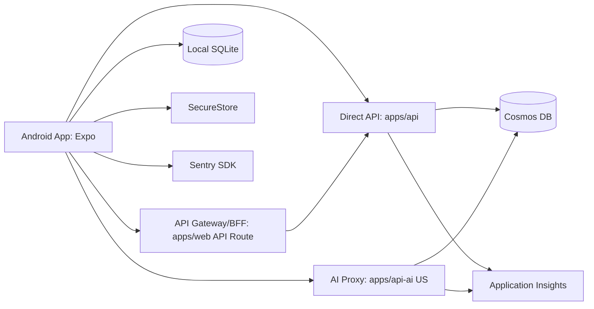

# 基本設計書: Android Google Play 版 (Web機能移植)

## 文書情報

| 項目 | 値 |
|---|---|
| 文書ID | 25_AndroidPlayBasicDesign |
| owner | documentation-steward / frontend-learning-engineer |
| status | Draft |
| version | 0.1.0 |
| source | ユーザー要件 (2026-06-11)、既存設計書、現行実装構成 |
| updated_at | 2026-06-11 |
| approval_status | PM未承認 |

---

## 1. 背景・目的

### 1.1 背景
- 現行 IpaLab は Web 中心構成。
- 構成要素:
  - `apps/web`: Next.js 16
  - `apps/api`: Azure Functions
  - `apps/api-ai`: Azure Functions (US)
  - データストア: Cosmos DB
  - 認証: NextAuth (GitHub / Google)
- 要望:
  - Android Google Play 版を先行公開し、Web 全機能を段階移植したい。
  - オフライン利用時の学習履歴保持と再接続同期を必須化したい。

### 1.2 目的
- Android 版で Web 同等の主要学習体験を提供する。
- OAuth (GitHub/Google) とゲスト利用を両立する。
- オフライン時でも学習継続でき、再接続時に整合性を保って同期する。
- クローズドβで品質を収束させ、一般公開へ移行する。
- 1名開発でも維持可能な設計にする。
- 将来 iOS 展開を見据え、モバイル共通化可能な構造を採用する。

---

## 2. スコープ/非スコープ

### 2.1 スコープ
- Android 向け Expo アプリ新設。
- Web 主要機能の移植:
  - ログイン/ゲスト
  - ダッシュボード
  - 学習計画閲覧/編集
  - 午前/午後演習
  - 学習履歴
  - AI採点結果閲覧
- 既存 API の流用と、必要最小限のモバイル向け API 追加。
- オフライン保存 + 再接続同期機能。
- Google Play クローズドβ配布と一般公開運用。

### 2.2 非スコープ
- iOS 本番配布 (設計のみ考慮、実装は後続)。
- Web UX の全面刷新。
- 管理者機能のモバイル最適化。
- オフライン時の AI 採点実行 (オンライン時のみ)。
- 課金/サブスク導入。

---

## 3. アーキテクチャ

### 3.1 システム構成



### 3.2 アプリ内レイヤー
- `presentation`:
  - 画面、ナビゲーション、状態表示。
  - `expo-router` を使用。
- `application`:
  - ユースケース実装。
  - 同期起動、リトライ、競合解決戦略。
- `domain`:
  - エンティティ、値オブジェクト、業務ルール。
  - 学習履歴イベントの正規化。
- `infrastructure`:
  - API クライアント、SQLite、SecureStore、監視SDK。

### 3.3 推奨ディレクトリ

```text
apps/mobile/
  app/                      # expo-router routes
    (auth)/
    (main)/
  src/
    presentation/
      screens/
      components/
      hooks/
    application/
      usecases/
      services/
    domain/
      models/
      policies/
    infrastructure/
      api/
      db/
      auth/
      telemetry/
      sync/
    store/                  # zustand stores
    query/                  # TanStack Query settings
    constants/
    types/
  assets/
  app.json
  eas.json
packages/shared/
  src/
    mobile/                 # mobile/web 共通型・バリデーション
```

---

## 4. 認証設計

### 4.1 方針
- 認証方式:
  - Google OAuth
  - GitHub OAuth
  - ゲスト利用
- 実装:
  - `expo-auth-session` で OAuth フロー実行。
  - 認証トークンは `expo-secure-store` 保存。
  - Web の NextAuth セッションと整合する API トークン交換エンドポイントを追加。

### 4.2 認証フロー
- OAuth 成功時:
  1. Provider 認可コード取得。
  2. モバイルから BFF へ送信。
  3. サーバーでトークン検証・ユーザー紐付け。
  4. モバイル用短期 Access Token + 長期 Refresh Token 発行。
  5. Access Token はメモリ、Refresh Token は SecureStore。
- ゲスト時:
  - ローカル `guest_id` を UUID 発行。
  - サインイン後に `guest_id` 紐づき履歴を統合。

### 4.3 セッション管理
- Access Token TTL: 60分。
- Refresh Token TTL: 30日。
- 自動更新:
  - API 401 受信時に1回のみ Refresh 実行。
  - 失敗時はログイン画面へ遷移。

---

## 5. オフライン同期設計

### 5.1 ローカル保存
- 保存基盤:
  - `expo-sqlite` + `drizzle`。
- 主テーブル:
  - `learning_events` (append-only)
  - `sync_queue` (未同期イベント)
  - `content_cache` (問題データ/マスタ)
  - `user_profile_cache`

### 5.2 同期トリガー
- アプリ起動時。
- ネットワーク復帰時。
- 画面遷移で履歴一覧表示時。
- 手動同期ボタン押下時。

### 5.3 同期アルゴリズム
- 方式: Outbox パターン。
- 手順:
  1. ローカル操作を `learning_events` に記録。
  2. 未送信レコードを `sync_queue` に積む。
  3. バックグラウンドでバッチ送信 (最大50件)。
  4. サーバー成功応答後に ACK を保存。
  5. ACK 済みをキューから削除。

### 5.4 競合解決
- 原則:
  - 学習履歴は追記型のため、重複排除優先。
- キー:
  - `event_id` (UUID) の冪等キーを採用。
- 衝突時:
  - 同一 `event_id` はサーバー側無視。
  - 同一問題への複数回答は `answered_at` の新しいものを有効値とする。

### 5.5 失敗時再試行
- Exponential Backoff: 2s, 4s, 8s, 16s, 最大60s。
- 最大再試行回数: 8回。
- 8回超過時:
  - 端末内で保留。
  - UI に「同期保留件数」を表示。

---

## 6. API設計方針（流用/新設）

### 6.1 流用 API
- 既存 API を優先流用:
  - 学習履歴取得/登録
  - 学習計画取得/更新
  - 問題データ取得
  - AI 採点リクエスト/結果取得
- 条件:
  - レスポンスをモバイル向けに軽量化できること。

### 6.2 新設 API
- `POST /api/mobile/auth/exchange`
  - OAuth 結果をモバイルセッションへ交換。
- `POST /api/mobile/sync/batch`
  - 履歴イベントを一括同期。
- `GET /api/mobile/bootstrap`
  - 初回起動に必要な最小データを集約配信。
- `POST /api/mobile/telemetry/client-errors`
  - クライアント重要障害の補助送信。

### 6.3 API 契約原則
- 冪等性:
  - 同期 API は `event_id` ベース冪等。
- バージョニング:
  - `/api/mobile/v1/...` を採用。
- エラー設計:
  - 共通エラーコード表を流用。
  - 再試行可否フラグを返す。

---

## 7. データ配信・キャッシュ設計

### 7.1 キャッシュ階層
- L1: メモリ (zustand / Query cache)
- L2: SQLite 永続キャッシュ
- L3: サーバー (Cosmos DB + API)

### 7.2 更新戦略
- 問題データ:
  - 日次で差分フェッチ。
  - `etag` または `content_version` で判定。
- 学習履歴:
  - Pull は最新30日を優先。
  - 全件再取得は手動再同期時のみ。

### 7.3 キャッシュ無効化
- ログアウト時:
  - 認証トークン削除。
  - 個人データキャッシュ削除。
- ゲスト→ログイン統合後:
  - ゲストキャッシュを統合済み状態へ更新。

---

## 8. 非機能要件（性能/セキュリティ/可観測性/障害時動作）

### 8.1 性能
- 初回起動 (ウォーム): 3秒以内を目標。
- 主要画面遷移: 1秒以内 (キャッシュヒット時)。
- 同期バッチ: 50件送信で 2秒以内 (通常ネットワーク)。

### 8.2 セキュリティ
- シークレットは SecureStore 保存。
- 通信は HTTPS/TLS 1.2+ 必須。
- PII をログ送信しない。
- トークン失効 API を提供し、ログアウト時に即時無効化。

### 8.3 可観測性
- モバイル: Sentry でクラッシュ/ANR/重要例外を収集。
- サーバー: Application Insights で API レイテンシ、失敗率、同期件数を収集。
- 追跡キー:
  - `x-correlation-id`
  - `user_id` (匿名化)
  - `device_id` (ハッシュ)

### 8.4 障害時動作
- API 障害時:
  - 学習操作はローカル継続。
  - 同期は保留キューへ退避。
- AI API 障害時:
  - 採点実行を停止し、再試行導線を表示。
- 認証障害時:
  - ゲスト利用は継続可能。

---

## 9. 環境・CI/CD・Play配布

### 9.1 環境
- `dev`: 開発者端末 + staging API。
- `beta`: Play クローズドβ (internal/closed track)。
- `prod`: 一般公開トラック。

### 9.2 CI/CD
- GitHub Actions:
  - lint/test/build 実行。
  - EAS Build トリガー。
  - 成果物署名検証。
- EAS:
  - `preview` プロファイル: β配布。
  - `production` プロファイル: 本番配布。

### 9.3 Play 配布
- クローズドβ:
  - テスター招待制。
  - クラッシュ率、継続率、同期失敗率を監視。
- 一般公開条件:
  - クラッシュフリー率 99.5%以上。
  - 同期成功率 99%以上。
  - 重大障害ゼロを2週間維持。

---

## 10. フェーズ計画と品質ゲート

### 10.1 フェーズ
- Phase 0: 要件確定・画面/機能棚卸し。
- Phase 1: モバイル基盤構築 (認証・ルーティング・状態管理)。
- Phase 2: 学習機能移植 (演習・履歴・計画)。
- Phase 3: オフライン同期実装。
- Phase 4: β運用・計測・修正。
- Phase 5: 一般公開。

### 10.2 品質ゲート
- Gate A (Phase 1 完了):
  - OAuth/Guest ログイン成功。
  - セッション再開成功。
- Gate B (Phase 2 完了):
  - Web 主要機能の80%以上移植。
  - 主要シナリオ E2E パス。
- Gate C (Phase 3 完了):
  - オフライン学習→再接続同期が再現試験で100%成功。
- Gate D (公開判定):
  - β KPI 達成。
  - セキュリティレビュー完了。

---

## 11. 技術リスク Top10 と軽減策

1. OAuth リダイレクト設定差異でログイン失敗。
   - 軽減: 環境別 redirect URI 自動検証スクリプト。
2. オフラインキュー肥大化で端末容量圧迫。
   - 軽減: キュー上限と古い詳細ログの圧縮。
3. 同期重複で履歴二重計上。
   - 軽減: `event_id` 冪等制御。
4. API レスポンス過大で表示遅延。
   - 軽減: モバイル専用軽量 API。
5. 1名開発で保守負荷過多。
   - 軽減: 機能フラグで段階リリース、監視自動化。
6. AI US リージョン依存による遅延。
   - 軽減: タイムアウト設定と再試行、事前説明UI。
7. Android 端末差分 (OS/メーカー) で挙動不一致。
   - 軽減: β で端末マトリクス検証。
8. SecureStore 破損や消失で自動ログアウト増加。
   - 軽減: 再認証導線短縮、異常検知ログ追加。
9. Play 審査リジェクト (データ収集説明不足)。
   - 軽減: Data Safety/Privacy Policy の事前整備。
10. iOS 展開時に Android 固有実装が障害。
   - 軽減: `platform adapter` 層で分離。

---

## 12. ADR（Architecture Decision Record）

### ADR-01: モバイル基盤に Expo を採用
- 理由: 1名開発での速度と配布運用性を優先。
- 影響: ネイティブ拡張時は EAS prebuild を前提。

### ADR-02: ルーティングに expo-router を採用
- 理由: ファイルベースルーティングで Web と認知負荷を揃える。
- 影響: route 設計規約を docs に明記。

### ADR-03: 状態管理に zustand を採用
- 理由: 小さく分離しやすく、学習コストが低い。
- 影響: グローバル状態の責務を最小化。

### ADR-04: サーバー状態管理に TanStack Query を採用
- 理由: キャッシュ/再試行/失効制御を標準化できる。
- 影響: API 層に query key 規約を導入。

### ADR-05: ローカル永続化に expo-sqlite + drizzle を採用
- 理由: オフライン同期で構造化データ管理が必要。
- 影響: マイグレーション運用を定義。

### ADR-06: 同期方式は Outbox パターン
- 理由: 断続接続下でも整合しやすい。
- 影響: 全イベントに冪等キー必須。

### ADR-07: 認証情報は SecureStore 管理
- 理由: OS セキュア領域を利用し漏えいリスクを低減。
- 影響: Root 化端末対策を運用で補完。

### ADR-08: 監視は Sentry + App Insights 併用
- 理由: クライアント障害とサーバー障害を相関分析するため。
- 影響: `correlation-id` の全経路伝搬が必須。

### ADR-09: Android 先行、iOS は後続
- 理由: 初期投資最小化と早期ユーザー検証を優先。
- 影響: プラットフォーム依存APIを隔離して実装。

### ADR-10: β期間中は機能フラグで段階公開
- 理由: 重大障害時の即時切戻しを可能にする。
- 影響: フラグ定義と運用手順を別紙で管理。

---

## 13. PM承認チェックリスト

- [ ] 背景・目的が事業要件と一致している。
- [ ] スコープ/非スコープが明確でスコープ膨張を抑止できる。
- [ ] Android 版で Web 全機能移植の優先順位が定義されている。
- [ ] OAuth/Guest 設計がセキュリティ要件を満たす。
- [ ] オフライン同期の競合解決方針が妥当。
- [ ] API 流用/新設の境界が実装可能。
- [ ] 非機能要件に測定可能な KPI がある。
- [ ] β→一般公開のゲート条件が妥当。
- [ ] Top10 リスクと軽減策に未対策の高リスクがない。
- [ ] 将来 iOS を阻害しない構造になっている。
- [ ] 1名開発で運用可能な負荷に収まっている。

---

## 14. 変更履歴

| 日付 | version | 変更内容 | 作成者 |
|---|---|---|---|
| 2026-06-11 | 0.1.0 | 初版作成 (Android Google Play 版 基本設計) | documentation-steward |
