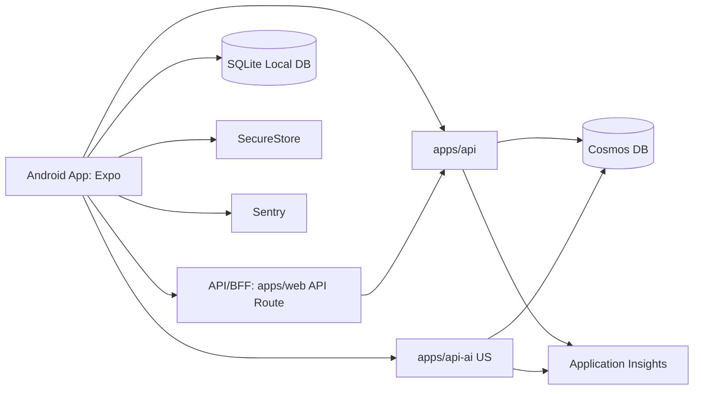

# 基本設計書: Android Google Play 版 (Web機能移植)

## 文書情報
| 項目 | 値 |
|---|---|
| 文書ID | 25_AndroidPlayBasicDesign |
| owner | documentation-steward / frontend-learning-engineer |
| status | Draft（本Compact版が正式版。`25_AndroidPlayBasicDesign.md` はArchived） |
| version | 0.2.0 |
| source | ユーザー要件(2026-06-11)、既存設計書、現行実装構成 |
| updated_at | 2026-06-12 |
| approval_status | PM未承認 |

## 1. 背景・目的
### 1.1 背景
- 現行構成は Web 中心。
- 主要システム:
  - `apps/web` (Next.js 16)
  - `apps/api` (Azure Functions)
  - `apps/api-ai` (Azure Functions, US)
  - Cosmos DB
  - NextAuth (GitHub/Google)
- 事業要請:
  - Android Google Play 版を先行提供。
  - Web 全機能を段階移植。
  - オフライン学習履歴を次回接続時に同期。

### 1.2 目的
- Android で Web 同等の主要学習体験を実現する。
- OAuth(GitHub/Google)+ゲストを一貫提供する。
- クローズドβで品質を収束し一般公開へ移行する。
- 1名開発でも運用可能な保守コストに抑える。
- 将来 iOS 展開可能なアーキテクチャを採用する。

## 2. スコープ/非スコープ
### 2.1 スコープ
- Android 向けモバイルアプリ新設 (Expo)。
- Web 機能移植:
  - 認証/ゲスト
  - ダッシュボード
  - 学習計画
  - 午前/午後演習
  - 学習履歴
  - AI 採点結果閲覧
- オフライン保存 + 再接続同期。
- Google Play クローズドβ配布と一般公開。

### 2.2 非スコープ
- iOS 本番配布 (設計考慮のみ)。
- 管理者機能の全面移植。
- オフライン時 AI 採点実行。
- 課金/サブスク導入。

## 3. アーキテクチャ
### 3.1 システム構成


### 3.2 アプリ内レイヤー
- `presentation`: 画面、ナビゲーション、表示状態。
- `application`: ユースケース、同期制御、リトライ制御。
- `domain`: 学習履歴イベント、採点結果、業務ルール。
- `infrastructure`: API、SQLite、SecureStore、Telemetry。

### 3.3 推奨ディレクトリ
```text
apps/mobile/
  app/                    # expo-router routes
    (auth)/
    (main)/
  src/
    presentation/
      screens/
      components/
      hooks/
    application/
      usecases/
      services/
    domain/
      models/
      policies/
    infrastructure/
      api/
      db/
      auth/
      sync/
      telemetry/
    store/                # zustand
    query/                # TanStack Query
    constants/
    types/
  assets/
  app.json
  eas.json
packages/shared/
  src/mobile/             # mobile/web 共通型
```

## 4. 認証設計
### 4.1 方針
- OAuth:
  - Google
  - GitHub
- 非ログイン利用:
  - ゲスト ID で利用可能。
- 実装:
  - `expo-auth-session` で認可。
  - `expo-secure-store` で機密情報保管。
  - サーバー側でモバイルトークン交換 API を提供。

### 4.2 セッション
- Access Token TTL: 15分（メモリ保持、SecureStore へ保存しない）。
- Refresh Token TTL: 絶対30日・無操作14日（SecureStore 保持）。
- Refresh Token はローテーションし、再利用検知時は token family を全失効する。
- 401 応答時は1回のみ自動 refresh（single-flight）。
- refresh 失敗時はログイン画面へ遷移。

> Token 仕様の詳細は `26_AndroidPlayDetailedDesign.md` §5.2 を正とする。

### 4.3 ゲスト統合
- ゲスト時は `guest_id` を端末保存。
- ログイン成功後にゲスト履歴をユーザー履歴へ統合。

## 5. オフライン同期設計
### 5.1 ローカル保存
- DB: `expo-sqlite` + `drizzle`。
- 主テーブル:
  - `learning_events` (追記専用)
  - `sync_queue` (未同期)
  - `content_cache`

### 5.2 同期トリガー
- アプリ起動時。
- ネットワーク復帰時。
- 履歴画面表示時。
- 手動同期時。

### 5.3 同期方式
- Outbox パターン採用。
- 手順:
  1. 操作を `learning_events` に記録。
  2. `sync_queue` に積む。
  3. バッチ送信 (最大50件)。
  4. ACK 後にキュー削除。

### 5.4 競合解決
- 冪等キー: `event_id` (UUID)。
- 同一 `event_id` は重複登録しない。
- 同一問題への複数回答は `answered_at` 新しい方を有効値とする。

### 5.5 再試行
- Backoff: 2s, 4s, 8s, 16s, 最大60s。
- 最大8回。
- 超過時は保留し UI に件数表示。

## 6. API設計方針（流用/新設）
### 6.1 流用
- 既存 API を原則流用:
  - 学習履歴
  - 学習計画
  - 問題データ
  - AI 採点

### 6.2 新設
- `POST /api/mobile/v1/auth/exchange`
  - OAuth 結果をモバイルセッションへ交換。
- `POST /api/mobile/v1/sync/batch`
  - 履歴イベント一括同期。
- `GET /api/mobile/v1/bootstrap`
  - 起動時に必要な初期データ取得。
- `POST /api/mobile/v1/telemetry/client-errors`
  - 重大クライアント障害を補助送信。

### 6.3 契約原則
- 同期 API は冪等必須。
- モバイル API は `/mobile/v1` で分離。
- エラー応答に `retryable` を付与。

## 7. データ配信・キャッシュ設計
### 7.1 キャッシュ階層
- L1: メモリ (zustand / Query cache)
- L2: SQLite
- L3: API/Cosmos

### 7.2 配信戦略
- 問題データ: 日次差分更新 (`content_version`)。
- 学習履歴: 最新30日優先 pull。
- 全件再同期: 手動操作時のみ。

### 7.3 キャッシュ失効
- ログアウト時: トークン/個人キャッシュ削除。
- ゲスト統合後: ゲスト領域を統合済みに更新。

## 8. 非機能要件（性能/セキュリティ/可観測性/障害時動作）
### 8.1 性能
- 初回ウォーム起動: 3秒以内目標。
- 主要画面遷移: 1秒以内目標(キャッシュヒット時)。
- 同期50件: 2秒以内目標(通常回線)。

### 8.2 セキュリティ
- 機密情報は SecureStore 保存。
- 通信は HTTPS/TLS1.2+。
- PII をログ送信しない。
- ログアウト時にサーバートークン失効を実行。

### 8.3 可観測性
- モバイル: Sentry で crash/ANR/重要例外収集。
- サーバー: App Insights で latency/error/sync件数を収集。
- 相関キー:
  - `x-correlation-id`
  - 匿名化 `user_id`
  - ハッシュ化 `device_id`

### 8.4 障害時動作
- API 障害時: ローカル学習継続、同期は保留。
- AI 障害時: 採点停止 + 再試行導線表示。
- 認証障害時: ゲスト利用を許可。

## 9. 環境・CI/CD・Play配布
### 9.1 環境
- `dev`: 開発端末 + staging API
- `beta`: Play internal/closed track
- `prod`: Play production

### 9.2 CI/CD
- GitHub Actions:
  - lint/test/build
  - EAS Build 実行
  - 署名/設定検証
- EAS Profiles:
  - `preview`: β配布
  - `production`: 本番配布

### 9.3 Play 配布方針
- クローズドβで段階公開。
- 一般公開ゲート:
  - Crash-free 99.5%以上
  - 同期成功率 99.5%以上
  - 重大障害ゼロを2週間継続

## 10. フェーズ計画と品質ゲート
### 10.1 フェーズ
- Phase 0: 要件確定/機能棚卸し。
- Phase 1: モバイル基盤 (認証/ルーティング/状態管理)。
- Phase 2: 学習機能移植。
- Phase 3: オフライン同期。
- Phase 4: クローズドβ運用。
- Phase 5: 一般公開。

### 10.2 品質ゲート
- Gate A:
  - OAuth/Guest ログイン成功
  - セッション再開成功
- Gate B:
  - 主要機能移植率 80%以上
  - 主要シナリオ E2E パス
- Gate C:
  - オフライン→再接続同期 成功率100%(検証ケース)
- Gate D:
  - β KPI 達成
  - セキュリティレビュー完了

## 11. 技術リスクTop10と軽減策
1. OAuth redirect 設定不整合。
   - 軽減: 環境別 URI 自動検証。
2. オフラインキュー肥大化。
   - 軽減: 上限管理/圧縮。
3. 同期重複登録。
   - 軽減: `event_id` 冪等制御。
4. API payload 過大で遅延。
   - 軽減: モバイル専用軽量 endpoint。
5. 1名開発で保守負荷増。
   - 軽減: 機能フラグで段階リリース。
6. AI US リージョン遅延。
   - 軽減: タイムアウト/再試行/UI通知。
7. 端末差異で不具合。
   - 軽減: β で端末マトリクス検証。
8. SecureStore 不整合で再ログイン増。
   - 軽減: 再認証導線短縮、監視追加。
9. Play 審査差戻し。
   - 軽減: Data Safety/Privacy 事前整備。
10. iOS 展開時の再設計コスト増。
   - 軽減: platform adapter 層分離。

## 12. ADR（8項目以上）
### ADR-01: Expo 採用
- 理由: 1名開発で開発速度と配布運用性を優先。
- 影響: ネイティブ拡張は EAS prebuild 前提。

### ADR-02: expo-router 採用
- 理由: ファイルベースで Web と認知モデルを揃える。
- 影響: ルート命名規約を固定する。

### ADR-03: zustand 採用
- 理由: 小規模状態管理を低コストで実装可能。
- 影響: グローバル状態は最小化する。

### ADR-04: TanStack Query 採用
- 理由: サーバー状態の再取得/失効/再試行を標準化。
- 影響: query key 規約を導入する。

### ADR-05: expo-sqlite + drizzle 採用
- 理由: オフライン同期に構造化永続化が必要。
- 影響: DB マイグレーション手順を運用化。

### ADR-06: Outbox 同期方式
- 理由: 断続接続での一貫性確保。
- 影響: 全イベントに冪等 ID を付与。

### ADR-07: SecureStore で機密保持
- 理由: OS セキュア領域利用で漏えいリスク低減。
- 影響: 端末異常時の再認証 UX を明示。

### ADR-08: Sentry + App Insights 併用
- 理由: クライアント/サーバー障害を横断把握。
- 影響: 相関 ID を全経路で伝搬。

### ADR-09: Android 先行・iOS 後続
- 理由: 初期投資最小化と早期検証。
- 影響: プラットフォーム依存処理を分離実装。

### ADR-10: β期間は機能フラグ運用
- 理由: 重大障害時の即時切戻し。
- 影響: フラグ管理台帳を別途運用。

## 13. PM承認チェックリスト
- [ ] 背景と目的が事業方針に整合する。
- [ ] スコープ/非スコープが明確。
- [ ] Web 全機能移植の優先順が妥当。
- [ ] OAuth/Guest 設計が実装可能。
- [ ] オフライン同期の競合解決が妥当。
- [ ] API 流用/新設境界が妥当。
- [ ] 非機�