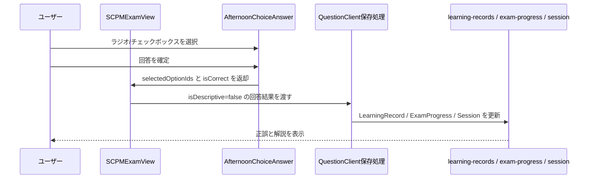

# 午後選択式・短答式小問の採点対応 修正計画書

## 変更履歴

| 日付 | 内容 |
|------|------|
| 2026-05-08 | 本文抜き出し・名称回答などの短答式小問を対象に追加 |
| 2026-05-08 | 初版作成。午後問題内の選択式小問を午前問題相当の採点UIへ分離する計画を定義 |

## 1. 目的

本計画書は、AP午後問題などの `context` 付き午後問題に含まれる選択式・短答式小問を、記述式AI採点ではなく午前問題と同等の正誤採点として扱うための修正方針を定義する。

対象となる代表事象は、次のページで確認された。

| 項目 | 内容 |
|------|------|
| 環境 | Staging |
| URL | `https://app-pm-exam-dx-staging.azurewebsites.net/exam/AP-2025-Spring-PM/PM/1?mode=practice&sessionId=996cedb2-0339-4f33-9c40-e916578616a0` |
| examId | `AP-2025-Spring-PM` |
| 問題 | 問1 |
| 事象 | 「解答群の中から選び、記号で答えよ」の小問や、本文抜き出し・名称回答系の短答小問が記述式扱いとなり、800文字相当の入力欄が表示される可能性がある |

## 2. 現状の問題

現在の午後問題表示では、`SCPMExamView` が `context` を持つ問題を新形式ケース問題として表示し、配下の `questions[]` / `subQuestions[]` を解答欄として扱う。ところが、午後問題には次のように複数の回答形式が混在する。

| 回答形式 | 例 | 本来のUI | 本来の採点 |
|------|------|------|------|
| 択一選択 | `解答群の中から選び、記号で答えよ` | ラジオボタン | 正答記号との一致 |
| 複数選択 | `該当するものを全て選び、記号で答えよ` | チェックボックス | 正答集合との一致 |
| 短答 | `25字以内で答えよ`、`本文中の字句を用いて答えよ`、`名称で答えよ`、`アルファベット3字で答えよ` | 短いテキスト入力 | 公式解答との一致、または表記ゆれ正規化後の一致 |
| 記述 | `800文字以内で述べよ` | 原稿用紙入力 | AI採点 |

現状はこれらを十分に分類していないため、選択式小問も短答式小問も `AIAnswerBox` に流れ、AI採点ボタンと原稿用紙入力が表示される。特に字数制限を抽出できない短答式小問は、原稿用紙入力の既定値により800文字相当の入力欄になる可能性がある。入力欄の種類だけを `textarea` に変える局所修正では、選択式・短答式として採点できないため不十分である。

## 3. 要件

### 3.1 機能要件

1. 午後問題内の選択式小問は、AI採点ではなく午前問題と同等の正誤採点を行う。
2. 択一選択式はラジオボタンで表示する。
3. 複数選択式はチェックボックスで表示する。
4. 本文抜き出し、名称回答、アルファベット数文字回答などの短答式小問は、原稿用紙入力ではなく短答用テキスト入力で表示する。
5. 短答式小問は、公式解答との完全一致または正規化一致で採点する。
6. 選択肢は、問題文または解答群データから構造化して表示する。
7. 正答は `answers_raw.json` または同期済みデータから取得し、表示中の回答欄IDと結び付ける。
8. 選択式・短答式小問にはAI採点ボタン、原稿用紙入力、AIフィードバック、レーダーチャートを表示しない。
9. 同一大問内で選択式、短答式、記述式が混在しても、それぞれ適切なUIと採点経路を使う。
10. 選択式・短答式の採点結果は、午前問題と同じく `isDescriptive: false` の学習記録として保存する。
11. 記述式の既存AI採点、下書き保存、セッション進捗保存は維持する。
12. ゲスト利用時も、選択式・短答式の回答履歴が午前問題相当の形式で保存される。

### 3.2 非機能要件

1. 問題文の自然文だけに依存した判定は最小限にし、可能な限り変換済みデータへ回答欄構造を持たせる。
2. 公式解答と対応できない小問は、推測採点せず未採点または要データ補正として扱う。
3. 既存の午前問題UI・採点ロジックを再利用できる箇所は再利用する。
4. データ補正、UI変更、採点保存変更を同一PRで追跡可能にする。

## 4. 対象範囲

### 4.1 対象

| 領域 | 対象 |
|------|------|
| データ | `packages/data/data/questions/*/questions_transformed.json`、`answers_raw.json` |
| 変換 | 午後問題の小問・空欄・解答群・短答欄・正答キーを `answerFields` として正規化する処理 |
| UI | `SCPMExamView`、午後用回答欄コンポーネント |
| 採点 | 選択式・短答式を午前問題相当の正誤採点へ分岐 |
| 保存 | `LearningRecord`、`ExamProgress`、`LearningSession`、ゲスト履歴 |
| テスト | 分類ユーティリティ、データ正規化、UI、採点保存、E2E |
| Docs | PM練習・採点設計、試験データ品質計画、E2E証跡報告 |

### 4.2 対象外

| 項目 | 理由 |
|------|------|
| 公式解答が存在しない小問のAI推測採点 | 正誤判定の根拠がなく、学習記録の信頼性を損なうため |
| 既存午前問題UIの全面刷新 | 本件は午後内選択式の扱いが主目的であるため |
| 全午後試験データの一括完全補正 | まず AP-2025-Spring-PM 問1 を代表ケースとして確立し、横展開する |

## 5. 基本設計

### 5.1 回答欄モデル

午後問題の小問を、画面描画前に `answerFields` へ正規化する。

```typescript
type AfternoonAnswerMode = 'single-choice' | 'multiple-choice' | 'short-text' | 'descriptive';

interface AfternoonAnswerField {
  id: string;
  label: string;
  mode: AfternoonAnswerMode;
  prompt: string;
  options?: Array<{
    id: string;
    label: string;
    text: string;
  }>;
  correctOptionIds?: string[];
  correctText?: string;
  acceptableTexts?: string[];
  limit?: number;
  explanation?: string;
  point?: number;
}
```

設計上の要点:

- `single-choice` は `correctOptionIds.length === 1` を期待する。
- `multiple-choice` は `correctOptionIds.length >= 1` を集合として扱う。
- `short-text` は本文抜き出し、名称回答、アルファベット数文字回答を含め、公式解答と正規化一致できる場合のみ自動採点する。
- `descriptive` のみ `AIAnswerBox` に流す。

### 5.2 回答形式判定

回答形式は、データ構造を優先し、構造がない場合のみ文言判定を補助的に使う。

| 優先度 | 判定材料 | 内容 |
|------:|------|------|
| 1 | `answerFields[].mode` | 変換済みデータに明示された回答形式 |
| 2 | `options` と正答数 | 選択肢があり、正答が1つなら `single-choice`、複数なら `multiple-choice` |
| 3 | 問題文 | `解答群`、`記号で答えよ`、`番号で答えよ`、`全て選び`、`二つ選び` 等 |
| 4 | 短答指示 | `本文中の字句を用いて`、`本文中から抜き出して`、`名称で答えよ`、`アルファベットn字で答えよ` 等は `short-text` |
| 5 | 字数制限 | `n字以内` は、短い上限なら `short-text`、長文上限なら `descriptive` |
| 6 | 記述指示 | `述べよ`、`説明せよ`、`理由を述べよ` は `descriptive` |

文言判定は初期移行用であり、最終的にはデータ変換で `answerFields` を生成する。

### 5.3 選択肢UI

| mode | UI | 操作 | 採点タイミング |
|------|------|------|------|
| `single-choice` | ラジオボタン | 1項目だけ選択 | 回答確定ボタン、または既存午前問題と同じタイミング |
| `multiple-choice` | チェックボックス | 複数項目を選択 | 回答確定ボタン |
| `short-text` | 1行または短い複数行入力 | テキスト入力 | 公式解答一致または正規化一致が可能な場合のみ自動採点 |
| `descriptive` | 原稿用紙入力 | 長文入力 | AI採点ボタン |

複数選択の正誤判定は、順序を無視した集合一致とする。

```typescript
isCorrect = selectedIds.length === correctIds.length
  && selectedIds.every(id => correctIds.includes(id));
```

短答式の正誤判定は、初期実装では公式解答との正規化一致とする。正規化では、前後空白、全角半角、英字大文字小文字、不要な句読点の差分を吸収する。意味的同値まで判定するAI採点は本計画の初期対象外とし、必要な場合は別計画で扱う。

### 5.4 採点・保存フロー

選択式・短答式午後小問は `/api/score` を呼び出さない。午前問題と同じ正誤レコードとして保存する。



保存レコードの方針:

| フィールド | 選択式・短答式午後小問 |
|------|------|
| `questionId` | `answerField.id` |
| `examId` | 親問題の `examId` |
| `category` | 親問題の `category` |
| `isDescriptive` | `false` |
| `userAnswer` | 選択した記号、または短答入力文字列を保存 |
| `selectedOptionId` / `selectedOptionIds` | 選択式で既存型拡張が必要なら追加検討 |
| `isCorrect` | 正答集合との一致結果 |
| `aiScore` | 保存しない |
| `aiFeedback` | 保存しない |
| `aiRadarData` | 保存しない |

## 6. 実装計画

### Phase 0: 受付・影響評価

| 項目 | 内容 |
|------|------|
| 依頼種別 | バグ修正 + 機能補完 |
| 影響領域 | UI、試験データ、採点、保存、Docs、Test |
| 主担当 | `project-manager` 受付後、`solution-architect`、`backend-data-engineer`、`frontend-learning-engineer`、`qa-evidence-engineer` |
| 承認ゲート | データ正規化方針と採点保存方針のGo判定 |

### Phase 1: データ調査

1. `AP-2025-Spring-PM/questions_transformed.json` の問1を確認する。
2. `AP-2025-Spring-PM/answers_raw.json` のキー形式を確認する。
3. 問題文中の `[a] [b] [c]`、下線番号、短答欄と `answers_raw.json` の `1-*-*` キーを対応付ける。
4. 解答群がどこに存在するかを確認する。問題本文、図表、表、raw PDF抽出結果のいずれかを対象とする。
5. 本文抜き出し・名称回答・アルファベット回答の短答式パターンを確認する。
6. 同一パターンが AP 他年度、SC午後、FE午後に存在するかをサンプリングする。

成果物:

- 対象問題の `answerFields` 生成ルール
- 未対応データ、曖昧データ、手動補正が必要なデータの一覧

### Phase 2: データモデル・変換設計

1. `answerFields` の型を定義する。
2. 既存 `questions_transformed.json` に後方互換で追加できる形にする。
3. `answers_raw.json` のキー形式を正規化するユーティリティを作る。
4. 短答式の正答文字列を `correctText` または `acceptableTexts` として保持できるようにする。
5. 正答キーと空欄ラベルの対応が取れない場合は、UIで推測採点せず、データ品質エラーとして検出できるようにする。
6. self-inspect またはデータ監査に、午後選択式・短答式小問の `answerFields` 欠落を検出するルールを追加する。

### Phase 3: UI設計

1. `AfternoonChoiceAnswer` コンポーネントを追加する。
2. `single-choice` はラジオボタンで表示する。
3. `multiple-choice` はチェックボックスで表示する。
4. `AfternoonShortTextAnswer` コンポーネントを追加する。
5. `short-text` は短い入力欄で表示し、字数上限がある場合は `maxLength` とカウンタを表示する。
6. 選択肢には記号と本文を表示する。
7. 回答確定後、正誤、正答、解説を表示する。
8. 選択式・短答式小問には `AIAnswerBox` を描画しない。
9. 記述式小問は既存 `AIAnswerBox` を維持する。

### Phase 4: 採点・保存実装

1. 午前問題の正誤判定ロジックを確認し、午後選択式用に共通化できる部分を抽出する。
2. 短答式の正規化一致ロジックを追加する。
3. `SCPMExamView` から選択式・短答式回答結果を `QuestionClient` へ返す経路を追加する。
4. `LearningRecord` を `isDescriptive: false` として保存する。
5. `ExamProgress` と `LearningSession` の進捗を午前問題と同じ意味で更新する。
6. ゲスト履歴も同じ粒度で保存する。
7. 複数選択は選択順に依存しない集合一致で判定する。

### Phase 5: テスト

| 種別 | 対象 | 期待結果 |
|------|------|------|
| Unit | 回答形式分類 | 選択式、複数選択、短答、記述を分類できる |
| Unit | `answers_raw.json` 正規化 | `1-2-a` のようなキーから `answerField.id` を生成できる |
| Unit | 選択式採点 | 択一、複数選択、未選択、不正解を判定できる |
| Unit | 短答式採点 | 本文抜き出し、名称回答、アルファベット回答を正規化一致で判定できる |
| Component | `SCPMExamView` | 選択式はラジオ/チェックボックス、記述式はAIAnswerBoxを描画する |
| Component | `AfternoonChoiceAnswer` | 正答・不正解・複数選択のUI状態が正しい |
| Component | `AfternoonShortTextAnswer` | 短答入力、字数上限、正誤表示が正しい |
| Integration | 保存処理 | 選択式午後小問が `isDescriptive: false` で保存される |
| Integration | 保存処理 | 短答式午後小問が `isDescriptive: false` で保存される |
| E2E | AP-2025-Spring-PM 問1 | 800字原稿用紙が出ず、選択式・短答式として採点できる |

E2Eを実行した場合は、リポジトリルールに従い `docs/04_reports/E2E_Test_Evidence_Report_{YYYYMMDD}.md` と `apps/web/e2e/evidence/` のスクリーンショットを作成・追跡対象に含める。

### Phase 6: 受入・出荷判定

受入条件:

- AP-2025-Spring-PM 問1で、選択式・短答式小問にAI採点ボタンが表示されない。
- 択一選択式はラジオボタンで回答できる。
- 複数選択式はチェックボックスで回答できる。
- 本文抜き出し・名称回答などの短答式は短い入力欄で回答でき、800字原稿用紙にならない。
- 選択式・短答式小問が午前問題相当の正誤判定で採点される。
- 正答・解説が表示される。
- 選択式・短答式の学習記録は `isDescriptive: false` で保存される。
- 記述式小問のAI採点はデグレしていない。
- `npm run test:unit` または対象unitが成功する。
- `node scripts/guard-exam-data-fallback.mjs` が成功する。
- self-inspect が成功する。
- UI変更に必要なE2E evidenceが作成される。

## 7. リスクと対策

| リスク | 影響 | 対策 |
|------|------|------|
| 解答群が構造化されていない | ラジオ/チェックボックスを生成できない | 初期対象をAP-2025-Spring-PM問1に限定し、抽出規則を確立する |
| `answers_raw.json` のキー形式が試験ごとに異なる | 正答と回答欄が対応しない | 正答キー正規化ユーティリティを作り、監査で欠落を検出する |
| 複数選択の指示文が多様 | 単一/複数の誤判定 | 正答数と文言の両方で判定し、矛盾時はデータ品質エラーにする |
| 本文抜き出し・名称回答に字数制限がない | 800字原稿用紙にフォールバックする | `本文中の字句を用いて`、`名称で答えよ`、`アルファベットn字で答えよ` を `short-text` として分類する |
| 短答の表記ゆれが多い | 正答なのに不正解になる | 全角半角、大小文字、空白、句読点を正規化し、必要に応じて `acceptableTexts` を持つ |
| 午前問題保存処理と午後選択式保存処理が分岐しすぎる | 進捗・履歴が壊れる | 午前問題の保存モデルに寄せ、共通関数化する |
| 記述式まで選択式扱いになる | AI採点が使えなくなる | `descriptive` 判定をunit testで固定し、サンプル午後問題で回帰確認する |

## 8. 実装前の確認事項

実装着手前に、次を確定する。

1. `answerFields` を静的JSONへ永続化するか、アプリ起動時に正規化するか。
2. `LearningRecord` に `selectedOptionIds` を追加するか、既存 `userAnswer` に保存するか。
3. 短答式の `acceptableTexts` をデータへ持たせるか、正答文字列1つだけで開始するか。
4. 複数選択の部分点を認めるか、完全一致のみとするか。初期案は完全一致。
5. 正答未接続の選択式・短答式小問を表示だけ許可するか、データ品質エラーとして修正対象にするか。
6. AP-2025-Spring-PM 問1以外へ同一PRで横展開する範囲。

## 9. 暫定修正の扱い

現在の「選択式文言なら原稿用紙入力を避ける」ようなUIレベルの局所回避は、本計画の最終解ではない。正式修正では、午後小問の回答形式を `answerFields` として構造化し、選択式はラジオボタンまたはチェックボックス、短答式は短いテキスト入力で描画し、午前問題相当の正誤採点と保存経路へ接続する。