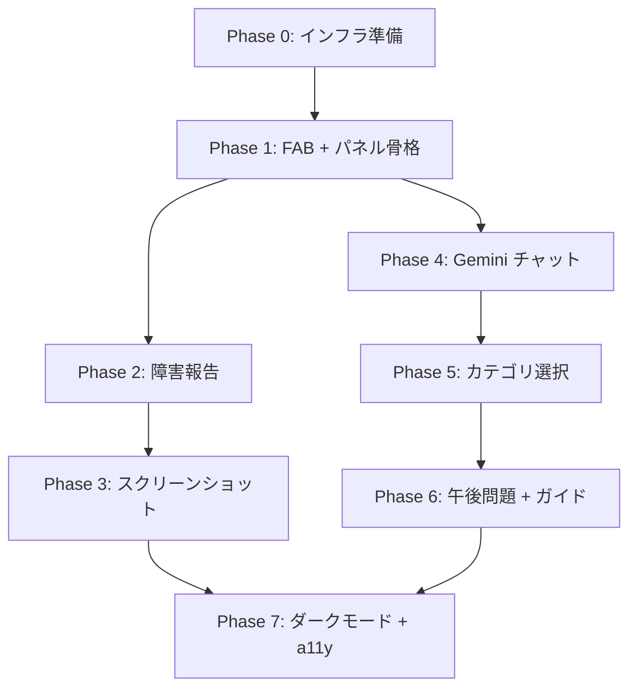

# AIアシスタント機能 実装計画書

## 1. 概要

shikaku-no.com に Intercom/Zendesk スタイルのフローティングチャットウィジェットを追加し、
障害報告（GitHub Issues 自動起票）と学習Q&A（Gemini API 回答生成）を提供する。

### 作成日

2026-04-14

### 関連ドキュメント

| ドキュメント | パス |
|------------|------|
| 要件定義（追補） | `docs/01_planning/AIアシスタント要件定義書.md` |
| 詳細設計 | `docs/02_design/18_AiAssistantDesign.md` |
| フィーチャーフラグ設計 | `docs/02_design/09_AdminAndFeatureFlagsDesign.md` |
| 共通 API 設計 | `docs/02_design/15_CommonApiAndErrorDesign.md` |

---

## 2. Phase 定義

### Phase 0: インフラ準備

| # | タスク | 成果物 | 見積 |
|---|-------|--------|------|
| 0-1 | CosmosDB コンテナ作成（`AiAssistantUsage`, `BugReports`） | Azure CLI スクリプト | S |
| 0-2 | フィーチャーフラグ追加（`ai_assistant_enabled`） | `lib/feature-flags.ts` 更新 | S |
| 0-3 | 環境変数追加（`GITHUB_ISSUES_TOKEN`） | `.env.template`, App Service 設定 | S |
| 0-4 | `html2canvas` パッケージ追加 | `package.json` | S |
| 0-5 | `octokit` パッケージ追加 | `package.json` | S |

### Phase 1: FAB + パネル骨格

| # | タスク | 成果物 | 見積 |
|---|-------|--------|------|
| 1-1 | `FloatingButton` コンポーネント作成 | `components/features/ai-assistant/FloatingButton.tsx` | S |
| 1-2 | `AssistantPanel` コンポーネント作成 | `components/features/ai-assistant/AssistantPanel.tsx` | M |
| 1-3 | `InitialMenu` コンポーネント作成 | `components/features/ai-assistant/InitialMenu.tsx` | S |
| 1-4 | `AiAssistantWidget` エントリポイント作成 | `components/features/ai-assistant/AiAssistantWidget.tsx` | M |
| 1-5 | CSS Modules 作成 | `components/features/ai-assistant/ai-assistant.module.css` | M |
| 1-6 | `use-ai-assistant` hook 作成 | `hooks/use-ai-assistant.ts` | M |
| 1-7 | Root Layout 統合 | `app/layout.tsx` 修正 | S |
| 1-8 | フィーチャーフラグ連携 | 条件付きレンダリング | S |

### Phase 2: 障害報告フォーム + GitHub Issues 連携

| # | タスク | 成果物 | 見積 |
|---|-------|--------|------|
| 2-1 | `BugReportForm` コンポーネント作成 | `components/features/ai-assistant/BugReportForm.tsx` | M |
| 2-2 | `github-issues.ts` ライブラリ作成 | `lib/ai-assistant/github-issues.ts` | M |
| 2-3 | `POST /api/ai-assistant/bug-report` Route Handler 作成 | `app/api/ai-assistant/bug-report/route.ts` | M |
| 2-4 | 自動情報収集（URL, UA, エラーログ） | `BugReportForm` 内 | S |
| 2-5 | ユニットテスト | `__tests__/api/ai-assistant/bug-report.test.ts` | M |

### Phase 3: スクリーンショット + DOM マスキング

| # | タスク | 成果物 | 見積 |
|---|-------|--------|------|
| 3-1 | `screenshot-masker.ts` ライブラリ作成 | `lib/ai-assistant/screenshot-masker.ts` | M |
| 3-2 | `ScreenshotCapture` コンポーネント作成 | `components/features/ai-assistant/ScreenshotCapture.tsx` | M |
| 3-3 | プレビュー UI 作成 | `ScreenshotCapture` 内 | S |
| 3-4 | Azure Blob Storage アップロード処理 | `lib/ai-assistant/blob-upload.ts` | M |
| 3-5 | `BugReportForm` にスクリーンショット統合 | 既存修正 | S |

### Phase 4: Gemini チャット + レート制限

| # | タスク | 成果物 | 見積 |
|---|-------|--------|------|
| 4-1 | `gemini-chat.ts` ライブラリ作成 | `lib/ai-assistant/gemini-chat.ts` | M |
| 4-2 | `context-builder.ts` プロンプト構築 | `lib/ai-assistant/context-builder.ts` | M |
| 4-3 | `rate-limiter.ts` レート制限ロジック | `lib/ai-assistant/rate-limiter.ts` | S |
| 4-4 | `POST /api/ai-assistant/chat` Route Handler 作成（SSE ストリーミング） | `app/api/ai-assistant/chat/route.ts` | L |
| 4-5 | `GET /api/ai-assistant/usage` Route Handler 作成 | `app/api/ai-assistant/usage/route.ts` | S |
| 4-6 | `ChatView` コンポーネント作成 | `components/features/ai-assistant/ChatView.tsx` | L |
| 4-7 | `ChatMessage` コンポーネント作成 | `components/features/ai-assistant/ChatMessage.tsx` | S |
| 4-8 | `RateLimitBadge` コンポーネント作成 | `components/features/ai-assistant/RateLimitBadge.tsx` | S |
| 4-9 | ユニットテスト | `__tests__/api/ai-assistant/chat.test.ts` | M |

### Phase 5: カテゴリ選択 + 問題コンテキスト注入

| # | タスク | 成果物 | 見積 |
|---|-------|--------|------|
| 5-1 | `CategorySelector` コンポーネント作成 | `components/features/ai-assistant/CategorySelector.tsx` | M |
| 5-2 | 演習画面コンテキスト注入（QuestionClient 連携） | `use-ai-assistant.ts` 拡張 | M |
| 5-3 | カテゴリ別プロンプト調整 | `context-builder.ts` 拡張 | M |

### Phase 6: 午後問題対応 + サイトガイド

| # | タスク | 成果物 | 見積 |
|---|-------|--------|------|
| 6-1 | 午後問題コンテキスト対応 | `context-builder.ts` 拡張 | M |
| 6-2 | サイトガイドモード実装 | `context-builder.ts` + UI 分岐 | M |
| 6-3 | US Functions プロキシ検討（Gemini 地域制限） | 調査・判断 | S |

### Phase 7: ダークモード + モバイル + a11y

| # | タスク | 成果物 | 見積 |
|---|-------|--------|------|
| 7-1 | `data-theme` 連動 CSS 変数対応 | `ai-assistant.module.css` | M |
| 7-2 | モバイルレスポンシブ（SP 全画面展開） | CSS Modules | M |
| 7-3 | キーボードナビゲーション + ARIA 属性 | 全コンポーネント | M |
| 7-4 | スクリーンリーダー対応 | 全コンポーネント | S |
| 7-5 | E2E テスト作成 | `e2e/ai-assistant.spec.ts` | L |

---

## 3. 見積基準

| サイズ | 目安行数 | 説明 |
|--------|---------|------|
| S | ~50行 | 設定変更、小コンポーネント |
| M | 50~200行 | 標準コンポーネント、API Route |
| L | 200~500行 | ストリーミング処理、複雑UI |

---

## 4. 依存関係グラフ



---

## 5. ブランチ戦略

```
main
 └── feature/ai-assistant
      ├── feature/ai-assistant-p0-infra
      ├── feature/ai-assistant-p1-fab
      ├── feature/ai-assistant-p2-bug-report
      ├── feature/ai-assistant-p3-screenshot
      ├── feature/ai-assistant-p4-chat
      ├── feature/ai-assistant-p5-category
      ├── feature/ai-assistant-p6-afternoon
      └── feature/ai-assistant-p7-polish
```

Phase ごとに `feature/ai-assistant` へマージし、全 Phase 完了後に `main` へ PR を作成する。

---

## 6. テスト戦略

| レイヤー | ツール | 対象 |
|---------|--------|------|
| Unit | Vitest | API Route Handler, ライブラリ関数 |
| Component | Vitest + Testing Library | React コンポーネント |
| E2E | Playwright | ウィジェット操作フロー |
| Manual | ブラウザ | スクリーンショット、ダークモード、モバイル |

---

## 7. リスクと対策

| リスク | 影響 | 対策 |
|--------|------|------|
| Gemini API 地域制限 | チャット応答不可 | 既存 US Functions プロキシ経由にフォールバック |
| html2canvas レンダリング不整合 | スクリーンショット品質低下 | 代替ライブラリ（dom-to-image-more）の検討 |
| コスト超過（Gemini API） | 運用費増加 | 1日10回制限 + feature flag で即時停止可能 |
| CosmosDB RU 消費増 | パフォーマンス低下 | 使用状況クエリに TTL インデックスを設定 |
| GitHub Issues スパム | Issue 品質低下 | 認証必須 + 1日5件制限 + ラベル自動付与 |

---

## 8. 段階的リリース計画

| Step | 内容 | フィーチャーフラグ |
|------|------|-----------------|
| 1 | 管理者のみ有効化（内部テスト） | `ai_assistant_enabled: false` + 管理者ロール判定 |
| 2 | Staging 環境でテスト | Staging 環境で `enabled: true` |
| 3 | 本番 10% ロールアウト | CosmosDB でユーザーIDハッシュ判定 |
| 4 | 全ユーザーリリース | `ai_assistant_enabled: true` |
