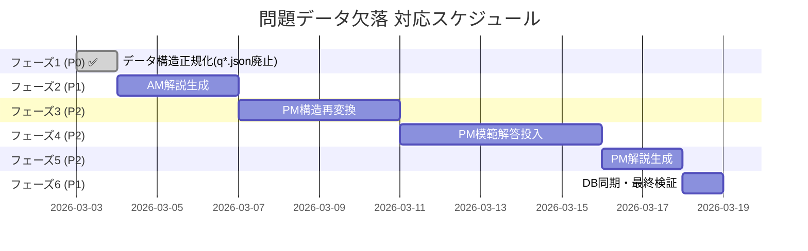

# 問題データ欠落 対応計画書

## 変更履歴

| 日付 | 内容 |
|------|------|
| 2026-03-03 | 初版作成（網羅的調査に基づく対応計画） |
| 2026-03-03 | q*.json 廃止方針を決定。データ構造を `questions_raw.json` / `questions_transformed.json` に一本化。フェーズ1を「データ構造正規化」に改訂。解説網羅率100%を品質目標に設定 |
| 2026-03-03 | データファイル形式・データフロー・アプリ読み込み仕様をセクション1.1〜1.3として追記。PM品質指標を修正（問題抽出は100%達成済み） |

---

## 1. 調査結果サマリー

2026年3月2日に実施した全174ディレクトリ・7試験区分の網羅的調査結果。

| 項目 | 値 |
|------|------|
| 総ディレクトリ数 | 174 |
| 問題のあるディレクトリ数 | 166 (95.4%) |
| 完全正常なディレクトリ数 | 1 (SC-2024-Spring-PM のみ) |
| 総Issue数 | 1,774件 |

### Issue種別 件数

| 種別 | 件数 | 説明 |
|------|------|------|
| `NO_EXPLANATION` | 881 | 午前問題の解説が空 |
| `PM_SUBQ_NO_ANSWER` | 533 | 午後問題の設問で模範解答が空 |
| `PM_SSQ_NO_ANSWER` | 106 | 午後問題の小問で模範解答が空 |
| `PM_SSQ_NO_EXPLANATION` | 76 | 午後問題の小問で解説が空 |
| ~~`NO_QUESTIONS`~~ | ~~49~~ | ~~個別問題ファイル(q*.json)が未生成~~ → **廃止**: q*.json 方式を廃止。アプリは `questions_raw.json` を直接参照する構成に変更済み |
| `PM_SUBQ_NO_EXPLANATION` | 48 | 午後問題の設問で解説が空 |
| `PM_NO_THEME` / `PM_NO_CONTEXT` | 各36 | 午後問題のテーマ/問題文構造が未設定 |
| `PM_SUBQ_NO_TEXT` / `PM_SSQ_NO_TEXT` | 7 / 2 | 設問テキストが空 |

### 1.1 データファイル形式

問題データは `packages/data/data/questions/{examId}/` 配下に格納される。ファイルは2種類あり、アプリは以下の優先順位で読み込む。

| ファイル | 用途 | 対象 |
|----------|------|------|
| `questions_transformed.json` | **最優先**。PM午後問題の構造化データ（theme/context/設問）を格納 | PM全区分 |
| `questions_raw.json` | フォールバック。AM問題、または未変換PMの生データを格納 | AM全区分、一部PM |

#### questions_transformed.json の形式

PM の `questions_transformed.json` には **2つの形式** が混在している。

| 形式 | 構造 | 該当 | 例 |
|------|------|------|-----|
| **配列形式** | `[ { qNo, theme, context, questions: [...] }, ... ]` | 68ディレクトリ（2016〜2020年代前半） | AP-2016-Fall-PM |
| **オブジェクト形式** | `{ qNo, theme, context, questions: [...] }` | 36ディレクトリ（2019〜2025年） | SC-2024-Fall-PM |

配列形式は大問が複数格納可能な構造だが、実際はほとんどが要素1個。オブジェクト形式は大問1つのみを直接格納する。

#### questions_raw.json の形式

| 形式 | 構造 | 該当 |
|------|------|------|
| **配列形式** | `[ { qNo, question, options, correctOption, explanation }, ... ]` | AM1 (FE/AP/IP) |
| **オブジェクト形式** | `{ questions: [ { qNo, question, options, correctOption, explanation }, ... ] }` | AM2 (PM/SA/SC/ST) |

### 1.2 データフロー

```
IPA公式PDF
  ↓ gemini-extract.ts (Gemini OCR)
questions_raw.json
  ↓ transform-batch-all-pm.ts (PM のみ)
questions_transformed.json（theme/context/設問に構造化）
  ↓ fill-missing-explanations.ts
解説が追加された questions_raw.json / questions_transformed.json
  ↓
  ├─→ SSG (ssg-helper.ts): JSON.parse して返却
  └─→ API (LocalQuestionRepository.ts): 配列/オブジェクト両対応で展開
```

### 1.3 アプリケーション側のデータ読み込み仕様

#### SSG (`apps/web/lib/ssg-helper.ts`)

| 項目 | 内容 |
|------|------|
| 読み込み関数 | `getExamData(examId)` |
| 優先順位 | `questions_transformed.json` → `questions_raw.json` |
| パース方法 | `JSON.parse(fileContent)` の結果を**そのまま返却** |
| 配列/オブジェクト判定 | **なし** — パース結果をそのまま呼び出し元に返す |
| 戻り値型 | `Promise<any[]>`（型アノテーション上は配列だが、実際はオブジェクトも返り得る） |

**注意**: PM の `questions_transformed.json` がオブジェクト形式（`{ qNo, theme, context, questions }`）の場合でも、配列形式（`[ { qNo, theme, context, questions } ]`）の場合でも、パース結果をそのまま返す。呼び出し元のページコンポーネントが両方の形式を処理できる設計になっている。

#### API (`apps/api/src/repositories/LocalQuestionRepository.ts`)

| 項目 | 内容 |
|------|------|
| 読み込み関数 | `listByExamId(examId)` |
| 優先順位 | `questions_transformed.json` → `questions_raw.json` |
| パース後の分岐 | 3パターンで処理 |
| キャッシュ | インメモリ、TTL 10分 |

```
パース後の分岐ロジック:
  配列の場合     → items = json          （AM問題: 配列形式）
  json.questions → items = json.questions （PM問題: オブジェクト形式）
  その他         → items = [json]         （フォールバック）
```

`qNo` または `id` を持つ要素のみを `Question` として結果に追加。`examId`/`id` が未設定の場合は自動付与する。

#### 試験一覧 (`apps/api/src/repositories/LocalExamRepository.ts`)

| 項目 | 内容 |
|------|------|
| 有効判定 | `q1.json`, `questions_transformed.json`, `questions_raw.json` のいずれかが存在すれば有効 |
| メタデータ | ディレクトリ名から category/year/term/type をパース |
| キャッシュ | インメモリ、TTL 5分 |

### 1.4 PM品質指標（2026-03-03時点）

| 指標 | 現状 | 目標 | 不足 |
|------|------|------|------|
| **問題抽出** | ✅ 100% (607問/104 dirs) | 100% | 達成済み |
| **theme/context** | 65.4% (68/104 dirs) | 100% | 36 dirs |
| **正答 (correctOption)** | 43.8% (266/607) | 100% | 341問 |
| **解説 (explanation)** | 81.4% (494/607) | 100% | 113問 |

※ 配列形式の `questions_transformed.json` 内の `questions` を正しく集計した値。当初「66ディレクトリで問題0件」と誤認したのは、配列形式 `[{ questions: [...] }]` の展開漏れが原因。

---

## 2. 対応方針

### 2.1 優先度の考え方

| レベル | 基準 | 影響 |
|--------|------|------|
| P0 (Critical) | 問題が表示できない / データが存在しない | ユーザーが学習不能 |
| P1 (High) | 問題は解けるが解説がない | 学習効果が著しく低下 |
| P2 (Medium) | 模範解答が不足 | 午後問題の自己採点が不可 |
| P3 (Low) | メタ情報の欠落（テーマ、設問テキスト少数） | UX低下、検索性劣化 |

### 2.2 対応の大分類

| # | カテゴリ | Issue種別 | 対応方法 |
|---|----------|-----------|----------|
| ~~A~~ | ~~AM個別ファイル未生成~~ | ~~`NO_QUESTIONS`~~ | **廃止**: q*.json 方式を廃止し、`questions_raw.json` を直接参照する構成に変更 |
| ~~B~~ | ~~AM個別ファイル不完全~~ | ~~1問のみ生成~~ | **廃止**: 同上 |
| C | AM解説欠落 | `NO_EXPLANATION` | `fill-missing-explanations.ts` で生成（**目標: 解説網羅率100%**） |
| D | PM構造不完全 | `PM_NO_THEME/CONTEXT` | `transform-batch-all-pm.ts` で再変換 |
| E | PM模範解答欠落 | `PM_SUBQ/SSQ_NO_ANSWER` | IPA公式解答例をパース or 手動投入 |
| F | PM解説欠落 | `PM_SUBQ/SSQ_NO_EXPLANATION` | `fill-missing-explanations.ts` で生成（**目標: 解説網羅率100%**） |

### 2.3 品質目標

| 指標 | 目標値 | 備考 |
|------|--------|------|
| **AM問題 解説網羅率** | **100%** | 全AM問題に20文字以上の解説が存在すること |
| **PM問題 解説網羅率** | **100%** | 全PM設問・小問に解説が存在すること |
| PM問題 模範解答率 | 100% | 全PM設問・小問に模範解答が存在すること |
| PM問題 テーマ/context充足率 | 100% | 全PM問題にテーマと問題背景が設定されていること |

---

## 3. フェーズ別対応計画

### フェーズ 1: データ構造正規化 — q*.json 廃止（P0）✅ 完了

**目的**: `q*.json` 方式を廃止し、`questions_raw.json` / `questions_transformed.json` に一本化

**背景・調査結果**:

| 指標 | `questions_raw.json` | `q*.json` |
|------|---------------------|------------|
| 問題数 | 2,799 | 2,849（+50は raw に存在しない問題） |
| **解説あり (20字以上)** | **2,699 (96.4%)** | 1,222 (42.9%) |
| 正解あり | 2,799 (100%) | 2,849 (100%) |
| `id` / `examId` フィールド | なし（読み込み時に自動付与） | あり |

調査の結果、`questions_raw.json` が解説の充実度において圧倒的に優れていることが判明。
`q*.json` には古いサンプル問題（7ディレクトリでq1.jsonが別問題）、解説未同期、rawにない問題番号など品質問題が多数あった。

**実施内容**:

1. **`LocalQuestionRepository.ts` の修正**: 全 `.json` 読み込みから `questions_transformed.json` → `questions_raw.json` の優先フォールバック方式に変更（SSGと同一ロジック）
2. **全 `q*.json` の削除**: 3,099ファイルを削除
3. `LocalExamRepository.ts` は `questions_raw.json` の存在でディレクトリ有効判定を行うため変更不要

**結果**: 重複読み込みのリスクが解消され、データの一元管理が実現

---

### フェーズ 2: AM問題の解説生成（P1）— 目標: 解説網羅率100%

**目的**: 全AM問題の解説網羅率を **100%** にする。現状 96.4% (2,699/2,799) を残り約100問分補完

**対象**: 解説が空または20文字以下の全AM問題（約100問）

#### 対象一覧

| ディレクトリ | 問題数 | 解説欠落数 |
|-------------|---------|-----------|
| AP-2019-Fall-AM | 80 | 80 |
| AP-2019-Spring-AM | 80 | 80 |
| AP-2020-Fall-AM | 80 | 80 |
| AP-2021-Fall-AM | 80 | 80 |
| AP-2021-Spring-AM | 80 | 80 |
| AP-2022-Fall-AM | 80 | 80 |
| AP-2022-Spring-AM | 80 | 80 |
| AP-2023-Fall-AM | 80 | 80 |
| AP-2024-Fall-AM | 80 | 80 |
| AP-2024-Spring-AM | 80 | 75 |
| PM-2021-Fall-AM2 | 25 | 25 |
| PM-2022-Fall-AM2 | 25 | 25 |
| PM-2023-Fall-AM2 | 25 | 25 |
| PM-2024-Fall-AM2 | 25 | 11 |
| **合計** | **950** | **881+α** |

※ フェーズ1で新規生成された問題にも解説が不足するため、フェーズ1完了後に再集計が必要

#### 実行手順

```bash
cd packages/data

# 環境変数の設定（Gemini API キー）
# GEMINI_API_KEY_2（有料キー）を優先使用

# 1. 解説生成の実行
npm run fill-explanations

# 2. 生成結果の確認
node ../../debug_check_questions.js | grep "NO_EXPLANATION"
```

#### 見積もり

| 項目 | 値 |
|------|------|
| 作業時間 | 4〜8時間（API速度依存） |
| Gemini API 使用 | 約960リクエスト（gemini-2.5-pro） |
| API コスト | 推定 $2〜5（入出力トークン量による） |
| リスク | 中（API レートリミット、生成品質のばらつき） |

#### 品質確認

- 生成後にランダムサンプリング（各区分5問程度）で内容を目視確認
- 10文字以下の極端に短い解説がないか自動チェック
- **完了基準: 全AM問題の解説網羅率が100%であること**

---

### フェーズ 3: PM問題の構造再変換（P2）

**目的**: テーマ・問題文本体(context)が欠落している午後問題の `questions_transformed.json` を再生成

**対象**: 36ディレクトリ

#### 対象の年代パターン

| パターン | 該当 | 状態 |
|----------|------|------|
| 2019〜2025年の AP午後 | 8件 | テーマ欠、context欠 |
| 2021〜2025年の PM午後(PM1/PM2) | 10件 | テーマ欠、context欠 |
| 2021〜2025年の SC午後 | 12件 | テーマ欠、context欠 |
| 2025年の SC/PM 午後 | 3件 | テーマ欠、context欠 |
| FE午後 | 3件 | テーマ欠、context欠 |

#### 実行手順

```bash
cd packages/data

# 1. 全PM問題の再変換（--force で上書き）
npx ts-node src/scripts/transform-batch-all-pm.ts --force --filter "AP-201[9]|AP-202"

# 2. SC/PM/SA/ST の再変換
npx ts-node src/scripts/transform-batch-all-pm.ts --force --filter "PM-202[1-5]"
npx ts-node src/scripts/transform-batch-all-pm.ts --force --filter "SC-202[1-5]"
npx ts-node src/scripts/transform-batch-all-pm.ts --force --filter "FE-"

# 3. クレンジング
npm run cleanse

# 4. 結果確認
node ../../debug_check_questions.js | grep "PM_NO_THEME\|PM_NO_CONTEXT"
```

#### 見積もり

| 項目 | 値 |
|------|------|
| 作業時間 | 6〜12時間（1問あたり数分のGemini処理） |
| Gemini API 使用 | 約36リクエスト（gemini-2.5-flash / 大入力） |
| API コスト | 推定 $3〜8 |
| リスク | 高（PM変換は複雑、出力品質の検証が必要） |

---

### フェーズ 4: 午後問題の模範解答投入（P2）

**目的**: 午後問題の設問・小問で模範解答が空の639箇所にデータを投入

**対象**: 639箇所（ほぼ全午後ディレクトリ）

#### 背景

IPAは午後問題の「解答例」PDFを公式に公開している。これをパースして `questions_transformed.json` の `answer` フィールドに反映する必要がある。

#### 対応方針

| 方法 | メリット | デメリット |
|------|---------|-----------|
| A. IPA公式解答例PDFをGemini OCRで抽出 | 正確性が高い、一括処理可能 | PDF取得・パース処理の開発が必要 |
| B. Gemini (Pro) に問題文から模範解答を生成 | 追加PDF不要 | 公式解答と齟齬の可能性 |
| C. 手動入力 | 確実 | 639箇所は工数大 |

**推奨**: 方法A + B のハイブリッド

1. まず `downloads/answers/` に既存の解答PDFがあるか確認
2. ある場合は OCR でパース → `answer` フィールドに反映
3. ない場合は Gemini Pro で公式問題文から模範解答を生成

#### 実行手順（概要）

```bash
cd packages/data

# 1. IPA解答例PDFのダウンロード状況確認
ls data/downloads/answers/

# 2. 解答PDFの取得（不足分）
npm run download -- --type answers

# 3. 解答PDFのOCR抽出
npm run extract -- --type answers

# 4. 抽出した解答をtransformed.jsonに反映（要スクリプト開発）
npx ts-node src/scripts/fill-pm-answers.ts

# 5. 確認
node ../../debug_check_questions.js | grep "PM_SUBQ_NO_ANSWER\|PM_SSQ_NO_ANSWER"
```

#### 見積もり

| 項目 | 値 |
|------|------|
| 作業時間 | 8〜16時間（スクリプト開発含む） |
| 新規開発 | `fill-pm-answers.ts`（解答反映スクリプト） |
| Gemini API 使用 | 解答PDF OCR + 生成（推定100〜200リクエスト） |
| リスク | 高（解答の正確性検証が必要） |

---

### フェーズ 5: 午後問題の解説生成（P2）— 目標: 解説網羅率100%

**目的**: 模範解答が投入された午後問題に対し、解説を生成。**PM問題の解説網羅率を100%にする**

**対象**: 124箇所（フェーズ4完了後に再集計）

#### 実行手順

```bash
cd packages/data

# fill-missing-explanations.ts は午後問題にも対応
npm run fill-explanations

# 確認
node ../../debug_check_questions.js | grep "PM_SUBQ_NO_EXPLANATION\|PM_SSQ_NO_EXPLANATION"
```

#### 見積もり

| 項目 | 値 |
|------|------|
| 作業時間 | 2〜4時間 |
| Gemini API 使用 | 約124リクエスト |
| 前提条件 | フェーズ4の完了（解答がないと適切な解説生成が難しい） |

---

### フェーズ 6: DB同期と最終検証（P1）

**目的**: 修正されたローカルデータをCosmosDBに同期し、本番環境で正しく表示されることを検証

#### 実行手順

```bash
cd packages/data

# 1. ドライラン
npm run sync-db -- --dry-run

# 2. 本番同期
npm run sync-db

# 3. 最終検証スクリプトの実行
node ../../debug_check_questions.js
# → 総Issue数が0件になることを確認
```

---

## 4. 全体スケジュール



| フェーズ | 優先度 | 作業日数 | 累積 | 状態 |
|----------|--------|----------|------|------|
| 1. データ構造正規化 | P0 | 1日 | 1日 | ✅ 完了 |
| 2. AM解説生成（100%目標） | P1 | 3日 | 4日 | |
| 3. PM構造再変換 | P2 | 4日 | 8日 | |
| 4. PM模範解答投入 | P2 | 5日 | 13日 | |
| 5. PM解説生成（100%目標） | P2 | 2日 | 15日 | |
| 6. DB同期・最終検証 | P1 | 1日 | 16日 | |
| **合計** | | **16日** | | |

---

## 5. 前提条件・依存関係

| 項目 | 詳細 |
|------|------|
| Gemini API キー | `GEMINI_API_KEY` および `GEMINI_API_KEY_2`（有料）が必要 |
| CosmosDB 接続 | `COSMOS_DB_CONNECTION` 環境変数の設定 |
| Node.js 環境 | `packages/data` の依存関係がインストール済み |
| ~~`gemini-import.ts` の改修~~ | ~~フィルタオプション・一括処理の対応確認~~ → q*.json 方式を廃止したため不要 |
| `fill-pm-answers.ts` の新規開発 | フェーズ4で必要 |

---

## 6. リスクと対策

| リスク | 影響 | 対策 |
|--------|------|------|
| Gemini API レートリミット | 大量リクエストで429エラー | バッチサイズ調整、APIキーローテーション |
| 解説生成品質のばらつき | 不正確・不十分な解説 | サンプリングによる品質レビュー、低品質分は再生成 |
| PM問題変換の失敗 | JSON構造の不整合 | ドライラン→目視確認→本番実行の段階的アプローチ |
| 公式解答との齟齬 | AI生成解答が公式と異なる | 方法Aを優先、AI生成分は「参考解答」であることを明記 |
| 既存正常データの破損 | フェーズ3の --force 実行 | 実行前にgitコミットでバックアップ確保 |

---

## 7. 検証チェックリスト

各フェーズ完了時に以下を確認:

- [ ] `debug_check_questions.js` で対象Issue種別が0件になること
- [ ] 生成されたJSONが正しいスキーマに準拠していること
- [ ] ランダムサンプリング5問以上で内容の妥当性を目視確認
- [ ] gitで変更差分をレビューし、意図しない変更がないこと
- [ ] フェーズ6完了後、staging環境でのE2Eテスト通過

---

## 8. 区分別 現状ステータス一覧

### AP（応用情報技術者）

| ディレクトリ | AM問題数 | AM解説 | PM問題 | PM解答 | PM解説 |
|-------------|---------|--------|--------|--------|--------|
| AP-2016-Fall | 1/80 | OK | 1問 | 欠(2) | - |
| AP-2016-Spring | 1/80 | OK | 1問 | 欠(1) | 欠(1) |
| AP-2017-Fall | 1/80 | OK | 1問 | 欠(4) | 欠(3) |
| AP-2017-Spring | 1/80 | OK | 1問 | 欠(1) | 欠(1) |
| AP-2018-Fall | 1/80 | OK | 1問 | 欠(3) | - |
| AP-2018-Spring | 1/80 | OK | 1問 | 欠(4) | - |
| AP-2019-Fall | 80 | **全欠** | 1問 | 構造不完全 | - |
| AP-2019-Spring | 80 | **全欠** | 1問 | 構造不完全 | - |
| AP-2020-Fall | 80 | **全欠** | 1問 | 構造不完全 | - |
| AP-2021-Fall | 80 | **全欠** | 1問 | 構造不完全 | - |
| AP-2021-Spring | 80 | **全欠** | 1問 | 構造不完全 | - |
| AP-2022-Fall | 80 | **全欠** | 1問 | 構造不完全 | - |
| AP-2022-Spring | 80 | **全欠** | 1問 | 構造不完全 | - |
| AP-2023-Fall | 80 | **全欠** | 1問 | 構造不完全 | - |
| AP-2023-Spring | 1/80 | OK | 1問 | 構造不完全 | - |
| AP-2024-Fall | 80 | **75欠** | 1問 | 構造不完全 | - |
| AP-2024-Spring | 80 | **80欠** | 1問 | 構造不完全 | - |
| AP-2025-Fall | **未生成** | - | - | - | - |

### FE（基本情報技術者）

| ディレクトリ | AM問題 | PM問題 |
|-------------|--------|--------|
| FE-2019-Fall-AM | **未生成** | - |
| FE-2022-Sample-AM | **未生成** | テーマ/context欠 |
| FE-2023-Public-AM | **未生成** | テーマ/context欠 |
| FE-2024-Public-AM | **未生成** | テーマ/context欠 |

### IP（ITパスポート）

| ディレクトリ | AM問題 |
|-------------|--------|
| IP-2021〜2024-Spring-AM | **全4年分 未生成** |

### PM（プロジェクトマネージャ）

| ディレクトリ | AM2問題 | AM2解説 | PM1 | PM2 |
|-------------|---------|---------|-----|-----|
| PM-2016〜2020 | **未生成**(5年) | - | 解答欠 | 解答欠 |
| PM-2021〜2023 | 25問 | **全欠**(3年) | 構造不完全 | 構造不完全 |
| PM-2024 | 25問 | **11問欠** | 構造不完全 | 構造不完全 |
| PM-2025 | **未生成** | - | 構造不完全 | 構造不完全 |

### SA（システムアーキテクト）

| ディレクトリ | AM2問題 | PM1 | PM2 |
|-------------|---------|-----|-----|
| SA-2016〜2024 全8年 | **全未生成** | 解答全欠 | 解答全欠 |

### SC（情報安全確保支援士）

| ディレクトリ | AM2問題 | PM1/PM2/PM |
|-------------|---------|-----------|
| SC-2016〜2025 全18年 | **全未生成** | 解答欠(大部分) |
| SC-2024-Spring-PM | - | **OK（唯一の正常PM）** |

### ST（ITストラテジスト）

| ディレクトリ | AM2問題 | PM1 | PM2 |
|-------------|---------|-----|-----|
| ST-2016〜2024 全8年 | **全未生成** | 解答全欠 | 解答全欠 |

---

## 9. 既存パイプラインツール一覧

| npm script | スクリプト | 用途 |
|------------|-----------|------|
| `npm run extract` | `gemini-extract.ts` | PDF→raw JSON (Gemini OCR) |
| `npm run fill-explanations` | `fill-missing-explanations.ts` | 解説生成 (gemini-2.5-pro) |
| `npm run transform-batch` | `transform-batch-sc-pm.ts` | SC午後変換 |
| `npm run cleanse` | `cleanse-pm-data.ts` | PMデータクレンジング |
| `npm run sync-db` | `sync-db.ts` | CosmosDB同期 |
| `npm run process-exams` | `process-exams.ts` | 統合パイプライン |
| (npx直接実行) | `gemini-import.ts` | raw→q*.json 変換 |
| (npx直接実行) | `transform-batch-all-pm.ts` | 全PM変換（汎用版） |

---

## 10. 今後の改善提案

### 10.1 パイプラインの自動化

- `gemini-import.ts` への npm script 追加
- CI/CD でデータ整合性チェック（`debug_check_questions.js` 相当）を自動実行
- 新しい試験データ追加時の一貫したワークフロー定義

### 10.2 データ品質の継続的監視

- 問題データの整合性チェックスクリプトをテストスイートに組み込み
- 解説の最低文字数チェック（現在20文字基準）
- PM問題の `theme`, `context.background`, 全設問の `answer`/`explanation` 必須チェック

### 10.3 ドキュメントの整備

- データパイプラインの実行手順書（`docs/02_design/` 配下）
- 各スクリプトの引数・オプション一覧
- 試験区分ごとの期待データ構造の定義
