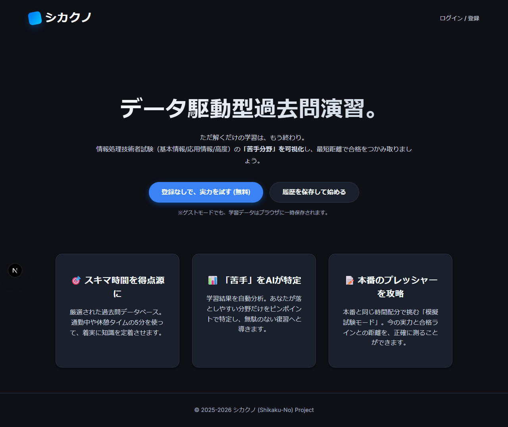
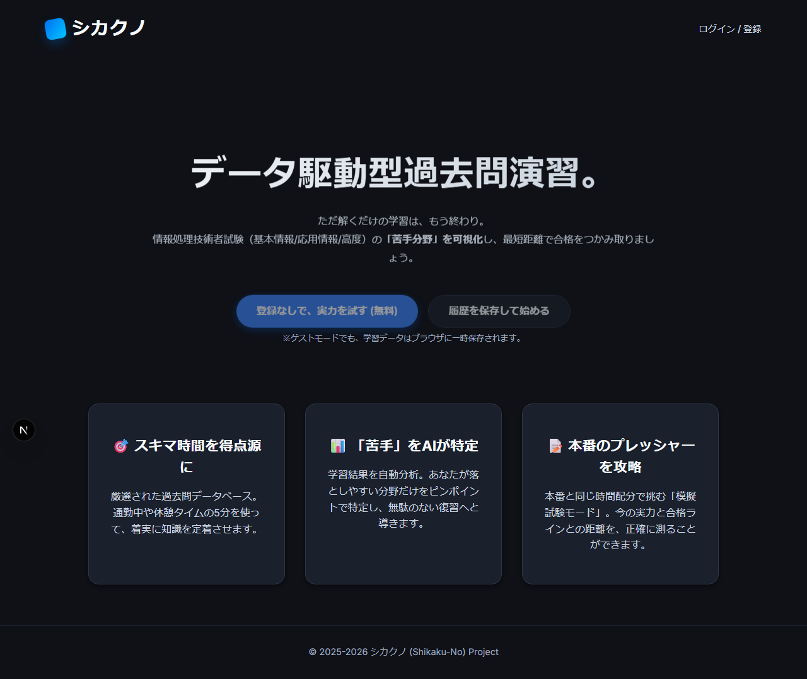
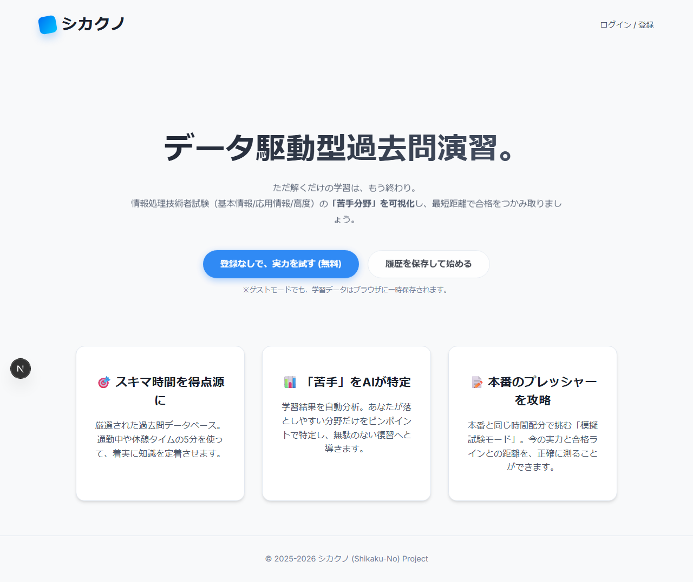
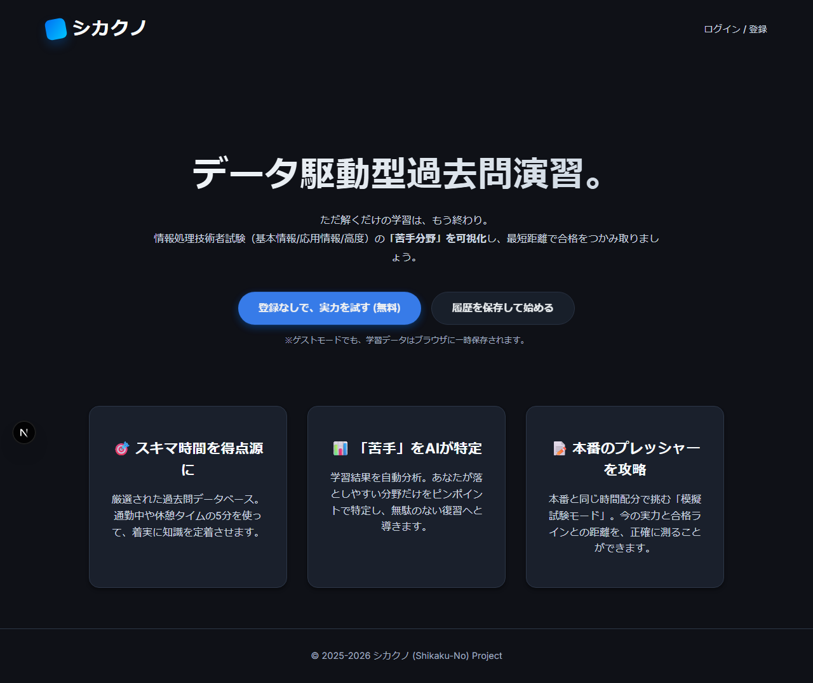
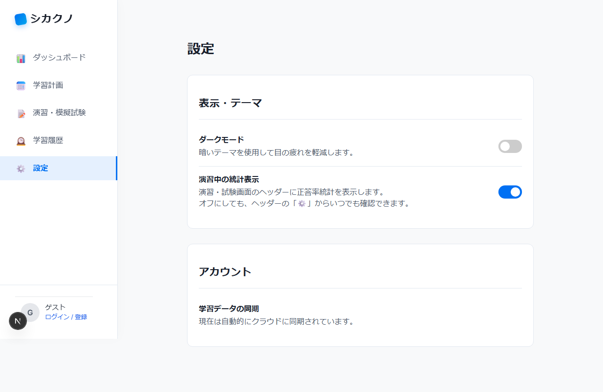

# E2E テスト エビデンス報告書

**実行日時**: 2026-02-11 07:36 JST (UTC: 2026-02-10T22:36)

---

## 1. エグゼクティブサマリー

| 項目 | 内容 |
|------|------|
| テストフレームワーク | Playwright (Chromium) |
| テストファイル数 | 3 |
| 総テスト数 | 49 |
| 成功数 | 49 |
| 失敗数 | 0 |
| 成功率 | **100%** |
| 実行時間 | 52.7 秒 |
| 対象ブランチ | `main` |
| PR番号 | #107 |

---

## 2. 変更概要

E2Eテスト仕様整備・ダークテーマ実装・異常系テスト追加の初回リグレッションテストとして、以下の変更が行われた：

- **E2Eテスト仕様整備**: テストヘルパー・エビデンスキャプチャ機能の追加、テスト構成の整理
- **ダークテーマ実装**: ダークモードの表示・切替・永続化・CSS変数の実装
- **異常系テスト追加**: 404ページ、OAuthエラー、XSS耐性、アクセシビリティのテスト追加

本 E2E テストは、上記の変更が既存の UI 機能に悪影響を与えていないことを確認する目的で実施した。

---

## 3. テストシナリオ一覧

### 3.1 dark-theme.spec.ts — ダークテーマテスト

| テストID | シナリオ名 | 結果 |
|----------|-----------|------|
| D-01 | デフォルトテーマの確認（初回アクセス時はライトテーマ） | ✅ Pass |
| D-02 | ダークモードのトップページ表示（背景色の検証） | ✅ Pass |
| D-03 | ダークモードのログイン画面表示 | ✅ Pass |
| D-04 | テーマ設定の localStorage 永続化 | ✅ Pass |
| D-05 | ページ再読み込みでテーマ維持（ダーク） | ✅ Pass |
| D-05 | ページ再読み込みでテーマ維持（ライト） | ✅ Pass |
| D-06 | テーマのトグル切替（ライト→ダーク→ライト） | ✅ Pass |
| D-07 | システム prefers-color-scheme 反映（ダーク） | ✅ Pass |
| D-07 | システム prefers-color-scheme 反映（ライト） | ✅ Pass |
| D-08 | ライトテーマの CSS 変数値検証 | ✅ Pass |
| D-09 | ダークテーマの CSS 変数値検証 | ✅ Pass |
| D-10 | トップページのライト/ダーク並列比較 | ✅ Pass |
| D-10 | ログイン画面のライト/ダーク並列比較 | ✅ Pass |
| D-10 | OAuthエラー画面のライト/ダーク並列比較 | ✅ Pass |

### 3.2 error-cases.spec.ts — 異常系テスト

| テストID | シナリオ名 | 結果 |
|----------|-----------|------|
| E-01 | 存在しないURL（404）— 浅い階層 | ✅ Pass |
| E-01 | 存在しないURL（404）— 深い階層 | ✅ Pass |
| E-02 | OAuthSignin エラー表示 | ✅ Pass |
| E-03 | OAuthAccountNotLinked エラー表示 | ✅ Pass |
| E-04 | AccessDenied エラー表示 | ✅ Pass |
| E-05 | Configuration エラー表示 | ✅ Pass |
| E-02b | 未知のエラーコードのデフォルトメッセージ | ✅ Pass |
| E-02c | エラーパラメータなしの正常表示 | ✅ Pass |
| E-06 | XSS 含む callbackUrl への耐性 | ✅ Pass |
| E-06 | 超長文 callbackUrl への耐性 | ✅ Pass |
| E-06 | 複数 error パラメータへの耐性 | ✅ Pass |
| E-07 | 未ログインでの保護ページアクセス | ✅ Pass |
| E-08 | ボタン連打防止（クリック前/クリック後の無効化） | ✅ Pass |
| E-09 | HTML lang 属性の設定確認 | ✅ Pass |
| E-09 | ボタンの role 属性（アクセシビリティ） | ✅ Pass |

### 3.3 top-to-login.spec.ts — トップページ→ログインフロー

| テストID | シナリオ名 | 結果 |
|----------|-----------|------|
| — | トップページが正常に表示される | ✅ Pass |
| — | ヘッダーに「ログイン / 登録」リンクが表示される | ✅ Pass |
| — | CTA ボタンが正しく表示される | ✅ Pass |
| — | フィーチャーカードが3つ表示される | ✅ Pass |
| — | フッターが表示される | ✅ Pass |
| — | ヘッダーリンクからログイン画面へ遷移 | ✅ Pass |
| — | 「履歴を保存して始める」ボタンからログイン画面へ遷移 | ✅ Pass |
| — | ログイン画面の見出しと説明文が表示される | ✅ Pass |
| — | Google ログインボタンが表示される | ✅ Pass |
| — | GitHub ログインボタンが表示される | ✅ Pass |
| — | 利用規約とプライバシーポリシーのリンク表示 | ✅ Pass |
| — | 「ゲストとして利用する」ボタンが表示される | ✅ Pass |
| — | 同意テキストが正しく表示される | ✅ Pass |
| — | 「ゲストとして利用する」ボタンで試験ページへ遷移 | ✅ Pass |
| — | 利用規約リンクが新しいタブで開く設定 | ✅ Pass |
| — | プライバシーポリシーリンクが新しいタブで開く設定 | ✅ Pass |
| — | トップ→ログイン→ゲスト利用の E2E フロー | ✅ Pass |
| — | 「登録なしで試す」ボタンからダッシュボードへ遷移 | ✅ Pass |
| — | トップページでJavaScriptエラーが発生しない | ✅ Pass |
| — | ログイン画面でJavaScriptエラーが発生しない | ✅ Pass |

---

## 4. スクリーンショットエビデンス

エビデンスファイルの保存先: `apps/web/e2e/evidence/`

最新実行タイムスタンプ: `2026-02-10T22-36-*`（UTC）

### D-01: デフォルトテーマの確認

### D-02: ダークモードのトップページ表示

| ライトテーマ（変更前） | ダークテーマ（変更後） |
|:---:|:---:|
|  |  |

### D-03: ダークモードのログイン画面表示

| ライトテーマ | ダークテーマ |
|:---:|:---:|
|  |  |

### D-04: テーマ設定の localStorage 永続化

| ダーク設定 | ライト設定 |
|:---:|:---:|
|  |  |

### D-05: ページ再読み込みでテーマ維持

### D-06: テーマのトグル切替（ライト→ダーク→ライト）

| Step 1: ライト | Step 2: ダーク | Step 3: ライト |
|:---:|:---:|:---:|
|  |  |  |

### D-07: システム prefers-color-scheme 反映

| システムダークモード | システムライトモード |
|:---:|:---:|
|  |  |

### D-08: ライトテーマの CSS 変数値検証

### D-09: ダークテーマの CSS 変数値検証

### D-10: ライト/ダーク並列比較

#### トップページ

| ライト | ダーク |
|:---:|:---:|
|  |  |

#### ログイン画面

| ライト | ダーク |
|:---:|:---:|
|  |  |

#### OAuthエラー画面

| ライト | ダーク |
|:---:|:---:|
|  |  |

### E-01: 存在しないURL（404）

| 浅い階層 | 深い階層 |
|:---:|:---:|
|  |  |

### E-02〜E-05: OAuth認証エラーパラメータの表示

| E-02: OAuthSignin | E-03: AccountNotLinked |
|:---:|:---:|
|  |  |

| E-04: AccessDenied | E-05: Configuration |
|:---:|:---:|
|  |  |

| E-02b: 未知のエラーコード | E-02c: エラーパラメータなし |
|:---:|:---:|
|  |  |

### E-06: 不正なパラメータへの耐性

| XSS callbackUrl | 超長文 callbackUrl | 複数 error パラメータ |
|:---:|:---:|:---:|
|  |  |  |

### E-07: 未ログインでの保護ページアクセス

### E-08: ボタン連打防止（二重サブミット）

| クリック前 | クリック後（無効化） |
|:---:|:---:|
|  |  |

### E-09: ページ基本構造の確認

| lang 属性 | アクセシビリティ（role 属性） |
|:---:|:---:|
|  |  |

---

## 5. 結論

- **全49テストが成功**（成功率 100%）
- 今回の変更（E2Eテスト仕様整備、ダークテーマ実装、異常系テスト追加）は初回リグレッションテストとして実施し、すべてのテストが正常に通過した
- ダークテーマの表示・切替・永続化・CSS 変数値はすべて正常動作
- 異常系（404、OAuth エラー、XSS 耐性、アクセシビリティ）もすべて正常動作
- トップページ→ログイン→ゲスト利用フローもすべて正常動作
- **変更が UI に悪影響を与えていないことを確認した**
