# E2E テスト エビデンス報告書

**実行日時**: 2026-03-02 08:37 JST (UTC: 2026-03-01T23:37)

---

## 1. エグゼクティブサマリー

| 項目 | 内容 |
|------|------|
| テストフレームワーク | Playwright 1.52.0 (Chromium) |
| テストファイル数 | 4 |
| 総テスト数 | 69 |
| 成功数 | 69 |
| 失敗数 | 0 |
| 成功率 | **100%** |
| 実行時間 | 96 秒 |
| 対象ブランチ | `test/admin-feature-flags-e2e` |
| PR番号 | #126 |

---

## 2. 変更概要

退職者が `feature/admin-and-feature-flags` ブランチにローカル作成していた管理者フィーチャーフラグ E2E テストを `test/admin-feature-flags-e2e` ブランチに移行し、全テストがパスするよう以下の修正を実施した。

- **CSS非表示チェックボックスのクリック方式変更** (10箇所): `.click({ force: true })` → `.evaluate(node => (node as HTMLElement).click())`
- **API呼び出しパターンの修正** (13箇所): `page.request.*` → `page.evaluate(() => fetch(...))` (`page.route()` との互換性)
- **Playwright strict mode違反の解消** (8箇所以上): 行スコープ付きロケーター、`exact: true`、`.first()` 等
- **無効なロケーター構文の修正** (FF-21): `.or()` パターン、条件分岐 `toBeChecked()`

本 E2E テストは、上記の変更が既存の UI 機能に悪影響を与えていないことを確認する目的で実施した。

---

## 3. テストシナリオ一覧

### 3.1 admin-feature-flags.spec.ts — 管理者フィーチャーフラグテスト（**今回追加**）

#### 1. アクセス制御テスト

| テストID | シナリオ名 | 結果 |
|----------|-----------|------|
| FF-01 | 未認証ユーザーのアクセス制限（リダイレクト確認） | ✅ Pass |
| FF-02 | 非管理者ユーザーのアクセス制限（エラー表示） | ✅ Pass |

#### 2. APIセキュリティテスト

| テストID | シナリオ名 | 結果 |
|----------|-----------|------|
| FF-11 | 管理API GET の未認証拒否（401） | ✅ Pass |
| FF-12 | 管理API PATCH の未認証拒否（401） | ✅ Pass |
| FF-13 | 管理API PATCH のバリデーション（不正入力） | ✅ Pass |
| FF-17 | 管理API GET の非管理者拒否（403） | ✅ Pass |
| FF-18 | 管理API PATCH の不正JSON送信 | ✅ Pass |
| FF-19 | 管理API PATCH の更新失敗時（500） | ✅ Pass |

#### 3. 公開APIテスト

| テストID | シナリオ名 | 結果 |
|----------|-----------|------|
| FF-10 | 公開API /api/feature-flags の応答確認 | ✅ Pass |

#### 4. フィーチャーフラグ表示テスト

| テストID | シナリオ名 | 結果 |
|----------|-----------|------|
| FF-03 | 管理画面の初期表示・フラグ一覧 | ✅ Pass |
| FF-04 | フラグ情報の詳細表示 | ✅ Pass |
| FF-20 | フラグ取得失敗時のUI表示 | ✅ Pass |

#### 5. フィーチャーフラグ トグル操作テスト

| テストID | シナリオ名 | 結果 |
|----------|-----------|------|
| FF-05 | OFFフラグをONに切り替え | ✅ Pass |
| FF-06 | ONフラグをOFFに切り替え | ✅ Pass |
| FF-07 | トグル操作中のUI無効化状態 | ✅ Pass |

#### 6. フィードバック表示テスト

| テストID | シナリオ名 | 結果 |
|----------|-----------|------|
| FF-08 | トグル成功時のメッセージ表示 | ✅ Pass |
| FF-09 | 成功メッセージの3秒後自動消去 | ✅ Pass |
| FF-21 | トグル更新失敗時のエラー表示 | ✅ Pass |

#### 7. 統合テスト

| テストID | シナリオ名 | 結果 |
|----------|-----------|------|
| FF-14 | フラグ切替後の公開APIへの反映 | ✅ Pass |
| FF-16 | 複数フラグの連続切替 | ✅ Pass |

### 3.2 dark-theme.spec.ts — ダークテーマテスト

| テストID | シナリオ名 | 結果 |
|----------|-----------|------|
| D-01 | デフォルトテーマの確認（初回アクセス時はライトテーマ） | ✅ Pass |
| D-02 | ダークモードのトップページ表示（背景色の検証） | ✅ Pass |
| D-03 | ダークモードのログイン画面表示 | ✅ Pass |
| D-04 | テーマ設定の localStorage 永続化 | ✅ Pass |
| D-05 | ページ再読み込みでテーマ維持（ダーク） | ✅ Pass |
| D-05 | ページ再読み込みでテーマ維持（ライト） | ✅ Pass |
| D-06 | テーマのトグル切替（ライト→ダーク→ライト） | ✅ Pass |
| D-07 | システム prefers-color-scheme 反映（ダーク） | ✅ Pass |
| D-07 | システム prefers-color-scheme 反映（ライト） | ✅ Pass |
| D-08 | ライトテーマの CSS 変数値検証 | ✅ Pass |
| D-09 | ダークテーマの CSS 変数値検証 | ✅ Pass |
| D-10 | トップページのライト/ダーク並列比較 | ✅ Pass |
| D-10 | ログイン画面のライト/ダーク並列比較 | ✅ Pass |
| D-10 | OAuthエラー画面のライト/ダーク並列比較 | ✅ Pass |

### 3.3 error-cases.spec.ts — 異常系テスト

| テストID | シナリオ名 | 結果 |
|----------|-----------|------|
| E-01 | 存在しないURL（404）— 浅い階層 | ✅ Pass |
| E-01 | 存在しないURL（404）— 深い階層 | ✅ Pass |
| E-02 | OAuthSignin エラー表示 | ✅ Pass |
| E-03 | OAuthAccountNotLinked エラー表示 | ✅ Pass |
| E-04 | AccessDenied エラー表示 | ✅ Pass |
| E-05 | Configuration エラー表示 | ✅ Pass |
| E-02b | 未知のエラーコードのデフォルトメッセージ | ✅ Pass |
| E-02c | エラーパラメータなしの正常表示 | ✅ Pass |
| E-06 | XSS 含む callbackUrl への耐性 | ✅ Pass |
| E-06 | 超長文 callbackUrl への耐性 | ✅ Pass |
| E-06 | 複数 error パラメータへの耐性 | ✅ Pass |
| E-07 | 未ログインでの保護ページアクセス | ✅ Pass |
| E-08 | ボタン連打防止（クリック前/クリック後の無効化） | ✅ Pass |
| E-09 | HTML lang 属性の設定確認 | ✅ Pass |
| E-09 | ボタンの role 属性（アクセシビリティ） | ✅ Pass |

### 3.4 top-to-login.spec.ts — トップページ→ログインフロー

| テストID | シナリオ名 | 結果 |
|----------|-----------|------|
| — | トップページが正常に表示される | ✅ Pass |
| — | ヘッダーに「ログイン / 登録」リンクが表示される | ✅ Pass |
| — | CTA ボタンが正しく表示される | ✅ Pass |
| — | フィーチャーカードが3つ表示される | ✅ Pass |
| — | フッターが表示される | ✅ Pass |
| — | ヘッダーリンクからログイン画面へ遷移 | ✅ Pass |
| — | 「履歴を保存して始める」ボタンからログイン画面へ遷移 | ✅ Pass |
| — | ログイン画面の見出しと説明文が表示される | ✅ Pass |
| — | Google ログインボタンが表示される | ✅ Pass |
| — | GitHub ログインボタンが表示される | ✅ Pass |
| — | 利用規約とプライバシーポリシーのリンク表示 | ✅ Pass |
| — | 「ゲストとして利用する」ボタンが表示される | ✅ Pass |
| — | 同意テキストが正しく表示される | ✅ Pass |
| — | 「ゲストとして利用する」ボタンで試験ページへ遷移 | ✅ Pass |
| — | 利用規約リンクが新しいタブで開く設定 | ✅ Pass |
| — | プライバシーポリシーリンクが新しいタブで開く設定 | ✅ Pass |
| — | トップ→ログイン→ゲスト利用の E2E フロー | ✅ Pass |
| — | 「登録なしで試す」ボタンからダッシュボードへ遷移 | ✅ Pass |
| — | トップページでJavaScriptエラーが発生しない | ✅ Pass |
| — | ログイン画面でJavaScriptエラーが発生しない | ✅ Pass |

---

## 4. スクリーンショットエビデンス

エビデンスファイルの保存先: `apps/web/e2e/evidence/`

最新実行タイムスタンプ: `2026-03-01T23-37-*` 〜 `2026-03-01T23-38-*`（UTC）

### 管理者フィーチャーフラグテスト（今回追加）

#### FF-01: 未認証ユーザーのアクセス制限

未ログイン状態で `/admin` にアクセスすると、ログインページ (`/login`) へリダイレクトされることを確認。

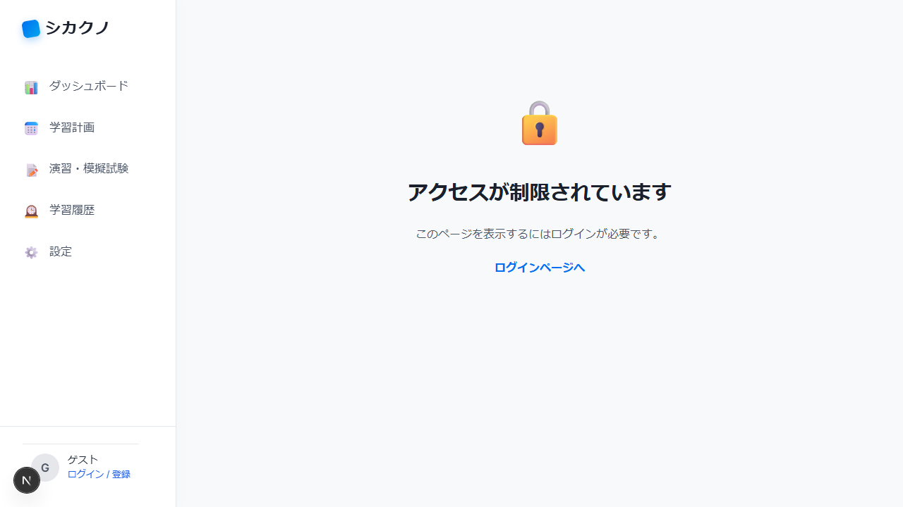

#### FF-02: 非管理者ユーザーのアクセス制限

管理者権限を持たないユーザーが `/admin` にアクセスすると、アクセス拒否メッセージとダッシュボードへの戻りリンクが表示されることを確認。

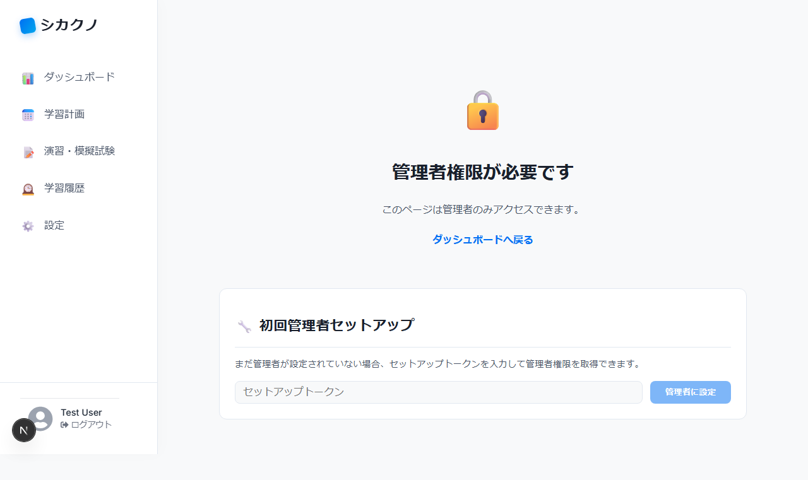

#### FF-03: 管理画面の初期表示・フラグ一覧

管理者ログイン後、Admin バッジ・フラグ一覧テーブル（ads_enabled, ai_plan_enabled）が正しく表示されることを確認。

#### FF-04: フラグ情報の詳細表示

各フラグの ID、ステータス（ON/OFF）、説明文、最終更新日時が正しく表示されることを確認。

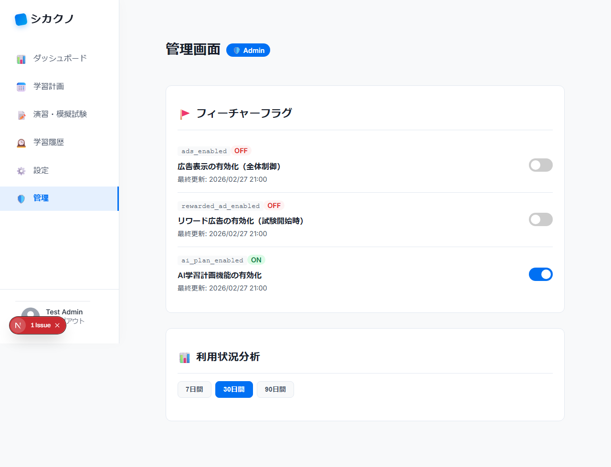

#### FF-20: フラグ取得失敗時のUI表示

API がエラーを返した場合に、エラーメッセージが管理画面に表示されることを確認。

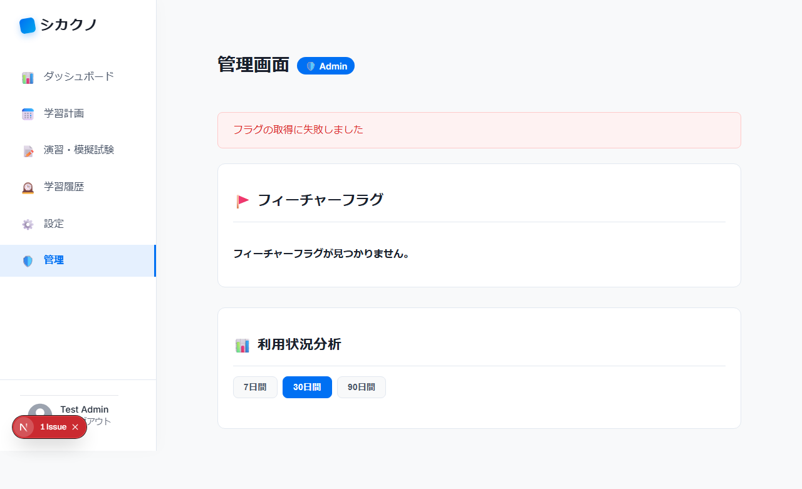

#### FF-05: OFFフラグをONに切り替え

ads_enabled フラグをOFF→ONに切り替え後、UIが「ON」表示に更新され、最終更新日時が表示されることを確認。

#### FF-06: ONフラグをOFFに切り替え

ai_plan_enabled フラグをON→OFFに切り替え後、UIが「OFF」表示に更新され、最終更新日時が表示されることを確認。

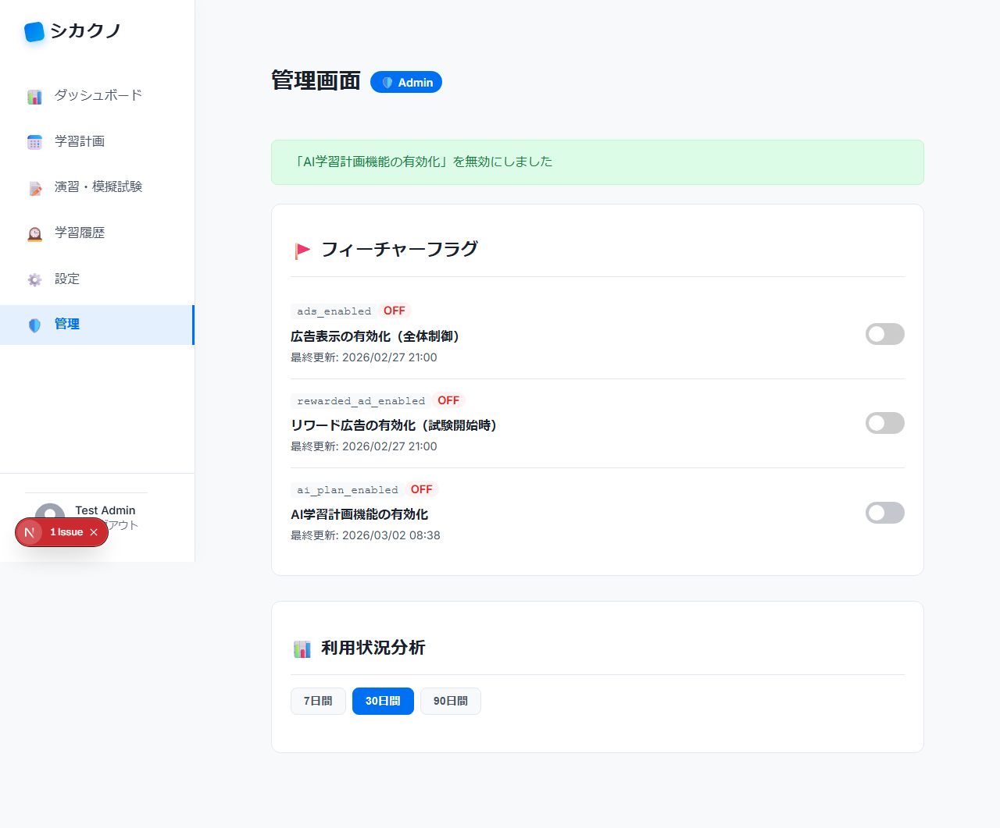

#### FF-07: トグル操作中のUI無効化状態

トグル操作中にチェックボックスが無効化 (`disabled`) され、API応答後に再有効化されることを確認。

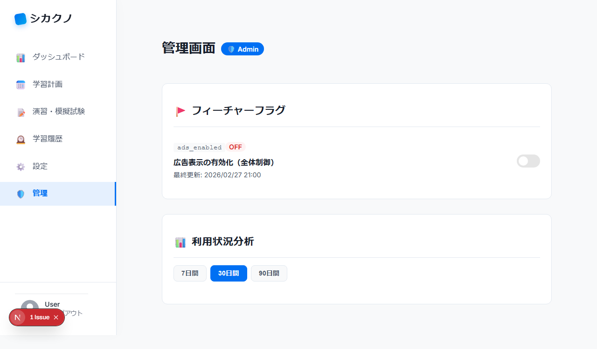

#### FF-08: トグル成功時のメッセージ表示

フラグ切替成功時に「〜を有効にしました」等の成功メッセージが表示されることを確認。

#### FF-09: 成功メッセージの3秒後自動消去

成功メッセージ表示後、3秒経過で自動的に非表示になることを確認。

| メッセージ表示中 | 3秒後（自動消去後） |
|:---:|:---:|
| 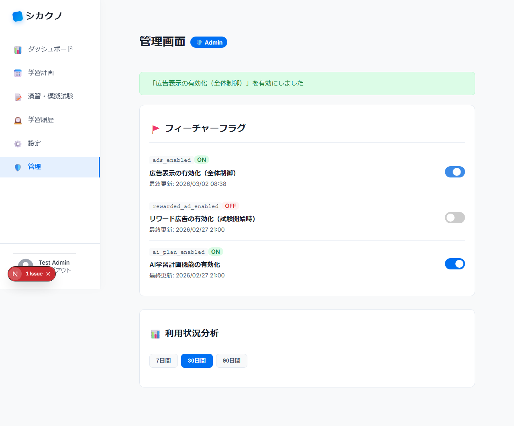 |  |

#### FF-21: トグル更新失敗時のエラー表示

API がエラーを返した場合にエラーメッセージが表示され、トグル状態が元に戻ることを確認。

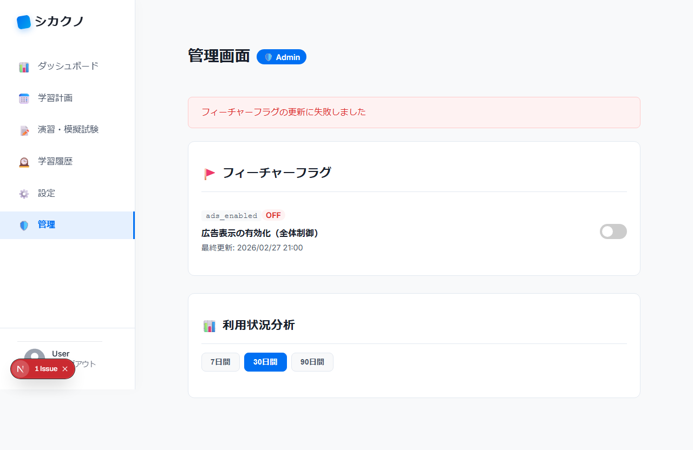

#### FF-14: フラグ切替後の公開APIへの反映

管理画面でフラグを切り替えた後、公開API `/api/feature-flags` の応答にも変更が反映されることを確認。

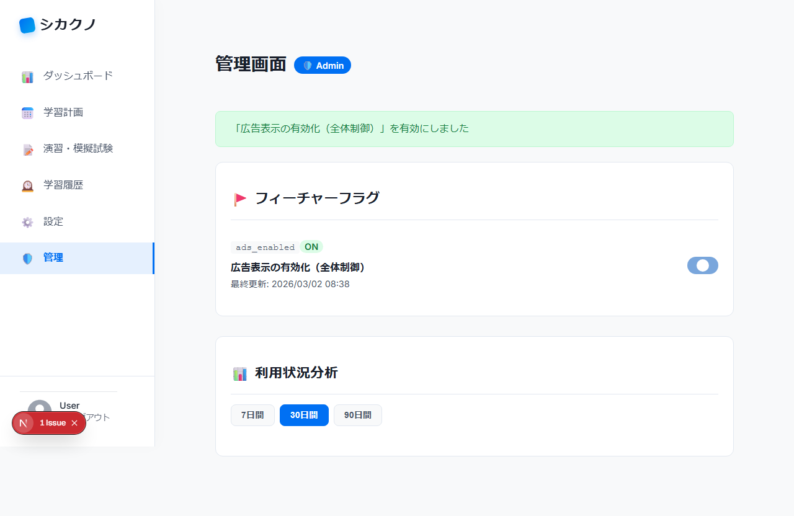

#### FF-16: 複数フラグの連続切替

ads_enabled → ai_plan_enabled の順に連続でトグル操作し、各フラグが正しく更新されることを確認。

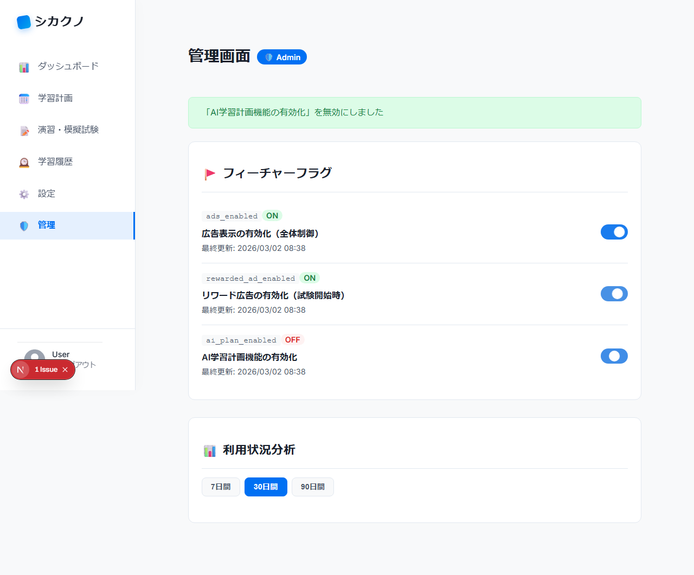

#### FF-11 / FF-12 / FF-13 / FF-17 / FF-18 / FF-19 / FF-10: APIセキュリティ・公開APIテスト

これらのテストはAPIレベルのテスト（HTTPステータスコード・レスポンスボディの検証）であり、画面キャプチャ対象外。テスト結果は「3. テストシナリオ一覧」の表で確認。

---

### ダークテーマテスト（既存）

#### D-01: デフォルトテーマの確認

#### D-02: ダークモードのトップページ表示

| ライトテーマ（変更前） | ダークテーマ（変更後） |
|:---:|:---:|
|  |  |

#### D-03: ダークモードのログイン画面表示

| ライトテーマ | ダークテーマ |
|:---:|:---:|
|  |  |

#### D-04: テーマ設定の localStorage 永続化

| ダーク設定 | ライト設定 |
|:---:|:---:|
|  |  |

#### D-05: ページ再読み込みでテーマ維持

#### D-06: テーマのトグル切替（ライト→ダーク→ライト）

| Step 1: ライト | Step 2: ダーク | Step 3: ライト |
|:---:|:---:|:---:|
|  |  |  |

#### D-07: システム prefers-color-scheme 反映

| システムダークモード | システムライトモード |
|:---:|:---:|
|  |  |

#### D-08: ライトテーマの CSS 変数値検証

#### D-09: ダークテーマの CSS 変数値検証

#### D-10: ライト/ダーク並列比較

##### トップページ

| ライト | ダーク |
|:---:|:---:|
|  |  |

##### ログイン画面

| ライト | ダーク |
|:---:|:---:|
|  |  |

##### OAuthエラー画面

| ライト | ダーク |
|:---:|:---:|
|  |  |

---

### 異常系テスト（既存）

#### E-01: 存在しないURL（404）

| 浅い階層 | 深い階層 |
|:---:|:---:|
|  |  |

#### E-02〜E-05: OAuth認証エラーパラメータの表示

| E-02: OAuthSignin | E-03: AccountNotLinked |
|:---:|:---:|
|  |  |

| E-04: AccessDenied | E-05: Configuration |
|:---:|:---:|
|  |  |

| E-02b: 未知のエラーコード | E-02c: エラーパラメータなし |
|:---:|:---:|
|  |  |

#### E-06: 不正なパラメータへの耐性

| XSS callbackUrl | 超長文 callbackUrl | 複数 error パラメータ |
|:---:|:---:|:---:|
|  |  |  |

#### E-07: 未ログインでの保護ページアクセス

#### E-08: ボタン連打防止（二重サブミット）

| クリック前 | クリック後（無効化） |
|:---:|:---:|
|  | 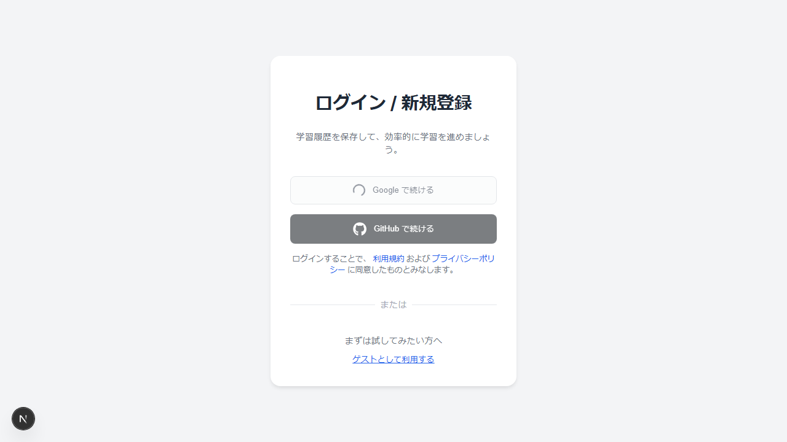 |

#### E-09: ページ基本構造の確認

| lang 属性 | アクセシビリティ（role 属性） |
|:---:|:---:|
|  |  |

---

## 5. 結論

- **全69テストが成功**（成功率 100%）
- 今回追加した管理者フィーチャーフラグ E2E テスト（20テスト）はすべて正常動作
  - アクセス制御（未認証リダイレクト、非管理者拒否）
  - フラグ一覧表示・詳細表示
  - トグル ON/OFF 操作・UI無効化状態
  - 成功メッセージの表示・3秒後自動消去
  - エラー表示（API失敗時）
  - APIセキュリティ（401/403/500/バリデーション）
  - 統合テスト（公開APIへの反映・複数フラグ連続操作）
- 既存テスト（ダークテーマ、異常系、ログインフロー）もすべて正常動作
- **変更が UI に悪影響を与えていないことを確認した**
