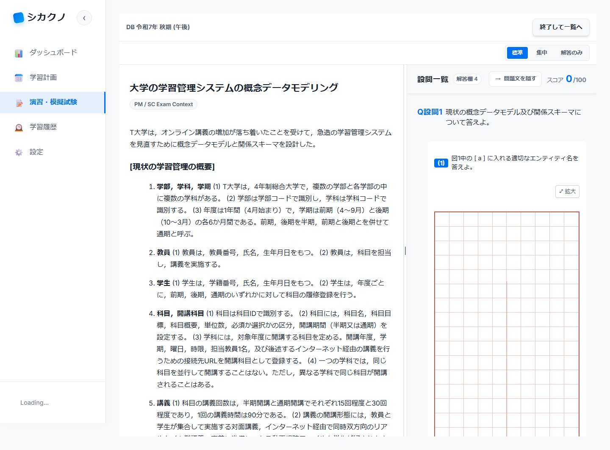
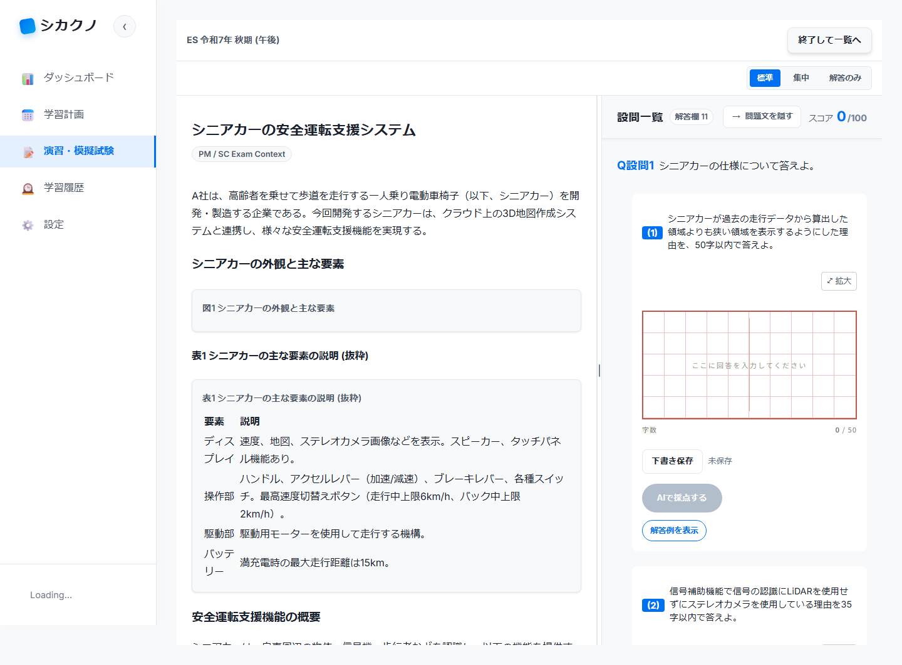
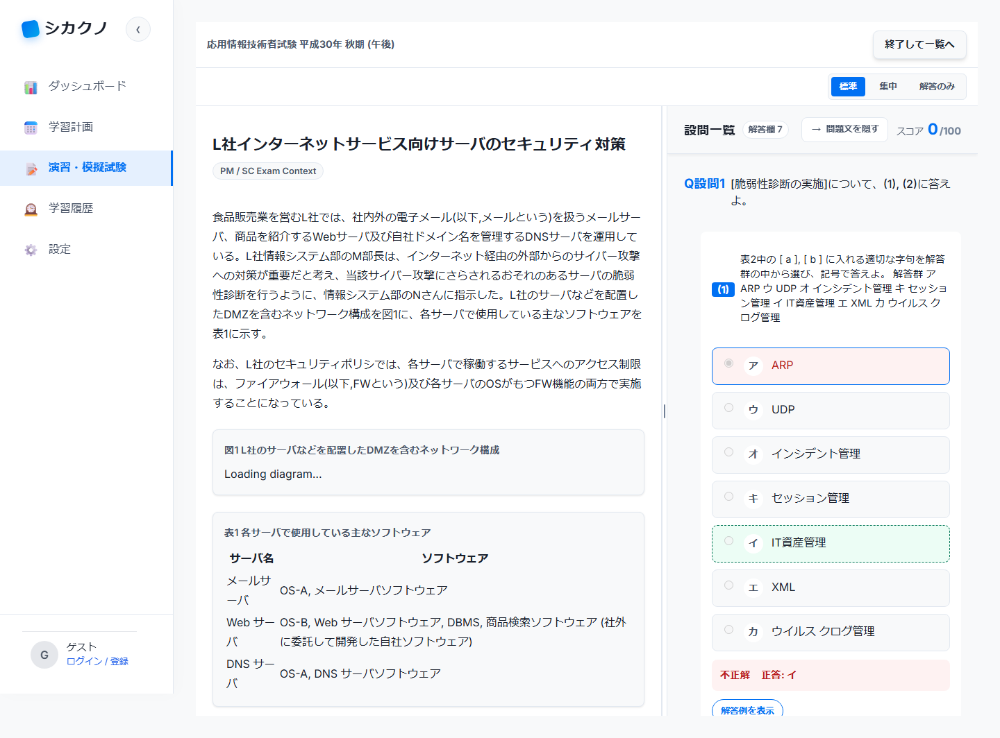
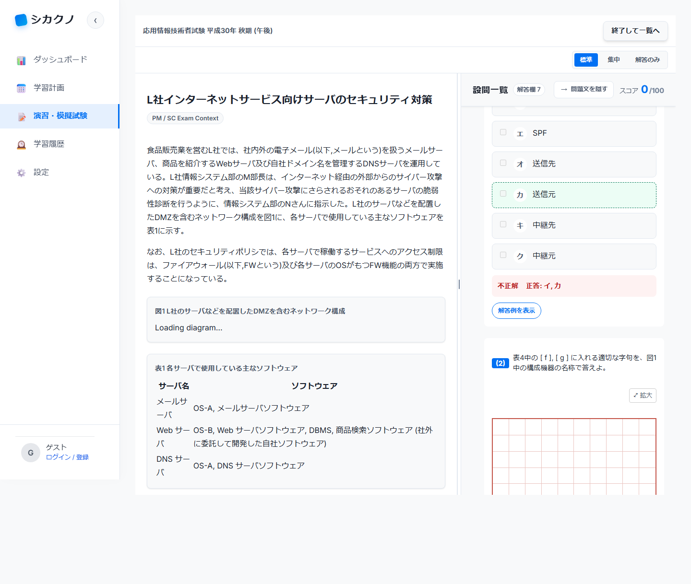

# E2E テストエビデンス報告書 2026-05-08

## 1. エグゼクティブサマリー

| 項目 | 内容 |
|------|------|
| 実行日時 | 2026-05-08 22:43 JST (2026-05-08T13:43:48.270Z) |
| 対象環境 | Staging |
| 対象URL | https://app-pm-exam-dx-staging.azurewebsites.net |
| ブランチ | fix/exam-data-quality-all-types |
| PR | #261 |
| フレームワーク | Playwright / Chromium |
| テスト種別 | ステージング受け入れ検証 |
| テスト数 | 4 |
| 成功 | 4 |
| 失敗 | 0 |
| 成功率 | 100% |
| 実行時間 | 12.6秒（シナリオ合計） |

## 2. 変更概要

午後問題の表示・採点品質を確認するため、ステージング環境で受験者想定の操作検証を実施した。検証対象は、DB/ES 午後1パイロットデータの表示、親見出しが余分な800字入力欄にならないこと、午後選択式が択一ラジオボタン・複数チェックボックスとして表示され採点できることとした。

## 3. テストシナリオ一覧

| テストID | シナリオ名 | 対象 | 結果 | 実行時間 |
|----------|------------|------|------|----------|
| A-01 | DB-2025-Fall-PM1 問1が余分な親見出し入力欄なしで表示される | DB-2025-Fall-PM1 / 問1 | Pass | 3.2秒 |
| A-02 | ES-2025-Fall-PM1 問1が公式解答同期済みの解答欄数で表示される | ES-2025-Fall-PM1 / 問1 | Pass | 1.7秒 |
| A-03 | 午後択一選択式がラジオボタンとして表示される | AP-2018-Fall-PM / 問1 | Pass | 3.9秒 |
| A-04 | 午後複数選択式がチェックボックスで採点できる | AP-2018-Fall-PM / 問1 | Pass | 3.8秒 |

## 4. スクリーンショットエビデンス

### A-01 DB-2025-Fall-PM1 問1表示

### A-02 ES-2025-Fall-PM1 問1表示

### A-03 午後択一選択式ラジオボタン表示

### A-04 午後複数選択式チェックボックス採点

## 5. 結論

ステージング環境での受験者想定操作検証は 4/4 成功した。DB/ES 午後1パイロットデータは表示可能であり、親見出しが余分な800字入力欄として表示される問題は再現しなかった。午後選択式についても、択一はラジオボタン、複数選択はチェックボックスとして表示され、複数選択の採点操作まで完了した。

UI 影響は想定どおりで、レビュー依頼前のステージング受け入れ条件を満たしている。
