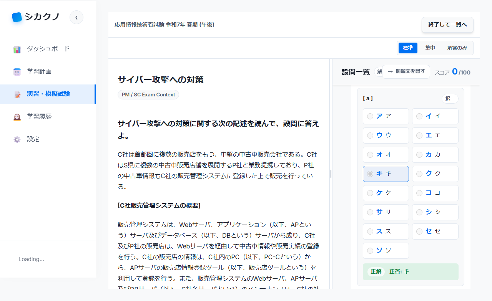

# E2E テストエビデンス報告書

> 自動生成レポートをもとに、本PR対象の最新証跡へ整理: 2026-05-08

## 1. エグゼクティブサマリー

| 項目 | 値 |
|------|-----|
| テストフレームワーク | Playwright |
| 対象テスト | `apps/web/e2e/afternoon-objective-answer.spec.ts` |
| 総テスト数 | 1 |
| 成功 | 1 |
| 失敗 | 0 |
| スキップ | 0 |
| 成功率 | 100.0% |
| 実行時間 | 7.2 秒 |
| ブランチ | `fix/afternoon-choice-short-answer-scoring` |
| PR 番号 | 作成前 |

## 2. 変更概要

午後問題の選択式・短答式小問を AI 採点欄から分離し、午前問題と同様に客観式として採点する UI と保存フローを追加した。択一はラジオボタン、複数選択はチェックボックス、本文抜き出し等の短答は短いテキスト入力として表示し、記述式のみ従来の AI 採点欄を使用する。

## 3. テストシナリオ一覧

### afternoon-objective-answer.spec.ts

| テスト ID | シナリオ名 | 結果 | 実行時間 |
|-----------|-----------|------|---------|
| O-01 | AP午後問1の選択式・短答式をAI採点欄にしない | Pass | 7.2s |

## 4. スクリーンショットエビデンス

| O-01 |
|:---:|
|  |

## 5. 結論

対象シナリオは成功し、AP 午後問1の客観式小問で AI 採点ボタンが表示されず、客観式回答 UI が表示されることを確認した。なお、全体 E2E は別途実行し既存シナリオを含む複数失敗を確認したため、PR 本文で残リスクとして明記する。
