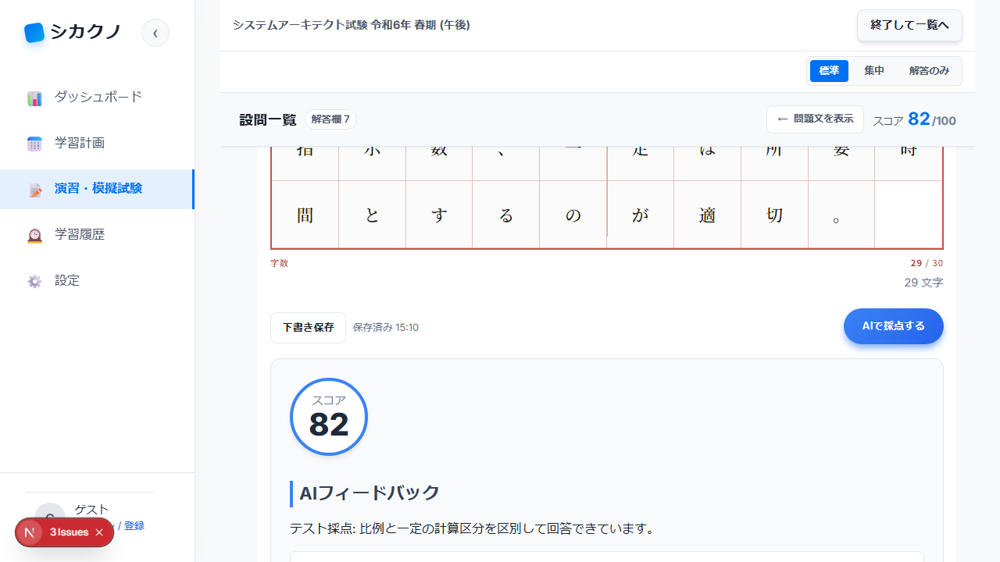

# E2E テストエビデンス報告書

> 自動生成: 2026-05-09T06:10:12.724Z — Playwright カスタムレポーター

## 1. エグゼクティブサマリー

| 項目 | 値 |
|------|-----|
| テストフレームワーク | Playwright |
| 総テスト数 | 1 |
| 成功 | 1 |
| 失敗 | 0 |
| スキップ | 0 |
| 成功率 | 100.0% |
| 実行時間 | 17.0 秒 |
| ブランチ | (local) |
| PR 番号 | (なし) |

## 2. 変更概要

> 本報告書は E2E テスト実行時に自動生成されます。変更概要は PR 本文を参照してください。

## 3. テストシナリオ一覧

###  > chromium > pm-answer-flow.spec.ts > 受講者想定 午後回答フロー

| テスト ID | シナリオ名 | 結果 | 実行時間 |
|-----------|-----------|------|---------|
| F-01 | F-01: テスト答案を入力し採点結果とゲスト保存を確認する | ✅ Pass | 13.7s |

## 4. スクリーンショットエビデンス

## 5. 結論

全 1 テストが成功しました。UI への悪影響はありません。
