# ステージング受け入れ検証エビデンス報告書 2026-05-09

## 1. エグゼクティブサマリー

| 項目 | 内容 |
|------|------|
| 実行日時 | 2026-05-09T03:40:45.454Z - 2026-05-09T03:41:16.047Z |
| 対象環境 | Staging |
| 対象URL | https://app-pm-exam-dx-staging.azurewebsites.net |
| ブランチ | fix/exam-data-quality-all-types |
| PR | #261 |
| フレームワーク | Playwright / Chromium |
| テスト種別 | ステージング受験者想定操作 |
| テスト数 | 13 |
| 成功 | 13 |
| 失敗 | 0 |
| 成功率 | 100.0% |
| 実行時間 | 29.3秒（シナリオ合計） |

## 2. 変更概要

AU/SM の最新年度午後データ追加後、ステージング環境で受験者想定操作を実施した。各問題ページで問題表示、設問一覧、解答欄数、入力保持、エラー表示なしを確認し、NW 代表ケースでは Mermaid 図表の非空レンダリングも確認した。

## 3. テストシナリオ一覧

| テストID | シナリオ名 | 対象 | 結果 | 実行時間 |
|----------|------------|------|------|----------|
| S-01 | AU PM1 問1の解答欄表示 | AU-2025-Fall-PM1 / 問1 | Pass | 1.8秒 |
| S-02 | AU PM1 問2の解答欄表示 | AU-2025-Fall-PM1 / 問2 | Pass | 1.7秒 |
| S-03 | AU PM1 問3の解答欄表示 | AU-2025-Fall-PM1 / 問3 | Pass | 1.4秒 |
| S-04 | AU PM2 問1の論述欄表示 | AU-2025-Fall-PM2 / 問1 | Pass | 1.6秒 |
| S-05 | AU PM2 問2の論述欄表示 | AU-2025-Fall-PM2 / 問2 | Pass | 1.4秒 |
| S-06 | SM PM1 問1の解答欄表示 | SM-2025-Spring-PM1 / 問1 | Pass | 2秒 |
| S-07 | SM PM1 問2の解答欄表示 | SM-2025-Spring-PM1 / 問2 | Pass | 2.3秒 |
| S-08 | SM PM1 問3の解答欄表示 | SM-2025-Spring-PM1 / 問3 | Pass | 3秒 |
| S-09 | SM PM2 問1の論述欄表示 | SM-2025-Spring-PM2 / 問1 | Pass | 2秒 |
| S-10 | SM PM2 問2の論述欄表示 | SM-2025-Spring-PM2 / 問2 | Pass | 1.4秒 |
| S-11 | 既存SA PM1の回帰確認 | SA-2025-Spring-PM1 / 問1 | Pass | 1.9秒 |
| S-12 | 既存ST PM1の回帰確認 | ST-2025-Spring-PM1 / 問1 | Pass | 2.6秒 |
| S-13 | 既存NW PM2のMermaid回帰確認 | NW-2025-Spring-PM2 / 問1 | Pass | 6.2秒 |

## 4. スクリーンショットエビデンス

### S-01 AU-2025-Fall-PM1 問1

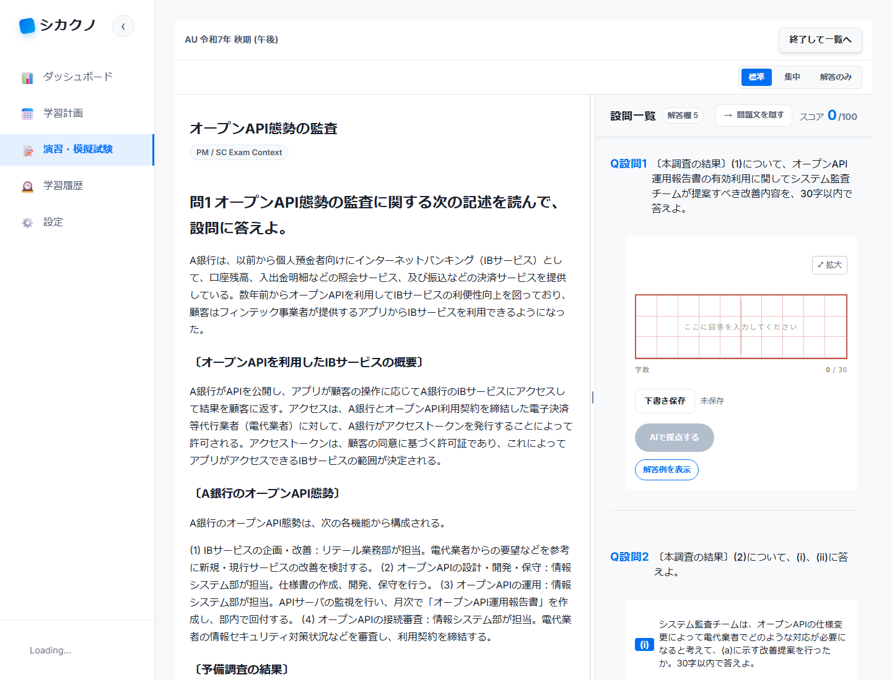

### S-02 AU-2025-Fall-PM1 問2

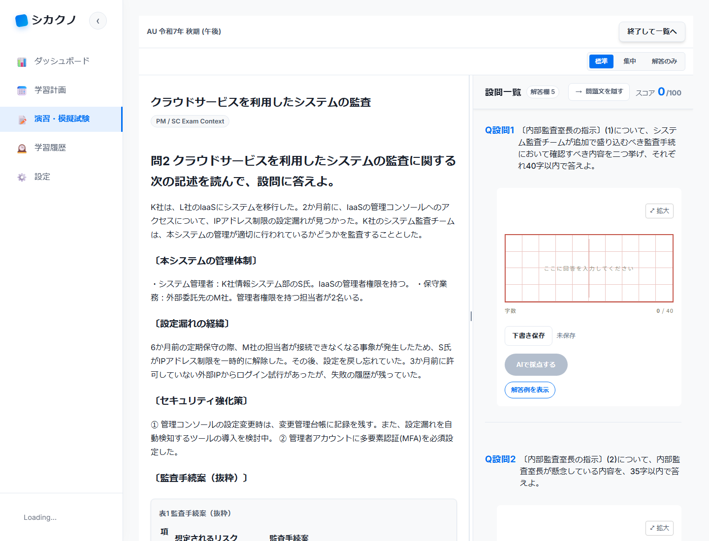

### S-03 AU-2025-Fall-PM1 問3

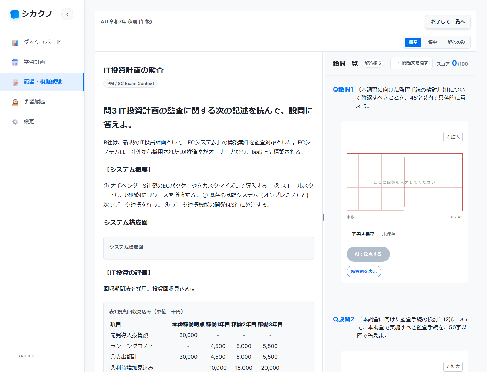

### S-04 AU-2025-Fall-PM2 問1

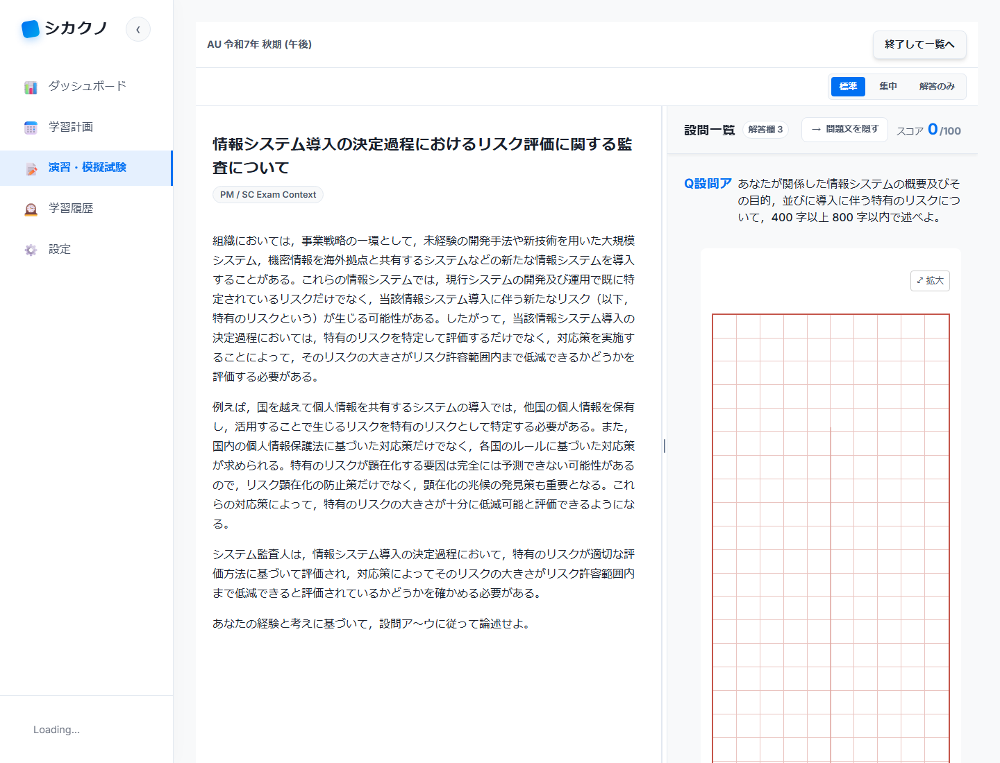

### S-05 AU-2025-Fall-PM2 問2

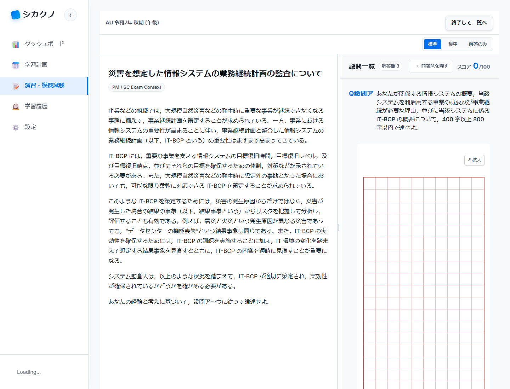

### S-06 SM-2025-Spring-PM1 問1

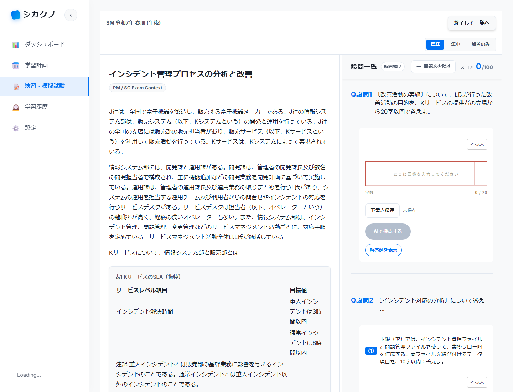

### S-07 SM-2025-Spring-PM1 問2

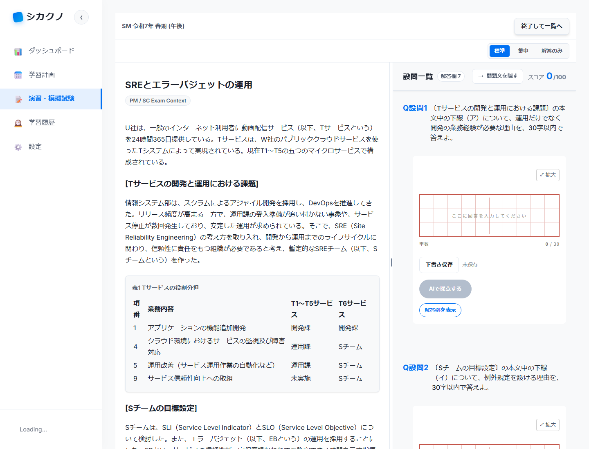

### S-08 SM-2025-Spring-PM1 問3

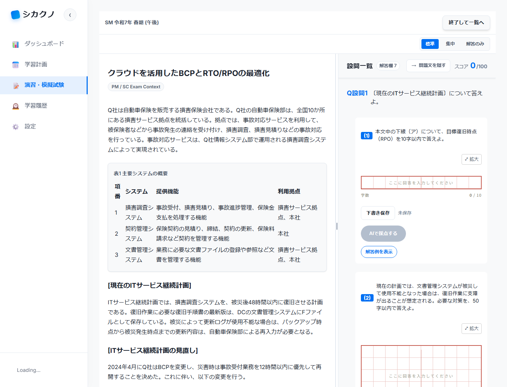

### S-09 SM-2025-Spring-PM2 問1

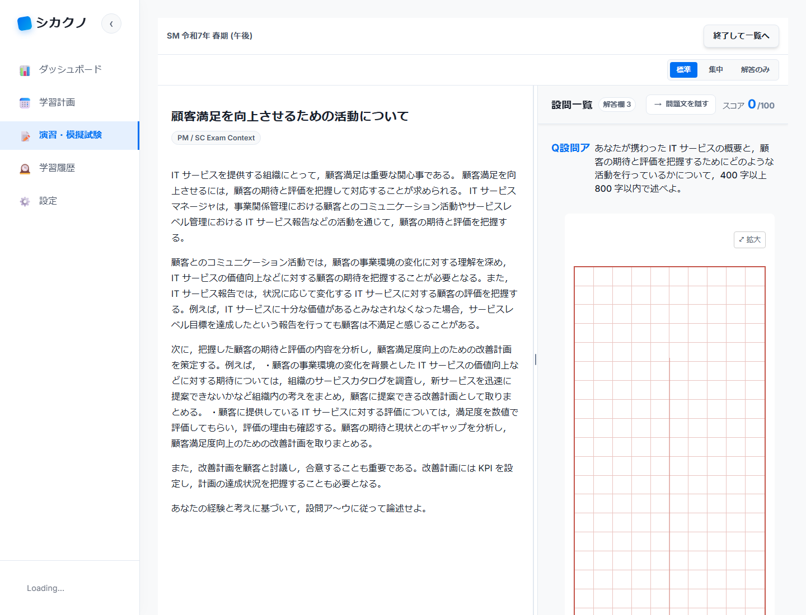

### S-10 SM-2025-Spring-PM2 問2

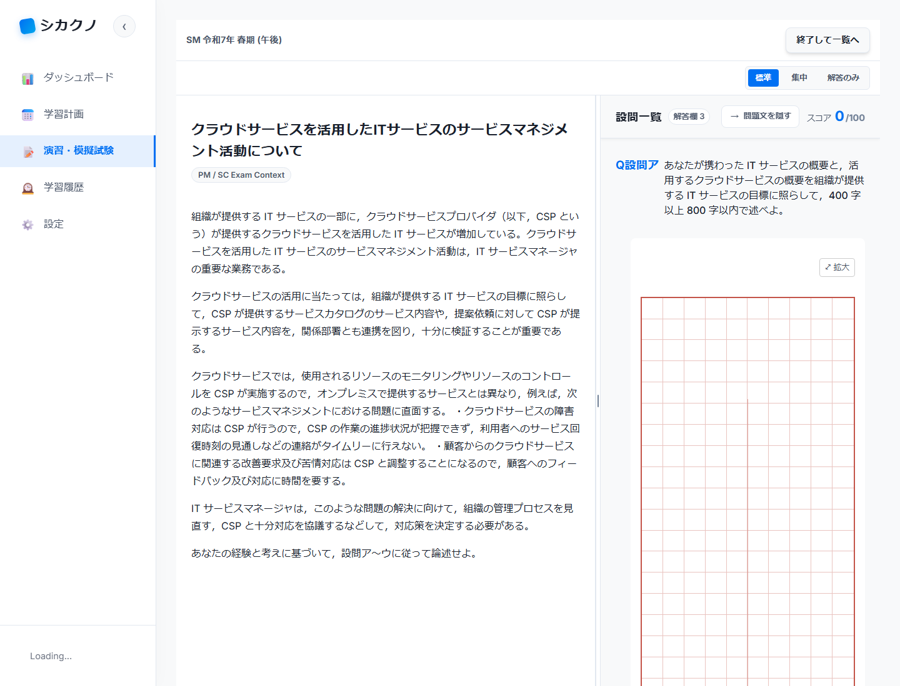

### S-11 SA-2025-Spring-PM1 問1

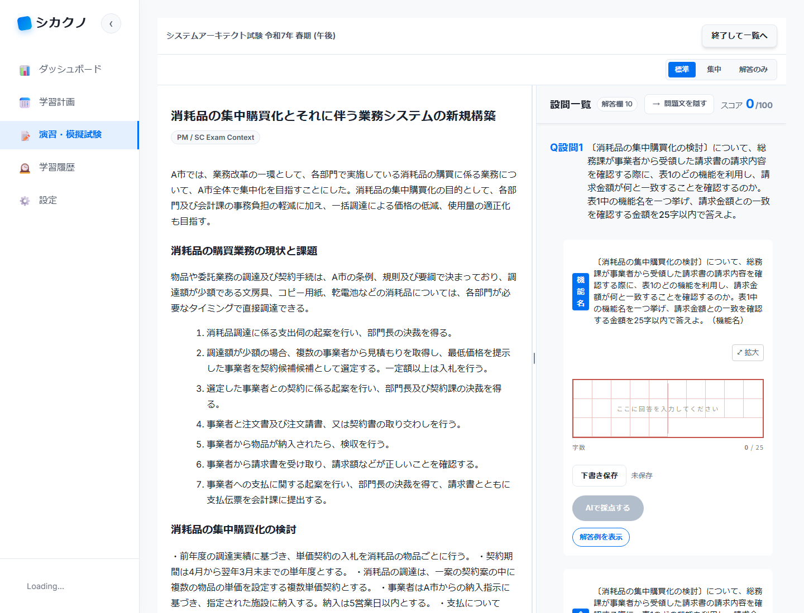

### S-12 ST-2025-Spring-PM1 問1

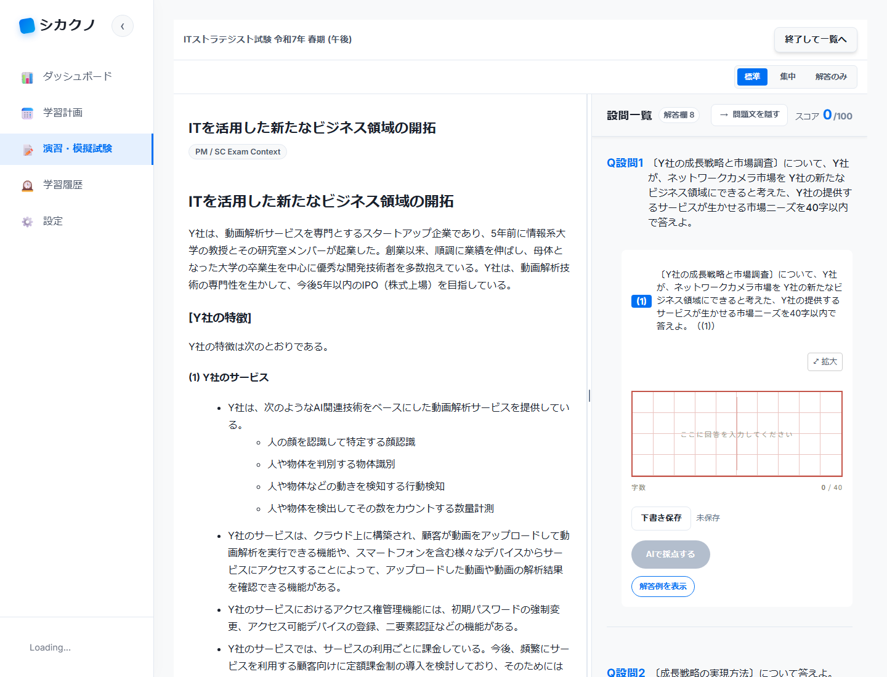

### S-13 NW-2025-Spring-PM2 問1

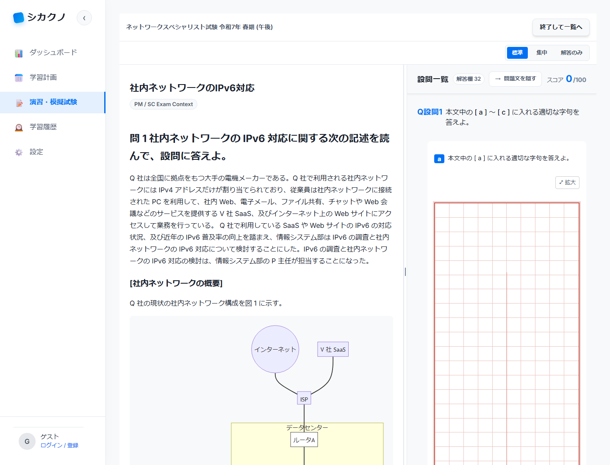

## 5. 結論

ステージング環境での受験者想定操作検証は 13/13 成功した。AU/SM の最新年度パイロットデータは、問題表示、解答欄、入力操作の観点で利用可能であり、既存代表区分の SA/ST/NW も回帰問題は見つからなかった。
