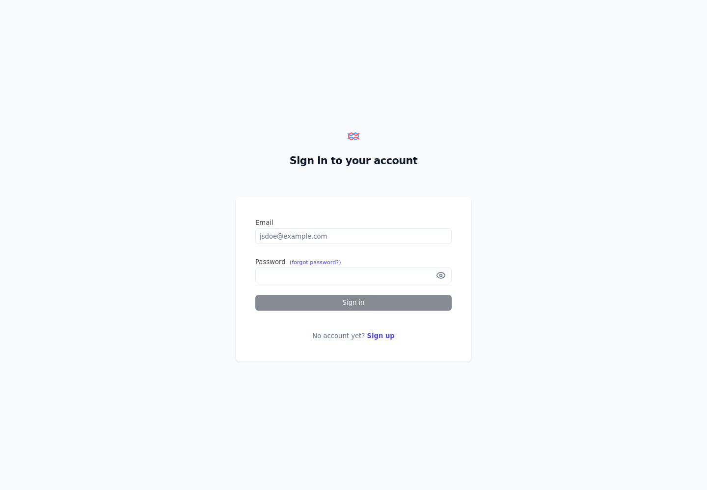

# Copilot OTel / Langfuse セッションレポート

## エグゼクティブサマリー

| 項目 | 値 |
|------|------|
| 実行日時 (UTC) | 2026-05-14T22:04:45.886Z |
| 実行元 | postStart |
| Langfuse Health | OK (http://langfuse-web:3000) |
| Copilot OTLP Endpoint | http://otel-collector:4318 |
| Remote OTLP Push | Disabled |

## ダッシュボードエビデンス

## 確認事項

- Langfuse は devcontainer 起動時に Docker Compose で自動起動します。
- Copilot Chat の OTel は OTel Collector に送信され、Collector からローカル Langfuse へ転送されます。
- `OTEL_REMOTE_EXPORTER_OTLP_ENDPOINT` を設定した場合、Collector は同じデータをリモート OTLP へも転送します。
