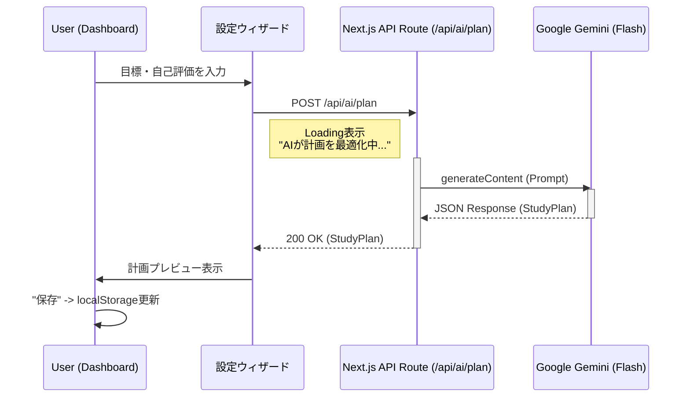

# AI学習プランナー機能 基本設計書 (Rev.2)

## 1. 概要
ユーザーの目標（試験区分・受験日）、学習可能時間、自己評価に基づき、生成AI（Gemini 2.5 Flash）を用いて**受験日までの学習計画を即座に策定**する機能である。
サーバーレス環境（Azure Static Web Apps / Functions）への適合性を最優先し、ステートレスな**同期APIアーキテクチャ**を採用する。

## 2. システムアーキテクチャ

### 2.1 全体構成


### 2.2 コンポーネント定義
1.  **Backend (`app/api/ai/plan/route.ts`)**:
    *   **役割**: クライアントからのリクエストを受け取り、Gemini APIを呼び出して整形済みのJSONを返す。
    *   **モデル**: `gemini-2.5-flash` (高速・低遅延)。
    *   **制約**: タイムアウト（通常 API Routesはデフォルトで長めに設定可能だが、10秒以内を目指す）。
2.  **Frontend (`GoalSettingWizard.tsx`)**:
    *   **役割**: 入力収集とAPIコール、結果の受け取り。
    *   **UX**: 待機中に適切な「考えている感」のあるUIを表示する。
3.  **Frontend (`DashboardClient.tsx`)**:
    *   **役割**: `localStorage` に保存された計画の表示。
    *   **変更点**: ポーリング処理は廃止。

## 3. データ設計 (Interface)

### 3.1 API Request (`JobRequest` 改め `PlanRequest`)

```typescript
interface PlanRequest {
    userId?: string;
    targetExam: string;      // 例: "AP"
    examDate: string;        // 例: "2026-04-19"
    studyTimeWeekday: number;// 例: 2
    studyTimeWeekend: number;// 例: 5
    scores: Record<string, number>; // 自己評価 { "technology": 3, "strategy": 5 ... }
}
```

### 3.2 API Response (`StudyPlan`)

```typescript
interface StudyPlan {
    title: string;          // 計画タイトル
    generatedAt: string;    // 生成日時 (ISO)
    examDate: string;       // 受験日
    monthlyGoal: string;    // 全体目標
    weeklySchedule: {
        weekNumber: number;
        startDate: string;
        endDate: string;
        goal: string;
        dailyTasks: {
            date: string;
            goal: string;
            questionCount: number;
            targetCategory: string; // "セキュリティ", "アルゴリズム" 等
            targetExamId?: string;  // "AP-2023-Spring" 等
        }[];
    }[];
}
```

## 4. 機能仕様

### 4.1 プロンプト設計
*   **Role**: プロの資格試験コーチ。
*   **Input**: ユーザーの強み・弱み（スコア）、可処分時間。
*   **Output**: JSON形式。1日ごとの具体的なアクション（何問解くか）を含める。
*   **制約**: `gemini-2.5-flash` のコンテキストウィンドウ内で完結させる。

### 4.2 エラーハンドリング
*   **Timeouts**: 生成が長引いた場合、クライアントは再試行を促すメッセージを表示。
*   **Validation**: AIが不正なJSONを返した場合、リトライまたはデフォルトプラン（テンプレート）へのフォールバックを検討（今回はエラー表示のみ）。

## 5. 将来の拡張
*   **サーバーサイド保存**: 現在は `localStorage` だが、Cosmos DBへ保存することでデバイス間同期を実現する。
