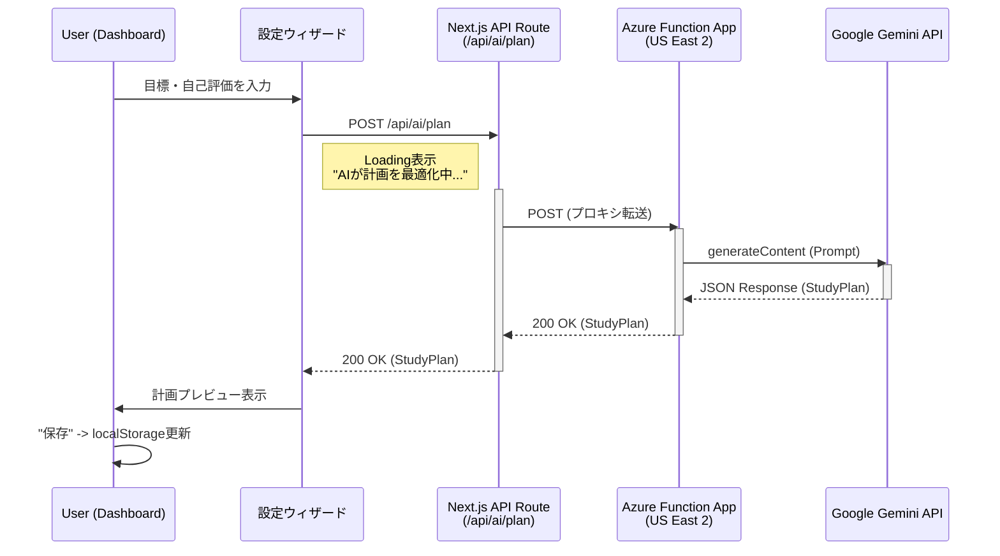

# AI学習プランナー機能 基本設計書 (Rev.4)

## 1. 概要
ユーザーの目標（試験区分・受験日）、学習可能時間、自己評価に基づき、生成AI（Gemini 2.5 Flash）を用いて**受験日までの学習計画を即座に策定**する機能である。
サーバーレス環境（Azure Static Web Apps / Functions）への適合性を最優先し、ステートレスな**同期APIアーキテクチャ**を採用する。

**Rev.4の主要変更点:**
- AIプロンプトを完全日本語化し、出力の言語を厳格に制御
- ゲーミフィケーション要素（XP、難易度、ミッション名）を追加
- 「今日のミッション」「今週のテーマ」をゲーム感覚で消化できるUI設計

## 2. システムアーキテクチャ

### 2.1 全体構成（USリージョンプロキシ）

**重要**: Gemini API は特定の地域（日本を含む）からの直接アクセスを制限しているため、US East 2 リージョンに配置した Azure Function App を経由する構成を採用している。


```mermaid
sequenceDiagram
    participant User as User (Dashboard)
    participant Wizard as 設定ウィザード
    participant Proxy as Next.js API Route<br/>(/api/ai/plan)
    participant FuncUS as Azure Function App<br/>(US East 2)
    participant AI as Google Gemini API

    User->>Wizard: 目標・自己評価を入力
    Wizard->>Proxy: POST /api/ai/plan
    Note right of Wizard: Loading表示<br/>"AIが計画を最適化中..."
    
    activate Proxy
    Proxy->>FuncUS: POST (プロキシ転送)
    activate FuncUS
    FuncUS->>AI: generateContent (Prompt)
    activate AI
    AI-->>FuncUS: JSON Response (StudyPlan)
    deactivate AI
    FuncUS-->>Proxy: 200 OK (StudyPlan)
    deactivate FuncUS
    Proxy-->>Wizard: 200 OK (StudyPlan)
    deactivate Proxy

    Wizard->>User: 計画プレビュー表示
    User->>User: "保存" -> localStorage更新
```

### 2.2 コンポーネント定義

1.  **Frontend Proxy (`apps/web/app/api/ai/plan/route.ts`)**:
    *   **役割**: クライアントからのリクエストをUS Function Appに転送するプロキシ。
    *   **エンドポイント**: `https://func-pm-exam-dx-ai-us.azurewebsites.net/api/ai/plan`
    *   **環境変数**: `AI_FUNCTION_URL` (オプション、デフォルトでハードコード)

2.  **Backend (`apps/api-ai/src/functions/aiPlan.ts`)**:
    *   **役割**: Gemini APIを呼び出して整形済みのJSONを返す。
    *   **リージョン**: US East 2（Gemini API地域制限回避のため）
    *   **モデル**: `gemini-2.5-flash` (Primary), `gemini-2.0-flash` (Fallback)
    *   **レスポンススキーマ**: v1beta API の `responseSchema` 機能を使用

3.  **Frontend (`GoalSettingWizard.tsx`)**:
    *   **役割**: 入力収集とAPIコール、結果の受け取り。
    *   **UX**: 待機中に適切な「考えている感」のあるUIを表示する。

4.  **Frontend (`DashboardClient.tsx`)**:
    *   **役割**: `localStorage` に保存された計画の表示。

## 3. データ設計 (Interface)

### 3.1 API Request (`JobRequest` 改め `PlanRequest`)

```typescript
interface PlanRequest {
    userId?: string;
    targetExam: string;      // 例: "AP"
    examDate: string;        // 例: "2026-04-19"
    studyTimeWeekday: number;// 例: 2
    studyTimeWeekend: number;// 例: 5
    scores: Record<string, number>; // 自己評価 { "technology": 3, "strategy": 5 ... }
}
```

### 3.2 API Response (`StudyPlan`)

```typescript
interface StudyPlan {
    title: string;          // 計画タイトル（日本語）
    generatedAt: string;    // 生成日時 (ISO)
    examDate: string;       // 受験日
    monthlyGoal: string;    // 今月の目標（日本語）
    weeklySchedule: {
        weekNumber: number;
        startDate: string;
        endDate: string;
        theme?: string;     // 週のテーマ（例: ネットワーク基礎）
        goal: string;       // 週目標（日本語）
        dailyTasks: {
            date: string;
            missionTitle?: string;   // ミッション名（ゲーム風、日本語）
            goal: string;            // 詳細目標（日本語）
            questionCount: number;
            targetCategory: string;  // "セキュリティ", "アルゴリズム" 等（日本語）
            targetExamId?: string;   // "AP-2023-Spring" 等
            difficulty?: 'easy' | 'normal' | 'hard';  // 難易度
            xpReward?: number;       // 獲得XP（10-100）
            isCompleted?: boolean;   // 完了フラグ（クライアント側で管理）
        }[];
    }[];
    totalXpEarned?: number;  // 累計獲得XP（クライアント側で計算）
}
```

### 3.3 ゲーミフィケーション要素

| 要素 | 説明 |
|------|------|
| `missionTitle` | ゲーム風のミッション名（例: 「セキュリティの門番」「DB探検隊」） |
| `difficulty` | easy/normal/hard の3段階。難易度によりXP報酬が変動 |
| `xpReward` | ミッション完了時の獲得XP。easy: 10-30, normal: 30-50, hard: 50-100 |
| `isCompleted` | ユーザーがミッションを完了したかどうか（クライアント側で管理） |

## 4. 機能仕様

### 4.1 プロンプト設計
*   **Role**: 日本の情報処理技術者試験専門の学習コーチ
*   **Language**: **すべての出力を日本語で厳格に指定**（英語禁止）
*   **Input**: ユーザーの強み・弱み（スコア）、可処分時間
*   **Output**: JSON形式。1日ごとの具体的なアクション（何問解くか）を含める
*   **ゲーミフィケーション**: ミッション名、難易度、XP報酬を含める
*   **制約**: `gemini-2.5-flash` のコンテキストウィンドウ内で完結させる

### 4.1.1 プロンプトの日本語強制ルール
```
【重要】すべての出力は必ず日本語で記述してください。英語は一切使用しないでください。
```
- title, monthlyGoal, weeklySchedule.theme, dailyTasks.missionTitle, dailyTasks.goal, dailyTasks.targetCategory はすべて日本語
- targetExamId（"AP-2023-Fall"等）のみ英数字を許可

### 4.2 エラーハンドリング
*   **Timeouts**: 生成が長引いた場合、クライアントは再試行を促すメッセージを表示。
*   **Validation**: AIが不正なJSONを返した場合、リトライまたはデフォルトプラン（テンプレート）へのフォールバックを検討（今回はエラー表示のみ）。
*   **地域制限エラー**: Gemini API から `User location is not supported` が返された場合は、US Function App 経由のアクセスであることを確認。

## 5. デプロイ

### 5.1 api-ai (US Function App)
```bash
cd apps/api-ai
npm run build
func azure functionapp publish func-pm-exam-dx-ai-us --build remote
```

**注意**: Linux Consumption Plan では `--build remote` オプションが必須。

### 5.2 フロントエンド
mainブランチへのプッシュで Azure Static Web Apps に自動デプロイされる。

## 6. 将来の拡張
*   **サーバーサイド保存**: 現在は `localStorage` だが、Cosmos DBへ保存することでデバイス間同期を実現する。
*   **学習進捗分析**: AIによる進捗評価と計画の動的調整。

## 7. 変更履歴

| 日付       | バージョン | 変更内容                                               |
| ---------- | ---------- | ------------------------------------------------------ |
| 2026/02/01 | Rev.4      | プロンプト完全日本語化、ゲーミフィケーション要素追加（XP、難易度、ミッション名） |
| 2026/02/01 | Rev.3      | USリージョンプロキシ構成を追加、モデル名をgemini-2.5-flashに更新 |
| -          | Rev.2      | 同期APIアーキテクチャに変更                            |
| -          | Rev.1      | 初版作成                                               |
